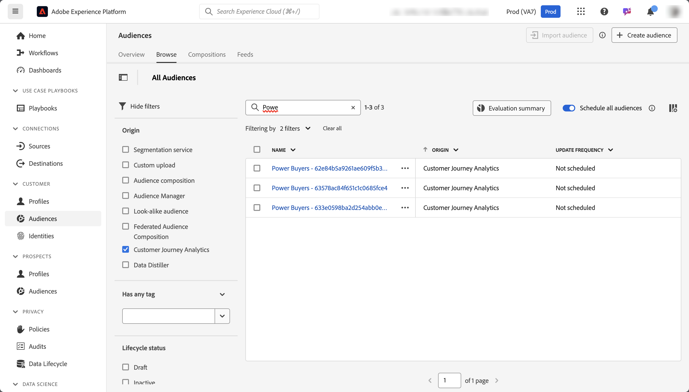

# 建立及發佈客群 {#create-and-publish-audiences}

<!-- markdownlint-disable MD034 -->

>[!CONTEXTUALHELP]
>id="components_audiences_refreshfrequency"
>title="重新整理頻率"
>abstract="查看重新評估對象會籍的頻率。 一次性對象僅會評估一次。"

<!-- markdownlint-enable MD034 -->

<!-- markdownlint-disable MD034 -->

>[!CONTEXTUALHELP]
>id="components_audiences_audiencelimit"
>title="對象限制"
>abstract="重新整理對象作業會受到其重新整理頻率的限制。"

<!-- markdownlint-enable MD034 -->

<!-- markdownlint-disable MD034 -->

>[!CONTEXTUALHELP]
>id="component_audiences_refreshlookbackwindow"
>title="重新整理回顧期間"
>abstract="定義從評估對象的今天所開始的回顧天數。"

<!-- markdownlint-enable MD034 -->

<!-- markdownlint-disable MD034 -->

>[!CONTEXTUALHELP]
>id="component_audiences_audiencesizelimit"
>title="客群規模限制"
>abstract="對象不得超過 2000 萬個會員。"

<!-- markdownlint-enable MD034 -->

<!-- markdownlint-disable MD034 -->

>[!CONTEXTUALHELP]
>id="component_audiences_namespacesincluded"
>title="包含的命名空間"
>abstract="此對象中的身分識別是由以下命名空間組成的。"

<!-- markdownlint-enable MD034 -->

本主題說明如何將在Customer Journey Analytics中發現的對象建立並發佈到Adobe Experience Platform中的[即時客戶個人檔案](https://experienceleague.adobe.com/zh-hant/docs/experience-platform/profile/home)，以用於客戶目標定位和個人化。

請閱讀此[總覽](/help/components/audiences/audiences-overview.md)，熟悉Customer Journey Analytics對象的概念。

## 建立及發佈對象 {#create}

1. 若要建立並發佈對象，請執行下列任一項作業：

   | 建立方法 | 詳細資料 |
   | --- | --- |
   | 從&#x200B;**[!UICONTROL 對象]**&#x200B;介面中。 | 從Customer Journey Analytics主功能表選取&#x200B;**[!UICONTROL 元件]** > **[!UICONTROL 對象]**。 Audiences介面隨即顯示。 選取「**[!UICONTROL 建立對象]**」，並開啟[!UICONTROL 對象產生器]。 |
   | 從Analysis Workspace中的視覺效果 | Analysis Workspace中的許多視覺效果都可讓您使用內容功能表建立對象。 例如，您可以從[自由格式表格](/help/analysis-workspace/visualizations/freeform-table/freeform-table.md)中專案的內容功能表或[歷程畫布](/help/analysis-workspace/visualizations/journey-canvas/journey-canvas.md)中的節點選取&#x200B;**[!UICONTROL 建立對象]**。
使用此方法時，會使用您選取的維度或維度專案預先填入對象產生器中的篩選器。

下列視覺效果可讓您使用滑鼠右鍵功能表建立對象：
<ul><li>[同類群組表格](/help/analysis-workspace/visualizations/cohort-table/cohort-analysis.md)</li><li>[流失](/help/analysis-workspace/visualizations/fallout/fallout-flow.md)</li><li>[流程](/help/analysis-workspace/visualizations/c-flow/flow.md)</li><li>[自由格式表格](/help/analysis-workspace/visualizations/freeform-table/freeform-table.md)</li><li>[歷程畫布](/help/analysis-workspace/visualizations/journey-canvas/journey-canvas.md)</li><li>[文氏圖表](/help/analysis-workspace/visualizations/venn.md)</li></ul>
**注意：**&#x200B;對象不能包含計算量度。 如果您嘗試建立包含計算量度的對象，則該計算量度不會包含在對象定義中。
 |
   | 從篩選器建立/編輯 UI | 勾選顯示「**[!UICONTROL 通過此篩選建立客群]**」的方塊。使用此方法預先填入篩選器。 如需詳細資訊，請參閱[建立篩選器](/help/components/filters/create-filters.md)。 |

   {style="table-layout:auto"}

1. 使用[對象產生器](#audience-builder)建立對象。

1. 使用[日期預覽](#data-preview)面板解譯資料。

1. 選取&#x200B;**[!UICONTROL [!UICONTROL 檢視範例ID]]**&#x200B;以檢視此對象中的ID範例。 在&#x200B;**[!UICONTROL 範例ID]**&#x200B;對話方塊中，您可以使用 [!UICONTROL *搜尋範例ID*]&#x200B;來搜尋範例ID。

1. 仔細檢查您的對象組態，並選取&#x200B;**[!UICONTROL 發佈]**。
您會收到一則對象已發佈的確認訊息。 發佈只需要一兩分鐘，此對象就會出現在Experience Platform中。

1. 在同一則訊息中選取「**[!UICONTROL 在AEP中檢視對象]**」，您就會進入Adobe Experience Platform中的[區段UI](https://experienceleague.adobe.com/en/docs/experience-platform/segmentation/ui/overview)。 請參閱下方以了解更多資訊。

## 對象產生器

進行這些設定以定義或更新您的對象。

| 設定 | 說明 |
| --- | --- |
|  | 選取要用於建立受眾的資料檢視。 |
| **[!UICONTROL 名稱]** | 對象名稱。 例如， `Really Interested in Potential Car Buyers` |
| **[!UICONTROL 標記]** | 您針對組織目的想要指派給對象的任何標籤。 您可以選取一或多個預先存在的標籤或輸入新標籤。 |
| **[!UICONTROL 說明]** | 對象的說明，用於與其他對象區分開來。 例如， `Build an audience of really interested potential car buyers` |
| **[!UICONTROL 重新整理頻率]** | 您想要重新整理客群的頻率。
您可以選擇 <ul><li>**[!UICONTROL 一次]**&#x200B;對象：不需要重新整理的對象（預設）。 例如，此選項可能有助於特定的一次性行銷活動。 您必須指定&#x200B;**[!UICONTROL 單次日期範圍]**。 您可以使用來輸入日期範圍。</li><li>重新整理的對象。 您可選取下列選項：<ul><li>**[!UICONTROL 每4小時]**&#x200B;秒：每4小時重新整理一次的受眾。</li><li>**[!UICONTROL 每日]**：每日重新整理的對象</li><li>**[!UICONTROL 每週]**：每週重新整理的對象。</li><li>**[!UICONTROL 每月]**：每月重新整理的對象</li></ul></li>若要重新整理對象，您必須指定：<ul><li>**[!UICONTROL 重新整理回顧期間]**。 定義從今天開始評估對象的回顧天數。 您可以從選項中選取或定義自訂時間。 最長90天。</li><li>**[!UICONTROL 到期日]**：定義對象停止重新整理的時間。 您可以使用來選取日期。 預設到期日是從建立日期算起的 1 年後。系統處理即將到期對象的方法與即將到期的排程報告相似。 管理員會在對象過期前一個月收到電子郵件。</li></ul> 請注意，根據您的Customer Journey Analytics權益，對象重新整理限製為75至150個。</li></ul> |
| **[!UICONTROL 篩選器]** | 篩選條件是客群的主要輸入項目。從左側 **[!UICONTROL 篩選器]**&#x200B;面板拖放一或多個篩選器至篩選器區域。 您可以使用 [!UICONTROL *搜尋篩選器*]&#x200B;來搜尋篩選器。 可最多新增 20 個篩選器。篩選器可以加入&#x200B;**[!UICONTROL And]**&#x200B;或&#x200B;**[!UICONTROL Or]**&#x200B;運運算元。
從Analysis Workspace中的視覺效果（例如自由表格或歷程畫布）建立受眾時，套用至面板或欄的任何篩選器都會保留。 您可以移除任何自動套用的篩選器。
 |
| **[!UICONTROL 資料預覽]** | 選取以顯示或隱藏所選日期範圍的[資料預覽](#data-preview)。 |

## 資料預覽

「資料預覽」面板提供下列資訊。

| 元素 | 說明 |
| --- | --- |
| **[!UICONTROL 總人數]** | 此客群中總人數的摘要數字。最大人數為2000萬人。 如果您的對象超過2,000萬人，您必須先減少對象規模，然後才能發佈。 |
| **[!UICONTROL 客群規模限制]** | 視覺效果會顯示此對象與2000萬上限的差距。 |
| **[!UICONTROL 預估的客群回訪]** | 您可以使用此值，重新鎖定此對象中回訪您網站、行動應用程式或其他頻道的人員。
您可以為可能回訪的估計客戶數選取時間範圍（**[!UICONTROL 接下來7天]**、**[!UICONTROL 接下來2週]**&#x200B;或&#x200B;**[!UICONTROL 下一個月]**）。 |
| **[!UICONTROL 預估回訪]** | 此數字可提供所選時段內回訪客戶的估計數量。 此數字會使用這個對象的歷史流失率來預測。 |
| **[!UICONTROL 預覽量度]** | 您可以選取特定量度，以檢視該量度的資料如何以您定義的對象為基礎。  每個預覽量度都會根據對象顯示量度的總計。 以及資料檢視定義的量度總和中，以對象為基礎的量度百分比。 例如，381人（您選取的量度）是您的對象定義的結果，佔資料檢視中可用總人數的5%。 您可以選取資料檢視中可用的任何量度。 |
| **[!UICONTROL 包含的命名空間]** | 與客群中的人員相關聯的特定命名空間。範例包括 ECID、CRM ID、電子郵件地址等。 |
| **[!UICONTROL 沙箱]** | 此客群所在的 [Experience Platform 沙箱](https://experienceleague.adobe.com/zh-hant/docs/experience-platform/sandbox/home)。當您將此對象發佈到Platform時，您只能在此沙箱的範圍內使用對象。 |

{style="table-layout:auto"}

## 建立及發佈對象後會發生什麼事？ {#after-audience-created}

在Customer Journey Analytics中建立並發佈對象後，您便可在Experience Platform中使用對象。 Adobe Experience Platform串流區段只會在您的組織設為串流區段時建立。

* Platform中的對象會與Customer Journey Analytics對象共用相同的名稱和說明。 名稱會加上Customer Journey Analytics對象ID，以確保對象是唯一的。
* 在Customer Journey Analytics中對對象名稱或說明所做的任何變更都會反映在Experience Platform中。
* 如果對象已在Customer Journey Analytics中刪除，在對象的設定檔成員資格過期之前，該對象會繼續在Experience Platform中使用。 一次性受眾的設定檔會籍將在420天後到期，而週期性受眾會在16天後到期。

## 延遲的注意事項 {#latency}

在對象發佈之前、期間和之後的數個時間點，可能會發生延遲。 以下是可能的延遲的概觀。

|  | 延遲點 | 延遲期間 |
| --- | --- | --- |
| 未顯示 | Adobe Analytics至Analytics來源聯結器(A4T) | 最多需 30 分鐘 |
| 1 | 將資料擷取至Data Lake （從Analytics來源聯結器或其他來源） | 最多需 90 分鐘 |
| 2 | 從Experience Platform Data Lake將資料擷取至Customer Journey Analytics | 最多需 90 分鐘 |
| 3 | 將對象發佈到即時客戶個人檔案，包括自動建立串流區段，並允許區段準備好接收資料。 | 幾秒鐘 |
| 4 | 客群的更新頻率 | <ul><li>一次性重新整理 (延遲時間小於 5 分鐘)</li><li>每 4 小時、每天、每週、每月重新整理一次 (延遲與重新整理頻率息息相關) |
| 5 | 在Adobe Experience Platform中建立目的地：啟用新區段 | 1-2 小時 |

{style="table-layout:auto"}

## 在Experience Platform中使用Customer Journey Analytics受眾 {#audiences-aep}

Customer Journey Analytics會從您發佈的對象中取得所有名稱空間和ID組合，並將它們串流至Real-Time Customer Data Platform 。 Customer Journey Analytics會根據設定連線時選取的[!UICONTROL 人員ID]，將對象傳送至具有主要身分設定的Experience Platform。

Real-Time Customer Data Platform接著會檢查每個名稱空間/ID組合，並尋找它可能屬於的個人檔案。 輪廓基本上是一組連結的命名空間、ID 和裝置。如果找到設定檔，則會將名稱空間和ID新增到此設定檔中的其他ID，做為區段會籍屬性。 例如，<user@adobe.com>可以跨其所有裝置和管道進行定位。 如果找不到輪廓，則會建立一個新的。

若要在Platform中檢視Customer Journey Analytics對象：

1. 展開左側面板中的&#x200B;**[!UICONTROL 客戶]**，然後選取&#x200B;**[!UICONTROL 對象]**。<!-- is there a folder called "Customer Journey Analytics? -->

1. 選取&#x200B;**[!UICONTROL 瀏覽]**&#x200B;標籤。

1. 若要找出您從Customer Journey Analytics發佈的對象，請執行下列任一項作業：

   左側面板中的

   * 依&#x200B;**[!UICONTROL Origin]**&#x200B;資料行排序資料表，以檢視顯示&#x200B;[!UICONTROL **Customer Journey Analytics**]&#x200B;為來源的受眾。

   * 篩選&#x200B;**[!UICONTROL 來源]**&#x200B;上的並選取&#x200B;**[!UICONTROL Customer Journey Analytics]**。

   * 使用搜尋欄位。

如需在Platform中使用對象的詳細資訊，請參閱Experience Platform檔案之[區段產生器UI指南](https://experienceleague.adobe.com/en/docs/experience-platform/segmentation/ui/segment-builder)中的[對象](https://experienceleague.adobe.com/en/docs/experience-platform/segmentation/ui/segment-builder)區段。

## 常見問題 {#faq}

客群發佈的常見問題。

+++**如果使用者不再是Customer Journey Analytics中的對象成員，會發生什麼情況？**

在此情況下，系統會從Customer Journey Analytics傳送退出事件至Experience Platform。

+++

+++**如果您刪除Customer Journey Analytics中的對象，會發生什麼事？**

刪除Customer Journey Analytics對象後，該對象就不會再顯示在Experience Platform UI中。 不過，與該對象相關聯的設定檔並不會在Experience Platform中刪除。

+++

+++**如果Real-Time Customer Data Platform中不存在對應的設定檔，是否會建立新的設定檔？**

是，會建立。

+++

+++**Customer Journey Analytics會以管線事件或同樣前往資料湖的平面檔案傳送對象資料？**

Customer Journey Analytics會透過pipeline將資料串流至Real-Time Customer Data Platform，這些資料也會收集到資料湖的系統資料集中。

+++

+++**Customer Journey Analytics會傳送哪些身分識別？**

在[連線設定](https://experienceleague.adobe.com/en/docs/analytics-platform/using/cja-connections/create-connection)中指定的任何識別/名稱空間配對。 具體來說，就是使用者選取要當作人員ID使用的欄位時的步驟。

+++

+++**選擇哪個 ID 作為主要身分識別？**

請參閱上述內容。每個Customer Journey Analytics人員僅會傳送一個身分。

+++

+++**Real-Time Customer Data Platform是否也會處理Customer Journey Analytics訊息？ Customer Journey Analytics是否可透過對象共用將身分新增至設定檔身分圖表？**

否。每人只會傳送一個身分，因此Real-Time Customer Data Platform不會有任何圖表邊緣可供使用。

+++

+++**一天中的哪個時間進行每日、每週和每月的重新整理？ 每週的哪一天會進行每週重新整理？**

重新整理的時間會根據原始對象的發佈時間以及當天時間的錨點（以及一週中的某天或一個月中的某天）來確定。

+++

+++**您可以設定每日、每週和每月的重新整理時間嗎？**

否，使用者無法設定重新整理的時間。

+++

## 後續步驟

* 若要管理此客群，請前往[「管理 UI」](/help/components/audiences/manage.md)。
