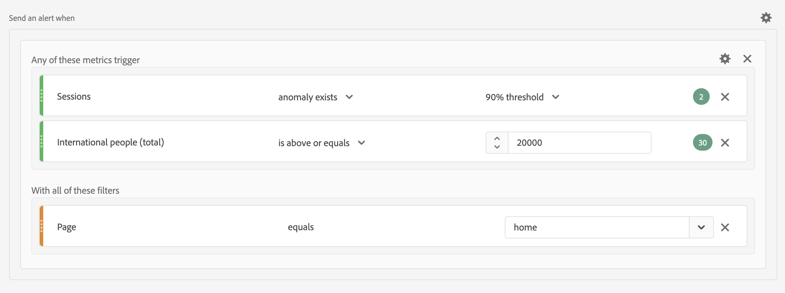

# 警示使用案例

您可以依照[建立警報](/help/components/c-intelligent-alerts/alert-builder.md)中的說明建立警報。

以下區段說明建立警報時需要考慮的範例使用案例。

## 篩選警報

您可以使用區段建立簡單警報。 例如，為透過行動應用程式工作階段造訪首頁的使用者定義工作階段數警報。

## 棧疊警報

您可以合併（棧疊）警報，而非建立多個警報。 棧疊警報可確保結合警報，以免您收到大量個別警報。 在以下範例中，當任一量度主動變更觸發時，就會傳送警報。

