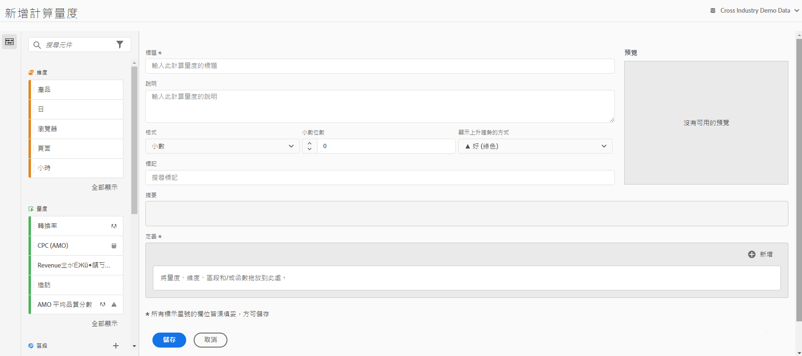

# 建立量度

「Customer Journey Analytics」提供的畫布可拖放維度、量度、篩選器和函式，以根據容器階層邏輯、規則和運運算元建立自訂量度。 此整合性開發工具可讓您建立並儲存簡單的計算量度或複雜的進階計算量度。

## 開始建立計算量度

您可以透過下列任何方式開始建立計算量度：

* 在Analysis Workspace中，開啟專案，然後選取 **[!UICONTROL 元件]** > **[!UICONTROL 建立量度]**.
* 在Analysis Workspace中開啟專案，然後選取 **加號** 圖示加以存取 [!UICONTROL **量度**] 區段。
* 在 [!DNL Customer Journey Analytics]，前往 **[!UICONTROL 元件]** > **[!UICONTROL 計算量度]**，然後選取 **[!UICONTROL +新增]** 在「計算量度」頁面頂端。

## 計算量度產生器的區域

下圖及隨附的表格說明計算量度產生器的部分主要區域和功能。

| 欄位 | 說明 |
| --- | --- |
| 標題 | 必須命名量度。未命名的量度將無法儲存。 |
| 說明 | 提供使用者易記的說明，以顯示其用途並與類似量度區別。 
此說明也會顯示在報表中。最好「不要」在說明中加入公式，而是該說明此量度適合和不適合的用途。(公式會在您建立量度時產生，位在「摘要」標頭下方。因此無需將公式加入說明中。) 
 |
| 格式 | 選項包括「小數」、「時間」、「百分比」和「貨幣」。 |
| 小數位數 | 顯示要在報表中顯示幾個小數位數。您可指定的小數位數上限為 10。 |
| 將「上升趨勢」顯示為... | 此量度極性設定顯示 Analytics 應將量度的上升趨勢視為好 (綠色) 或壞 (紅色)。因此，報表的圖形會隨著量度上升而顯示為綠色或紅色。 |
| 貨幣 | 此資料檢視的基本貨幣。 |
| 標記 | 標記是組織量度的好方法。所有使用者都能建立標記，並套用一或多個標記至量度。不過，您僅可以看見自己所擁有或已和您共用之篩選器的標記。您應該建立什麼樣的標記？以下是一些建議的實用標記：<ul><li>**團隊名稱**，例如社交行銷、行動裝置行銷。</li><li>**專案** （分析標籤），例如登入頁面分析。</li><li>**類別**，例如「女性」、「地理」。</li><li>**工作流程**，例如「待核准」、「策劃」（特定的業務單位）</li></ul> |
| 摘要 | 
「摘要」公式會隨著您變更量度定義而隨時更新。當您將游標停留在量度上並按一下「 」，此公式也會顯示在量度邊欄中。  圖示。 
 |
| 定義 | 這裡是您將量度/計算量度、篩選器和/或函數拖曳進來，以建立計算量度的地方。 <ul><li>如果您將一個計算量度拖曳進來，它將自動展開其量度定義。 </li> <li>您可以使用容器巢狀嵌套定義。不過，與篩選容器不同，這些容器的功能與數學運算式類似，而且會決定作業順序。 </li> </ul> |
| 運算子 | 除以(  )為預設運運算元，另外還有+、 — 和x運運算元。 |
| 預覽 | 提供快速閱覽，以便查看可能的錯誤。預覽涵蓋最近 90 天。這可供您初步衡量是否為量度選擇了正確的元件。意外的結果可能表示您需要再次檢查量度定義。 |
| 產品相容性 | 對於您在CJA中建立的任何計算量度，此值一律會列為 [!UICONTROL **完全處理的資料**]. 計算量度只能包含事件資料集中的資料。 |
| 新增 | 若為所有類型的計算量度，您可以將容器和靜態數字新增到定義中。若為進階計算量度，您也可以新增篩選器和函數。<ul><li>容器的功能類似數學運算式，用以決定運算順序。所以容器中的項目會先行處理，再進行下一個運算。</li><li>將篩選器拖曳至容器會篩選該容器中的所有專案。 (僅限進階計算量度)</li><li>您可以在一個容器中堆疊多個篩選器。</li></ul> |
| 齒輪圖示 (「量度類型」、「歸因」) | 選取量度旁的齒輪圖示，即可指定量度類型和歸因模式。 |
| 加號(+)圖示 | 可讓您建立新元件，例如新篩選器 (會帶您前往「篩選產生器」)。 |
| 搜尋元件 | 此搜尋列可讓您搜尋維度、量度、篩選器（僅限進階計算量度）和函式（僅限進階計算量度）。 |
| 維度清單 | 您可以拖曳至「頁面」並直接從計算量度產生器選取「首頁」，而不用為了在篩選產生器中建立簡易篩選器（例如「頁面=首頁」）而離開計算量度產生器。 如此可讓工作流程更為流暢，方便建立篩選過的計算量度。 |
| 量度清單 | 量度共有 3 個類別：<ul><li>標準量度</li><li>計算量度</li><li>量度範本 - 位於清單底部。</li></ul>當您將滑鼠游標停留在量度上時，您可在其右側看到「資訊」圖示。按一下此圖示會提供下列資訊：<ul><li>其計算公式。</li><li>量度的預覽趨勢。</li><li>右上角的編輯（鉛筆）圖示可帶您前往計算量度產生器，您可在此編輯此計算量度。</li></ul> |
| 篩選器清單 | (僅限進階計算量度) 身為管理員，此清單會顯示在您的登入公司中建立的所有篩選器。如果您不是管理員使用者，此清單就只會顯示您所擁有並已和您共用的篩選器。 |
| 函數清單 | (僅限進階計算量度) 函數分為兩種清單： 基本 (最常使用) 和進階。 |
| 資料檢視選擇器 | 此選擇器 (位於右上方) 可讓您切換至不同的資料檢視。 |
