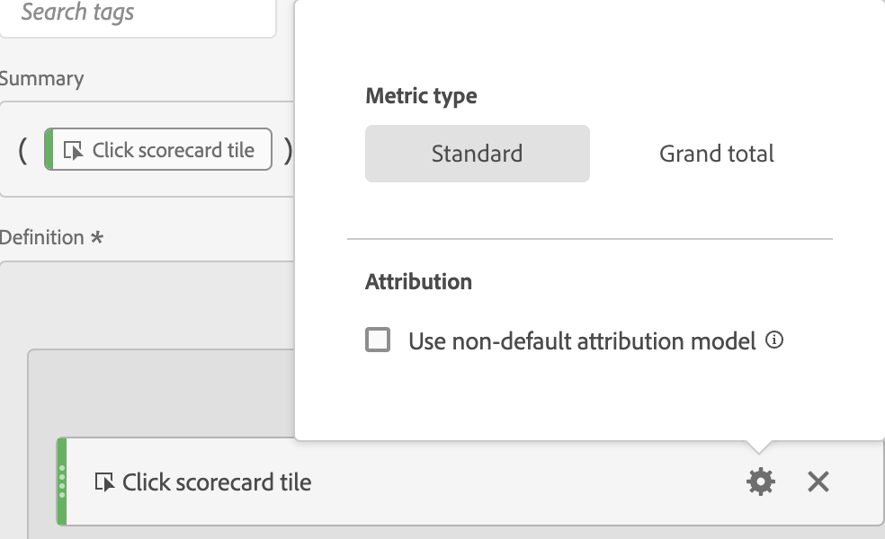

# 量度類型和歸因

選取量度旁的齒輪圖示，即可指定量度類型和歸因模式。

## 量度類型

| 量度類型 | 定義 |
|---|---|
| 標準 | 這些量度就是在標準 [!DNL Analytics] 報表中使用的量度。如果某個公式由單一標準量度組成，則其顯示的資料將與其非計算量度相對應公式一樣。標準量度適合用來建立每個行項目專屬的計算量度。例如，[訂單] / [造訪] 會採用該特定條列項目的訂單，然後除以該特定條列項目的造訪次數。 |
| 總計 | 總計適用於每個行項目的報告期間。如果公式由單一總計量度組成，則會在每個行項目顯示相同的總數。總計量度適合用來建立要與網站資料總計比較的計算量度。例如，[訂單] / [造訪總次數] 可顯示相較於網站「全部」造訪次數的訂單比例，而不只是特定條列項目的造訪次數。 |

## 歸因

>[!IMPORTANT]
>如需非預設歸因模式及支援的回顧期間的完整清單，請參閱[歸因模式與回顧期間](/help/analysis-workspace/attribution/models.md)。
