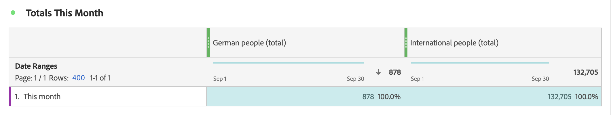

# 區段量度

在[計算量度產生器](cm-build-metrics.md#definition-builder)中，您可以在量度定義中套用區段。 如果您想要在分析中將量度用於資料的子集，套用區段會很有幫助。

>[!NOTE]
>
>透過[區段產生器](/help/components/segments/seg-builder.md)更新區段定義。 如果您變更區段，該區段會在任何使用它的地方自動更新，包括如果該區段屬於計算量度定義的一部分。
>

您想要比較和您的品牌互動的德國人員與德國以外人員的量度。 因此，您可以回答以下問題：

1. 有多少德國和國際人士造訪您最受歡迎的[頁面](#popular-pages)。
1. 本月[總計](#totals)有多少德國和國際人士與您的品牌進行線上互動。
1. 造訪過您熱門頁面的德國人和海外人士的[百分比](#percentages)為何？

請參閱以下各節，說明區段量度如何協助您回答這些問題。 在適當的情況下，會參考更詳細的檔案。

## 受歡迎頁面

1. [從名為`German people`的Workspace專案建立計算量度](cm-workflow.md)。
1. 在[計算量度產生器](cm-build-metrics.md)中，[建立區段](/help/components/segments/seg-builder.md)，標題為`Germany`，其會使用CRM資料中的CRM國家/地區欄位來判斷人員的來源。

   >[!TIP]
   >
   >在計算量度產生器中，您可以使用「元件」面板直接建立區段。
   >   

   您的區段可能如下所示。

   

1. 返回計算量度產生器，使用區段更新計算量度。

   

針對計算量度的國際版本重複上述步驟。

1. 從您的Workspace專案中建立標題為`International people`的計算量度。
1. 在計算量度產生器中，建立名為`Not Germany`的區段，此區段會使用您CRM資料中的CRM國家/地區欄位來判斷人員的來源。

   您的區段看起來應該像這樣。

   

1. 返回計算量度產生器，使用區段更新計算量度。

   

1. 在Analysis Workspace中建立專案，在那裡您可以檢視德國和國際人士造訪的頁面。

   

## 總計

1. 根據總計建立兩個新區段。 開啟先前建立的每個區段、重新命名區段、將&#x200B;**[!UICONTROL 人員]**&#x200B;的&#x200B;**[!UICONTROL 量度型別]**&#x200B;設定為&#x200B;**[!UICONTROL 總計]**，並使用&#x200B;**[!UICONTROL 另存新檔]**&#x200B;以新名稱儲存區段。 例如：

   德國的

1. 新增自由表格視覺效果至您的Workspace專案，顯示當月的總頁數。

   

## 百分比

1. 建立兩個新計算量度，用於根據您先前建立的計算量度計算百分比。

   

1. 更新您的Workspace專案。

   

>[!BEGINSHADEBOX]

請參閱 [使用分段計算量度作為示範視訊的無實作量度](https://video.tv.adobe.com/v/25407?quality=12&learn=on){target="_blank"}。

{{videoaa}}

>[!ENDSHADEBOX]

