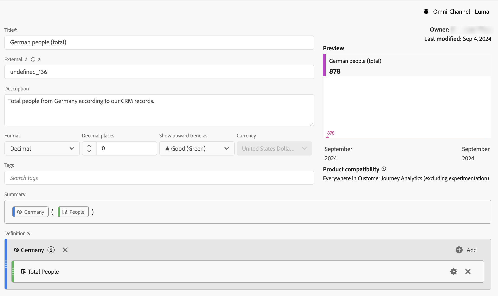

# 篩選量度

在[計算量度產生器](cm-build-metrics.md#definition-builder)中，您可以在量度定義中套用篩選器。 如果您想要在分析中將量度用於資料的子集，套用篩選器會很有幫助。

>[!NOTE]
>
>已透過[篩選產生器](/help/components/filters/filter-builder.md)更新篩選定義。 如果您變更篩選器，則篩選器會在任何使用篩選器的地方自動更新，包括該篩選器是否為計算量度定義的一部分。
>

您想要比較和您的品牌互動的德國人員與德國以外人員的量度。 因此，您可以回答以下問題：

1. 有多少德國和國際人士造訪您最受歡迎的[頁面](#popular-pages)。
1. 本月[總計](#totals)有多少德國和國際人士與您的品牌進行線上互動。
1. 造訪過您熱門頁面的德國人和海外人士的[百分比](#percentages)為何？

請參閱下列各節，說明篩選量度如何協助您回答這些問題。 在適當的情況下，會參考更詳細的檔案。

## 受歡迎頁面

1. [從名為`German people`的Workspace專案建立計算量度](cm-workflow.md)。
1. 在[計算量度產生器](cm-build-metrics.md)中，[建立標題為`Germany`的篩選器](/help/components/filters/filter-builder.md)，此篩選器使用您CRM資料中的CRM國家/地區欄位來判斷人員的來源。

   >[!TIP]
   >
   >在計算量度產生器中，您可以使用「元件」面板直接建立篩選器。
   >   

   您的篩選器可能如下所示。

   

1. 返回計算量度產生器，使用篩選器更新計算量度。

   

針對計算量度的國際版本重複上述步驟。

1. 從您的Workspace專案中建立標題為`International people`的計算量度。
1. 在計算量度產生器中，建立標題為`Not Germany`的篩選器，使用您CRM資料中的CRM國家/地區欄位來判斷人員的來源。

   您的篩選器應該看起來像。

   

1. 返回計算量度產生器，使用篩選器更新計算量度。

   

1. 在Analysis Workspace中建立專案，在那裡您可以檢視德國和國際人士造訪的頁面。

   

## 總計

1. 根據總計建立兩個新篩選器。 開啟先前建立的每個篩選器、重新命名篩選器、將&#x200B;**[!UICONTROL 人員]**&#x200B;的&#x200B;**[!UICONTROL 量度型別]**&#x200B;設定為&#x200B;**[!UICONTROL 總計]**，並使用&#x200B;**[!UICONTROL 另存新檔]**&#x200B;以新名稱儲存篩選器。 例如：

   德國的

1. 新增自由表格視覺效果至您的Workspace專案，顯示當月的總頁數。

   

## 百分比

1. 建立兩個新計算量度，用於根據您先前建立的計算量度計算百分比。

   

1. 更新您的Workspace專案。

   

+++ 以下影片會說明如何將篩選的計算量度作為無實作量度。

>[!VIDEO](https://video.tv.adobe.com/v/25407/?quality=12)

{{videoaa}}

+++
