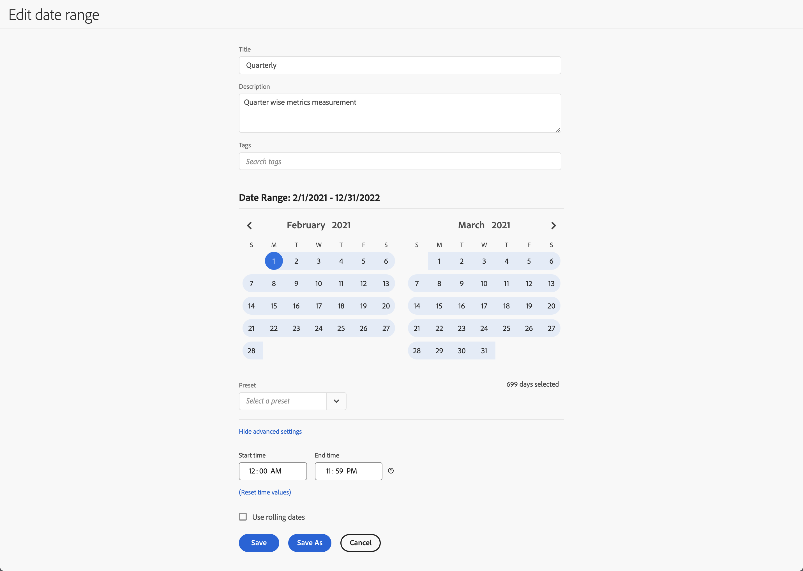

# 建立日期範圍


任何人都能建立自訂日期範圍。 您可以透過下列方式建立日期範圍：


* ??在主介面中，選取&#x200B;**[!UICONTROL 元件]**&#x200B;並選取&#x200B;**[!UICONTROL 日期範圍]**。 從[[!UICONTROL 日期範圍]管理員](/help/components/date-ranges/manage.md)中選取 [!UICONTROL **[!UICONTROL Add]**]。
* ??在Workspace專案中，從視覺效果的內容功能表中，選取&#x200B;**[!UICONTROL 自訂日期範圍至此日期範圍]**。
* ??在Workspace專案中，從功能表選取&#x200B;**[!UICONTROL 元件]**，然後選取&#x200B;**[!UICONTROL 建立日期範圍]**
* ??在Workspace專案中，使用捷徑&#x200B;**[!UICONTROL ctrl+shift+d]** (Windows)或&#x200B;**[!UICONTROL shift+command+d]** (macOS)。
* ??在Workspace專案中，從「元件」左側面板選取 **日期範圍**&#x200B;的。

若要定義附註，請使用[[!UICONTROL 日期範圍產生器]](#annotation-builder)：

<!-- Should we really mention API here. If so, we can do it all over the place in the docs...
| **Use the [Customer Journey Analytics Annotations API](https://developer.adobe.com/cja-apis/docs/endpoints/annotations/)** | The Customer Journey Analytics Annotations APIs allow you to create, update, or retrieve annotations programmatically through Adobe Developer. These APIs use the same data and methods that Adobe uses inside the product UI. |
-->


## 日期範圍產生器 {#date-range-builder}

<!-- markdownlint-disable MD034 -->

>[!CONTEXTUALHELP]
>id="cja_components_dateranges_endtime"
>title="結束時間"
>abstract="結束時間始終會包含 59 秒。"

<!-- markdownlint-enable MD034 -->


**[!UICONTROL 新日期範圍]**&#x200B;或&#x200B;**[!UICONTROL 編輯日期範圍]**&#x200B;對話方塊可用來建立新日期範圍或編輯現有日期範圍。




1. 指定日期範圍的&#x200B;**[!UICONTROL 標題]**。 例如，**[!UICONTROL 每季]**。
1. 選擇性地指定&#x200B;**[!UICONTROL 描述]**。
1. 透過建立或套用一或多個&#x200B;**[!UICONTROL 標籤]**&#x200B;來組織篩選。 開始輸入以尋找現有可選取的標籤。 或按&#x200B;**[!UICONTROL ENTER]**&#x200B;以新增標籤。 選取以移除標籤。 |
1. 請先選取開始日期，然後再選取結束日期，以選取&#x200B;**[!UICONTROL 日期範圍]**。
或者，您也可以從[!UICONTROL *選取預設集*]&#x200B;下拉式選單中選取&#x200B;**[!UICONTROL 預設集]**。

1. 選擇性地選取&#x200B;**[!UICONTROL 顯示進階設定]**&#x200B;以：

   * 指定預設`12:00 AM` (`0:00`)和`11:59 PM` (`23:59`)以外的開始時間&#x200B;]**和**[!UICONTROL &#x200B;結束時間&#x200B;]**。**[!UICONTROL &#x200B;結束時間一律包括59秒。 對於橫跨許多天的日期範圍，開始時間會套用至日期範圍的第一天，結束時間則套用至日期範圍中的最後一天。 使用&#x200B;**[!UICONTROL （重設時間值）]**&#x200B;將開始和結束時間重設為其預設值。
   * **[!UICONTROL 使用遞延日期]**。 如果啟用，預設日期範圍（例如&#x200B;**[!UICONTROL 最近7天整]**）會動態更新為目前的日期和時間進度。 如果停用，這類預設集在套用後不會更新。

     您可以選取方括弧中的文字（例如&#x200B;**[!UICONTROL 固定開始 — 每季滾動]**）來延伸面板，並指定&#x200B;**[!UICONTROL 開始]**&#x200B;和&#x200B;**[!UICONTROL 結束]**&#x200B;的詳細資料。

     

      1. 選取&#x200B;**[!UICONTROL 開始]**、**[!UICONTROL 結束]**&#x200B;或&#x200B;**[!UICONTROL 固定日]**。
      1. 當您選取&#x200B;**[!UICONTROL Start of]**&#x200B;或&#x200B;**[!UICONTROL End of]**&#x200B;時，您可以建置完整的運算式。 例如： **[!UICONTROL 結束]** **[!UICONTROL 目前季度]** **[!UICONTROL 減去]** `20` **[!UICONTROL 天]**。 為運算式的每個個別部分選取適當的值。
         * 選取目前值。 例如，**[!UICONTROL 目前季度]**。
         * 選取額外計算的值。 例如，**[!UICONTROL 減]**。
         * 當您指定其他計算時，請指定值。 例如，`20`。
         * 當您指定其他計算時，請選取用於計算的時間週期。 例如，**[!UICONTROL 天]**。

     選取&#x200B;**[!UICONTROL 隱藏詳細資料]**&#x200B;以隱藏滾動日期計算的詳細資料。

1. 選取：
   * **[!UICONTROL 儲存]**&#x200B;以儲存日期範圍。
   * **[!UICONTROL 另存新檔]**&#x200B;以儲存日期範圍的復本。
   * **[!UICONTROL 取消]**&#x200B;以取消您對日期範圍所做的任何變更，或取消建立新的日期範圍。


<!--


You can create a date range using either of the following two methods:

* Directly in a workspace project by clicking the '`+`' button next to the list of date range components on the left
* Within the date range manager

To create a date range in the date range manager:

1. Log in to [analytics.adobe.com](https://analytics.adobe.com) using your AdobeID credentials.
1. Navigate to [!UICONTROL Components] > [!UICONTROL Date Ranges].
1. Click the [!UICONTROL Add] button to open the modal window that creates a date range.

## Create a date range modal window

The modal window has four fields you can edit:

* **Date range**: The date range you want for this component.
* **Title**: The name you want for this component. The title is used in workspace projects.
* **Description**: The description you want for this component. The description is seen when clicking the  icon.
* **Tags**: Use tags to organize your date ranges. A date range can belong to multiple tags.

## Selecting a date range

When clicking the date range in the modal window, you have several options:

* **Calendar**: Select the start and end date.
* **Use rolling dates**: Check this box if you want the date range to change as time goes on. Do not check this box if you want your date range to remain static.
* **Select preset**: Use this drop-down selection if you want a custom date range based on a range that Adobe offers by default. When you select a preset, you can further customize the date range to suit your needs. It does not affect the preset that Adobe offers.

## Rolling date ranges

If you want a rolling date range, you can customize when it rolls. You can control when the start and end dates roll independently of each other.

* **When the date starts**: Choose if the date starts at the beginning of a time period, at the end of a time period, or use a fixed day.
* **The time period to use**: Choose how often the date range rolls. You can have it roll every day, every week, every month, every quarter, or every year.
* **Offset**: Choose the offset of the date range. You can add or subtract days, weeks, months, quarters, or years.

## Rolling date examples

Some date ranges can be useful in certain reports.

Year-to-date:

```text
Start: Start of current year
End: End of current day
```

Last Thursday to this Thursday:

```text
Start: Start of current week minus 3 days
End: Start of current week plus 4 days
```

Fiscal year (for example, if a fiscal year starts in December)

```text
Start: Start of current year minus 1 month
End: End of current year minus 1 month
```


-->