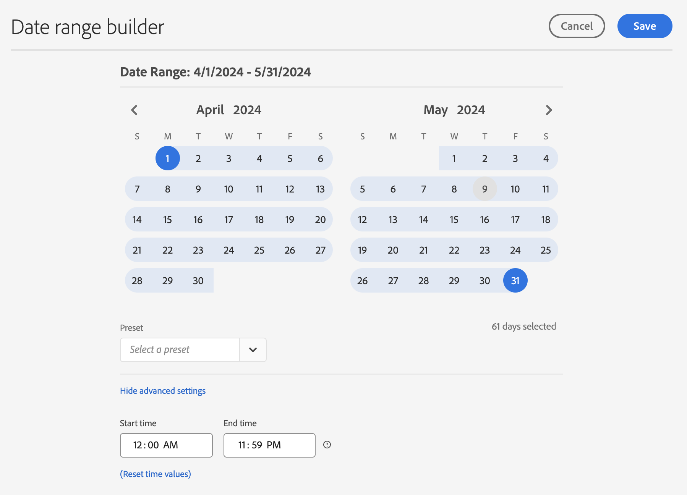

# 建立自訂日期範圍

在 Analysis Workspace 中建立自訂日期範圍，並將其儲存為時間元件。

**[!UICONTROL 元件]** > **[!UICONTROL 新的日期範圍]**

日期範圍會套用至面板層級。若要新增日期範圍至專案，請按一下&#x200B;**「面板** > *`<select panel>`*」，指定新的日期範圍。

## 「兩個月前」的日期範圍

下列自訂日期範圍會顯示「兩個月前」的日期範圍，而「摘要變更」視覺效果會顯示方向變化。

自訂日期範圍會顯示在您專案中的「[!UICONTROL 日期範圍]」元件面板上方：

您可將此自訂日期範圍拖曳至使用「上個月」預設集之自訂每月滾動日期範圍旁的欄中，用以進行比較。新增「摘要變更」視覺效果並選取每個欄的總計，顯示方向變化：

## 使用 7 天滾動日期範圍

日期範圍會套用至面板層級。若要新增日期範圍至專案，請按一下「**動作** > **新增面板**」，指定新的日期範圍。

您可以在日期範圍產生器中建立自訂日期範圍，用於和其他日期範圍一起顯示在元件面板中。

例如，您可以建立一個日期範圍，指定在一週前結束的 7 天滾動期間：

使用 *`rolling daily`*.

* 開始設定是 *`current day minus 14 days`*。

* 結束設定是 *`current day minus 7 days`*。

您可將此日期範圍當做元件，拖曳至其他自由表格上。
