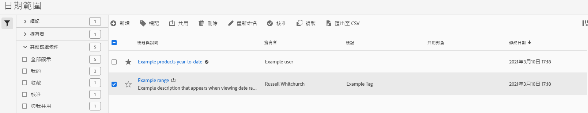

# 管理日期範圍

使用日期範圍管理器來共用、重新命名或刪除日期範圍。 若要存取日期管理器：

1. 使用您的 AdobeID 憑證登入 [analytics.adobe.com](https://analytics.adobe.com)。
1. 導覽至[!UICONTROL 元件] > [!UICONTROL 日期範圍]。

## 介面

日期範圍管理器包括以下選項：

* **新增**：建立新的日期範圍。 如需詳細資訊，請參閱[建立日期範圍](create.md)。
* **依標題搜尋**：依照標題搜尋日期範圍。 會根據此處輸入的文字，對結果進行篩選。
* **篩選器**：使用左欄來篩選日期範圍。 您可以依照自訂標籤、所有者、由您建立、您的最愛、已核准或與您共用來篩選。 您也可以搜尋所需的篩選器。
* **我的最愛**：按一下日期範圍旁邊的圖示，將其新增到您的最愛。
* **自訂欄**：按一下圖示以顯示或隱藏日期範圍管理器中的欄。

按一下一個或多個日期範圍旁的核取方塊，就會顯示更多選項。

* **標籤**：將標籤套用於所有選定的日期範圍。 標籤可協助您組織日期範圍，並讓您使用左欄篩選它們。
* **共用**：與其他 Experience Cloud 用戶共用日期範圍。 如果您是產品管理員，您還可以共用給整個組織或群組。 與您組織中的其他用戶共用的日期範圍，在標題旁邊會包含一個圖示。
* **刪除**：永久刪除選定的日期範圍。
* **重新命名**：如果選取了單一日期範圍，您可以變更其標題。
* **核准**：如果您是產品管理員，您可以新增核准印章至日期範圍。 核准的日期範圍會通知您組織中的用戶他們是「官方的」，將它們與組織中其他用戶建立的日期範圍區分開來。 核准的日期範圍在標題旁邊會有一個圖示。
* **取消核准**：如果您是產品管理員並選取已核准的日期範圍，則可以取消核准。
* **複製**：建立所選日期範圍的副本。 複製日期範圍會附加 `(Copy)` 到新複製的日期範圍標題的末尾。
* **匯出到 CSV**：將所有選定的日期範圍匯出到 CSV 檔案中。 產生的 CSV 檔案中的欄包括日期範圍管理器中的所有可見欄。
