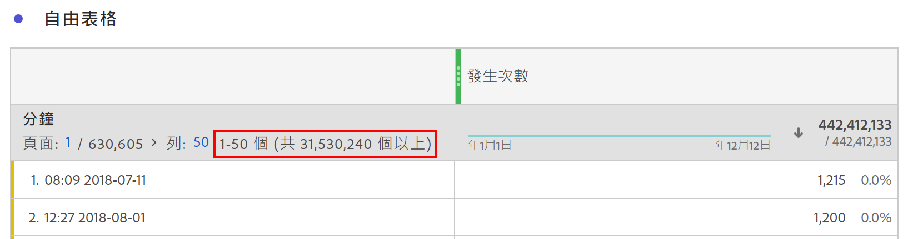

# Dimension基數很高

Customer Journey Analytics(CJA)不會限制在單一維度中可報告的唯一值或維度項目數。 但是，在某些情況下，具有大量唯一項目的維度（也稱為高基數維度）可能會影響可報告的內容。

## 限制

根據特定CJA連線中的事件數，以下兩個限制可能與高基數維度一起發生：

### 1.列數可能無法精確報告

高基數維度的列計數可能無法精確報告。 發生這種情況時，自由表格會提供如下指示：

### 2.計算量度可能會針對某些函式和排序順序使用估計值

當與高度基本維度搭配使用時，某些計算量度函式可能會傳回估計值，包括：「欄最大值」、「欄最小值」、「列計數」、「平均值」、「中位數」、「百分位數」、「四分位數」、「標準差」、「方差」、「回歸函式」和「T」和「Z」函式。

此外，使用計算度量對表列進行排序可能基於估計，並不一定總是反映確切的排序順序。 會出現警告訊息，提醒您可能已使用估計值。

請注意，即使計算量度有時可能會傳回估計，但欄總計永遠是正確的，永遠不會以估計為基礎。 同樣地，使用標準量度時，系統不會使用估計值，而且一律會反映精確的排序順序。

### 其中會考慮所有維度值

即使某些計算量度和維度列計數有限，但請注意，不論維度是否高度主要，下列功能一律會考慮任何維度中的所有唯一值：

* 量度歸因與維度配置
* 套用至自由表格的行項目搜尋
* 使用維度或維度項目的篩選
* 計算量度中的近似計數不同函式
* 包含／排除套用至「資料檢視」中任何量度或維度的邏輯
* 新增至連線的查閱資料集

## 使用高基本維度的最佳實務

為了消除使用高基數維度時可能發生的警告或估計，我們建議您使用下列其中一種方法來縮小報表中考慮的列數：

* 將篩選器新增至受影響的欄或面板。
* 將搜尋套用至自由表格。
* 將劃分套用至目標列，或將高度基本的維度當做劃分維度
* 將包含／排除條件新增至維度的「資料檢視」設定，以縮小維度中存在的唯一值數目。

使用這些技術通常可以消除使用高基本維度時遇到的任何不期望的估計或警告。
