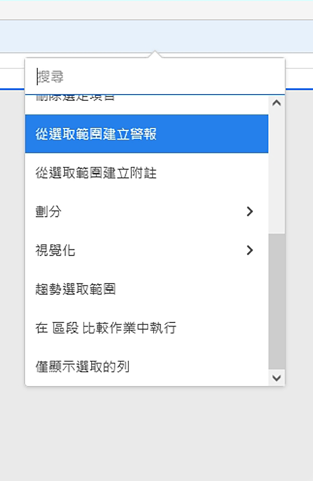

# 在 Workspace 中劃分維度

>[!NOTE]
>
>您正在檢視 Customer Journey Analytics 中 Analysis Workspace 的相關文件，其功能集與傳統 Adobe Analytics 中的 [Analysis Workspace 略有不同](https://experienceleague.adobe.com/docs/analytics/analyze/analysis-workspace/home.html)。[了解更多...](/help/getting-started/cja-aa.md)

在 Analysis Workspace 中劃分維度和維度項目。

根據您的特定需求無限制地分解資料；使用相關度量、維、篩選器、時間線和其他分析細分值生成查詢。

1. [建立專案](/help/analysis-workspace/home.md)並搭配資料表格。
1. 在資料表格中，以滑鼠右鍵按一下某個條列項目，並選取&#x200B;**[!UICONTROL 劃分]** > *`<item>`*。

   

   您可以按維項目或受眾篩選器在選定的時段中細分度量。 您也可以更深入鑽研至更詳細的層級。

   >[!NOTE]
   >
   >表格中顯示的劃分數目上限為 200。匯出劃分時，此限制會提高。

**視頻：DimensionAnalysis Workspace**

>[!VIDEO](https://video.tv.adobe.com/v/23971)

**視頻：Dimension故障**

>[!VIDEO](https://video.tv.adobe.com/v/23969)

## 將歸因模型套用到資料劃分

表格中的任何劃分也可套用任何歸因模型。此歸因模型可與父欄相同或不同。舉例來說，您可以在「行銷管道」維度中分析線性訂單，但將「U 形訂單」套用至管道中的特定追蹤代碼。若要編輯套用到劃分的歸因模型，請將滑鼠移到劃分模型上方，然後按一下&#x200B;**[!UICONTROL 編輯]**：

這是將屬性模型應用於故障或編輯故障時的預期行為：

* 如果在不存在其他屬性時應用屬性，則屬性將應用於整個列樹。

* 如果在應用了屬性後添加細分，則它將對添加的給定細分使用預設值（如果該維具有預設值）。 否則，它將使用父列的細分。 某些維具有預設分配。 例如，「時間」尺寸和「參照」使用「相同觸點」。 產品維使用上次觸摸。 其他維沒有預設維，將使用父列分配。

* 如果列樹中已存在屬性，則更改屬性只會影響您正在編輯的屬性。

## 影片

在 Analysis Workspace 中新增維度和量度至您的專案：

>[!VIDEO](https://video.tv.adobe.com/v/30606)

在自由格式表格中使用維度：

>[!VIDEO](https://video.tv.adobe.com/v/40179)

Dimension按位置分類：

>[!VIDEO](https://video.tv.adobe.com/v/24033)
