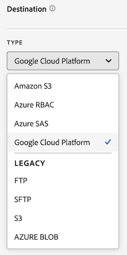

# 建立資料摘要

建立資料摘要時，您需要向 Adobe 提供：

* 關於原始資料檔案傳送目標的相關資訊

* 您要在每個檔案中包含的資料

* 資料摘要的傳送頻率（包括擷取延遲送達點選的處理延遲）

在建立資料摘要之前，務必先對資料摘要有基本的了解，並確認您已滿足所有先決條件。 如需詳細資訊，請參閱[資料摘要概觀](data-feed-overview.md)。

## 建立並設定資料摘要 {#create-and-configure-data-feed}

<!-- markdownlint-disable MD034 -->

>[!CONTEXTUALHELP]
>id="cja_datafeed_export_file"
>title="manifest"
>abstract="選擇是否在每次傳送資料摘要時包含資訊清單檔案。 資訊清單檔案包含資料摘要中所包含之每個檔案的相關資訊。 在以單一封裝傳送資料摘要的資料時，您也可以選擇包含完成檔案，但建議包含資訊清單檔案。 "

<!-- markdownlint-enable MD034 -->

<!-- markdownlint-disable MD034 -->

>[!CONTEXTUALHELP]
>id="cja_datafeed_notify"
>title="完成時通知"
>abstract="指定一或多個電子郵件地址，在傳送資料摘要後，向其傳送通知。 多個電子郵件地址必須以逗號分隔。"

<!-- markdownlint-enable MD034 -->

<!-- markdownlint-disable MD034 -->

>[!CONTEXTUALHELP]
>id="cja_datafeed_lookback_date_range"
>title="回顧日期範圍"
>abstract="控制 Customer Journey Analytics 在處理資料摘要傳送時回顧的時間範圍。 此設定不會更改頻率時段 (小時或日)。 不過，回顧日期範圍可能會影響傳送的資料。 區段資格、工作階段計算、某些衍生欄位轉換和維度持續性都受到回顧日期範圍的影響。"

<!-- markdownlint-enable MD034 -->

1. 使用您的 Adobe ID 認證登入 [experiencecloud.adobe.com](https://experiencecloud.adobe.com)。

1. 在介面右上方選取 [!UICONTROL **Customer Journey Analytics**] (透過應用程式切換器)。

1. 在頂端導覽列中，前往&#x200B;[!UICONTROL **「管理」**]>[!UICONTROL **「資料摘要」**]。

1. 選取&#x200B;[!UICONTROL **建立資料摘要**]。

   會顯示包含以下索引標籤的頁面： [!UICONTROL **詳細資料**]、[!UICONTROL **資料結構**]&#x200B;和&#x200B;[!UICONTROL **傳遞**]。

   

1. 在&#x200B;[!UICONTROL **詳細資料**]&#x200B;區段中，完成下列欄位：

   | 欄位 | 函數 |
   |---------|----------|
   | [!UICONTROL **名稱**] | 資料摘要的名稱 名稱在選取的資料檢視中必須是唯一的，而且長度最多可為255個字元。<!--[Learn more](/help/export/analytics-data-feed/df-faq.md#must-feed-names-be-unique)--> |
   | [!UICONTROL **標記**] | 將任何標籤套用到資料摘要以方便分類。<!--You can filter on tags as described in [Filter and search the list of data feeds](/help/export/analytics-data-feed/df-manage-feeds.md#filter-and-search-the-list-of-data-feeds) in [Manage data feeds](/help/export/analytics-data-feed/df-manage-feeds.md).--> |
   | [!UICONTROL **說明**] | 指定資料摘要的說明。 編輯資料摘要時，會顯示您新增的說明。 |
   | [!UICONTROL **資料檢視**] | 選取包含您要匯出之資料的資料檢視。 |

1. 在&#x200B;[!UICONTROL **資料結構**]&#x200B;區段中，確定已在&#x200B;**[!UICONTROL 資料檢視]**&#x200B;欄位中選取正確的資料檢視。 
選取資料檢視時，請考量下列事項：
 <ul><li>如果相同資料檢視建立了多個資料摘要，則每個資料摘要都必須有不同的欄定義。</li><li>可用欄的清單取決於所選資料檢視所屬的登入公司。 如果您變更資料檢視，可用欄的清單可能會變更。 </li></ul>

1. 將欄新增至資料摘要設定。 在左側的元件邊欄區段中，找出您要納入的任何欄，然後將其拖曳至畫布以建置您的資料結構。 您可以按住&#x200B;**[!UICONTROL Shift]**&#x200B;或按住&#x200B;**[!UICONTROL Command]** （在macOS上）或&#x200B;**[!UICONTROL Ctrl]** （在Windows上）來選取多個欄。

   使用下列資訊來瞭解一律包含的維度、不可包含的維度以及必須替代的量度：

   +++ 資料摘要中一律包含的維度

   下列維度預設會包含在每個資料摘要中，且無法移除：

   | 維度名稱 | 附註 | 資料饋送 | 其他報告 |
   |---|---|---|---|
   | 時間戳記 | 事件期間的時間戳記。 微秒粒度。 以UTC表示。 | 強制 | 未提供 |
   | 列ID | 唯一列識別碼 | 強制 | 未提供 |
   | 工作階段ID | 每個工作階段的唯一識別碼 | 強制 | 未提供 |
   | 人員 ID | 資料檢視和連線的個人識別碼 | 強制 | 可選標準 |
   | 帳戶ID [!BADGE B2B edition]{type=Informative url="https://experienceleague.adobe.com/zh-hant/docs/analytics-platform/using/cja-overview/cja-b2b/cja-b2b-edition" newtab=true tooltip="Customer Journey Analytics B2B Edition"} | 使用帳戶容器時的帳戶ID | 強制 | 可選標準 |

   +++

   +++ 無法納入資料摘要的維度

   Customer Journey Analytics標準維度不得包含在資料摘要中。 下表列出這些維度：

   | 維度名稱 | 附註 | 資料饋送 |
   |---|---|---|
   | 5 分鐘 | 事件發生時的五分鐘間隔（無條件舍去） | 未提供 |
   | 15 分鐘 | 發生事件時的15分鐘間隔（無條件舍去） | 未提供 |
   | 30 分鐘 | 發生事件時的30分鐘間隔（無條件舍去） | 未提供 |
   | 日 | 事件發生日期 | 未提供 |
   | 星期 | 事件發生的一週中的第幾天 | 未提供 |
   | 當月日期 | 事件發生當月的第幾天 | 未提供 |
   | 事件深度 | 循序數值（1、2、3等） 指派給工作階段中的每個事件互動 | 未提供 |
   | 小時 | 發生事件的小時（無條件舍去） | 未提供 |
   | 小時 | 事件發生當天的小時（無條件舍去） | 未提供 |
   | 分鐘 | 發生事件的分鐘數（無條件舍去） | 未提供 |
   | 小時期間各分鐘 | 發生事件當小時的分鐘（無條件舍去） | 未提供 |
   | 月 | 發生事件的月份 | 未提供 |
   | 月份 | 發生事件的月份 | 未提供 |
   | 季 | 季度發生事件 | 未提供 |
   | 季別 | 發生事件的季別 | 未提供 |
   | Second | 發生事件第二次（無條件舍去） | 未提供 |
   | 週 | 事件發生周 | 未提供 |
   | 年度內的第幾週 | 事件發生的一年中的第幾週 | 未提供 |
   | 年 | 事件發生年份 | 未提供 |

   +++

   +++ 在資料摘要中必須替代的量度

   下列Customer Journey Analytics量度必須被取代：

   | 量度名稱 | 附註 | 資料饋送 |
   |---|---|---|
   | 帳戶 [!BADGE B2B Edition]{type=Informative url="https://experienceleague.adobe.com/zh-hant/docs/analytics-platform/using/cja-overview/cja-b2b/cja-b2b-edition" newtab=true tooltip="Customer Journey Analytics B2B Edition"} | 根據連線中指定的帳戶ID | 無法使用。 使用帳戶ID的相異計數。 |
   | 購買群組[!BADGE B2B edition]{type=Informative url="https://experienceleague.adobe.com/zh-hant/docs/analytics-platform/using/cja-overview/cja-b2b/cja-b2b-edition" newtab=true tooltip="Customer Journey Analytics B2B Edition"} | 根據連線中的購買群組ID購買群組 | 無法使用。 使用購買群組ID的相異計數。 |
   | 活動 | 連線中所有事件資料集的列數 | 無法使用。 使用資料列ID的相異計數。 |
   | 全域帳戶 [!BADGE B2B Edition]{type=Informative url="https://experienceleague.adobe.com/zh-hant/docs/analytics-platform/using/cja-overview/cja-b2b/cja-b2b-edition" newtab=true tooltip="Customer Journey Analytics B2B Edition"} | 根據連線中的全域帳戶ID | 無法使用。 使用全域帳戶ID的相異計數。 |
   | 機會 [!BADGE B2B Edition]{type=Informative url="https://experienceleague.adobe.com/zh-hant/docs/analytics-platform/using/cja-overview/cja-b2b/cja-b2b-edition" newtab=true tooltip="Customer Journey Analytics B2B Edition"} | 根據連線中的機會ID的機會 | 無法使用。 使用與機會ID不同的計數。 |
   | 使用者 | 根據連線中指定的人員ID | 無法使用。 使用人員ID的相異計數。 |
   | 對話數 | 交談數 | 無法使用。 使用對話識別碼的相異計數。 |
   | 工作階段結束 | 工作階段中最後一個事件的事件數 | 未提供 |
   | 工作階段開始 | 工作階段中第一個事件的事件數 | 未提供 |
   | 工作階段 | 根據資料檢視的工作階段設定 | 無法使用。 使用工作階段ID的相異計數。 |
   | 逗留時間（秒） | 加總兩個不同維度值之間的時間 | 未提供 |

   +++

   +++ 可選標準元件

   | 元件名稱 | 類型 | 附註 | 資料饋送 |
   |---|---|---|---|
   | 上午/下午 | 時間分段維度 | 上午或下午 | 未提供 |
   | 批次 ID | 維度 | Experience Platform批次的識別碼 | 可用 |
   | 資料集 ID | 維度 | Experience Platform資料集的識別碼 | 可用 |
   | 當月日期 | 時間分段維度 | 1-31 | 未提供 |
   | 星期 | 時間分段維度 | 星期一到星期日 | 未提供 |
   | 年中的日 | 時間分段維度 | 1-366 | 未提供 |
   | 小時 | 時間分段維度 | 0-23 | 未提供 |
   | 月份 | 時間分段維度 | 1-12月 | 未提供 |
   | 首次工作階段 | 量度 | 個人在報告時段內首次定義的工作階段 | 未提供 |
   | 回訪工作階段 | 量度 | 非個人首次工作階段的工作階段 | 未提供 |
   | 人員ID名稱空間 | 維度 | 組成人員ID的ID型別（例如電子郵件或Cookie ID） | 可用 |
   | 全域帳戶ID [!BADGE B2B edition]{type=Informative url="https://experienceleague.adobe.com/zh-hant/docs/analytics-platform/using/cja-overview/cja-b2b/cja-b2b-edition" newtab=true tooltip="Customer Journey Analytics B2B Edition"} | 維度 | 使用全域帳戶容器時的全域帳戶ID | 可用 |
   | 機會ID [!BADGE B2B edition]{type=Informative url="https://experienceleague.adobe.com/zh-hant/docs/analytics-platform/using/cja-overview/cja-b2b/cja-b2b-edition" newtab=true tooltip="Customer Journey Analytics B2B Edition"} | 維度 | 使用機會容器時的機會識別碼 | 可用 |
   | 購買群組ID [!BADGE B2B edition]{type=Informative url="https://experienceleague.adobe.com/zh-hant/docs/analytics-platform/using/cja-overview/cja-b2b/cja-b2b-edition" newtab=true tooltip="Customer Journey Analytics B2B Edition"} | 維度 | 使用購買群組容器時的購買群組ID | 可用 |
   | 季別 | 時間分段維度 | 第 1 季、第 2 季、第 3 季、第 4 季 | 未提供 |
   | 重複工作階段 | 量度 | 不是個人的首次工作階段的工作階段 | 未提供 |
   | 工作階段型別 | 維度 | 兩個值：首次或傳回 | 未提供 |
   | 每個事件逗留時間 | 維度 | 將「逗留時間」量度儲存至事件值區 | 未提供 |
   | 每個工作階段逗留時間 | 維度 | 將「逗留時間」量度儲存至「工作階段」值區 | 未提供 |
   | 每人逗留時間 | 維度 | 將「逗留時間」量度儲存至人員值區 | 未提供 |
   | 週末/平常日 | 時間分段維度 | 週末或平常日 | 未提供 |

   +++

1. 在&#x200B;[!UICONTROL **傳遞**]&#x200B;區段中，指定下列資訊：

   | 欄位 | 函數 |
   |---------|----------|
   | [!UICONTROL **摘要型別**] | 選取您要建立的摘要型別：<ul><li>[!UICONTROL **即時摘要**]：匯出目前和未來的資料。</li><li>[!UICONTROL **回填摘要**]：匯出兩個過去日期之間的歷史資料。</li></ul> |
   | [!UICONTROL **開始日期**] | 指定資料摘要的開始日期。 若要立即開始處理歷史資料的資料摘要，請確定已選取&#x200B;[!UICONTROL **回填摘要**]，然後將此日期設定為收集資料時的任何過去日期。 開始日期取決於資料檢視的時區。 |
   | [!UICONTROL **結束日期**] | 指定資料摘要的結束日期。 結束日期取決於資料檢視的時區。 |
   | [!UICONTROL **頻率**] | 選取資料摘要的傳送頻率。 時間戳記屬於頻率視窗的事件會包含在資料摘要傳送中。 [!UICONTROL **回顧日期範圍**]&#x200B;及&#x200B;[!UICONTROL **處理延遲**]&#x200B;欄位也會影響哪些事件包含在您所選擇傳遞頻率的資料中。
對於即時摘要，選取此選項可包含一小時的資料量或一天的資料量。 回填摘要必須為每日。
<ul><li>**每日**：摘要包含一整天的資料，從資料檢視時區的午夜到午夜。 此選項可用於回填摘要或即時摘要。</li><li>**小時**：摘要包含一個小時的資料量。 對即時摘要使用此選項。</li></ul> |
   | [!UICONTROL **回顧日期範圍**] | 控制 Customer Journey Analytics 在處理資料摘要傳送時回顧的時間範圍。 
此設定不會改變頻率視窗（小時或天），其定義要包含在資料摘要輸出中的事件時間範圍。 不過，回顧日期範圍可能會透過下列方式影響傳送的資料： 
<ul><li>**區段資格**：將區段套用至您的資料摘要定義時，回顧日期範圍內的任何事件都會決定某人是否符合資格。 區段的容器設定會決定範圍。 (可能的容器包括：「人員」、「工作階段」或「事件」。 B2B有下列額外的容器：全域帳戶、帳戶、商機、購買群組。)  
例如，如果使用「人員」容器，且該人員在回顧日期範圍內符合資格，則其在頻率期間的所有事件也符合資格。
</li><li>**工作階段計算**：工作階段範圍是使用回顧日期範圍內的資料計算。</li><li>**衍生欄位轉換**：參考容器的任何衍生欄位函式（例如「摘要」、「重複資料刪除」和「深度」函式）會在資料摘要匯出中使用回顧日期範圍。</li><li>**Dimension持續性**：如果您選擇在個別維度上設定持續性，您也可選擇有效期限，以決定維度專案在其設定的事件之後持續多長時間。 
當資料檢視中的到期日設定為下列任一選項時，回顧日期範圍會影響維度持續性：
<ul><li>對於資料摘要定義中每個使用&#x200B;[!UICONTROL **報告期間**]&#x200B;作為到期日的維度，回顧日期範圍都會變成新的報告期間。</li><li>對於資料摘要定義中以&#x200B;[!UICONTROL **自訂時間**]&#x200B;作為到期時間的每個維度，如果選取的自訂時間超過回顧日期範圍，則忽略自訂時間，並將回顧日期範圍用於維度到期日。
如需有關在資料檢視中設定維度的持續性的詳細資訊，請參閱[持續性元件設定](/help/data-views/component-settings/persistence.md)。
</li></ul> |
   | [!UICONTROL **處理延遲**] | 選擇在處理資料摘要檔案之前要等待的時間長度。 在處理延遲期間傳入的任何延遲送達點選都會納入資料摘要中。 
延遲的作用在於，在行動裝置實作中讓離線裝置得以上線並傳送資料。 在管理舊的已處理檔案時，它也可用於容納組織的伺服器端處理程序。 

您可以將摘要延遲2、3、4或8小時。
工作階段必須在處理延遲截止之後開始才能納入；在截止之前開始並在處理延遲內結束的工作階段不包括在內。
 |

1. 在&#x200B;[!UICONTROL **目的地**]&#x200B;區段中，設定您要傳送資料的目的地。

   >[!NOTE]
   >
   >設定報告目標時，請考慮以下事項：
   >
   ><!--* Adobe recommends using a cloud account for your report destination. [Legacy FTP and SFTP accounts](/help/components/locations/configure-import-accounts.md) are available, but are not recommended.-->
   >* 您先前設定的任何雲端帳戶都可用於資料摘要。 您可以從「位置」管理員的[元件>匯出>位置帳戶](/help/components/exports/cloud-export-accounts.md)中設定雲端帳戶。
   >
   >* 雲端帳戶與您的Customer Journey Analytics使用者帳戶相關聯。 其他使用者無法使用或檢視您設定的雲端帳戶，除非您提供這些帳戶給組織中的所有使用者。
   >
   >* 您可以在[元件>匯出>位置](/help/components/exports/cloud-export-locations.md)中，編輯從「位置」管理員建立的任何位置。

   填入下列欄位：

   | 欄位 | 函數 |
   |---------|----------|
   | [!UICONTROL **帳戶**] | 進行下列一項：<ul><li>**使用現有帳戶：**&#x200B;選取&#x200B;**[!UICONTROL 帳戶]**&#x200B;欄位旁的下拉式功能表。 或者，開始輸入帳戶名稱，然後從下拉式選單中選取。 
只有在您已設定帳戶，或帳戶與您所屬的某個組織共用時，您才可使用帳戶。
</li><li>**建立新帳戶：**&#x200B;在&#x200B;**[!UICONTROL 帳戶]**&#x200B;欄位下選取&#x200B;**[!UICONTROL 新增]**。 如需有關如何設定帳戶的資訊，請參閱[設定雲端匯出帳戶](/help/components/exports/cloud-export-accounts.md)。</li></ul> |
   | [!UICONTROL **位置**] | 進行下列一項：<ul><li>**使用現有的位置：**&#x200B;選取&#x200B;**[!UICONTROL 位置]**&#x200B;欄位旁的下拉式功能表。 或者，開始輸入位置名稱，然後從下拉式選單中選取它。</li><li>**建立新位置：**&#x200B;在&#x200B;**[!UICONTROL 位置]**&#x200B;欄位下選取&#x200B;**[!UICONTROL 新增]**。 如需有關如何設定位置的資訊，請參閱[設定雲端匯出位置](/help/components/exports/cloud-export-locations.md)。</li></ul> |
   | [!UICONTROL **完成時通知**] | 指定一或多個電子郵件地址，在資料摘要成功傳送或無法傳送後，應傳送通知。 多個電子郵件地址必須以逗號分隔。 |
   | [!UICONTROL **啟用資訊清單**] | 選擇是否在每次傳送資料摘要時包含資訊清單檔案。 資訊清單檔案包含資料摘要中所包含每個檔案的資訊。 |

1. 選取&#x200B;**[!UICONTROL 「儲存」]**。

<!-- why would you want to do this? -->

<!--
I don't think we need anything after this, but saving here just in case:

1. In the [!UICONTROL **Feed Information**] section, complete the following fields:
   
   | Field | Function |
   |---------|----------|
   | [!UICONTROL **Name**] | The name of the data feed. Must be unique within the selected report suite, and can be up to 255 characters in length. [Learn more](/help/export/analytics-data-feed/df-faq.md#must-feed-names-be-unique) |
   | [!UICONTROL **Report suite**] | The report suite that the data feed is based on. If multiple data feeds are created for the same report suite, they must have different column definitions. Only source report suites support data feeds; virtual report suites are not supported. |
   | [!UICONTROL **Email when complete**] | The email address to be notified when a feed finishes processing. The email address must be properly formatted. |
   | [!UICONTROL **Feed interval**] | Select **Daily** for backfill or historical data. Daily feeds contain a full day's worth of data, from midnight to midnight in the report suite's time zone. Select **Hourly** for continuing data (Daily is also available for continuing feeds if you prefer). Hourly feeds contain a single hour's worth of data. |
   | [!UICONTROL **Delay processing**] | Wait a given amount of time before processing a data feed file. A delay can be useful to give mobile implementations an opportunity for offline devices to come online and send data. It can also be used to accommodate your organization's server-side processes in managing previously processed files. In most cases, no delay is needed. A feed can be delayed by up to 120 minutes. |
   | [!UICONTROL **Start & end dates**] | The start date indicates the date when you want the data feed to begin. To immediately begin processing data feeds for historical data, set this date to any date in the past when data is being collected. The start and end dates are based on the report suite's time zone. |
   | [!UICONTROL **Continuous feed**] | This checkbox removes the end date, allowing a feed to run indefinitely. When a feed finishes processing historical data, a feed waits for data to finish collecting for a given hour or day. Once the current hour or day concludes, processing begins after the specified delay. |
   
1. In the [!UICONTROL **Destination**] section, in the [!UICONTROL **Type**] drop-down menu, select the destination where you want the data to be sent. 

   >[!NOTE]
   >
   >Consider the following when configuring a report destination:
   >
   >* We recommend using a cloud account for your report destination. [Legacy FTP and SFTP accounts](#legacy-destinations) are available, but are not recommended.
   >* Any cloud accounts that you previously configured are available to use for Data Feeds. You can configure cloud accounts in any of the following ways:
   >
   >   * When configuring cloud accounts for [Data Warehouse](/help/export/data-warehouse/create-request/dw-request-report-destinations.md) 
   >   
   >   * When [importing Adobe Analytics classification data](/help/components/locations/locations-manager.md) (Any locations that are configured for importing classification data cannot be used.)
   >   
   >   * From the Locations manager, in [Components > Locations](/help/components/locations/configure-import-accounts.md) 
   >
   >* Cloud accounts are associated with your Adobe Analytics user account. Other users cannot use or view cloud accounts that you configure.
   >
   >* You can edit any locations that you create from the Locations manager in [Components > Locations](/help/components/locations/configure-import-accounts.md)

   

   Use any of the following destination types when creating a data feed. For configuration instructions, expand the destination type. (Additional [legacy destinations](#legacy-destinations) are also available, but are not recommended.)

   +++Amazon S3

   You can send feeds directly to Amazon S3 buckets. This destination type requires only your Amazon S3 account and the location (bucket). 

   Adobe Analytics uses cross-account authentication to upload files from Adobe Analytics to the specified location in your Amazon S3 instance.

   When using Amazon S3 with Data Feeds, only SSE-S3 encryption is supported.

   To configure an Amazon S3 bucket as the destination for a data feed:

   1. Begin creating a data feed as described in [Create and configure a data feed](#create-and-configure-a-data-feed).
   
   1. In the [!UICONTROL **Destination**] section, in the [!UICONTROL **Type**] drop-down menu, select [!UICONTROL **Amazon S3**].

      

   1. Select [!UICONTROL **Select location**].

      The Amazon S3 Export Locations page is displayed.

   1. (Conditional) If an Amazon S3 account (and a location on that account) has already been configured in Adobe Analytics, you can use it as your data feed destination: 

      >[!NOTE]
      >
      >Accounts are available to you only if you configured them or if they were shared with an organization you are a part of.
   
      1. Select the account from the [!UICONTROL **Select account**] drop-down menu.

         Any cloud accounts that were configured in any of the following areas of Adobe Analytics are available to use:
      
         * When importing Adobe Analytics classification data, as described in [Schema](/help/components/classifications/sets/manage/schema.md).
      
           However, any locations that are configured for importing classification data cannot be used. Instead, add a new destination as described below.

         * When configuring accounts and locations in the Locations area, as described in [Configure cloud import and export accounts](/help/components/locations/configure-import-accounts.md) and [Configure cloud import and export locations](/help/components/locations/configure-import-locations.md).
   
      1. Select the location from the [!UICONTROL **Select location**] drop-down menu.

      1. Select [!UICONTROL **Save**] > [!UICONTROL **Save**].

      The destination is now configured to send data to the Amazon S3 location that you specified.
   
   1. (Conditional) If you have not previously added an Amazon S3 account:

      1. Select [!UICONTROL **Add account**], then specify the following information:
   
         |Field | Function |
         |---------|----------|
         | [!UICONTROL **Account name**] | A name for the account. This can be any name you choose. |
         | [!UICONTROL **Account description**] | A description for the account. |
         | [!UICONTROL **Role ARN**] | You must provide a Role ARN (Amazon Resource Name) that Adobe can use to gain access to the Amazon S3 account. To do this, you create an IAM permission policy for the source account, attach the policy to a user, and then create a role for the destination account. For specific information, see [this AWS documentation](https://aws.amazon.com/premiumsupport/knowledge-center/cross-account-access-iam/). |
         | [!UICONTROL **User ARN**] | The User ARN (Amazon Resource Name) is provided by Adobe. You must attach this user to the policy you created. |

         {style="table-layout:auto"}

      1. Select [!UICONTROL **Add location**], then specify the following information:
   
         |Field | Function |
         |---------|----------|
         | [!UICONTROL **Name**] | A name for the account.  |
         | [!UICONTROL **Description**] | A description for the account. |
         | [!UICONTROL **Bucket**] | The bucket within your Amazon S3 account where you want Adobe Analytics data to be sent. 
Ensure that the User ARN that was provided by Adobe has the `S3:PutObject` permission in order to upload files to this bucket. This permission allows the User ARN to upload initial files and overwrite files for subsequent uploads.

Bucket names must meet specific naming rules. For example, they must be between 3 to 63 characters long, can consist only of lowercase letters, numbers, dots (.), and hyphens (-), and must begin and end with a letter or number. [A complete list of naming rules are available in the AWS documentation](https://docs.aws.amazon.com/AmazonS3/latest/userguide/bucketnamingrules.html). 
 |
         | [!UICONTROL **Prefix**] | The folder within the bucket where you want to put the data. Specify a folder name, then add a backslash after the name to create the folder. For example, `folder_name/` |

         {style="table-layout:auto"}

      1. Select [!UICONTROL **Create**] > [!UICONTROL **Save**].

         The destination is now configured to send data to the Amazon S3 location that you specified.

      1. (Conditional) If you need to manage the destination (account and location) that you just created, it is available in the [Locations manager](/help/components/locations/locations-manager.md).
   
   +++

   +++Azure RBAC

   You can send feeds directly to an Azure container by using RBAC authentication. This destination type requires an Application ID, Tenant ID, and Secret. 

   To configure an Azure RBAC account as the destination for a data feed:

   1. If you haven't already, create an Azure application that Adobe Analytics can use for authentication, then grant access permissions in access control (IAM). 
   
      For information, refer to the [Microsoft Azure documentation about how to create an Azure Active Directory application](https://learn.microsoft.com/en-us/azure/active-directory/develop/howto-create-service-principal-portal). 
   
   1. In the Adobe Analytics admin console, in the [!UICONTROL **Destination**] section, in the [!UICONTROL **Type**] drop-down menu, select [!UICONTROL **Azure RBAC**].

      

   1. Select [!UICONTROL **Select location**].

      The Azure RBAC Export Locations page is displayed.

   1. (Conditional) If an Azure RBAC account (and a location on that account) has already been configured in Adobe Analytics, you can use it as your data feed destination: 

      >[!NOTE]
      >
      >Accounts are available to you only if you configured them or if they were shared with an organization you are a part of.
   
      1. Select the account from the [!UICONTROL **Select account**] drop-down menu.

      Any cloud accounts that you configured in any of the following areas of Adobe Analytics are available to use:
      
         * When importing Adobe Analytics classification data, as described in [Schema](/help/components/classifications/sets/manage/schema.md).
      
           However, any locations that are configured for importing classification data cannot be used. Instead, add a new destination as described below.

         * When configuring accounts and locations in the Locations area, as described in [Configure cloud import and export accounts](/help/components/locations/configure-import-accounts.md) and [Configure cloud import and export locations](/help/components/locations/configure-import-locations.md).

      1. Select the location from the [!UICONTROL **Select location**] drop-down menu.

      1. Select [!UICONTROL **Save**] > [!UICONTROL **Save**].

         The destination is now configured to send data to the Azure RBAC location that you specified.

   1. (Conditional) If you have not previously added an Azure RBAC account:

      1. Select [!UICONTROL **Add account**], then specify the following information:
   
         |Field | Function |
         |---------|----------|
         | [!UICONTROL **Account name**] | A name for the Azure RBAC account. This name displays in the [!UICONTROL **Select account**] drop-down field and can be any name you choose. |
         | [!UICONTROL **Account description**] | A description for the Azure RBAC account. This description displays in the [!UICONTROL **Select account**] drop-down field and can be any name you choose.  |
         | [!UICONTROL **Application ID**] | Copy this ID from the Azure application that you created. In Microsoft Azure, this information is located on the **Overview** tab within your application. For more information, see the [Microsoft Azure documentation about how to register an application with the Microsoft identity platform](https://learn.microsoft.com/en-us/azure/active-directory/develop/quickstart-register-app). |
         | [!UICONTROL **Tenant ID**] | Copy this ID from the Azure application that you created. In Microsoft Azure, this information is located on the **Overview** tab within your application. For more information, see the [Microsoft Azure documentation about how to register an application with the Microsoft identity platform](https://learn.microsoft.com/en-us/azure/active-directory/develop/quickstart-register-app). |
         | [!UICONTROL **Secret**] | Copy the secret from the Azure application that you created. In Microsoft Azure, this information is located on the **Certificates & secrets** tab within your application. For more information, see the [Microsoft Azure documentation about how to register an application with the Microsoft identity platform](https://learn.microsoft.com/en-us/azure/active-directory/develop/quickstart-register-app). |

         {style="table-layout:auto"}

      1. Select [!UICONTROL **Add location**], then specify the following information: 
   
         |Field | Function |
         |---------|----------|
         | [!UICONTROL **Name**] | A name for the location. This name displays in the [!UICONTROL **Select location**] drop-down field and can be any name you choose. |
         | [!UICONTROL **Description**] | A description for the location. This description displays in the [!UICONTROL **Select location**] drop-down field and can be any name you choose. |
         | [!UICONTROL **Account**] | The Azure storage account. |
         | [!UICONTROL **Container**] | The container within the account you specified where you want Adobe Analytics data to be sent. Ensure that you grant permissions to upload files to the Azure application that you created earlier. |
         | [!UICONTROL **Prefix**] | The folder within the container where you want to put the data. Specify a folder name, then add a backslash after the name to create the folder. For example, `folder_name/`
Make sure the Application ID that you specified when configuring the Azure RBAC account has been granted the `Storage Blob Data Contributor` role in order to access the container (folder).
 
For more information, see [Azure built-in roles](https://learn.microsoft.com/en-us/azure/role-based-access-control/built-in-roles).
 |

         {style="table-layout:auto"}

      1. Select [!UICONTROL **Create**] > [!UICONTROL **Save**].

         The destination is now configured to send data to the Azure RBAC location that you specified.

      1. (Conditional) If you need to manage the destination (account and location) that you just created, it is available in the [Locations manager](/help/components/locations/locations-manager.md).
   
   +++

   +++Azure SAS

   You can send feeds directly to an Azure container by using SAS authentication. This destination type requires an Application ID, Tenant ID, Key vault URI, Key vault secret name, and secret. 

   To configure Azure SAS as the destination for a data feed:

   1. If you haven't already, create an Azure application that Adobe Analytics can use for authentication. 
   
      For information, refer to the [Microsoft Azure documentation about how to create an Azure Active Directory application](https://learn.microsoft.com/en-us/azure/active-directory/develop/howto-create-service-principal-portal). 
   
   1. In the Adobe Analytics admin console, in the [!UICONTROL **Destination**] section, select [!UICONTROL **Azure SAS**].

      

   1. Select [!UICONTROL **Select location**].

      The Azure SAS Export Locations page is displayed.

   1. (Conditional) If an Azure SAS account (and a location on that account) has already been configured in Adobe Analytics, you can use it as your data feed destination: 

      >[!NOTE]
      >
      >Accounts are available to you only if you configured them or if they were shared with an organization you are a part of.
   
      1. Select the account from the [!UICONTROL **Select account**] drop-down menu.

         Any cloud accounts that you configured in any of the following areas of Adobe Analytics are available to use:
      
         * When importing Adobe Analytics classification data, as described in [Schema](/help/components/classifications/sets/manage/schema.md).
      
           However, any locations that are configured for importing classification data cannot be used. Instead, add a new destination as described below.

         * When configuring accounts and locations in the Locations area, as described in [Configure cloud import and export accounts](/help/components/locations/configure-import-accounts.md) and [Configure cloud import and export locations](/help/components/locations/configure-import-locations.md).

      1. Select the location from the [!UICONTROL **Select location**] drop-down menu.

      1. Select [!UICONTROL **Save**] > [!UICONTROL **Save**].

         The destination is now configured to send data to the Azure SAS location that you specified.
   
   1. (Conditional) If you have not previously added an Azure SAS account:

      1. Select [!UICONTROL **Add account**], then specify the following information:
   
         |Field | Function |
         |---------|----------|
         | [!UICONTROL **Account name**] | A name for the Azure SAS account. This name displays in the [!UICONTROL **Select account**] drop-down field and can be any name you choose. |
         | [!UICONTROL **Account description**] | A description for the Azure SAS account. This description displays in the [!UICONTROL **Select account**] drop-down field and can be any name you choose. |
         | [!UICONTROL **Application ID**] | Copy this ID from the Azure application that you created. In Microsoft Azure, this information is located on the **Overview** tab within your application. For more information, see the [Microsoft Azure documentation about how to register an application with the Microsoft identity platform](https://learn.microsoft.com/en-us/azure/active-directory/develop/quickstart-register-app). |
         | [!UICONTROL **Tenant ID**] | Copy this ID from the Azure application that you created. In Microsoft Azure, this information is located on the **Overview** tab within your application. For more information, see the [Microsoft Azure documentation about how to register an application with the Microsoft identity platform](https://learn.microsoft.com/en-us/azure/active-directory/develop/quickstart-register-app). |
         | [!UICONTROL **Key vault URI**] | 
The path to the SAS URI in Azure Key Vault. To configure Azure SAS, you need to store an SAS URI as a secret using Azure Key Vault. For information, see the [Microsoft Azure documentation about how to set and retrieve a secret from Azure Key Vault](https://learn.microsoft.com/en-us/azure/key-vault/secrets/quick-create-portal?source=recommendations).

After the key vault URI is created:<ul><li>Add an access policy on the Key Vault in order to grant permission to the Azure application that you created.
For information, see the [Microsoft Azure documentation about how to assign a Key Vault access policy](https://learn.microsoft.com/en-us/azure/key-vault/general/assign-access-policy?tabs=azure-portal).

Or

If you want to grant an access role directly without creating an access policy, see the [Microsoft Azure documentation about how to assign Azure roles using Azure portal](https://learn.microsoft.com/en-us/azure/role-based-access-control/role-assignments-portal). This adds the role assignment for the application ID to access the key vault URI. 
</li><li>Make sure the Application ID has been granted the `Key Vault Certificate User` built-in role in order to access the key vault URI. 
For more information, see [Azure built-in roles](https://learn.microsoft.com/en-us/azure/role-based-access-control/built-in-roles).
</li></ul> |
         | [!UICONTROL **Key vault secret name**] | The secret name you created when adding the secret to Azure Key Vault. In Microsoft Azure, this information is located in the Key Vault you created, on the **Key Vault** settings pages. For information, see the [Microsoft Azure documentation about how to set and retrieve a secret from Azure Key Vault](https://learn.microsoft.com/en-us/azure/key-vault/secrets/quick-create-portal?source=recommendations). |
         | [!UICONTROL **Secret**] | Copy the secret from the Azure application that you created. In Microsoft Azure, this information is located on the **Certificates & secrets** tab within your application. For more information, see the [Microsoft Azure documentation about how to register an application with the Microsoft identity platform](https://learn.microsoft.com/en-us/azure/active-directory/develop/quickstart-register-app). |

         {style="table-layout:auto"}

      1. Select [!UICONTROL **Add location**], then specify the following information: 
   
         |Field | Function |
         |---------|----------|
         | [!UICONTROL **Name**] | A name for the location. This name displays in the [!UICONTROL **Select location**] drop-down field and can be any name you choose. |
         | [!UICONTROL **Description**] | A description for the location. This description displays in the [!UICONTROL **Select location**] drop-down field and can be any name you choose. |
         | [!UICONTROL **Container**] | The container within the account you specified where you want Adobe Analytics data to be sent. |
         | [!UICONTROL **Prefix**] | The folder within the container where you want to put the data. Specify a folder name, then add a backslash after the name to create the folder. For example, `folder_name/`
Make sure that the SAS URI store that you specified in the Key Vault secret name field when configuring the Azure SAS account has the `Write` permission. This allows the SAS URI to create files in your Azure container. 
If you want the SAS URI to also overwrite files, make sure that the SAS URI store has the `Delete` permission.

For more information, see [Blob storage resources](https://learn.microsoft.com/en-us/azure/storage/blobs/storage-blobs-introduction#blob-storage-resources) in the Azure Blob Storage documentation.
 |

         {style="table-layout:auto"}

      1. Select [!UICONTROL **Create**] > [!UICONTROL **Save**].

         The destination is now configured to send data to the Azure SAS location that you specified.

      1. (Conditional) If you need to manage the destination (account and location) that you just created, it is available in the [Locations manager](/help/components/locations/locations-manager.md).
   
   +++

   +++Google Cloud Platform

   You can send feeds directly to Google Cloud Platform (GCP) buckets. This destination type requires only your GCP account name and the location (bucket) name. 
   
   Adobe Analytics uses cross-account authentication to upload files from Adobe Analytics to the specified location in your GCP instance.

   To configure a GCP bucket as the destination for a data feed:

   1. In the Adobe Analytics admin console, in the [!UICONTROL **Destination**] section, select [!UICONTROL **Google Cloud Platform**].

      

   1. Select [!UICONTROL **Select location**].

      The GCP Export Locations page is displayed.

   1. (Conditional) If a Google Cloud Platform account (and a location on that account) has already been configured in Adobe Analytics, you can use it as your data feed destination: 

      >[!NOTE]
      >
      >Accounts are available to you only if you configured them or if they were shared with an organization you are a part of.
   
      1. Select the account from the [!UICONTROL **Select account**] drop-down menu.

         Any cloud accounts that you configured in any of the following areas of Adobe Analytics are available to use:
      
         * When importing Adobe Analytics classification data, as described in [Schema](/help/components/classifications/sets/manage/schema.md).
      
           However, any locations that are configured for importing classification data cannot be used. Instead, add a new destination as described below.

         * When configuring accounts and locations in the Locations area, as described in [Configure cloud import and export accounts](/help/components/locations/configure-import-accounts.md) and [Configure cloud import and export locations](/help/components/locations/configure-import-locations.md).

      1. Select the location from the [!UICONTROL **Select location**] drop-down menu.

      1. Select [!UICONTROL **Save**] > [!UICONTROL **Save**].

         The destination is now configured to send data to the Google Cloud Platform location that you specified.
   
   1. (Conditional) If you have not previously added a GCP account:

      1. Select [!UICONTROL **Add account**], then specify the following information:
   
         |Field | Function |
         |---------|----------|
         | [!UICONTROL **Account name**] | A name for the account. This can be any name you choose. |
         | [!UICONTROL **Account description**] | A description for the account. |
         | [!UICONTROL **Project ID**] | Your Google Cloud project ID. See the [Google Cloud documentation about getting a project ID](https://cloud.google.com/resource-manager/docs/creating-managing-projects#identifying_projects). |

         {style="table-layout:auto"}

      1. Select [!UICONTROL **Add location**], then specify the following information:
   
         |Field | Function |
         |---------|----------|
         | [!UICONTROL **Principal**] | The Principal is provided by Adobe. You must grant permission to receive feeds to this principal. |
         | [!UICONTROL **Name**] | A name for the account.  |
         | [!UICONTROL **Description**] | A description for the account. |
         | [!UICONTROL **Bucket**] | The bucket within your GCP account where you want Adobe Analytics data to be sent. 
Ensure that you have granted either of the following permissions to the Principal provided by Adobe: (For information about granting permissions, see [Add a principal to a bucket-level policy](https://cloud.google.com/storage/docs/access-control/using-iam-permissions#bucket-add) in the Google Cloud documentation.)<ul><li>`roles/storage.objectCreator`: Use this permission if you  want to limit the Principal to only create files in your GCP account.  **Important:** If you use this permission with scheduled reporting, you must use a unique file name for each new scheduled export. Otherwise, the report generation will fail because the Principal does not have access to overwrite existing files.</li><li>(Recommended) `roles/storage.objectUser`: Use this permission if you want the Principal to have access to view, list, update, and delete files in your GCP account. This permission allows the Principal to overwrite existing files for subsequent uploads, without the need to auto-generate unique file names for each new scheduled export.</li></ul>
If your organization is using [Organization policy constraints](https://cloud.google.com/storage/docs/org-policy-constraints) to allow only the Google Cloud Platform account in your allow list, you need the following Adobe-owned Google Cloud Platform organization ID: <ul><li>`DISPLAY_NAME`: `adobe.com`</li><li>`ID`: `178012854243`</li><li>`DIRECTORY_CUSTOMER_ID`: `C02jo8puj`</li></ul> 
 |
         | [!UICONTROL **Prefix**] | The folder within the bucket where you want to put the data. Specify a folder name, then add a backslash after the name to create the folder. For example, `folder_name/` |

         {style="table-layout:auto"}

      1. Select [!UICONTROL **Create**] > [!UICONTROL **Save**].

         The destination is now configured to send data to the GCP location that you specified.

      1. (Conditional) If you need to manage the destination (account and location) that you just created, it is available in the [Locations manager](/help/components/locations/locations-manager.md).
   
   +++

1. In the  [!UICONTROL **Data Column Definitions**] section, select the latest [!UICONTROL **All Adobe Columns**] template in the drop-down menu, then complete the following fields:
   
   |Field | Function |
   |---------|----------|
   | [!UICONTROL **Remove escaped characters**] | When collecting data, some characters (such as newlines) can cause issues. Check this box if you would like these characters removed from feed files. |
   | [!UICONTROL **Compression format**] | The type of compression used. **Gzip** outputs files in `.tar.gz` format. **Zip** outputs files in `.zip` format. |
   | [!UICONTROL **Packaging type**] | Select [!UICONTROL **Multiple files**] for most data feeds. This option paginates your data into uncompressed 2GB chunks. (If the [!UICONTROL **Multiple files**] option is selected and uncompressed data for the reporting window is less than 2GB, one file is sent.) Selecting **Single file** outputs the `hit_data.tsv` file in a single, potentially massive file. |
   | [!UICONTROL **Manifest**] | Determines whether Adobe should deliver a [manifest file](c-df-contents/datafeeds-contents.md#feed-manifest) to the destination when no data is collected for a feed interval. If you select **Manifest File**, you receive a manifest file similar to the following when no data is collected:
`text`

`Datafeed-Manifest-Version: 1.0`

`Lookup-Files: 0`

`Data-Files: 0`

 `Total-Records: 0`
 |
   | [!UICONTROL **Column templates**] | When creating many data feeds, Adobe recommends creating a column template. Selecting a column template automatically includes the specified columns in the template. Adobe also provides several templates by default. |
   | [!UICONTROL **Available columns**] | All available data columns in Adobe Analytics. Click [!UICONTROL Add all] to include all columns in a data feed. |
   | [!UICONTROL **Included columns**] | The columns to include in a data feed. Click [!UICONTROL Remove all] to remove all columns from a data feed. |
   | [!UICONTROL **Download CSV**] | Downloads a CSV file containing all included columns. |

1. Select [!UICONTROL **Save**] in the top-right.

    Historical data processing begins immediately. When data finishes processing for a day, the file is sent to the destination that you configured.

    For information about how to access the data feed and to get a better understanding of its contents, see [Data feed contents - overview](/help/export/analytics-data-feed/c-df-contents/datafeeds-contents.md).

## Legacy destinations

>[!IMPORTANT]
>
>The destinations described in this section are legacy, and are not recommended. Instead, use one of the following destinations when creating a data feed: Amazon S3, Google Cloud Platform, Azure RBAC, or Azure SAS. See [Create and configure a data feed](#create-and-configure-a-data-feed) for detailed information about each of these recommended destinations. 

The following information provides configuration information for each of the legacy destinations:

### FTP

Data feed data can be delivered to an Adobe or customer-hosted FTP location. Requires an FTP host, username, and password. Use the path field to place feed files in a folder. Folders must already exist; feeds throw an error if the specified path does not exist.

Use the following information when completing the available fields:

* [!UICONTROL **Host**]: Enter the desired FTP destination URL. For example, `ftp://ftp.omniture.com`.
* [!UICONTROL **Path**]: Can be left blank
* [!UICONTROL **Username**]: Enter the username to log in to the FTP site.
* [!UICONTROL **Password and confirm password**]: Enter the password to log in to the FTP site.

### SFTP

SFTP support for data feeds is available. Requires an SFTP host, username, and the destination site to contain a valid RSA or DSA public key. You can download the appropriate public key when creating the feed.

### S3

You can send feeds directly to Amazon S3 buckets. This destination type requires a Bucket name, an Access Key ID, and a Secret Key. See [Amazon S3 bucket naming requirements](https://docs.aws.amazon.com/awscloudtrail/latest/userguide/cloudtrail-s3-bucket-naming-requirements.html) within the Amazon S3 docs for more information.

The user you provide for uploading data feeds must have the following [permissions](https://docs.aws.amazon.com/AmazonS3/latest/API/API_Operations_Amazon_Simple_Storage_Service.html):

* s3:GetObject
* s3:PutObject
* s3:PutObjectAcl

  >[!NOTE]
  >
  >For each upload to an Amazon S3 bucket, [!DNL Analytics] adds the bucket owner to the BucketOwnerFullControl ACL, regardless of whether the bucket has a policy that requires it. For more information, see "[What is the BucketOwnerFullControl setting for Amazon S3 data feeds?](df-faq.md#BucketOwnerFullControl)"

The following 16 standard AWS regions are supported (using the appropriate signature algorithm where necessary):

* us-east-2
* us-east-1
* us-west-1
* us-west-2
* ap-south-1
* ap-northeast-2
* ap-southeast-1
* ap-southeast-2
* ap-northeast-1
* ca-central-1
* eu-central-1
* eu-west-1
* eu-west-2
* eu-west-3
* eu-north-1
* sa-east-1

>[!NOTE]
>
>The cn-north-1 region is not supported.

### Azure Blob

Data feeds support Azure Blob destinations. Requires a container, account, and a key. Amazon automatically encrypts the data at rest. When you download the data, it gets decrypted automatically. See [Create a storage account](https://docs.microsoft.com/en-us/azure/storage/common/storage-quickstart-create-account?tabs=azure-portal#view-and-copy-storage-access-keys) within the Microsoft Azure docs for more information.

>[!NOTE]
>
>You must implement your own process to manage disk space on the feed destination. Adobe does not delete any data from the server.

-->
