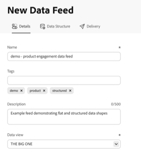

# 建立資料摘要

{{release-limited-testing}}

建立資料摘要時，您需要向 Adobe 提供：

* 關於原始資料檔案傳送目標的相關資訊

* 您要在每個檔案中包含的資料

* 傳送資料的頻率（包括擷取延遲抵達事件的處理延遲）

在建立資料摘要之前，務必先對資料摘要有基本的了解，並確認您已滿足所有先決條件。 如需詳細資訊，請參閱[資料摘要概觀](data-feed-overview.md)。

## 建立並設定資料摘要 {#create-and-configure-data-feed}

<!-- markdownlint-disable MD034 -->

>[!CONTEXTUALHELP]
>id="cja_datafeed_export_file"
>title="manifest"
>abstract="選擇是否在每次傳送資料摘要時包含資訊清單檔案。 資訊清單檔案包含資料摘要中所包含之每個檔案的相關資訊。 在以單一封裝傳送資料摘要的資料時，您也可以選擇包含完成檔案，但建議包含資訊清單檔案。 "

<!-- markdownlint-enable MD034 -->

<!-- markdownlint-disable MD034 -->

>[!CONTEXTUALHELP]
>id="cja_datafeed_notify"
>title="通知問題、完成時間和到期時間"
>abstract="指定一個或多個電子郵件地址，在資料摘要完成、即將到期或遇到問題時，應向這些地址傳送通知。 請使用逗號分隔多個電子郵件地址。"

<!-- markdownlint-enable MD034 -->

<!-- markdownlint-disable MD034 -->

>[!CONTEXTUALHELP]
>id="cja_datafeed_frequency_granularity"
>title="頻率和粒度"
>abstract="**傳遞頻率** （即時摘要）：資料摘要的傳遞頻率。 每小時傳遞包含一個小時的資料；每日傳遞包含一天的資料。 回顧日期範圍和處理延遲也可能會影響要包含哪些事件。
**粒度** （回填摘要）：用來分割歷史資料的時間間隔。 每個區塊都包含一天的資料量，而且會儘快傳送，而不是每天傳送一次。 此欄位一律設為「每日」，且無法修改。
"

<!-- markdownlint-enable MD034 -->

1. 使用您的 Adobe ID 認證登入 [experiencecloud.adobe.com](https://experiencecloud.adobe.com)。

1. 在介面右上方選取 [!UICONTROL **Customer Journey Analytics**] (透過應用程式切換器)。

1. 在頂端導覽列中，前往&#x200B;[!UICONTROL **元件**] > [!UICONTROL **匯出**]。

1. 選取&#x200B;[!UICONTROL **資料摘要**]&#x200B;標籤。

1. 選取畫面右上角的&#x200B;[!UICONTROL **建立**]。

   或者，如果先前未建立任何資料摘要，請選取空白表格中的&#x200B;[!UICONTROL **建立資料摘要**]。

   會顯示包含以下索引標籤的頁面： [!UICONTROL **詳細資料**]、[!UICONTROL **資料結構**]&#x200B;和&#x200B;[!UICONTROL **傳遞**]。

   

1. 在&#x200B;[!UICONTROL **詳細資料**]&#x200B;標籤上，完成下列欄位：

   | 欄位 | 函數 |
   |---------|----------|
   | [!UICONTROL **名稱**] | 資料摘要的名稱 名稱在選取的資料檢視中必須是唯一的，而且長度最多可為255個字元。<!--[Learn more](/help/export/analytics-data-feed/df-faq.md#must-feed-names-be-unique)--> |
   | [!UICONTROL **標記**] | 將任何標籤套用到資料摘要以方便分類。<!--You can filter on tags as described in [Filter and search the list of data feeds](/help/export/analytics-data-feed/df-manage-feeds.md#filter-and-search-the-list-of-data-feeds) in [Manage data feeds](/help/export/analytics-data-feed/df-manage-feeds.md).--> |
   | [!UICONTROL **說明**] | 指定資料摘要的說明（最多500個字元）。 編輯資料摘要時，會顯示您新增的說明。 |
   | [!UICONTROL **資料檢視**] | 選取包含您要匯出之資料的資料檢視。
選取資料檢視時，請考量下列事項：
 <ul><li>如果相同資料檢視建立了多個資料摘要，則每個資料摘要都必須有不同的欄定義。</li><li>可用欄的清單取決於所選資料檢視所屬的登入公司。 如果您變更資料檢視，可用欄的清單可能會變更。 </li></ul> |

1. 選取&#x200B;[!UICONTROL **「下一步」**]。

1. 在&#x200B;[!UICONTROL **資料結構**]&#x200B;索引標籤上，確定在&#x200B;**[!UICONTROL 資料檢視]**&#x200B;欄位中選取了正確的資料檢視。

   <!--add screenshot-->

1. 在&#x200B;[!UICONTROL **區段**]&#x200B;下拉式功能表中，搜尋並選取任何區段以篩選摘要中包含的資料。

   套用多個區段時，它們會與AND運運算元連結。 若要使用OR運運算元聯結區段，您必須先在區段產生器中建立新區段，然後將新區段套用至資料摘要。

   您在此處套用的區段，是可能已在資料檢視中套用的任何區段以外的區段。

1. （選擇性）在左側邊欄中，使用&#x200B;**搜尋**&#x200B;欄位來找出特定元件。 或者，選取&#x200B;**排序**&#x200B;圖示以套用下列任何排序選項：

   | 選項 | 函數 |
   | --------- | ---------- |
   | [!UICONTROL **建議**] | 以建議置於清單頂端的元件來對元件進行排序。 您或貴組織中其他人近期最頻繁使用的元件會顯示在清單的較高位置。 |
   | [!UICONTROL **字母順序**] | 依字母順序對元件進行排序。 |
   | [!UICONTROL **分類**] | 排序類似於&#x200B;[!UICONTROL **建議**]&#x200B;的元件，只是計算量度和標準量度會分開分組，而非混合在一起。 |

1. 將元件新增至資料摘要設定。 左側欄僅顯示對資料摘要有效的元件。

   * **拖放**：將元件從左側邊欄拖曳至畫布。 按住&#x200B;**[!UICONTROL Shift]**，或按住&#x200B;**[!UICONTROL Command]** (macOS)或&#x200B;**[!UICONTROL Ctrl]** (Windows)，一次選取和拖曳多個元件。
   * **加號按鈕**：選取左側邊欄中任何元件旁的加號圖示，以將它新增至畫布。
   * **[!UICONTROL 全部顯示]**：選取元件清單底部的&#x200B;**[!UICONTROL 全部顯示]**&#x200B;以開啟顯示所有可用元件的對話方塊。 選取您要新增的每個元件旁的核取方塊，然後選取&#x200B;**[!UICONTROL 新增選取的專案]**。 當搜尋字詞或篩選器標籤在左側邊欄中作用中時，也會出現「**[!UICONTROL 新增全部]**」按鈕，讓您一次新增所有篩選結果。

   新增欄位時，請考量下列事項：

   * 某些元件為必要、不支援的元件，或資料摘要中有限制。 如需詳細資訊，請參閱資料摘要[&#128279;](/help/components/exports/cja-data-feeds/df-components.md)中的元件可用性。

   * 當您新增屬於XDM陣列欄位（例如，Adobe Journey Optimizer主張欄位）或對應欄位的元件時，對話方塊會提示您從相同的子容器新增任何其他元件。 在資料摘要輸出中，所有這些元件都會顯示在單一欄中。 如需詳細資訊，請參閱資料摘要中的[子容器元件](/help/components/exports/cja-data-feeds/df-sub-event.md)

1. （選用）拖曳畫布上的元件以重新排序元件。 您定義的順序會保留為匯出的資料摘要檔案中的欄順序。

1. （選用）拖曳欄框線，調整畫布上的欄大小。

   欄寬會儲存在Cookie中，並在您下次在相同瀏覽器上返回此資料摘要時保留。

1. （選用）變更資料摘要輸出中顯示的元件ID。

   1. 將滑鼠懸停在畫布上的元件上，然後選取資訊圖示。

   1. 在「元件ID」欄位中，指定新元件ID。

      <!--add screenshot-->

1. （選擇性）在繼續之前，請使用頁面右側的&#x200B;**[!UICONTROL 摘要摘要]**&#x200B;和&#x200B;**[!UICONTROL 結構描述預覽]**&#x200B;面板來檢閱您的資料結構：

   * **[!UICONTROL 摘要摘要]**&#x200B;會顯示您所新增的元件、欄、維度和量度總計即時計數。
   * **[!UICONTROL 結構描述預覽]**&#x200B;會顯示資料摘要結構描述的JSON表示法，此結構描述會隨著您新增或重新排序元件而更新。
   * **[!UICONTROL 範例列]**&#x200B;按鈕會開啟顯示範例輸出列的對話方塊，以便您驗證結構看起來是否正確。 此對話方塊只會顯示範例資料，不會反映您的實際資料。

   <!--add screenshot-->

1. 在&#x200B;[!UICONTROL **傳遞**]&#x200B;索引標籤的&#x200B;[!UICONTROL **排程**]&#x200B;區段中，選擇要建立的摘要型別（即時或回填），然後指定報告時段、頻率和其他設定選項：

   <!--add screenshot-->

   | 欄位 | 函數 |
   |---------|----------|
   | [!UICONTROL **摘要型別**] | 選取您要建立的摘要型別：<ul><li>[!UICONTROL **即時摘要**]：匯出目前和未來的資料。</li><li>[!UICONTROL **回填摘要**]：匯出歷史資料。 </li></ul> |
   | [!UICONTROL **開始日期**] | 資料摘要開始的日期。 對於即時摘要，這必須是今天或未來的日期。 對於回填摘要，這必須是資料檢視資料保留期間內的過去日期。 開始日期取決於資料檢視的時區。 |
   | [!UICONTROL **到期日**]  僅供即時摘要使用 | 資料摘要到期且不再執行的日期。 日期取決於資料檢視的時區。 |
   | [!UICONTROL **結束日期**] &#x200B;僅供回填摘要使用 | 資料摘要結束的日期。 結束日期不能為未來日期。 日期取決於資料檢視的時區。 |
   | [!UICONTROL **頻率**] &#x200B;僅適用於即時摘要 | 選取資料摘要的傳送頻率。 時間戳記屬於頻率視窗的事件會包含在資料摘要傳送中。 [!UICONTROL **回顧日期範圍**]&#x200B;及&#x200B;[!UICONTROL **處理延遲**]&#x200B;欄位也會影響哪些事件包含在您所選擇傳遞頻率的資料中。
選取此選項可包含一小時的資料或一天的資料。
<ul><li>**每日**：摘要包含一整天的資料，從資料檢視時區的午夜到午夜。</li><li>**小時**：摘要包含一個小時的資料量。</li></ul> |
   | [!UICONTROL **粒度**] &#x200B;僅適用於回填摘要 | 用來將歷史資料分割成區塊的時間間隔。 每個區塊包含一整天的資料，從資料檢視時區的午夜到午夜。 
詳細程度會決定資料的分組方式，而非資料傳送的頻率。 回填資料會儘快傳送，不會每天傳送一次。

此欄位一律設為&#x200B;[!UICONTROL **每日**]，無法修改。
 |
   | [!UICONTROL **回顧日期範圍**] | 控制 Customer Journey Analytics 在處理資料摘要傳送時回顧的時間範圍。 預設值為30天。
頻率時段 (小時或日) 會決定哪些事件包含在資料摘要中，而&#x200B;**回顧日期範圍**&#x200B;則提供正確分類這些事件所需的歷史情境。

細分資格篩選、維度持續性、工作階段計算和衍生欄位轉換都會影響包含的事件。
 
在設定此選項之前，請參閱以下章節中說明的詳細資訊和範例，[瞭解回顧日期範圍](#data-feed-lookback-date-range)。
 |
   | [!UICONTROL **處理延遲**] | 選擇Customer Journey Analytics在處理資料摘要檔案之前等待的時間長度。 在處理延遲期間傳入的任何延遲送達事件都會納入資料摘要中。 
最小處理延遲為2小時，但某些型別的資料需要更長的延遲。 您選擇的延遲取決於連線中的資料型別，例如串流、批次、拼接、查詢或設定檔資料。

選擇夠長的延遲，讓連線中最慢的資料完成處理。 如果延遲太短，仍在處理的資料不會包含在資料摘要檔案中。

在設定此選項之前，請參閱以下章節中說明的詳細資訊和範例，[瞭解處理延遲](#data-feed-processing-delay)。
 |
   | [!UICONTROL **壓縮格式**] | 為傳送到雲端目的地的Parquet輸出檔案選取壓縮格式。 從下列格式中選擇：<ul><li>[!UICONTROL **快取**]：檔案大小適中，可快速壓縮與解壓縮。 受到現代化資料平台（例如BigQuery、Snowflake和Apache Spark）的廣泛支援。</li><li>[!UICONTROL **GZip**]：廣泛相容，包括本機不支援Snappy的工具。 如果您的下游管道需要廣泛認可的壓縮標準，則建議使用。</li><li>[!UICONTROL **Z標準(Zstd)**]：快速解壓縮的高壓縮效率。 如果優先考慮檔案大小最小化，且您的工具支援Zstd，則適合使用。</li></ul> |

1. 在&#x200B;[!UICONTROL **傳遞**]&#x200B;標籤的&#x200B;[!UICONTROL **目的地**]&#x200B;區段中，設定您要傳送資料的目的地。

   >[!NOTE]
   >
   >設定報告目標時，請考慮以下事項：
   >
   ><!--* Adobe recommends using a cloud account for your report destination. [Legacy FTP and SFTP accounts](/help/components/locations/configure-import-accounts.md) are available, but are not recommended.-->
   >* 您先前設定的任何雲端帳戶都可用於資料摘要。 您可以從「位置」管理員的[元件>匯出>位置帳戶](/help/components/exports/cloud-export-accounts.md)中設定雲端帳戶。
   >
   >* 雲端帳戶與您的Customer Journey Analytics使用者帳戶相關聯。 其他使用者無法使用或檢視您設定的雲端帳戶，除非您提供這些帳戶給組織中的所有使用者。
   >
   >* 您可以在[元件>匯出>位置](/help/components/exports/cloud-export-locations.md)中，編輯從「位置」管理員建立的任何位置。

   填入下列欄位：

   | 欄位 | 函數 |
   |---------|----------|
   | [!UICONTROL **檢視所有使用者的目的地**] | 如果您是系統管理員，則可以啟用此選項以檢視組織中所有使用者建立的目的地。 停用此選項時，只會顯示您建立的目的地。 |
   | [!UICONTROL **帳戶**] | 進行下列一項：<ul><li>**使用現有帳戶：**&#x200B;選取&#x200B;**[!UICONTROL 帳戶]**&#x200B;欄位旁的下拉式功能表。 或者，開始輸入帳戶名稱，然後從下拉式選單中選取。 
只有在您已設定帳戶，或帳戶與您所屬的某個組織共用時，您才可使用帳戶。
</li><li>**建立新帳戶：**&#x200B;在&#x200B;**[!UICONTROL 帳戶]**&#x200B;下拉式功能表中選取&#x200B;**[!UICONTROL 新增帳戶]**。 如需有關如何設定帳戶的資訊，請參閱[設定雲端匯出帳戶](/help/components/exports/cloud-export-accounts.md)。</li></ul> |
   | [!UICONTROL **位置**] | 進行下列一項：<ul><li>**使用現有的位置：**&#x200B;選取&#x200B;**[!UICONTROL 位置]**&#x200B;欄位旁的下拉式功能表。 或者，開始輸入位置名稱，然後從下拉式選單中選取它。</li><li>**建立新位置：**&#x200B;在&#x200B;**[!UICONTROL 位置]**&#x200B;下拉式功能表中選取&#x200B;**[!UICONTROL 新增位置]**。 如需有關如何設定位置的資訊，請參閱[設定雲端匯出位置](/help/components/exports/cloud-export-locations.md)。</li></ul> |
   | [!UICONTROL **完成時透過電子郵件通知**] | 指定一或多個電子郵件地址，在資料摘要成功傳送或無法傳送後，應傳送通知。 多個電子郵件地址必須以逗號分隔。 |
   | [!UICONTROL **啟用資訊清單**] | 選擇是否在每次傳送資料摘要時包含資訊清單檔案。 資訊清單檔案包含資料摘要中所包含每個檔案的資訊。 |

1. 選取&#x200B;**[!UICONTROL 「儲存」]**。

## 了解回顧日期範圍 {#data-feed-lookback-date-range}

<!-- markdownlint-disable MD034 -->

>[!CONTEXTUALHELP]
>id="cja_datafeed_lookback_date_range"
>title="回顧日期範圍"
>abstract="控制 Customer Journey Analytics 在處理每次傳遞時所回顧的時間範圍。
頻率時段 (小時或日) 會決定哪些事件包含在資料摘要中，而&#x200B;**回顧日期範圍**&#x200B;則提供正確分類這些事件所需的歷史情境。

細分資格篩選、維度持續性、工作階段計算和衍生欄位轉換都會影響包含的事件。

較長的回顧可提高準確性；較短的回顧則可提高效能。
"

<!-- markdownlint-enable MD034 -->

回顧日期範圍可控制Customer Journey Analytics在處理每個資料摘要傳遞時回顧的時間範圍。

事件仍必須有屬於頻率期間（小時或天）的時間戳記才能納入傳送中，但屬於&#x200B;**回顧日期範圍**&#x200B;的資料提供正確分類這些事件所需的歷史內容。

設定此選項時，請考量下列重要概念：

* 較長的回顧日期範圍通常可產生較準確的資料；較短的範圍則可產生較佳的傳送效能。
* 回顧日期範圍及頻率視窗的運作方式與Analysis Workspace報表日期範圍類似。 不過，有[主要差異](/help/components/exports/cja-data-feeds/df-comparison-workspace.md#differences)。 這些差異可能會導致Workspace報表與資料摘要傳送之間的資料差異。

處理回顧日期範圍內的資料時，會分別考慮區段資格、工作階段計算、維度持續性以及衍生欄位轉換：

### 細分資格篩選

將區段套用至您的資料摘要定義時，回顧日期範圍內的資料會決定哪些事件、工作階段或人員符合區段的資格。 區段的容器設定會決定範圍。 (可能的容器包括：「人員」、「工作階段」或「事件」。 B2B包括下列額外的容器：全域帳戶、帳戶、商機、購買群組。)

>[!BEGINSHADEBOX]

**範例：**

假設您要建立資料摘要，以瞭解屬於特定行銷活動（行銷活動B）之使用者行為。

若要完成此操作，請將區段套用至促銷活動B _中名為_&#x200B;使用者的資料摘要，以表示資料摘要中只應包含繫結至此區段中使用者的事件。

在此情況下，使用者必須同時符合&#x200B;**兩者**&#x200B;以下條件，才能納入資料摘要中：

* 使用者的事件時間戳記在資料摘要頻率視窗（資料摘要的指定小時或日期）內。
* 使用者在回顧日期範圍&#x200B;**內的某個時間符合&#x200B;_促銷活動B_區段**&#x200B;的資格。

  針對9天前發生的合格事件，這表示如果回顧日期範圍設定為30天，使用者&#x200B;**將會包含在資料摘要中**，但是如果回顧日期範圍設定為7天，使用者&#x200B;**將不會包含在資料摘要中**。

>[!ENDSHADEBOX]

### 工作階段計算

工作階段邊界是使用回顧日期範圍內的所有事件進行計算，而不只是傳送時段中的事件。 在傳遞期間之前啟動的工作階段仍會識別為相同的工作階段。

工作階段ID是以您的資料檢視中的人員、工作階段開始時間和工作階段設定為基礎。 工作階段可跨傳遞保留相同的工作階段ID，因此您可以從跨越每小時或每日傳遞的工作階段加入事件。

在資料摘要中使用工作階段時，請考量下列事項：

* 如果工作階段在回顧日期範圍之前開始，則無法使用其先前的事件，因此工作階段值可以與Analysis Workspace不同。 如需詳細資訊，請參閱[瞭解資料摘要和Analysis Workspace之間的資料差異](/help/components/exports/cja-data-feeds/df-comparison-workspace.md)。
* 變更資料檢視中的工作階段設定會變更工作階段ID。 在後續的傳遞中，工作階段ID將不會符合在先前傳遞中的工作階段ID。

### Dimension持續性

當您在個別維度上設定持續性時，您也會設定到期時間，以決定維度專案在其設定的事件之後持續多久。

當資料檢視中的到期日設定為下列任一選項時，回顧日期範圍會影響維度持續性：

* [!UICONTROL **人員報告期間**]：回顧日期範圍會變成資料摘要定義中每個使用&#x200B;[!UICONTROL **人員報告期間**]&#x200B;作為到期日之維度的新報告期間。
* [!UICONTROL **自訂時間**]：如果選取的自訂時間超過回顧日期範圍，則會忽略自訂時間，而回顧日期範圍會用於資料摘要定義中每個使用&#x200B;[!UICONTROL **自訂時間**]&#x200B;作為到期日的維度的維度到期日。 系統不會考量回顧日期範圍之前發生的值。

  如需有關在資料檢視中設定維度的持續性的詳細資訊，請參閱[持續性元件設定](/help/data-views/component-settings/persistence.md)。

若要取得最準確的資料，請考慮將回顧日期範圍設為等於或大於資料中維度上設定的持續性的值。 但請記住，較短的回顧日期範圍可導致資料摘要傳送的效能提高。

>[!BEGINSHADEBOX]

**範例：**

假設您想要在您的資料摘要中，知道使用者在造訪您的網站前最初看到了哪些行銷活動。

若要完成此操作，請在「行銷活動」維度上設定持續性，並將「原始」作為配置模式。

在此情況下，只有當使用者同時符合&#x200B;**兩個**&#x200B;的下列條件時，原始行銷活動才會顯示在資料摘要輸出中：

* 使用者的事件時間戳記在資料摘要頻率視窗（資料摘要的指定小時或日期）內。

* 使用者在回顧日期範圍&#x200B;**內的某個時間符合原始行銷活動**&#x200B;的資格。

  如果使用者在9天前符合原始促銷活動的資格，則回顧日期範圍設為30天時，資料摘要會包含&#x200B;**原始促銷活動，但是如果回顧日期範圍設為7天，則資料摘要不會包含**&#x200B;原始促銷活動。**&#x200B;**

>[!ENDSHADEBOX]

### 衍生欄位轉換

參考容器的任何衍生欄位函式會在資料摘要匯出中使用回顧日期範圍。 衍生欄位中有哪些日期功能？<!--Not sure how this applies.-->

## 瞭解處理延遲 {#data-feed-processing-delay}

<!-- markdownlint-disable MD034 -->

>[!CONTEXTUALHELP]
>id="cja_datafeed_processing_delay"
>title="處理延遲"
>abstract="Customer Journey Analytics在處理資料摘要檔案之前等待的時間。 在處理延遲期間傳入的任何延遲送達事件都會納入資料摘要中。
最小處理延遲為2小時，但某些型別的資料需要更長的延遲。 選擇足夠長的延遲，讓連線中最慢的資料到達Experience Platform資料湖並擷取到Customer Journey Analytics。 如果延遲太短，仍在處理的資料不會包含在資料摘要檔案中。

拼接最多可新增4小時。 若要解決此問題，請在延遲中新增4小時，以取得任何彙整的資料。
"

<!-- markdownlint-enable MD034 -->

### 處理延遲的運作方式

處理延遲是Customer Journey Analytics在處理資料摘要檔案之前等待的時間量。 在處理延遲期間傳入的任何延遲送達事件都會納入資料摘要中。

由於各種原因，需要處理延遲，例如為了說明管道延遲、讓行動實施有機會讓離線裝置上線並傳送資料，或在管理先前處理的檔案時容納組織的伺服器端程式。

最小處理延遲為2小時，但某些型別的資料需要更長的延遲。

>[!BEGINSHADEBOX]

**範例：**

假設每小時的資料摘要包含從中午1:00到下午2:00的資料，且處理延遲為2小時。 該資料摘要檔案的處理於下午4:00開始，並包含處理開始前抵達的任何資料。

>[!ENDSHADEBOX]

### 根據您的資料選擇處理延遲

不同型別的資料需要經過不同的時間，才能在Customer Journey Analytics中使用。 資料會經過兩個處理階段，每個階段的時間會增加總和。

選擇足夠長的處理延遲，讓連線中最慢的資料完成兩個階段。 如果延遲太短，仍在處理的資料不會包含在資料摘要檔案中。

#### 階段1：資料到達Experience Platform資料湖

抵達時間會依您收集的資料型別而有所不同。 選擇符合您要收集之資料型別的延遲。

* **來自Edge Network或串流擷取的事件資料集**：資料通常會在60分鐘內到達資料湖（請參閱[延遲](/help/technotes/guardrails.md#latencies)）。

* **Analytics來源聯結器資料集**：資料通常會在2.25小時內到達資料湖（請參閱[延遲](/help/technotes/guardrails.md#latencies)）。

  <!--When using the Analytics Source Connector, the minimum processing delay increases from 2 hours to 6 hours (?) to account for the source connector data. (checking to see if this is feasible) -->

* **來自其他來源聯結器的資料集**：延遲因來源聯結器和批次傳送時間而異。 Experience Platform中的上游處理（例如「資料準備」）可以新增更多時間。

* **查詢資料集**：資料到達資料湖的時間取決於資料的上傳頻率。 查詢資料通常會以資料庫完整副本的形式上傳，其中只有一小部分的記錄有所變更。 以較小的批次上傳查閱資料，以縮短處理時間。

  小型上傳通常會在最小延遲內處理。

  大型上傳（例如，每週上傳數百萬筆記錄）的處理優先順序較低，而且可能需要3至4小時的時間。 在大量上傳的情況下，事件資料不會延遲，但查閱值可能不會反映最新的更新。

* **設定檔資料集**：資料到達資料湖的時間取決於資料的上傳頻率。 設定檔資料通常會以大型批次擷取，例如完整設定檔表格的每日快照。 以較小的批次上傳設定檔資料，以縮短處理時間。

  小型上傳通常會在最小延遲內處理。

  大型上傳（例如，每週上傳數百萬筆記錄）的處理優先順序較低，而且可能需要3至4小時的時間。 在大量上傳的情況下，事件資料不會延遲，但設定檔值可能不會反映最新的更新。

#### 階段2：從資料湖擷取資料至Customer Journey Analytics

資料擷取時間會因資料集是否已啟用銜接而異。

* **非拼接資料集**：這最多可能需要90分鐘（請參閱[延遲](/help/technotes/guardrails.md#latencies)）。

* **拼接資料集**：在非拼接資料集所需的90分鐘基礎上，拼接最多可新增4小時（請參閱[延遲](/help/technotes/guardrails.md#latencies)）。 如果連線已啟用拼接，請將延遲設定為至少6小時，可能為8小時。 拼接重播更新的資料通常不包含在已處理的資料摘要檔案中。

  啟用拚接後，最小處理延遲從2小時增加到6小時，以說明拚接的資料。

>[!BEGINSHADEBOX]

**範例：**

如果您的連線包含多種型別的資料，請選擇可容納最慢資料的延遲。 在以下範例中，大約為8小時。

拼接最多可新增4小時以擷取至Customer Journey Analytics。 若要解決此問題，請在延遲中新增4小時，以取得任何彙整的資料。

| 資料來源 | 階段1：抵達資料湖 | 階段2：擷取至Customer Journey Analytics | 總計 |
| --- | --- | --- | --- |
| Edge Network或串流擷取 | 60分鐘 | 90分鐘 
不彙整
 | 2.5小時 |
| Analytics 來源連接器 | 2.25小時 | 90分鐘+ 4小時的彙整時間 
使用拼接
 | 7.75小時 |

>[!ENDSHADEBOX]

