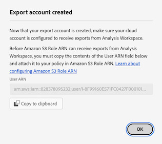

# 設定雲端匯出帳戶

在您可以依照[將Customer Journey Analytics報表匯出至雲端](/help/analysis-workspace/export/export-cloud.md)中的說明將Customer Journey Analytics報表匯出至雲端目的地之前，您必須新增並設定您要傳送資料的目的地。

此程式包含依照本文所述新增及設定帳戶(例如Amazon S3、Google Cloud Platform等)，然後依照[設定雲端匯出位置](/help/components/exports/cloud-export-locations.md)所述，新增及設定該帳戶內的位置（例如帳戶內的資料夾）。

如需有關如何管理現有帳戶的資訊，包括檢視、編輯和刪除帳戶，請參閱[管理雲端匯出位置和帳戶](/help/components/exports/manage-export-locations.md)。

## 開始建立雲端匯出帳戶

1. 請確定您符合將報表匯出至雲端的[最低需求](/help/analysis-workspace/export/export-cloud.md#minimum-requirements)。
1. 在Customer Journey Analytics中，選取&#x200B;[!UICONTROL **元件**] > [!UICONTROL **匯出**]。
1. 在[!UICONTROL 匯出]頁面上，選取&#x200B;[!UICONTROL **位置帳戶**]&#x200B;標籤。

   

1. 選取&#x200B;[!UICONTROL **新增帳戶**]。

   新增帳戶對話方塊隨即顯示。

1. 在&#x200B;[!UICONTROL **位置帳戶名稱**]&#x200B;欄位中，指定位置帳戶的名稱。 建立位置時會顯示此名稱。

1. 在&#x200B;[!UICONTROL **位置帳戶說明**]&#x200B;欄位中，提供帳戶的簡短說明，以協助將其與相同帳戶型別的其他帳戶區分開來。

1. 啟用選項&#x200B;[!UICONTROL **如果您想要允許組織中的其他使用者使用該帳戶，則讓組織中的所有使用者都可以使用該帳戶**]。

   共用帳戶時，請考量下列事項：

   * 您無法取消共用您共用的帳戶。

   * 共用帳戶只能由帳戶擁有者編輯。

   * 任何人都可以建立共用帳戶的位置。

1. 在&#x200B;[!UICONTROL **帳戶型別**]&#x200B;欄位中，選取您要匯出的雲端帳戶型別。 可用的帳戶型別為Amazon S3 Role ARN、Google Cloud Platform、Azure SAS、Azure RBAC、Snowflake和AEP資料登陸區域。

1. 繼續下列對應至您選取之&#x200B;[!UICONTROL **帳戶型別**]&#x200B;的區段。

   * [AEP 資料登陸區域](#aep-data-landing-zone)

   * [Amazon S3 Role ARN](#amazon-s3-role-arn)

   * [Google Cloud Platform](#google-cloud-platform)

   * [Azure SAS](#azure-sas)

   * [Azure RBAC](#azure-rbac)

   * [Snowflake](#snowflake)

### AEP 資料登陸區域

>[!IMPORTANT]
>
>為您的匯出帳戶使用AEP資料登陸區域時，請考慮以下事項：
>
> * 將Customer Journey Analytics報表匯出至Adobe Experience Platform資料登陸區域時，請務必在7天內下載資料，然後從AEP資料登陸區域將其刪除。 7天後，資料會自動從AEP資料登陸區域刪除。
> * AEP資料登陸區域使用Azure或AWS儲存空間。 如果您的組織使用設定為使用Azure的登入公司，則AEP資料登陸區域會使用Azure。 如果登入公司設定為使用AWS，則AEP資料登陸區域會使用AWS。
>

1. 透過下列其中一種方式開始建立雲端匯出帳戶：

   * 從如上所述的[匯出]頁面，在[開始建立雲端匯出帳戶](#begin-creating-a-cloud-export-account)

   * [從Analysis Workspace](/help/analysis-workspace/export/export-cloud.md#export-full-tables-from-analysis-workspace)匯出完整資料表時

1. 在&#x200B;**[!UICONTROL 帳戶型別]**&#x200B;欄位中選取&#x200B;**[!UICONTROL AEP資料登陸區域]**&#x200B;之後，請選取&#x200B;[!UICONTROL **儲存**]。

   視您的AEP資料登陸區域設定為使用Azure或AWS儲存而定，系統會顯示下列任一對話方塊：

   * **Azure儲存體：**

     [!UICONTROL **已建立匯出帳戶**]&#x200B;對話方塊隨即顯示。

     

   * **AWS儲存空間：**

     >[!AVAILABILITY]
     >
     >本節適用於在Amazon Web Services (AWS)上執行的Experience Platform實作。 在AWS上執行的Experience Platform目前可供有限數量的客戶使用。 若要深入瞭解支援的Experience Platform基礎結構，請參閱[Experience Platform多雲端總覽](https://experienceleague.adobe.com/en/docs/experience-platform/landing/multi-cloud)。

     [!UICONTROL **已建立的帳戶**]&#x200B;對話方塊隨即顯示。

     

1. （視條件而定）如果您使用Azure儲存體：

   1. 將&#x200B;[!UICONTROL **SAS URI**]&#x200B;欄位的內容複製到剪貼簿。 您將使用此SAS URI來存取從Analysis Workspace從AEP資料登陸區域匯出的資料。

      如果此欄位為空，您需要被授予存取Adobe Experience Platform的許可權。

   1. 在Adobe Experience Platform中，設定您的資料登陸區域容器，以使用您複製的SAS URI。

      >[!NOTE]
      >
      >使用以Azure為基礎的AEP資料登陸區域帳戶時，存取匯出至AEP資料登陸區域之報告的最簡單方式是使用Azure儲存體總管。 下列步驟會使用此方法。

      1. 如果沒有，請下載[Microsoft Azure儲存體總管](https://azure.microsoft.com/en-us/products/storage/storage-explorer/)。

      1. 在Adobe Experience Platform檔案中，請依照[將您的資料登陸區域容器連線到Azure儲存體總管](https://experienceleague.adobe.com/docs/experience-platform/destinations/catalog/cloud-storage/data-landing-zone.html#connect-your-data-landing-zone-container-to-azure-storage-explorer)中所述的步驟操作。

         您可以略過[擷取資料登陸區域的認證](https://experienceleague.adobe.com/docs/experience-platform/destinations/catalog/cloud-storage/data-landing-zone.html#retrieve-dlz-credentials)和[更新資料登陸區域認證](https://experienceleague.adobe.com/docs/experience-platform/destinations/catalog/cloud-storage/data-landing-zone.html#update-dlz-credentials)小節中說明的工作，因為您複製的URI包含這些認證。

      1. 遵循Adobe Experience Platform檔案並前往&#x200B;[!UICONTROL **Blob容器SAS URL**]&#x200B;欄位時，請貼上您在步驟3中複製的SAS URI。

         >[!NOTE]
         >
         >您需要每7天執行此動作，因為SAS URI會在建立7天後過期。 您可以建立指令碼來自動化此程式。

         

   1. 選取&#x200B;[!UICONTROL **下一步**] > [!UICONTROL **連線**]。

   1. 在Customer Journey Analytics的&#x200B;[!UICONTROL **已建立匯出帳戶**]&#x200B;對話方塊中，選取&#x200B;[!UICONTROL **確定**]。

      

1. （視條件而定）如果您正在使用AWS儲存空間：

   1. 將以下欄位的內容複製到剪貼簿(您將使用此資訊來存取從Analysis Workspace從AEP資料登陸區域匯出的資料)：

      * [!UICONTROL **存取金鑰識別碼**]

      * **[!UICONTROL 秘密存取金鑰]**

      * **[!UICONTROL 工作階段權杖]**

      * **[!UICONTROL 貯體名稱]**

      * **[!UICONTROL DLZ資料夾]**

      

   1. 選取&#x200B;[!UICONTROL **確定**]。

1. 繼續[設定雲端匯出位置](/help/components/exports/cloud-export-locations.md)。

### Amazon S3 Role ARN

1. 透過下列其中一種方式開始建立雲端匯出帳戶：

   * 從如上所述的[匯出]頁面，在[開始建立雲端匯出帳戶](#begin-creating-a-cloud-export-account)

   * [從Analysis Workspace](/help/analysis-workspace/export/export-cloud.md#export-full-tables-from-analysis-workspace)匯出完整資料表時

1. 在&#x200B;[!UICONTROL **新增帳戶**]&#x200B;對話方塊的&#x200B;[!UICONTROL **帳戶屬性**]&#x200B;區段中，指定下列資訊：

   | 欄位 | 函數 |
   |---------|----------|
   | [!UICONTROL **角色 ARN**] | 您必須提供角色 ARN (Amazon 資源名稱)，以便 Adobe 可以使用該角色來取得 Amazon S3 帳戶的存取權。為此，您需要為來源帳戶建立 IAM 權限原則，將該原則附加給使用者，然後為目標帳戶建立角色。有關特定資訊，請參閱「[此 AWS 文件](https://aws.amazon.com/premiumsupport/knowledge-center/cross-account-access-iam/)」。 |

   {style="table-layout:auto"}

1. 選取「[!UICONTROL **儲存**]」。

   [!UICONTROL **已建立匯出帳戶**]&#x200B;對話方塊隨即顯示。

   

1. 將&#x200B;[!UICONTROL **使用者ARN**]&#x200B;欄位的內容複製到剪貼簿。 使用者 ARN (Amazon 資源名稱) 是由 Adob&#x200B;&#x200B;e 提供。您必須將此使用者附加至您在Amazon S3角色ARN中建立的原則。

1. 選取&#x200B;[!UICONTROL **確定**]。

1. 繼續[設定雲端匯出位置](/help/components/exports/cloud-export-locations.md)。

### Google Cloud Platform

1. 透過下列其中一種方式開始建立雲端匯出帳戶：

   * 從如上所述的[匯出]頁面，在[開始建立雲端匯出帳戶](#begin-creating-a-cloud-export-account)

   * [從Analysis Workspace](/help/analysis-workspace/export/export-cloud.md#export-full-tables-from-analysis-workspace)匯出完整資料表時

1. 在&#x200B;[!UICONTROL **新增帳戶**]&#x200B;對話方塊的&#x200B;[!UICONTROL **帳戶屬性**]&#x200B;區段中，指定下列資訊：

   | 欄位 | 函數 |
   |---------|----------|
   | [!UICONTROL **專案 ID**] | 您從Google Cloud帳戶複製的Google Cloud專案ID。 請參閱「[Google Cloud 文件關於如何取得專案 ID](https://cloud.google.com/resource-manager/docs/creating-managing-projects#identifying_projects)」。 |

   {style="table-layout:auto"}

1. 選取「[!UICONTROL **儲存**]」。

   [!UICONTROL **已建立匯出帳戶**]&#x200B;對話方塊隨即顯示。

   

1. 將&#x200B;[!UICONTROL **主體**]&#x200B;欄位的內容複製到剪貼簿，然後確定您授予主體許可權，以便在Google Cloud Platform中將檔案上傳到此貯體。<!-- add link to Google Cloud docs on how to do this -->

1. 選取&#x200B;[!UICONTROL **確定**]。

1. 繼續[設定雲端匯出位置](/help/components/exports/cloud-export-locations.md)。

### Azure SAS

1. 透過下列其中一種方式開始建立雲端匯出帳戶：

   * 從如上所述的[匯出]頁面，在[開始建立雲端匯出帳戶](#begin-creating-a-cloud-export-account)

   * [從Analysis Workspace](/help/analysis-workspace/export/export-cloud.md#export-full-tables-from-analysis-workspace)匯出完整資料表時

1. 在&#x200B;[!UICONTROL **新增帳戶**]&#x200B;對話方塊的&#x200B;[!UICONTROL **帳戶屬性**]&#x200B;區段中，指定下列資訊：

   | 欄位 | 函數 |
   |---------|----------|
   | [!UICONTROL **應用程式 ID**] | 從您建立的 Azure 應用程式複製此 ID。在 Microsoft Azure 中，此資訊位於您應用程式中的「**概述**」標籤。若要了解更多資訊，請參閱「[Microsoft Azure 文件關於如何使用 Microsoft 身分識別平台註冊應用程式](https://learn.microsoft.com/en-us/azure/active-directory/develop/quickstart-register-app)」。 |
   | [!UICONTROL **租用戶 ID**] | 從您建立的 Azure 應用程式複製此 ID。在 Microsoft Azure 中，此資訊位於您應用程式中的「**概述**」標籤。若要了解更多資訊，請參閱「[Microsoft Azure 文件關於如何使用 Microsoft 身分識別平台註冊應用程式](https://learn.microsoft.com/en-us/azure/active-directory/develop/quickstart-register-app)」。 |
   | [!UICONTROL **金鑰保存庫 URI**] | <p>Azure Key Vault 中得到 SAS URI 的路徑。若要設定 Azure SAS，需要使用 Azure Key Vault 將 SAS URI 儲存為密碼。若要了解更多資訊，請參閱「[Microsoft Azure 文件有關如何從 Azure Key Vault 設定和擷取密碼](https://learn.microsoft.com/en-us/azure/key-vault/secrets/quick-create-portal?source=recommendations)」。</p><p>建立金鑰保存庫 URI 後：<ul><li>在 Key Vault 上新增存取權原則，以便向您建立的 Azure 應用程式授予權限。<p><p>若要了解更多資訊，請參閱「[Microsoft Azure 文件有關如何指定 Key Vault 存取權原則](https://learn.microsoft.com/en-us/azure/key-vault/general/assign-access-policy?tabs=azure-portal)」。</p>或</p><p>如果您要直接授與存取角色而不建立存取原則，請參閱[Microsoft Azure檔案，瞭解如何使用Azure入口網站](https://learn.microsoft.com/en-us/azure/role-based-access-control/role-assignments-portal)指派Azure角色。 這會新增應用程式ID的角色指派，以存取金鑰儲存庫URI。 </p></li><li>確保已將應用程式 ID 授予 `Key Vault Certificate User` 內建角色，以便存取金鑰保存庫 URI。</br><p>若要了解更多資訊，請參閱「[Azure 內建角色](https://learn.microsoft.com/en-us/azure/role-based-access-control/built-in-roles)」。</p></li></ul> |
   | [!UICONTROL **金鑰保存庫祕密名稱**] | 您將密碼新增至 Azure Key Vault 時建立的密碼名稱。在 Microsoft Azure 中，此資訊位於您建立的 Key Vault 中，位於 **Key Vault** 設定頁面。若要了解更多資訊，請參閱「[Microsoft Azure 文件有關如何從 Azure Key Vault 設定和擷取密碼](https://learn.microsoft.com/en-us/azure/key-vault/secrets/quick-create-portal?source=recommendations)」。 |
   | [!UICONTROL **位置帳戶密碼**] | 從您建立的 Azure 應用程式複製密碼。在 Microsoft Azure 中，此資訊位於您的應用程式中的「**憑證和密碼**」標籤。如需詳細資訊，請參閱[Microsoft Azure檔案，瞭解如何向Microsoft身分識別平台註冊應用程式](https://learn.microsoft.com/en-us/azure/active-directory/develop/quickstart-register-app)。<!-- need to grant permission to the bucket. Jun will send info on where that is documented) --> |

   {style="table-layout:auto"}

1. 選取「[!UICONTROL **儲存**]」。

   [!UICONTROL **已建立匯出帳戶**]&#x200B;對話方塊隨即顯示。

   

1. 如果您尚未這樣做，請確定您已授與許可權給Azure SAS中的儲存貯體。<!-- add link to Google Cloud docs on how to do this -->

1. 選取&#x200B;[!UICONTROL **確定**]。

1. 繼續[設定雲端匯出位置](/help/components/exports/cloud-export-locations.md)。

### Azure RBAC

1. 透過下列其中一種方式開始建立雲端匯出帳戶：

   * 從如上所述的[匯出]頁面，在[開始建立雲端匯出帳戶](#begin-creating-a-cloud-export-account)

   * [從Analysis Workspace](/help/analysis-workspace/export/export-cloud.md#export-full-tables-from-analysis-workspace)匯出完整資料表時

1. 在&#x200B;[!UICONTROL **新增帳戶**]&#x200B;對話方塊的&#x200B;[!UICONTROL **帳戶屬性**]&#x200B;區段中，指定下列資訊：

   | 欄位 | 函數 |
   |---------|----------|
   | [!UICONTROL **應用程式 ID**] | 從您建立的 Azure 應用程式複製此 ID。在 Microsoft Azure 中，此資訊位於您應用程式中的「**概述**」標籤。若要了解更多資訊，請參閱「[Microsoft Azure 文件關於如何使用 Microsoft 身分識別平台註冊應用程式](https://learn.microsoft.com/en-us/azure/active-directory/develop/quickstart-register-app)」。 |
   | [!UICONTROL **租用戶 ID**] | 從您建立的 Azure 應用程式複製此 ID。在 Microsoft Azure 中，此資訊位於您應用程式中的「**概述**」標籤。若要了解更多資訊，請參閱「[Microsoft Azure 文件關於如何使用 Microsoft 身分識別平台註冊應用程式](https://learn.microsoft.com/en-us/azure/active-directory/develop/quickstart-register-app)」。 |
   | [!UICONTROL **位置帳戶密碼**] | 從您建立的 Azure 應用程式複製密碼。在 Microsoft Azure 中，此資訊位於您的應用程式中的「**憑證和密碼**」標籤。若要了解更多資訊，請參閱「[Microsoft Azure 文件關於如何使用 Microsoft 身分識別平台註冊應用程式](https://learn.microsoft.com/en-us/azure/active-directory/develop/quickstart-register-app)」。 |

   {style="table-layout:auto"}

1. 選取「[!UICONTROL **儲存**]」。

   [!UICONTROL **已建立匯出帳戶**]&#x200B;對話方塊隨即顯示。

   

1. 如果您尚未這樣做，請確定您已授與許可權給Azure RBAC中的儲存貯體。<!-- add link to Google Cloud docs on how to do this -->

1. 選取&#x200B;[!UICONTROL **確定**]。

1. 繼續[設定雲端匯出位置](/help/components/exports/cloud-export-locations.md)。

### Snowflake

1. 透過下列其中一種方式開始建立雲端匯出帳戶：

   * 從如上所述的[匯出]頁面，在[開始建立雲端匯出帳戶](#begin-creating-a-cloud-export-account)

   * [從Analysis Workspace](/help/analysis-workspace/export/export-cloud.md#export-full-tables-from-analysis-workspace)匯出完整資料表時

1. 在&#x200B;[!UICONTROL **新增帳戶**]&#x200B;對話方塊的&#x200B;[!UICONTROL **帳戶屬性**]&#x200B;區段中，指定下列資訊：

   | 欄位 | 函數 |
   |---------|----------|
   | [!UICONTROL **帳戶識別碼**] | 可唯一識別組織內，以及Snowflake支援的雲端平台和雲端區域的全球網路中的Snowflake帳戶。 <p>您必須從Snowflake帳戶取得帳戶識別碼，然後在此處貼上資訊。</p><p>若要瞭解從何處取得此資訊，請參閱Snowflake檔案[&#128279;](https://docs.snowflake.com/en/user-guide/admin-account-identifier)中的帳戶識別碼頁面。</p> |
   | [!UICONTROL **使用者**] | 用於連線的使用者登入名稱。 我們建議您建立專門用於Adobe的新使用者。 在此處指定名稱，然後以Snowflake建立具有相同名稱的使用者。 您可以使用`CREATE USER`命令在Snowflake中建立使用者。  <p>如需詳細資訊，請參閱[使用者、角色和許可權命令](https://docs.snowflake.com/en/sql-reference/commands-user-role)。</p> |
   | [!UICONTROL **角色**] | 將指派給使用者的角色。 我們建議您建立專門用於Adobe的新角色。 在此處指定角色，然後以相同名稱在Snowflake中建立角色，並將角色授予使用者。 您可以使用`CREATE ROLE`命令在Snowflake中建立角色。 <p>如需詳細資訊，請參閱[使用者、角色和許可權命令](https://docs.snowflake.com/en/sql-reference/commands-user-role)。</p> |

   {style="table-layout:auto"}

1. 選取「[!UICONTROL **儲存**]」。

   [!UICONTROL **已建立匯出帳戶**]&#x200B;對話方塊隨即顯示。

   

1. 將&#x200B;[!UICONTROL **公開金鑰**]&#x200B;欄位的內容複製到剪貼簿。 公開金鑰由Adobe提供。

   在Snowflake中使用公開金鑰來連線至您的Snowflake帳戶。 您必須將您建立的使用者與此公開金鑰建立關聯。

   例如，在Snowflake中，指定下列指令：

   ```
   CREATE USER <your_adobe_user> RSA_PUBLIC_KEY = '<your_public_key>';
   ```

   如需詳細資訊，請參閱Snowflake檔案[&#128279;](https://docs.snowflake.com/en/user-guide/key-pair-auth)中的金鑰組驗證與金鑰組輪換頁面。

1. 選取&#x200B;[!UICONTROL **確定**]。

1. 繼續[設定雲端匯出位置](/help/components/exports/cloud-export-locations.md)。
