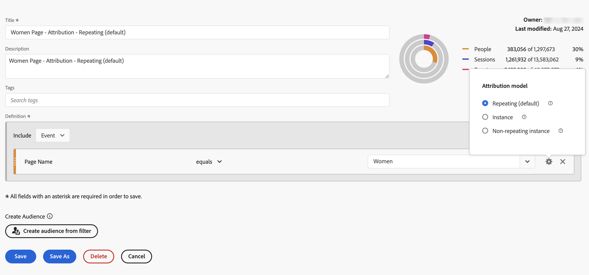

# 建置篩選器 {#build-filters}

<!-- markdownlint-disable MD034 -->

>[!CONTEXTUALHELP]
>id="cja_components_filters_createaudience"
>title="建立客群"
>abstract="客群可以透過篩選器建立，並與 Adobe Experience Platform 共用以進行啟用。"

<!-- markdownlint-enable MD034 -->

<!-- markdownlint-disable MD034 -->

>[!CONTEXTUALHELP]
>id="cja_components_filters_datapreview"
>title="資料預覽"
>abstract="將此篩選器的資料與資料檢視的資料進行比較。 預覽百分比是根據&#x200B;**最近90天**&#x200B;的資料檢視總數。  如果預覽未載入，您的連線可能仍在回填。"

<!-- markdownlint-enable MD034 -->

**[!UICONTROL 篩選器產生器]**&#x200B;對話方塊可用來建立新篩選器或編輯現有篩選器。 對話方塊的標題為&#x200B;**[!UICONTROL 新篩選器]**&#x200B;或&#x200B;**[!UICONTROL 編輯篩選器]**，篩選條件為您從[[!UICONTROL 篩選器]管理員](/help/components/filters/manage-filters.md)建立或管理的篩選器。

>[!BEGINTABS]

>[!TAB 篩選產生器]

>[!TAB 建立或編輯篩選器]

>[!ENDTABS]

1. 指定以下詳細資料 ( 是必要的)：

   | 元素 | 說明 |
   | --- | --- |
   | **[!UICONTROL 資料釋圖]** | 您可以選取篩選的資料檢視。  您定義的篩選器可在資料檢視的[設定](/help/data-views/create-dataview.md#settings-filters)索引標籤中作為篩選器使用。 |
   | **[!UICONTROL 僅限專案的篩選器]** | 資訊方塊，說明篩選僅會顯示在建立該篩選的專案中，且不會將該篩選新增至您的元件清單中。 啟用&#x200B;**[!UICONTROL 讓此篩選器可用於您的所有專案，並將其新增至您的元件清單]**&#x200B;以變更該設定。 只有當您使用[!UICONTROL 快速篩選]介面中的&#x200B;**[!UICONTROL 開啟產生器]**&#x200B;來建立[快速篩選](quick-filters.md)，並將快速篩選資訊轉換為一般篩選時，才會顯示此資訊方塊。 |
   | **[!UICONTROL 標題]** | 為篩選器命名，例如`Last month mobile customers`。 |
   | **[!UICONTROL 說明]** | 提供篩選的說明，例如，`Filter to define the mobile customers for the last month`。 |
   | **[!UICONTROL 標記]** | 透過建立或套用一個或多個標籤來組織篩選器。 開始輸入內容以尋找您可以選取的現有標記。或按&#x200B;**[!UICONTROL ENTER]**&#x200B;以新增標籤。 選取以移除標記。 |
   | **[!UICONTROL 定義]**  | 使用[定義產生器](#definition-builder)定義您的篩選器。 |

   {style="table-layout:auto"}

1. 若要驗證您的篩選器定義是否正確，請使用右上方的持續更新篩選器結果預覽。
1. 若要從篩選器建立對象並與Experience Platform共用對象，請選取&#x200B;**[!UICONTROL 從篩選器建立對象]**。 如需詳細資訊，請參閱[建立和發佈對象](/help/components/audiences/publish.md)。
1. 選取：
   * **[!UICONTROL 儲存]**&#x200B;以儲存篩選。
   * **[!UICONTROL 另存新檔]**&#x200B;以儲存篩選的復本。
   * **[!UICONTROL 刪除]**&#x200B;以刪除篩選器。
   * **[!UICONTROL 取消]**&#x200B;以取消您對篩選器所做的任何變更，或取消建立新的篩選器。

## 定義產生器

您可以使用定義產生器來建構您的篩選器定義。 在該建構中，您會使用元件、容器、運運算元和邏輯。

您可以設定定義的型別和範圍：

1. 若要指定定義的型別，請指定您要讓組建成為包含或排除定義。 選取 **[!UICONTROL 選項]**，並從下拉式清單切換&#x200B;**[!UICONTROL 包含]**&#x200B;或&#x200B;**[!UICONTROL 排除]**。
1. 若要指定定義範圍，請從&#x200B;**[!UICONTROL 包含]**&#x200B;或&#x200B;**[!UICONTROL 排除]**&#x200B;下拉式清單中選取，以決定定義範圍是&#x200B;**[!UICONTROL 事件]**、**[!UICONTROL 工作階段]**&#x200B;或&#x200B;**[!UICONTROL 人員]**。

您稍後一律可以變更這些設定。

### 元件

建構篩選定義的重要部分是使用維度、量度、現有篩選器和日期範圍。 這些元件都可從篩選產生器的元件面板使用。

{width=100%}

若要新增元件：

1. 將元件從元件面板拖放至&#x200B;**[!UICONTROL 將量度、篩選器和/或Dimension拖放到這裡]**。 您可以使用元件列中的來搜尋特定元件。
1. 指定元件的詳細資料。 例如，從&#x200B;**[!UICONTROL 選取值]**&#x200B;中選取值。 或輸入值。 指定一或多個值的內容和方式取決於元件和運運算元。
1. 選擇性地修改預設運運算元。 例如，從&#x200B;**[!UICONTROL 等於]**&#x200B;到&#x200B;**[!UICONTROL 等於任何]**。 如需可用運運算元的詳細概觀，請參閱[運運算元](operators.md)。

若要編輯元件：

* 從運運算元下拉式選單中選取元件的新運運算元。
* 視需要選取或指定不同的運運算元值。
* 如果元件型別是尺寸，您可以定義歸因模型。 如需詳細資訊，請參閱[歸因模型](#attribution-models)。

若要刪除元件：

* 在元件中選取。

### 容器

您可以將多個元件群組在一個或多個容器中，並定義容器內和容器之間的邏輯。 容器可讓您為篩選器建置複雜的定義。

{Width=100%}

* 若要新增容器，請從 **[!UICONTROL 選項]**&#x200B;中選取&#x200B;**[!UICONTROL 新增容器]**。
* 若要將現有元件新增至容器，請將該元件拖放至容器中。
* 若要將另一個元件新增至容器，請將元件面板中的元件拖放至容器中。 使用藍色插入線作為參考線。
* 若要在容器外部新增另一個元件，請從元件面板將元件拖放至容器外部、主要定義容器內。 使用藍色插入線作為參考線。
* 若要修改容器中元件之間、容器之間或容器與元件之間的邏輯，請選取適當的&#x200B;**[!UICONTROL 和]**、**[!UICONTROL 或]**、**[!UICONTROL 然後]**。 選取「Then」時，可將篩選器轉換為循序篩選器。 如需詳細資訊，請參閱[建立循序篩選器](seg-sequential-build.md)。
* 若要切換容器層級，請選取 **[!UICONTROL 事件]**、 **[!UICONTROL 工作階段]**&#x200B;或 **[!UICONTROL 人員]**。

您可以在容器中使用進行下列動作：

| 容器動作 | 說明 |
|---|---|
| **[!UICONTROL 新增容器]** | 將巢狀容器新增至容器。 |
| **[!UICONTROL 排除]** | 從篩選器定義中的容器排除結果。 薄紅色左列可識別排除容器。 |
| **[!UICONTROL 包括]** | 在篩選定義中包含來自容器的結果。 包含為預設值。 薄灰色左列可識別包含容器。 |
| **[!UICONTROL 名稱容器]** | 從容器的預設描述重新命名容器。 在文字欄位中輸入名稱。 如果您未提供任何輸入，則會使用預設說明。 |
| **[!UICONTROL 刪除容器]** | 從定義中刪除容器。 |

## 日期範圍

您可以建立包含滾動日期範圍的篩選器。 因此，您可以回答與持續性促銷活動或事件有關的問題。 例如，您可以建立篩選器，包含&#x200B;*過去60天內進行線上購買的所有人*。

+++ 以下是有關在篩選器中使用滾動式日期範圍的影片

>[!VIDEO](https://video.tv.adobe.com/v/25403/?quality=12)

{{videoaa}}

+++

## 堆疊篩選器 {#stack}

您可以使用篩選器來建立篩選器。 當您在篩選器中使用篩選器時，可以最佳化篩選器並降低複雜性。

想像您想要依裝置型別(2)和美國狀態(50)的組合進行篩選。 您可以建立100個篩選器，每個篩選器分別代表裝置型別（行動電話與平板電腦）和美國州別的唯一組合。 若要取得Californian平板電腦使用者，您可以使用100個篩選器之一：

或者，您可以定義52個篩選器：50個篩選器適用於美國各州，一個適用於行動電話，一個適用於平板電腦。 然後棧疊篩選器以取得相同的結果。 若要取得Californian平板電腦使用者，您可棧疊兩個篩選器：

CA和平板電腦的

## 歸因 {#attribution}

<!-- markdownlint-disable MD034 -->

>[!CONTEXTUALHELP]
>id="cja_components_filters_attribution_repeating"
>title="重複"
>abstract="包括維度的例項和持續值。"

<!-- markdownlint-enable MD034 -->

<!-- markdownlint-disable MD034 -->

>[!CONTEXTUALHELP]
>id="cja_components_filters_attribution_instance"
>title="例項"
>abstract="包括維度的例項和持續值。"

<!-- markdownlint-enable MD034 -->

<!-- markdownlint-disable MD034 -->

>[!CONTEXTUALHELP]
>id="cja_components_filters_attribution_nonrepeatinginstance"
>title="非重複的例項"
>abstract="包括維度的唯一例項 (非重複) 例項。"

<!-- markdownlint-enable MD034 -->

當您在篩選產生器中使用維度時，您有選項可指定該維度的歸因模型。 您選取的歸因模型會決定資料是否符合您為維度元件指定的條件。

在維度元件中選取，然後從快顯視窗中選取其中一個歸因模型：

| 模型 | 說明 |
|---|---|
| **[!UICONTROL 重複模型（預設）]** | 納入維度的例項和持續值以判斷資格。 |
| **[!UICONTROL 例項]** | 僅包含維度的例項值以判斷資格。 |
| **[!UICONTROL 非重複的執行個體]** | 納入維度的唯一例項（非重複）值以判斷資格。 |

建立篩選器時

### 範例

在篩選定義中，您已指定下列條件：「頁面名稱」等於「女性」。 與上述範例類似。 您會使用其他兩個歸因模型來重複此篩選定義。 因此，您有三個篩選器，每個都有各自的歸因模型：

* 女性頁面 — 歸因 — 重複（預設）
* 女性頁面 — 歸因 — 例項
* 女性頁面 — 歸因 — 非重複例項

下錶針對每個歸因模型，說明哪些傳入事件符合該條件的。

| 女性頁面 — 歸因 —  *歸因模型* | 事件1： 頁面名稱等於 女性 | 事件2： 頁面名稱等於 人 | 事件3： 頁面名稱等於 女性 | 事件4： 頁面名稱等於 女性 （持續） | 事件5： 頁面名稱等於 簽出 | 事件6： 頁面名稱等於 女性 | 事件7： 頁面名稱等於 首頁 |
|---|:---:|:---:|:---:|:---:|:---:|:---:|:--:|
| 重複（預設） |  |  |  |  |  |  |  |
| 例項 |  |  |  |  |  |  |  |
| 非重複的例項 |  |  |  |  |  |  |  |

使用三個篩選器的事件報告範例看起來如下所示：

