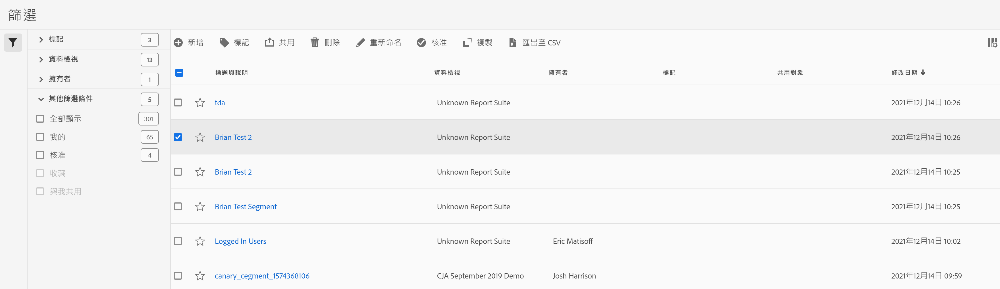

# 管理篩選器

「篩選器管理器」提供許多策劃篩選器的方式，例如共用、標籤、核准、複製、刪除和標示為我的最愛。

「篩選器管理器」會顯示您所擁有以及已經與您共用的篩選器。管理員層級的使用者可以查看組織中的所有篩選器。此概觀會介紹「篩選器管理器」的使用者介面和功能。

在上方導覽區，前往 **[!UICONTROL Customer Journey Analysis]** > 「**[!UICONTROL 元件]**」 > 「**[!UICONTROL 篩選器]**」存取篩選器管理器。

## 篩選器管理器 UI {#ui}

| # | UI 功能 | 說明 |
|---|---|---|
| 1 | 篩選器管理工具列 | 勾選某個篩選器後，便會出現此工具列。多數的管理工作均可以透過此工具列完成。 |
| 2 | 核取方塊 | 勾選要管理的篩選器。 |
| 4 | 我的最愛 | 按一下篩選器旁的星號，會使該星號變黃色並將該篩選器標示為我的最愛。 |
| 5 | 標題和說明 | 於篩選器產生器中提供。若要編輯標題和說明，請按一下標題連結，回到「篩選器產生器」。 |
| 7 | 擁有者 | 指出篩選器的擁有者。如果您不是管理員，就只能看見自己所擁有或已和您共用的篩選器。 |
| 8 | 標記 (未在欄選擇器中勾選，因此此欄不會出現) | 由您或共用篩選器給您的人員對篩選器套用的標記。 |
| 9 | 共用對象 | 列出您共用篩選器的目標個人或群組 (僅限管理員使用) 或「全部」(僅限管理員使用)。 |
| 10 | 修改日期 | 顯示上次修改篩選器的日期。 |
| 11 | 欄選擇器 | (右上) 用於選取要在「篩選器管理器」中顯示的欄。 |
| 12 | 共用圖示 | 指出此篩選器已由您共用或與您共用。 |
| 13 | 核准圖示 | 指出管理員已核准此篩選器。 |
| 14 | 其他篩選器 | 可讓您依照「標籤」、「資料檢視」、「擁有者」及「其他」(「全部顯示」、「我的」、「已和我共用」、「已核准」、「我的最愛」) 查看篩選器。 |

## 規劃篩選器 {#plan}

花些時間來規劃篩選器，可提高篩選器對貴組織的有用程度，並避免篩選器無限增加。

* 考慮對象：誰會取用區段？您將和誰共用該區段？哪群人會使用此篩選器，我又該如何加上對應的標記？這也表示需提供清楚的篩選器說明。說明至少應該要能回答下列問題：

   * 此篩選器在哪方面有用？

   * 何時應使用此篩選器？

* 決定篩選範圍。哪個[篩選器容器](/help/components/filters/filters-overview.md)最能代表範圍？使用的容器越小越好。

* 決定要在篩選器定義中納入哪些元素及哪些值。

* 考慮您想要有的核准程序形式。是要讓單一人員檢閱並核准篩選器，還是要讓一群人員決定？

* 定義篩選器時，目標是建立的篩選器庫能讓商務使用者以模組化方式堆疊和重複使用篩選器片段或元件。您需要定義哪些「模組」才能讓這樣的篩選器庫成真？

### 標記篩選器 {#tag}

在「篩選器管理器」中，可藉由為篩選器加上標記來整理篩選器。所有使用者均可為篩選器建立標籤，也可對篩選器套用一或多個標籤。不過，您僅可以看見自己所擁有或已和您共用之篩選器的標記。

您應該建立什麼樣的標記？以下是一些建議的實用標記：

* 以團隊名稱為基礎的標記，例如「社交行銷」、「手機行銷」。

* 專案標記 (分析標記)，例如「登入頁面分析」。

* 類別標記：「男性」、地理區.

* 工作流程標記：「待核准」、策劃 (特定的業務單位)

標記篩選器的方式：

1. 在「篩選器管理器」中，勾選您要標記之篩選器旁的核取方塊。篩選器管理工具列隨即出現。

1. 按一下「**[!UICONTROL 標記]**」，然後

   * 選取現有標記或是

   * 輸入新標籤名稱，然後按「**[!UICONTROL Enter]**」鍵。

1. 再按一下「**[!UICONTROL 標籤]**」來標記篩選器。

標記現在應該出現在「標記」欄中。(按一下右上方的齒輪圖示來管理您的欄。)您也可以前往&#x200B;**[!UICONTROL 「篩選器」 > 「標籤」]**&#x200B;來依標籤篩選。

### 核准篩選器 {#approve}

在「篩選器管理器」內，您可以設立工作流程來核准適合各種應用層級、適合特定部門或群組，以及符合報表原則的篩選器。

以下說明將篩選器標幟為已核准的程序：

1. 在「篩選器管理器」中，勾選篩選器標題左側的核取方塊。

1. 按一下篩選器管理工作列中的「**[!UICONTROL 核准]**」。

1. 考慮將核准的篩選器和組織共用。

1. 按一下「**[!UICONTROL 確定]**」。

   請注意清單中該篩選器旁會出現核准圖示。

   

1. 您也可以按一下「**[!UICONTROL 取消核准]**」，將核准的篩選器取消核准。

### 共用篩選器 {#share}

您可以將篩選器和整個組織、群組或個別使用者 (視您的權限而定) 共用。

| 管理員 | 非管理員 |
|---|---|
| 可以使用「全部」、「群組」和「使用者」選項將篩選器和不同對象共用。如需詳細資訊，請參閱 [Admin Console 文件](https://helpx.adobe.com/tw/enterprise/using/manage-products-and-profiles.html)。 | 僅可將篩選器和個別使用者共用。 |

何時應將篩選器和整個公司共用而不僅是一群使用者或個人？以下是您可以遵循的一些最佳實務：

* 身為管理員，如果篩選器對整個公司都有用，而且每個人都樂於使用它，請將篩選器和全部的人共用。在此情況下，您也應該考慮讓它成為已核准篩選器。

* 身為管理員，如果篩選器可為特定產品設定檔帶來良好的商務價值，請將篩選器與給該團隊共用。請勿正式核准此類型的篩選器。

* 身為管理員或個人使用者，可將篩選器與其他個人共用以審查和檢驗篩選器。如果效果不如預期，則可加以捨棄。請勿正式核准此類型的篩選器。

共用篩選器的方式：

1. 在「篩選器管理器」中，勾選您要共用之篩選器旁的核取方塊。

1. 在篩選器管理工具列中，按一下「**[!UICONTROL 共用]**」。

1. 如果您是管理員，可以選取「全部」或選取貴組織中的「群組」和「使用者」。身為非管理員，您只能看見個人使用者。使用「搜尋」欄位來搜尋群組或使用者。按一下「**[!UICONTROL 共用]**」。「已共用」圖示會出現在該篩選器旁：

1. 您可以前往「篩選 > 其他篩選器 > 已和我共用」，依已和您共用的篩選器來篩選。

### 將篩選器標示為我的最愛 {#favorites}

要組織篩選器以方便使用，將篩選器標記為我的最愛是另一種方法。

1. 在「篩選器管理器」中，勾選您要標示為我的最愛的任何篩選器旁的星號。星號選取後即變黃。

1. 您也可以在「篩選 > 其他篩選器 > 我的最愛」下依我的最愛篩選。
