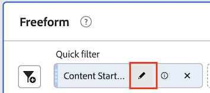

# 快速篩選

快速篩選器可讓您輕鬆探索指定專案中的資料，而不需在中建立更複雜的元件清單篩選器。 [篩選產生器](/help/components/filters/create-filters.md).

建立快速篩選時，請考量下列事項：

* 快速篩選只適用於建立所在的專案。 您無法在其他專案中取得這些篩選器，且無法和其他使用者共用。
* 最多允許3個規則。
* 不支援巢狀容器或循序規則。

以下影片示範如何使用快速濾鏡。 (注意：本影片使用「快速區段」一詞而非「快速篩選」。 不過，功能是相同的。)

>[!VIDEO](https://video.tv.adobe.com/v/341466/?quality=12&learn=on)

## 建立快速篩選 {#create}

Analysis Workspace中的任何使用者都可以建立快速篩選。

若要建立快速篩選：

1. 選擇下列其中一個方法，開始建立快速篩選：

   * **臨機（拖放）：** 從左側邊欄中，將元件拖曳至 **篩選** 圖示中，然後選取 **編輯** 圖示可調整篩選器。

      

      >[!NOTE]
      >
      > 建立快速篩選隨選（拖放）時，請考量下列事項：
      > * 不支援下列元件型別：計算量度和維度，以及無法建立篩選器的量度。
      > * 為了取得完整的維度和事件，Analysis Workspace會建立「存在」事件篩選器。 範例：`Hit where eVar1 exists` 或 `Hit where event1 exists`。
      > * 如將「未指定」或「無」拖放至篩選拖放區，就會自動轉換成「不存在」篩選，以便系統可正確處理篩選。

   * **使用篩選圖示：** 在自由格式表格中，選取 **篩選** 圖示來識別。

      

1. 調整下列任一設定：

   | 設定 | 說明 |
   | --- | --- |
   | [!UICONTROL 名稱] | 篩選的預設名稱是篩選器中規則名稱的組合。您可將篩選器重新命名為更好記的名稱。 |
   | [!UICONTROL 包含/排除] | 您可以在篩選定義中包含或排除元件，但不能同時包含和排除。 |
   | [!UICONTROL 點擊/造訪/訪客]容器 | 快速篩選僅包含一個[篩選容器](https://experienceleague.adobe.com/docs/analytics-platform/using/cja-components/cja-filters/filters-overview.html#filter-containers)，可讓您在篩選中包含（或從中排除）維度/量度/日期範圍。[!UICONTROL 訪客] 包含個人在瀏覽和頁面檢視中的特定整體資料。 A [!UICONTROL 造訪] 容器可讓您設定規則，以根據造訪劃分人員資料，並且 [!UICONTROL 點選] 容器可讓您根據個別頁面檢視來劃分人員資訊。 預設容器為[!UICONTROL 點擊]。 |
   | [!UICONTROL 元件] (維度/量度/日期範圍) | 透過新增元件 (維度、量度、日期範圍或維度值) 來定義最多 3 個規則。有 3 種方法可以找到正確的元件:<ul><li>開始輸入，然後快速篩選產生器就會自動找到合適的元件。</li><li>使用下拉式清單來尋找元件。</li><li>從左側邊欄拖放元件。</li></ul> |
   | [!UICONTROL 運算子] | 使用下拉式選單尋找標準運算子和[!UICONTROL 相異計數]運算子。參閱[篩選運算子](operators.md)。 |
   | 加 (+) 號 | 新增另一個規則 |
   | AND/OR 限定詞 | 您可以對規則加入「AND」或「OR」的限定詞，但不能在單一篩選定義中混合使用「AND」和「OR」。 |
   | [!UICONTROL 套用] | 將此篩選套用在面板上。如果篩選不包含任何資料，系統會詢問您是否要繼續。 |
   | [!UICONTROL 開啟產生器] | 開啟篩選產生器。在篩選產生器中儲存或套用篩選後，將無法再考慮「快速篩選」。 它會成為元件清單篩選資料庫的一部分。 
若要讓元件可在您的所有專案中和左側欄中使用，請選取選項 [!UICONTROL **將此篩選器設為可用於所有專案，並將其新增至您的元件清單**].

如需詳細資訊，請參閱區段 [將快速篩選儲存為元件清單篩選](#save-a-quick-filter-as-a-component-list-filter) 本文章內容。

**注意：** 僅限在中擁有篩選器建立許可權的使用者。 [Adobe Admin Console](https://experienceleague.adobe.com/docs/analytics/admin/admin-console/permissions/summary-tables.html#analytics-tools) 可以開啟「篩選產生器」。
 |
   | [!UICONTROL 取消] | 取消此快速篩選（不要套用它）。 |
   | [!UICONTROL 日期範圍] | 驗證器使用面板日期範圍進行資料查詢。但是在快速篩選中套用的任何日期範圍都會覆寫面板頂端的面板日期範圍。 |
   | 預覽 (右上角) | 讓您查看是否有有效的篩選以及篩選的範圍。代表您套用此篩選器時可預期看到的資料集劃分。 您可能會收到一則通知，指出此篩選器沒有資料。這種情況下，您可繼續或變更篩選器定義。 |

1. 選取 [!UICONTROL **套用**] 以儲存變更。

## 編輯快速篩選 {#edit}

1. 暫留在您要編輯的快速篩選上，然後選取 **編輯** 圖示。

   

1. 編輯篩選定義或篩選名稱。
1. 選取 [!UICONTROL **套用**] 以儲存變更。

## 將快速篩選儲存為元件清單篩選 {#save}

>[!IMPORTANT]
>
> 儲存快速篩選時，請考量下列事項：
> 
> * 若要儲存快速篩選，您需要 [Adobe Admin Console](https://experienceleague.adobe.com/docs/analytics/admin/admin-console/permissions/summary-tables.html#analytics-tools).
> 
> * 儲存或套用篩選後，無法在快速篩選產生器中編輯它。 您必須改用一般篩選產生器。

您可以選擇將快速篩選儲存為元件清單篩選。 元件清單篩選器的優點包括：

* 所有Workspace專案的可用性
* 支援更複雜的篩選器以及循序篩選器

您可以從快速篩選產生器或儲存篩選 [!UICONTROL 篩選產生器].

### 儲存在快速篩選產生器中 {#save2}

1. 套用快速篩選後，將滑鼠懸停在其上並選取資訊(「i」)圖示。
1. 選取 **[!UICONTROL 使其可用於所有專案並新增至您的元件清單]**.
1. (選擇性) 重新命名篩選。
1. 選取&#x200B;**[!UICONTROL 「儲存」]**。

   此篩選器現在會顯示在左側欄的元件清單中。 另請注意，篩選器的側邊欄會從淺藍色變更為深藍色，這表示在快速篩選產生器中無法再編輯或開啟它。

### 儲存在篩選產生器中 {#save3}

1. 套用快速篩選後，將滑鼠懸停在其上並選取資訊(「i」)圖示。
1. 選取「**[!UICONTROL 儲存篩選]**」
1. （可選）重新命名篩選器，然後選取 [!UICONTROL **套用**].

   返回「工作區」，並注意篩選器的側邊欄會從淺藍色變更為深藍色，表示不能再在快速篩選產生器中編輯或開啟它。 而透過將其儲存，該區段會成為元件清單的一部分。

   

套用篩選後，您可以選擇將其新增至篩選元件清單，並使其可用於所有專案。

1. 將滑鼠懸停在已儲存的篩選上，並選取鉛筆圖示。

1. 選取 [!UICONTROL **開啟產生器**].

1. 在篩選產生器頂端，請注意這個對話框：

   

1. 選取旁邊的核取方塊 **[!UICONTROL 將此篩選器設為可用於所有專案，並將其新增至您的元件清單。]**

1. 選取&#x200B;**[!UICONTROL 「儲存」]**。

   該篩選現在會顯示在所有專案的篩選元件清單中。您也可以和組織中的其他人[共用篩選](/help/components/filters/manage-filters.md)。

## 快速篩選範例

下列篩選範例結合了維度和量度：

