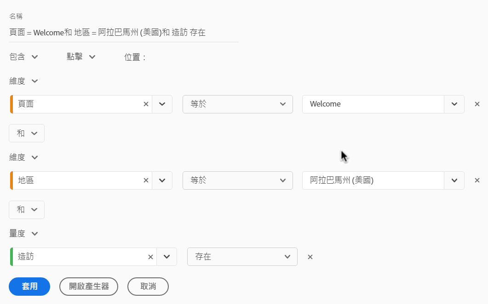
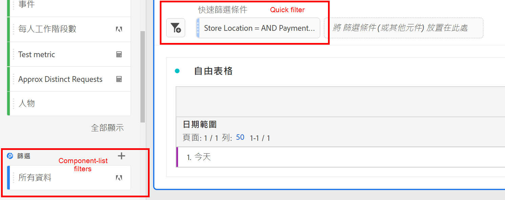
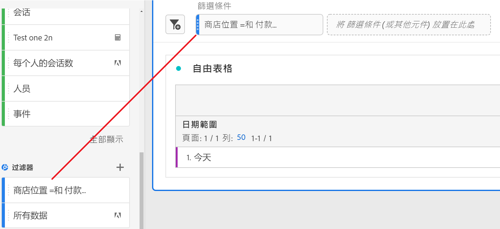
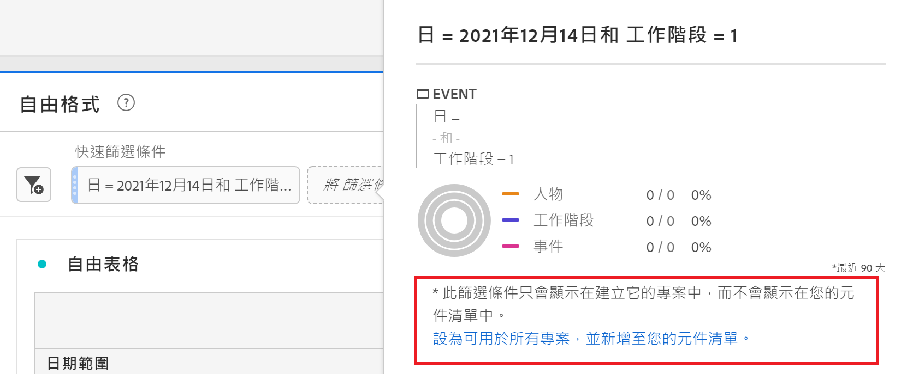

# 快速篩選

您可以在專案內建立快速篩選，以略過完整[篩選產生器](/help/components/filters/create-filters.md)的複雜度。 快速篩選

* 僅套用至建立專案的專案（您可以變更此項目）。
* 允許最多3個規則
* 不容納巢狀容器或循序規則。
* 在具有多個報表套裝的專案中工作

若要比較快速篩選可以執行哪些功能與完整元件清單篩選，請前往[此處](/help/components/filters/filters-overview.md)。

>[!IMPORTANT]
> 快速篩選器目前正在進行有限的測試，目前尚未推出。

## 先決條件

任何人都可以建立快速區段。 不過，您需要[Adobe Admin Console](https://experienceleague.adobe.com/docs/analytics/admin/admin-console/permissions/summary-tables.html?lang=en#analytics-tools)中的「區段建立」權限，才能儲存快速區段或在「區段產生器」中開啟。

## 建立快速篩選

在自由表格中，按一下面板標題中的「篩選+」圖示：

| 設定 | 說明 |
| --- | --- |
| 名稱 | 篩選器的預設名稱是篩選器中規則名稱的組合。 您可以將篩選器重新命名為更好記的名稱。 |
| 包含/排除 | 您可以在篩選器定義中包含或排除元件，但不能同時包含和排除元件。 |
| 點擊/造訪/訪客容器 | 快速篩選器包含一個[篩選器容器](https://experienceleague.adobe.com/docs/analytics-platform/using/cja-components/cja-filters/filters-overview.html?lang=zh-Hant#filter-containers)，僅可讓您在篩選器中納入維度/量度/日期範圍（或將其排除在篩選器中）。  訪客包含各瀏覽和頁面檢視的訪客特定整體資料。[!UICONTROL 瀏覽]容器可讓您設定規則，以根據瀏覽來劃分訪客的資料，而[!UICONTROL 點擊]容器則可讓您根據個別頁面檢視來劃分訪客資訊。 預設容器為[!UICONTROL Hit]。 |
| 元件(Dimension/量度/日期範圍) | 新增元件（維度和/或量度及/或日期範圍）及其值，以定義最多3個規則。 有3種方式可尋找正確的元件：<ul><li>開始輸入，[!UICONTROL 快速篩選]產生器會自動找到適當的元件。</li><li>使用下拉式清單來尋找元件。</li><li>從左側邊欄拖放元件。</li></ul> |
| 運算元 | 使用下拉式功能表來尋找標準運算子和[!UICONTROL 不重複計數]運算子。 [了解更多](https://experienceleague.adobe.com/docs/analytics/components/filteration/segment-reference/seg-operators.html?lang=en) |
| 加號(+) | 新增其他規則 |
| 和/或限定符 | 您可以將「AND」或「OR」限定符新增至規則，但無法在單一篩選器定義中混合「AND」和「OR」。 |
| 套用 | 將此篩選器套用至面板。 如果篩選器不含任何資料，系統會詢問您是否要繼續。 |
| 開啟產生器 | 開啟篩選器產生器。 一旦您在篩選器產生器中儲存或套用篩選器，就不再被視為「快速篩選」。 它會成為元件清單篩選程式庫的一部分。 |
| 取消 | 取消此快速篩選 — 不要應用它。 |
| 日期範圍 | 驗證器會使用面板日期範圍來進行資料查閱。 但快速篩選中套用的任何日期範圍都會覆寫面板頂端的面板日期範圍。 |
| 預覽（右上） | 可讓您查看您是否具備有效的篩選條件，以及篩選的範圍。 代表套用此篩選時，您可預期看到的資料集劃分。 您可能會收到通知，指出此篩選器沒有資料。 在此情況下，您可以繼續或變更篩選定義。 |

以下是結合維度和量度的篩選器範例：

篩選器會顯示在頂端。 請注意其藍色條狀側邊欄，而非左側篩選程式庫中元件層級篩選器的藍色側邊欄。

## 編輯快速篩選

1. 將滑鼠指標暫留在快速篩選器上，並選取鉛筆圖示。
1. 編輯篩選器定義或篩選器名稱。

## 儲存快速篩選

您可以選擇在[!UICONTROL 快速篩選產生器]或[!UICONTROL 篩選產生器]中儲存快速篩選。

>[!IMPORTANT]
>儲存或套用篩選器後，您就無法在快速篩選產生器中編輯篩選器，而只能在一般的篩選器產生器中編輯。

### 儲存至快速篩選產生器

1. 套用快速篩選後，將滑鼠指標暫留在快速篩選上，然後選取資訊(「i」)圖示。
1. 按一下「**[!UICONTROL 讓所有專案都可用」並新增至元件清單]**。
1. （選用）重新命名篩選器。
1. 按一下「**[!UICONTROL 儲存]**」。

請注意，篩選器的側邊欄會如何從條狀藍色變更為淺藍色。 它現在會顯示在左側邊欄的元件清單中。

### 儲存於篩選器產生器

1. 將滑鼠指標暫留在快速篩選器上，並選取資訊(「i」)圖示。
1. 選擇&#x200B;**[!UICONTROL 保存篩選器]**
1. 名稱保持原樣，或重新命名篩選器。

   返回「工作區」，注意篩選器現在有淺藍色側欄的方式。 這表示您無法再在快速篩選產生器中編輯/開啟篩選器。 儲存後就會成為元件清單的一部分。

   

套用篩選器後，您可以選取將其新增至您的篩選元件清單，並讓它可供所有專案使用。

1. 將滑鼠指標暫留在儲存的篩選器上，並選取鉛筆圖示。

1. 在「篩選產生器」頂端，注意此對話方塊：

   

1. 選中&#x200B;**[!UICONTROL 讓所有項目都可用並添加到元件清單旁的複選框。]**
1. 按一下「**[!UICONTROL 儲存]**」。
1. 篩選器現在會顯示在您所有專案的篩選器元件清單中。
1. 您也可以[與組織中的其他人員共用篩選器](/help/components/filters/manage-filters.md)。

## 什麼是僅限專案的篩選器？

僅限專案的篩選器是快速篩選器或臨機工作區專案篩選器。 在[!UICONTROL 篩選產生器]中編輯/開啟這些量度時，會顯示僅限專案的方塊。

如果您在產生器中套用快速篩選，但未勾選「可用」方塊，則該篩選仍為僅限專案的篩選，但無法在[!UICONTROL 快速篩選產生器]中開啟。 如果勾選該方塊並按一下「**[!UICONTROL 儲存]**」，現在它已成為元件清單篩選器。
