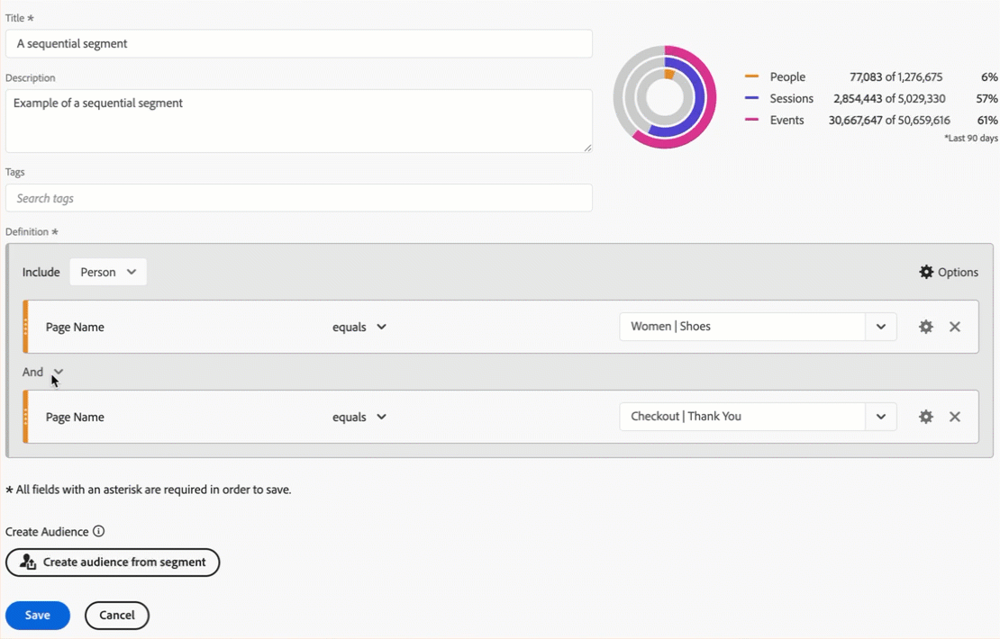
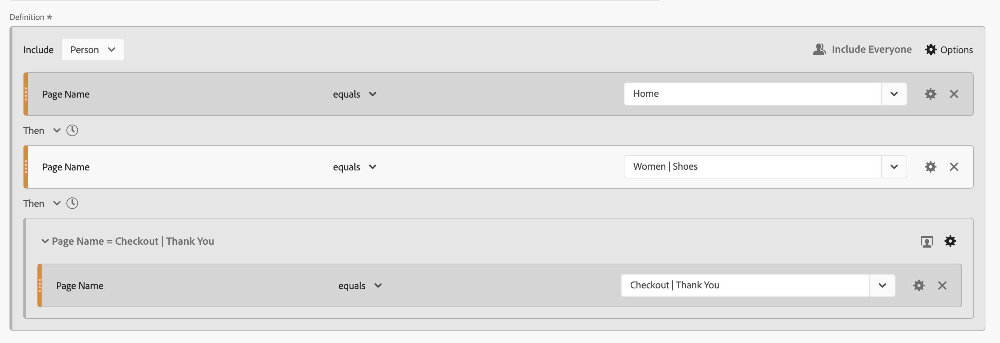
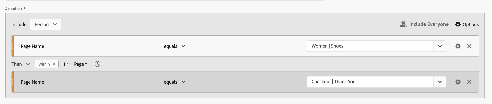
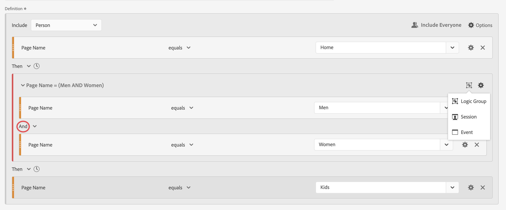

# 循序篩選器

您可以使用Then邏輯運運算元，而不是元件、容器和元件或容器之間的And或Or邏輯運運算元，來建立循序篩選器。 Then邏輯運運算元表示有一個篩選條件發生，接著是另一個篩選條件。

+++ 以下是示範循序分段的影片。

>[!VIDEO](https://video.tv.adobe.com/v/25405/?quality=12)

{{videoaa}}

+++

循序篩選器具有某些[基本功能](#basics)以及您可以設定的其他選項，以增加循序篩選器的複雜性：

* 序列篩選定義中Then邏輯的[After和within](#after-and-within)限制：

* [要包含哪些資料作為篩選定義整體順序的一部分](#include)。 或針對定義為容器一部分的序列。 依預設，所有符合的資料都會被考慮，由 [!UICONTROL 包含所有人]識別。

   * 選取 **[!UICONTROL Only Before Sequence]**，僅考慮序列之前的資料。
   * 選取 **[!UICONTROL Only After After After]**，只考慮序列之後的資料。

* 要將[排除](#exclude)的哪些資料視為循序篩選器定義的一部分。

* 如何在循序篩選定義中[邏輯群組](#logic-group)條件。

## 基本知識

建立循序篩選的基本原理與使用[篩選產生器](filter-builder.md)建立一般篩選並無不同。 您使用[定義產生器](filter-builder.md#definition-builder)來建構您的篩選器定義。 在該建構中，您會使用元件、容器、運運算元和邏輯。 只要您在主要定義或您在[定義產生器](filter-builder.md#definition-builder)內使用的任何容器中選取&#x200B;**[!UICONTROL Then]**&#x200B;運運算元，一般篩選器就會自動變成循序篩選器。

### 範例

以下範例說明如何在各種使用案例中使用循序篩選器。

#### 簡單順序

識別檢視了某個頁面然後又檢視另一個頁面的人員。 事件層級資料會篩選此序列，不論先前、過去或臨時人員工作階段，或工作階段之間發生的時間或頁面檢視次數。

#### 跨工作階段的順序

識別在一個工作階段中檢視頁面，然後在另一個工作階段中檢視其他頁面的人員。 若要區分工作階段，請使用容器來建置順序，並為每個容器定義 **[!UICONTROL 工作階段]**&#x200B;層級。

#### 混合層級序列

識別在次數不定的工作階段中檢視兩個頁面，然後在不同的工作階段中檢視第三個頁面的人員。 再次使用容器來建置順序，並在定義個別工作階段的容器上定義 **[!UICONTROL 工作階段]**&#x200B;層級。

#### 彙總序列

識別在首次工作階段中造訪特定頁面，隨後造訪部分其他頁面的人員。 若要區分事件順序，請使用容器來分隔 **[!UICONTROL 工作階段]**&#x200B;容器層級的邏輯。

#### 巢狀內嵌序列

識別某人先造訪另一個頁面的一個頁面，接著再進行涉及其他兩個頁面的後續工作階段的所有工作階段。 例如，識別某人先造訪首頁，接著造訪類別1頁面，接著又在每個工作階段中造訪類別2和類別3頁面的所有工作階段。

## After和within

您可以使用 **[!UICONTROL After]**&#x200B;和 **[!UICONTROL Within]** **[!UICONTROL Then]**&#x200B;運運算元來定義事件、工作階段或Dimension](#event-session-and-dimension-constraints)的其他[時間限制](#time-constraints)或[限制。

### 時間限制

若要將時間限制套用至&#x200B;**[!UICONTROL Then]**&#x200B;運運算元：

1. 選取。
1. 從內容功能表中選取&#x200B;**[!UICONTROL Within]**&#x200B;或&#x200B;**[!UICONTROL After]**。
1. 指定時段（**[!UICONTROL 分鐘]**，**[!UICONTROL 小時]**，直到&#x200B;**[!UICONTROL 年]**）。
1. 選取 **[!UICONTROL *數字&#x200B;*]**以開啟快顯視窗，讓您使用**[!UICONTROL -]**或**[!UICONTROL +]**輸入或指定數字。

若要移除時間限制，請使用。

下表更詳細地說明時間限制運運算元。

| 運算子 | 說明 |
|--- |--- |
| **[!UICONTROL After]** | [!UICONTROL After]運運算元用來指定兩個查核點之間時間量的下限。 設定After值時，時間限制將在套用篩選器時開始。 例如，如果在容器上設定After運運算元，以識別造訪頁面A但直到一天後才返回造訪頁面B的人，則該日將從訪客離開頁面A時開始。 若要將訪客納入篩選器中，離開頁面A後必須至少經過1440分鐘（一天）才能檢視頁面B。 |
| **[!UICONTROL Within]** | [!UICONTROL Within]運運算元用於指定兩個查核點之間時間量的上限。 例如，如果在容器上設定[!UICONTROL Within]運運算元，以識別在一天內造訪頁面A然後返回造訪頁面B的人，則該日將從該人離開頁面A開始。若要納入篩選器中，此人開啟頁面B前的時間長度上限為一天。若要將人員納入篩選器中，在離開頁面A檢視頁面B後，最多必須在1440分鐘（一天）內開啟頁面B。 |
| **[!UICONTROL 晚於]**&#x200B;但以內 | 同時使用[!UICONTROL After]和[!UICONTROL Within]運運算元時，兩個運運算元會同時開始和結束，而非連續進行。  例如，您建置容器設為`After = 1 Week(s) and Within = 2 Week(s)`的篩選器。 在此篩選中識別訪客的條件僅符合一週到兩週之間。 這兩個條件都會從第一個頁面檢視的時間開始執行。 |

#### 範例

使用時間限制的一些範例。

##### After運運算元

識別兩週後造訪過一個頁面然後造訪另一個頁面的人員。 例如，造訪過首頁的人員，但 | 僅於兩週後顯示鞋頁面。

之後

如果首頁的頁面檢視發生於2024年6月1日00:01，則對頁面的頁面檢視為女性 | 只要2024年6月15日00:01之後發生頁面檢視，鞋子就會符合。

##### Within運運算元

識別在五分鐘內造訪一個頁面然後造訪另一個頁面的人員。 例如，造訪過首頁的人，然後造訪了女性 | 在5分鐘內完成「鞋子」頁面。

內的順序

如果首頁的頁面檢視發生於2024年6月1日12:01，則對頁面的頁面檢視為「女性」 | 只要2024年6月15日12:16之前發生該頁面檢視，鞋子就會相符。

##### After but Within運運算元

識別在兩週後但在一個月內造訪過一個頁面然後造訪另一個頁面的人員。 例如，訪客造訪首頁，然後在兩週後及一個月內造訪女性網站的人 | 鞋子頁面。

但以內

任何在2024年6月1日點選首頁及回訪女性網站的人 | 2019年6月15日之後00:01，但2019年7月1日之前的「鞋子」頁面符合該區段的資格。

### 事件、工作階段和Dimension限制

 **[!UICONTROL After]**&#x200B;與 **[!UICONTROL Within]**&#x200B;限制不僅可讓您指定時間限制，也可指定事件、工作階段或維度限制。 選取&#x200B;**[!UICONTROL 事件]**、**[!UICONTROL 工作階段]**&#x200B;或&#x200B;**[!UICONTROL 其他維度]**  **[!UICONTROL *Dimension名稱&#x200B;*]**。 您可以使用&#x200B;[!UICONTROL *搜尋*]欄位來搜尋維度。

#### 範例

以下範例為循序篩選器，會尋找造訪過一個產品類別頁面的人員（女性） | 鞋子)，接著是結帳頁面（結帳） | 感謝您)。

內的序列篩選器

以下範例序列符合或不符合：

| 序列 |  |
|--- | :---: |
| 頁面`Women \| Shoes`後面接著頁面`Checkout \| Thank You` |  |
| 頁面`Women \| Shoes`後接頁面`Women \| Tops`後接頁面`Checkout \| Thank You` |  |

## 包含

您可以指定要納入循序篩選器或循序篩選器所屬循序容器的資料。

### 每個人 {#include_everyone}

若要建立包含每個人的循序篩選器，請選取 **[!UICONTROL 包含每個人]**&#x200B;選項。

循序篩選器會識別整體符合指定模式的資料。  以下是基本順序篩選的範例，此篩選器會尋找造訪過一個產品類別頁面的人員（女性） | 鞋子)，接著是結帳頁面（結帳） | 感謝您)。 篩選器已設定為 **[!UICONTROL 包含所有人]**。

以下範例序列符合或不符合：

| 序列 |  |
|--- | --- |
| A然後B在同一工作階段中 |  |
| A然後C然後D然後B （跨不同的工作階段） |  |
| B 然後 A |  |

### 「僅限序列之前」與「僅限序列之後」

選項 **[!UICONTROL Only Before Sequence]**&#x200B;與 **[!UICONTROL Only After Sequence]**&#x200B;在指定的序列之前或之後，將資料篩選為子集。

*  **Only Before Sequence**：包含序列之前的所有資料以及序列本身的第一個資料（請參閱範例1、3）。 如果序列作為資料的一部分出現多次，則[!UICONTROL 僅於序列之前]包括最後一個出現序列的首次點選和所有先前的點選（請參閱範例2）。
*  **Only After Sequence**：包含序列之後的所有點選，以及序列本身的最後資料（請參閱範例1、3）。 如果序列在資料中出現多次，則「僅限序列之後」包括第一個出現序列的最後點選，以及之後的所有點選（請參閱範例2）。

請考慮使用以B識別之條件指定元件順序的定義，接著使用以D識別之條件指定(Then)的元件。三個選項可識別資料，如下所示：

| B然後D | A | B | C | D | E | F |
|---|:---:|:---:|:---:|:---:|:---:|:---:|
| 包括所有人 |  |  |  |  |  |  |
| 只限之前序列 |  |  |  |  |  |  |
| 只限之後序列 |  |  |  |  |  |  |

| B然後D （發生多次） | A | B | C | D | B | C | D | E |
|---|:---:|:---:|:---:|:---:|:---:|:---:|:---:|:---:|
| 包括所有人 |  |  |  |  |  |  |  |  |
| 只限之前序列 |  |  |  |  |  |  |  |  |
| 只限之後序列 |  |  |  |  |  |  |  |  |

#### 範例

您已為網站區段定義三個版本的循序篩選器。 一個具有選項 **[!UICONTROL 包含所有人]**，一個具有選項 **[!UICONTROL 僅在Sequence]**&#x200B;之前，另一個具有選項 **[!UICONTROL 僅在Sequence]**&#x200B;之後。 您已據此為三個篩選器命名。

使用這三個篩選條件製作網站區段報表時，這會是自由表格中的範例輸出。

## 排除

篩選器定義包含所有資料，除非您使用&#x200B;**[!UICONTROL 排除]**&#x200B;明確排除 [!UICONTROL 人員]、 [!UICONTROL 工作階段]或 [!UICONTROL 事件]資料。

[!UICONTROL 排除]可讓您解除一般資料，並建立更聚焦的篩選器。 「排除」也可讓您建立排除特定群組人員的篩選器。 例如，定義篩選器，指定下訂單的人員，然後排除該人員群組以識別&#x200B;*非購買者*。 最佳作法是建立使用廣泛定義的規則，而不是嘗試使用[!UICONTROL 排除]來鎖定符合特定包含值的特定角色。

排除定義的範例為：

* **排除頁面**。使用篩選定義從報告中移除特定頁面（例如&#x200B;*首頁*）、建立頁面等於`Home Page`的事件規則，然後排除該規則。 此定義會自動包含&#x200B;*首頁*&#x200B;以外的所有頁面。
* **排除反向連結網域**。請使用僅包含來自Google.com的反向連結網域並排除所有其他網域的定義。
* **找出未購買者**。識別訂單大於零的時間，然後排除[!UICONTROL 人員]。

[!UICONTROL 排除]可用來識別特定工作階段或事件未由人員執行的順序。 [!UICONTROL 排除]也可以包含在邏輯群組中（請參閱下文）。

您可以排除容器，而非元件。

### 範例

請參閱下列範例以取得使用[!UICONTROL 排除]的範例。

#### 排除範圍：

識別造訪過某個頁面、未造訪其他頁面，然後又造訪其他頁面的人員。 您使用排除來排除容器。 排除的容器以左側的紅色細列表示。

#### 開頭排除

識別造訪過一個頁面而從未造訪過另一個頁面的人。 例如，訪客結帳後從未造訪過首頁。

#### 在結尾處排除

識別造訪過一個頁面但從未造訪過其他頁面的人員。 例如，有人造訪您的首頁，但從未造訪過您的任何結帳頁面。

## 邏輯群組中

>[!NOTE]
>
>[!UICONTROL 邏輯群組]只能在循序篩選器中定義，這表示容器內會使用[!UICONTROL Then]運運算元。

邏輯群組可讓您將條件群組至單一循序篩選器查核點。 作為序列的一部分，在任何先前的循序查核點之後，任何後續的循序查核點之前，都會評估識別為邏輯群組的容器中定義的邏輯。

邏輯群組本身內的條件可依任何順序符合。 相較之下，非循序容器（事件、工作階段、人員）不要求其條件在整個序列中均符合，如果搭配使用Then運運算元可能會產生非直覺式結果。

[!UICONTROL 邏輯群組]設計成將&#x200B;*數個條件視為群組，在群組條件中沒有任何排序*。 若另有說明，邏輯群組中條件的順序並不相關。

使用邏輯群組的部分最佳實務如下：

* 若要將循序查核點分組。
* 簡化循序篩選器的建構。

### 範例

以下是如何使用邏輯群組容器的範例。

#### 任何訂單

識別瀏覽一個頁面，然後以任意順序從另一組頁面中檢視每個頁面的使用者。 例如，無論順序為何，訪客造訪首頁，接著造訪每個「男性」頁面、「女性」頁面和「孩子」頁面。

您可以在不使用[!UICONTROL 邏輯群組]的情況下建置此篩選器，但建置將會是複雜而費力的工作。 您必須指定訪客可檢視的每個頁面順序。 為清楚起見，只有第一個容器開啟，而其他容器關閉。 您可以透過標題衍生出其他容器的內容。

您可以使用[!UICONTROL 邏輯群組]來簡化建立此篩選器的程式，如下所示。 請確保為容器選取 **[!UICONTROL 邏輯群組]**。

#### 第一個相符

識別造訪過一個頁面或其他頁面，接著又造訪另一個頁面的人員。 例如，某人造訪了「女性」頁面或「男性」頁面，接著造訪了「結帳」 | 感謝頁面。

#### 排除和

識別造訪過某個頁面，但明確未造訪其他頁面集，但已造訪其他頁面的人員。 例如，造訪過首頁的人，沒有造訪男性或女性頁面，但造訪了兒童頁面。

#### 排除或

識別造訪過某個頁面，但明確未造訪一組頁面中的任何頁面，但確實造訪了另一個頁面的人員。 例如，訪客造訪了首頁，沒有造訪男性與女性頁面，但造訪了兒童頁面。

<!--
An example of a complex sequential filter if you want to find the persons that 

| Session One | Session Two | Session Three |
| --- | --- | --- |
| The person went to the main landing page A, excluded the campaign page B, and then viewed the Product page C.| The person again went to the main landing page A, excluded the campaign page B, and went again to the Product page C, and then to a new page D. | The person entered and followed that same path as in the first and second visits, then excluded page F to go directly to a targeted product on page G. |
-->

## 最後一個範例

最後，您想要識別瞭解特定產品頁面的使用者，不讓這些使用者受到您的「啟用您的移動」行銷活動的影響。 第一次造訪您的線上商店時，他們檢視了首頁，但並未進一步檢視「男性」類別的任何健身（裝備）產品。 不過在之後的下一個工作階段中，他們直接前往產品頁面下線訂單，而未先瀏覽首頁。

