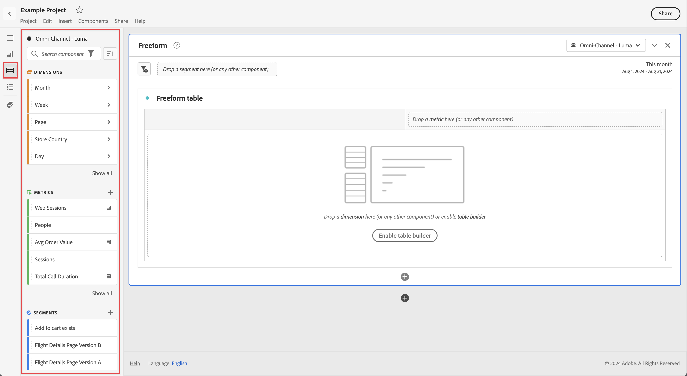

# 元件概觀

元件是Customer Journey Analytics中可用於報表或補充報表功能的功能。 您可以使用下列步驟管理這些元件：

1. 使用您的 Adobe ID 憑證登入 [analytics.adobe.com](https://analytics.adobe.com)。
2. 導覽至頁首功能表中的[!UICONTROL 元件] > [!UICONTROL 元件]。

您可以管理下列元件：

* [**篩選器**](filters/filters-overview.md)：排除部分資料，以聚焦於常見的維度項目
* [**計算量度**](calc-metrics/calc-metr-overview.md)：將量度和公式作為新元件用於報告中
* [**日期範圍**](date-ranges/overview.md)：自訂和調整 Analysis Workspace 提供的日期範圍
* [**專案**](/help/analysis-workspace/home.md)：在 Analysis Workspace 中組織和維護專案

## Analysis Workspace 元件

Analysis Workspace 中的元件包含量度、維度、篩選器及時間粒度，您可將它們拖放至專案上。您建立的自訂元件會加入這些面板，例如自訂日期範圍。

若要存取「元件」面板，請按一下左側邊欄中的&#x200B;**[!UICONTROL 元件]**&#x200B;圖示。您可以利用左欄圖示或[快捷鍵](/help/analysis-workspace/build-workspace-project/fa-shortcut-keys.md)，在各面板 (空白面板、[自由表格面板](/help/analysis-workspace/visualizations/freeform-table/freeform-table.md)、[快速深入分析面板](/help/analysis-workspace/c-panels/quickinsight.md)或[歸因 IQ](/help/analysis-workspace/c-panels/attribution.md) 面板)、[視覺化效果](/help/analysis-workspace/visualizations/freeform-analysis-visualizations.md)和元件之間來回切換。

請參閱[建立專案](/help/analysis-workspace/home.md)，以了解在專案中使用元件的詳細資訊。

## 元件動作

您可以透過多種方式管理元件 (個別或選取多個元件)。以滑鼠右鍵按一下元件，或按一下元件清單頂端的&#x200B;**[!UICONTROL 動作]**。

>[!NOTE]
>
>此類動作不適用於「時間」元件。

| 元件動作 | 說明 |
| --- | --- |
| 標記 | 以套用標記的方式組織或管理元件。接著元件會在相關的元件管理器中顯示，例如 [!UICONTROL Analytics] > [!UICONTROL 元件] > [!UICONTROL 篩選器]，或 [!UICONTROL Analytics] > [!UICONTROL 元件] > [!UICONTROL 專案] |
| 我的最愛 | 新增元件至我的最愛清單。接著元件會在相關的元件管理器中顯示，例如「[!UICONTROL Analytics]」 > 「[!UICONTROL 元件]」 > 「[!UICONTROL 篩選器]」，或「[!UICONTROL Analytics]」 > 「[!UICONTROL 元件]」 > 「[!UICONTROL 專案]」。 |
| 核准 | 核准元件使其成為正式項目。接著元件會在相關的元件管理器中顯示，例如「[!UICONTROL Analytics]」 > 「[!UICONTROL 元件]」 > 「[!UICONTROL 篩選器]」，或 「[!UICONTROL Analytics]」 > 「[!UICONTROL 元件]」 > 「[!UICONTROL 專案]」 |
| 共用 | 僅適用於篩選器。 |
| 刪除 | 僅適用於篩選器。 |

觀看建立量度、篩選器和日期的說明影片：

>[!VIDEO](https://video.tv.adobe.com/v/23979)

## 元件存取權限

在 Analysis Workspace 中，管理員可以[管理](/help/analysis-workspace/curate-share/curate.md)在報表中向使用者公開的元件。
