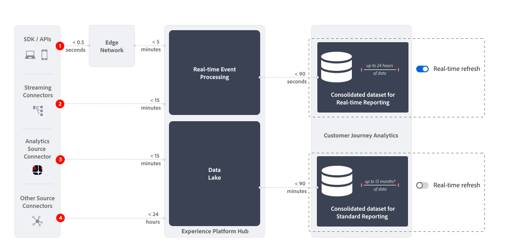

# 即時報告概觀

Customer Journey Analytics中的即時報表可即時顯示和更新Analysis Workspace中一個或多個面板內的資料和視覺效果。

{{release-limited-testing}}

{{ultimate-package}}

## 使用案例

本節提供典型有用和較不值錢的使用案例概觀。 以及何時不考慮即時報表的資訊。

* 即時報表最有價值的使用案例是關於主要銷售、促銷或產品推出。
在這次啟動中，您想知道以下事項：

   * 銷售與上次銷售相比如何？
   * 此產品上市與上次產品上市有何不同？
   * 您針對這個重要日子或活動的促銷活動是否真的有效？

* 即時報表的相關使用案例是驗證使用案例，但較不實用。
例如，您要驗證：

   * 您最近啟動的行銷活動歷程是否實際運作？
   * 您的新產品頁面何時上線，您是否從頁面收集客戶資料？
   * 您的即時媒體活動進行中嗎？

請勿將作業監控使用案例的即時報告列入考量。 例如，回答網站是否正常運作的問題。 由於[即時重新整理切換](use-real-time.md)會在30分鐘後自動停用，而即時報表會停止重新整理，因此您不應使用即時報表作為這些使用案例的可靠來源。

## 定義

Customer Journey Analytics即時報表的即時層面定義為從透過相關連線擷取基礎資料之日起約6.5分鐘內更新的資料和視覺效果。

資料收集設定的各種元件會決定即時報表延遲。

{zoomable="yes"}

| | 說明 | 延遲性 |
|:---:|---|--:|
| 1 | 透過Edge Network SDK / API收集到Edge Network的資料。 | &lt; 500毫秒 |
| 2 | 資料從Edge Network復寫到Experience Platform中樞的資料收集和驗證服務。 | &lt; 5 分鐘 |
| 3 | 透過串流聯結器收集的資料匯入Experience Platform中樞的資料收集和驗證服務。 | &lt; 15分鐘 |
| 4 | 透過Adobe Analytics收集並由Analytics來源聯結器轉送至Experience Platform中樞中來源聯結器處理器的資料。 | &lt; 15分鐘 |
| 5 | 透過其他來源聯結器收集到Experience Platform中樞來源聯結器處理器的資料。 | &lt; 24小時 |
| 6 | 即時處理器針對整合資料集所處理的資料，以進行即時報告。 | &lt; 90秒 |

## 限制

請注意下列即時報表的限制：

* 即時報表只會報告24小時滾動期間的可用資料。 跨此24小時滾動時段的資料會隱藏起來，以供即時報表使用。 報告的[即時重新整理](use-real-time.md)停用或自動關閉後，報告的所有相關資料即可再次使用。
* 歸因、細分、計算量度等只適用於24小時內滾動時間內可用的資料。
* 即時報表最適合用於事件和工作階段層級的資料，針對個人層級的資料，使用即時報表時，請務必謹慎。 <!--Need to explain this a bit better -->由於即時報表只能使用滾動24小時期間的事件，因此個人的事件歷史記錄也僅限於此視窗。 當您選取維度和（計算）量度時，請考慮事件和工作階段層級資料的偏好設定。 當您在啟用即時重新整理的面板中使用劃分、下一個或上一個等功能時。
* 您無法結合拼接與即時報告。 <!-- Do we need to explain this in more detail, why? -->即時報表是關於事件和工作階段層級的資料，與以人員為基礎的資料不太相關。
* 除了媒體開始和媒體關閉量度外，沒有可用的心率收集媒體量度。 因此，您仍可使用即時報告來啟用媒體使用案例。
* 當您使用[下載或匯出選項](/help/analysis-workspace/export/download-send.md)下載專案或從自由表格匯出資料時，請考慮下列事項：
   * 下載的CSV專案或匯出的CSV檔案包含下載或匯出時可用的即時資料。
   * 下載的PDF專案包含非即時資料，類似於停用即時重新整理時顯示的資料。
