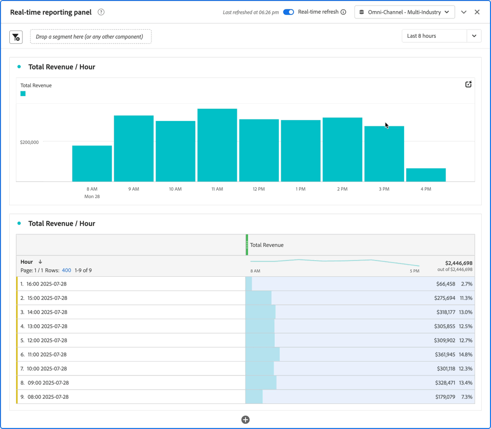

# 使用即時報告 {#use-real-time-reporting}

>[!CONTEXTUALHELP]
>id="workspace_panel_realtime_refresh"
>title="即時重新整理"
>abstract="啟用即可即時更新此面板的資料及視覺效果。"

{{release-limited-testing}}

若要使用即時報告，請在Workspace專案中啟用下列任何面板的&#x200B;**[!UICONTROL 即時重新整理]**&#x200B;切換功能：

* [空白面板](/help/analysis-workspace/c-panels/blank-panel.md)
* [自由格式](/help/analysis-workspace/c-panels/freeform-panel.md)
* [歸因](/help/analysis-workspace/c-panels/attribution.md)
* [下一個或上一個項目](/help/analysis-workspace/c-panels/next-previous.md)
* [快速深入分析](/help/analysis-workspace/c-panels/quickinsight.md)

您會看到包含資料最近一次重新整理時間戳記的訊息。 例如： [!UICONTROL  *上次重新整理時間： 07:55 pm*]。

從下拉式選單中選取您要報告的即時時段。 可選擇下列選項：

* [!UICONTROL 最近15分鐘]
* [!UICONTROL 最近30分鐘]
* [!UICONTROL 最後一小時]
* [!UICONTROL 最近8小時]
* [!UICONTROL 最近24小時]

現在面板中的所有視覺效果會每分鐘更新一次，最多更新30分鐘，同時啟用即時重新整理面板的瀏覽器標籤會啟用。

例如，檢視下方&#x200B;**[!UICONTROL 即時報表面板]**&#x200B;的快照，該快照會隨著時間從&#x200B;**[!UICONTROL 06]**&#x200B;移至&#x200B;**[!UICONTROL 06]**&#x200B;下午&#x200B;**[!UICONTROL *，重新整理:26pm*]**&#x200B;總收入/小時&#x200B;**[!UICONTROL *長條圖視覺效果和:27總收入/小時&#x200B;*]**自由格式表格。

30分鐘後，或當瀏覽器索引標籤停用時，**[!UICONTROL 即時重新整理]**&#x200B;切換會自動停用，且即時更新會停止。
