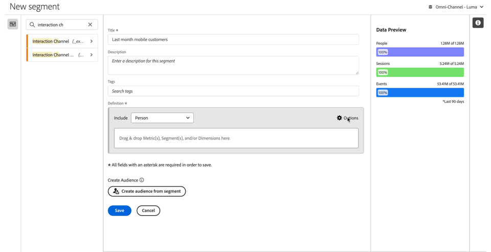
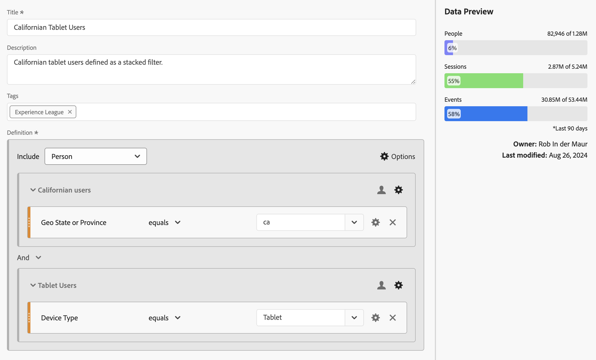
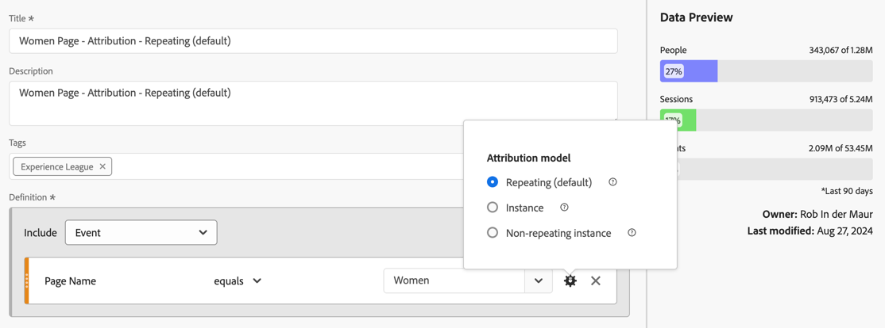

# 建置區段 {#build-segments}

>[!CONTEXTUALHELP]
>id="components_filters_createaudience"
>title="建立客群"
>abstract="客群可以透過細分群體建立，並與 Adobe Experience Platform 共用以進行啟用。"

>[!CONTEXTUALHELP]
>id="components_filters_datapreview"
>title="資料預覽"
>abstract="將此細分群體的資料與資料檢視的資料進行比較。此預覽百分比是根據資料檢視中&#x200B;**過去 90 天**&#x200B;的總數。  如果預覽未載入，您的連線可能仍在進行回填。"

**[!UICONTROL 區段產生器]**&#x200B;對話框用於建立新區段或編輯現有區段。對於您從[[!UICONTROL 區段]管理員](/help/components/segments/seg-manage.md)建立或管理的區段，對話框標題為&#x200B;**[!UICONTROL 新增區段]**&#x200B;或&#x200B;**[!UICONTROL 編輯區段]**。

>[!BEGINTABS]

>[!TAB 區段產生器]

>[!TAB 建立或編輯區段]

>[!ENDTABS]

1. 指定以下詳細資料 ( 是必要的)：

   | 元素 | 說明 |
   | --- | --- |
   | **[!UICONTROL 資料檢視]** | 您可以選取區段的資料檢視。您定義的區段可做為資料檢視[設定](/help/data-views/create-dataview.md#settings-filters)索引標籤中的區段使用。 |
   | **[!UICONTROL 僅限專案區段]** | 資訊框是用來說明區段只會在建立區段所屬專案中見到，並且該區段不會新增至您的元件清單中。啟用&#x200B;**[!UICONTROL 「讓此區段適用於您的所有專案並將其新增至您的元件清單中」]**&#x200B;以變更該設定。此資訊框只會在後述情況時可見到：當您建立[快速區段](seg-quick.md)時；以及從[!UICONTROL 快速區段]介面使用「**[!UICONTROL 開啟產生器]**」，將快速區段資訊變成一般區段時。 |
   | **[!UICONTROL 標題]** | 為區段命名，例如 `Last month mobile customers`。 |
   | **[!UICONTROL 說明]** | 提供區段說明，例如，`Segment to define the mobile customers for the last month`。 |
   | **[!UICONTROL 標記]** | 透過建立或套用一或多個標記來整理區段。開始輸入內容以尋找您可以選取的現有標記。或按一下 **[!UICONTROL ENTER]** 以新增新標記。選取以移除標記。 |
   | **[!UICONTROL 定義]**  | 使用[定義產生器](#definition-builder)來定義區段。 |

   {style="table-layout:auto"}

1. 若要驗證您的區段定義是否正確，請使用右上角不斷更新的區段結果預覽。
1. 若要透過區段建立客群，並與 Experience Platform 共用客群，請選取「**[!UICONTROL 透過區段建立客群]**」。請參閱「[建立並發佈客群](/help/components/audiences/publish.md)」，了解更多資訊。
1. 選取：
   * **[!UICONTROL 儲存]**&#x200B;以儲存區段。
   * **[!UICONTROL 另存新檔]**&#x200B;以儲存區段副本。
   * **[!UICONTROL 刪除]**&#x200B;以刪除區段。
   * **[!UICONTROL 取消]**&#x200B;以取消對區段所做的任何變更或取消建立新區段。

## 定義產生器

您可以使用定義產生器來建立區段定義。在該構造中，您可以使用元件、容器、運算子和邏輯。

您可以設定定義的類型和範圍：

1. 若要指定定義的類型，請指定是否要建立一個包含定義或一個排除定義。選取 **[!UICONTROL 「選項」]**，並從下拉式選單中選取&#x200B;**[!UICONTROL 「包括」]**&#x200B;或&#x200B;**[!UICONTROL 「排除」]**。
1. 若要指定定義的範圍，請從&#x200B;**[!UICONTROL 包含]**&#x200B;或&#x200B;**[!UICONTROL 排除]**&#x200B;下拉式功能表選取，以決定您要定義的範圍是&#x200B;**[!UICONTROL 事件]**、**[!UICONTROL 工作階段]**、**[!UICONTROL 人員]**、**[!UICONTROL 全域帳戶]** [!BADGE B2B edition]{type=Informative url="https://experienceleague.adobe.com/zh-hant/docs/analytics-platform/using/cja-overview/cja-b2b/cja-b2b-edition" newtab=true tooltip="Customer Journey Analytics B2B Edition"}、**[!UICONTROL 帳戶]** [!BADGE B2B edition]{type=Informative url="https://experienceleague.adobe.com/zh-hant/docs/analytics-platform/using/cja-overview/cja-b2b/cja-b2b-edition" newtab=true tooltip="Customer Journey Analytics B2B Edition"}、**[!UICONTROL 機會]** [!BADGE B2B edition]{type=Informative url="https://experienceleague.adobe.com/zh-hant/docs/analytics-platform/using/cja-overview/cja-b2b/cja-b2b-edition" newtab=true tooltip="Customer Journey Analytics B2B Edition"}或&#x200B;**[!UICONTROL 購買群組]** [!BADGE B2B edition]{type=Informative url="https://experienceleague.adobe.com/zh-hant/docs/analytics-platform/using/cja-overview/cja-b2b/cja-b2b-edition" newtab=true tooltip="Customer Journey Analytics B2B Edition"}

您稍後可以隨時變更這些設定。

### 元件

建立區段定義時，有個重要部分是使用維度、量度、現有區段和日期範圍。區段產生器中的元件面板提供所有這些元件。

{width=100%}

若要新增元件：

1. 將元件面板中的元件拖放至「**[!UICONTROL 將量度、區段和/或維度拖放至此處]**」。您可以使用元件列中的「」來搜尋特定元件。
1. 指定元件的詳細資訊。例如，從「**[!UICONTROL 選擇值]**」中選取一個值。或輸入一個值。指定一個或多個值的內容和方式取決於元件和運算子。
1. 可選擇修訂預設的運算子。例如，從「**[!UICONTROL 等於]**」改為「**[!UICONTROL 等於任何]**」。請參閱「[運算子](seg-operators.md)」，了解可用運算子詳細概觀。

若要編輯元件：

* 從運算子下拉式選單中選取元件的新運算子。
* 若可以，請為運算子選取或指定不同的值。
* 如果元件類型是維度，則可以定義歸因模型。如需詳細資訊，請參閱「[歸因模型](#attribution)」。

若要刪除元件：

* 在元件中選取 。

### 容器

您可以將多個元件分組在一個或多個容器中，並定義容器內和容器之間的邏輯。容器可讓您為區段建置複雜的定義。

{Width=100%}

* 若要新增容器，請選取「**[!UICONTROL 新增容器]**」(從  **[!UICONTROL 選項]**)。
* 若要將現有元件新增至容器中，請將元件拖曳到容器中。
* 若要為容器新增另一個元件，請將元件從元件面板拖曳到容器中。使用藍色插入線作為準則。
* 若要在容器外部新增另一個元件，請將元件從元件面板拖曳到容器外部，但拖曳到主定義容器內部。使用藍色插入線作為準則。
* 若要修改容器內元件之間、容器之間或容器與元件之間的邏輯，請選取適當的「**[!UICONTROL 以及]**」(And)、「**[!UICONTROL 或]**」(Or)、「**[!UICONTROL 然後]**」(Then)。當您選取「然後」時，您會將區段變成循序區段。如需詳細資訊，請參閱「[建立循序區段](seg-sequential-build.md)」。
* 若要切換容器級別，請選取  **[!UICONTROL 全域帳戶]** [!BADGE B2B Edition]{type=Informative url="https://experienceleague.adobe.com/zh-hant/docs/analytics-platform/using/cja-overview/cja-b2b/cja-b2b-edition" newtab=true tooltip="Customer Journey Analytics B2B Edition"}、 **[!UICONTROL 帳戶]** [!BADGE B2B Edition]{type=Informative url="https://experienceleague.adobe.com/zh-hant/docs/analytics-platform/using/cja-overview/cja-b2b/cja-b2b-edition" newtab=true tooltip="Customer Journey Analytics B2B Edition"}、 **[!UICONTROL 機會]** [!BADGE B2B Edition]{type=Informative url="https://experienceleague.adobe.com/zh-hant/docs/analytics-platform/using/cja-overview/cja-b2b/cja-b2b-edition" newtab=true tooltip="Customer Journey Analytics B2B Edition"}、 **[!UICONTROL 購買群組]** [!BADGE B2B Edition]{type=Informative url="https://experienceleague.adobe.com/zh-hant/docs/analytics-platform/using/cja-overview/cja-b2b/cja-b2b-edition" newtab=true tooltip="Customer Journey Analytics B2B Edition"}、 **[!UICONTROL 事件]**、 **[!UICONTROL 工作階段]**&#x200B;或  **[!UICONTROL 人員]**。

您可以在容器中使用  來執行下列動作：

| 容器動作 | 說明 |
|---|---|
| **[!UICONTROL 新增容器]** | 新增巢狀容器至容器中。 |
| **[!UICONTROL 排除]** | 在區段定義中排除容器中的結果。左側的細紅色條是指排除容器。 |
| **[!UICONTROL 包括]** | 在區段定義中包括容器中的結果。包含為預設值。左側的細灰色條是指包含容器。 |
| **[!UICONTROL 容器名稱]** | 根據容器的預設說明為容器重新命名。在文字欄位中輸入名稱。如果您未輸入任何資料，則使用預設說明。 |
| **[!UICONTROL 刪除容器]** | 根據定義來刪除容器。 |

## 日期範圍

您可以建置包含滾動日期範圍的區段。如此一來，您便可以回答有關持續進行的活動或事件的問題。舉例來說，您可以建置包括「*過去 60 天內在線上購買過一次的人*」的區段。

>[!BEGINSHADEBOX]

請參閱  [&#x200B; 在細分群體捲動日期範圍](https://video.tv.adobe.com/v/25403/?quality=12&learn=on){target="_blank"}的示範影片。

>[!ENDSHADEBOX]

## 堆疊細分群體 {#stack}

您可以使用區段來建置區段。當您在區段中使用區段時，您可以最佳化您的區段並降低複雜性。

假設您想要根據裝置類型 (2) 和美國各州 (50) 的組合進行劃分。您可以建置 100 個區段，每個區段都是裝置類型 (手機與平板電腦) 和美國各州的唯一組合。若要取得加州平板電腦使用者的結果，您可以使用以下 100 個區段之一：

或者，您可以定義 52 個區段：50 個美國各州的區段、一個手機的區段、一個平板電腦的區段。然後堆疊區段以取得相同的結果。若要取得加州平板電腦使用者結果，你需要堆疊兩個區段：

## 歸因 {#attribution}

>[!CONTEXTUALHELP]
>id="components_filters_attribution_repeating"
>title="重複"
>abstract="包括維度的執行個體和持續值。"

>[!CONTEXTUALHELP]
>id="components_filters_attribution_instance"
>title="例項"
>abstract="包括維度的執行個體。"

>[!CONTEXTUALHELP]
>id="components_filters_attribution_nonrepeatinginstance"
>title="非重複的例項"
>abstract="包括維度的唯一執行個體 (非重複) 執行個體。"

當您在區段產生器中使用維度時，您可以選擇指定該維度的歸因模型。您選取的歸因模型會決定資料是否符合您為維度元件指定的條件。

在維度元件中選取「」，然後從快顯視窗中選取一個歸因模型：

| 模型 | 說明 |
|---|---|
| **[!UICONTROL 重複模型 (預設)]** | 包含維度的實例和持續值來確定資格。 |
| **[!UICONTROL 例項]** | 僅包含維度的實例值來確定資格。 |
| **[!UICONTROL 非重複的例項]** | 包含維度的唯一實例 (非重複) 值來確定資格。 |

### 範例

作為區段定義的一部分，您已指定以下條件：頁面名稱等於「女性」。與上面的例子類似。您是使用另外兩個歸因模型來重複此區段定義。因此，您有三個區段，每個區段有自己的歸因模型：

* 女性頁面 - 歸因 - 重複 (預設)
* 女性頁面 - 歸因 - 實例
* 女性頁面 - 歸因 - 非重複實例

下表說明每個歸因模型，其中傳入的事件是符合該條件的 。

| 女性頁面 - 歸因 -  *歸因模型* | 事件 1： 頁面名稱等於 女性 | 事件 2： 頁面名稱等於 男性 | 事件 3： 頁面名稱等於 女性 | 事件 4： 頁面名稱等於 女性  (持續) | 事件 5： 頁面名稱等於 結帳 | 事件 6： 頁面名稱等於 女性 | 事件 7： 頁面名稱等於 首頁 |
|---|:---:|:---:|:---:|:---:|:---:|:---:|:--:|
| 重複 (預設) |  |  |  |  |  |  |  |
| 例項 |  |  |  |  |  |  |  |
| 非重複的例項 |  |  |  |  |  |  |  |

使用三個區段的事件報告範例如下：

