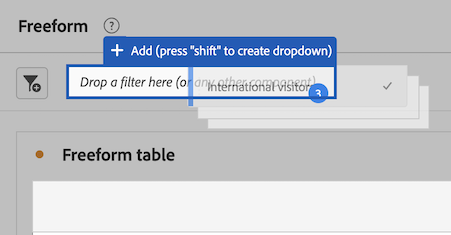

# 在Analysis Workspace中使用元件

元件構成Analysis Workspace中任何專案的實際資料。 元件包含維度、量度、篩選器和日期範圍。 您可以將元件拖曳至視覺效果或面板中，藉此新增元件至專案。

如需可新增之元件型別的概觀資訊，請參閱 [元件概觀](/help/components/overview.md).

>[!TIP]
>
>如需各個元件的詳細資訊，請在Analysis Workspace的左側邊欄中選取元件名稱旁的「資訊」圖示。

## 開始新增元件至專案

1. [在Analysis Workspace中建立專案](/help/analysis-workspace/build-workspace-project/create-projects.md) 如果您尚未這樣做。

1. [新增面板](/help/analysis-workspace/c-panels/panels.md) 或 [新增視覺效果](/help/analysis-workspace/visualizations/freeform-analysis-visualizations.md#add-visualizations-to-a-panel) Analysis Workspace中的專案。

   如果您將元件新增至空白專案，則會自動建立自由表格視覺效果。

1. 選取左側邊欄中的「**[!UICONTROL 元件]**」圖示。

   

1. 捲動至或搜尋要新增的元件，然後將其拖曳到專案中的面板或視覺化效果中。

   例如，您可以將篩選器拖曳到面板標題中的篩選器放置區域。

   

1. 如需更多詳細資訊，請根據您新增的元件型別，繼續下列其中一節：

   * [將維度新增至專案](#add-dimensions-to-a-project)

   * [將量度新增至專案](#add-metrics-to-a-project)

   * [將篩選器新增至專案](#add-filters-to-a-project)

   * [新增日期範圍至專案](#add-date-ranges-to-a-project)

## 將維度新增至專案

[Dimension](/help/components/dimensions/overview.md) 是Adobe Analytics中通常包含字串值的變數。 相對地，[量度](/help/components/calc-metrics/calc-metr-overview.md)包含繫結至維度的數值。基本報表會針對一個數值 (量度) 欄顯示字串值 (維度) 列。

1. 如所述，開始將維度新增至Analysis Workspace中的專案 [開始新增元件至專案](#begin-adding-components-to-a-project).

1. 選擇下列其中一種方法來新增維度，並決定您要分析的資料型別：

   * 將維度拖曳至Analysis Workspace中的視覺效果（例如自由表格）。

     

   * 從左側邊欄將一或多個維度拖曳至篩選器拖放區域以建立臨時篩選器，如所述 [將篩選器新增至專案](#add-filters-to-a-project).

如需如何在Analysis Workspace中使用維度的詳細資訊，請參閱 [預覽維度](/help/components/dimensions/view-dimensions.md)， [劃分維度](/help/components/dimensions/t-breakdown-fa.md)、和 [時間分段維度](/help/components/dimensions/time-parting-dimensions.md).

## 將量度新增至專案

量度可讓您量化 Analysis Workspace 中的資料點。它們最常用作視覺效果中的欄，並和維度相連結。

若要在Analysis Workspace中新增量度至專案：

1. 開始在Analysis Workspace中將量度新增至您的專案，如所述 [開始新增元件至專案](#begin-adding-components-to-a-project).

1. 選擇下列其中一種方法，在Analysis Workspace中新增量度：

   * 將量度拖曳至空白自由表格中的量度拖放區域，可檢視專案日期期間的量度趨勢。

     

   * 存在維度時可將量度拖移，以查看該量度和每個維度項目的比較。

   * 將量度拖移到現有量度標頭的頂部，即可將其取代。

   * 將量度拖移到標頭旁邊，即可並排查看兩個量度。

如需量度的詳細資訊，請參閱 [計算量度概觀](/help/components/calc-metrics/calc-metr-overview.md).

## 將篩選器新增至專案

[篩選器](/help/components/filters/filters-overview.md) 可讓您根據特性或特定互動來識別訪客的子集。

若要在Analysis Workspace中新增篩選器至專案：

1. 開始在Analysis Workspace中將篩選器新增至您的專案，如所述 [開始新增元件至專案](#begin-adding-components-to-a-project).

1. 選擇下列其中一個方法，開始篩選面板：

   * 將個別篩選器從左側邊欄拖曳至篩選器拖放區域。

     

   * 按住Shift或Ctrl鍵，在左側邊欄中選取多個篩選器，然後按住Shift鍵，將篩選器拖放至篩選器拖放區域。

     

     這會建立下拉式功能表，讓面板的使用者選擇要套用的篩選器。 下拉式功能表包含 [!UICONTROL **無篩選器**] 使用者可選取的選項，此選項會讓面板保持未篩選狀態。

     您可以從下拉式選單中選取(x)以移除任何選項。 如果您移除 [!UICONTROL **無篩選器**] 選項，則需要篩選。

   * 將非篩選元件拖放至拖放區域，建立臨時篩選。 這可讓您節省前往篩選產生器的時間和精力。 以這種方式建立的篩選器會被自動定義為點擊層級的篩選器。若要修改此定義，可按一下篩選器旁的資訊圖示 (i)，然後按一下筆狀編輯圖示，即可在篩選產生器中進行編輯。

     臨時篩選器是一種快速篩選器，而且是專案的本機篩選器。除非您將其公開，否則它們不會顯示在左側邊欄中。

     如需更多資訊，請參閱「[快速篩選器](/help/components/filters/quick-filters.md)」。

如需如何在面板上使用篩選器拖放區域來篩選面板的詳細資訊，請參閱 [拖放區域](/help/analysis-workspace/c-panels/panels.md#drop-zone) 在 [面板概觀](/help/analysis-workspace/c-panels/panels.md).

## 新增日期範圍至專案

[日期範圍](/help/components/date-ranges/custom-date-ranges.md) 決定Analysis Workspace中的報告時間範圍，並可套用至專案中一或多個面板。

依預設，每個面板都包含日期範圍。 更新面板的日期範圍有多種方式。 在Analysis Workspace中更新面板日期範圍的一種方法是從左側邊欄拖曳日期範圍元件：

1. 開始在Analysis Workspace中新增日期範圍至您的專案，如所述 [開始新增元件至專案](#begin-adding-components-to-a-project).

1. 從左側邊欄將日期範圍拖曳至面板右上角目前的日期範圍。

   

如需如何在Analysis Workspace中使用行事曆和日期範圍的詳細資訊，請參閱 [日曆和日期範圍概觀](/help/components/date-ranges/custom-date-ranges.md).
