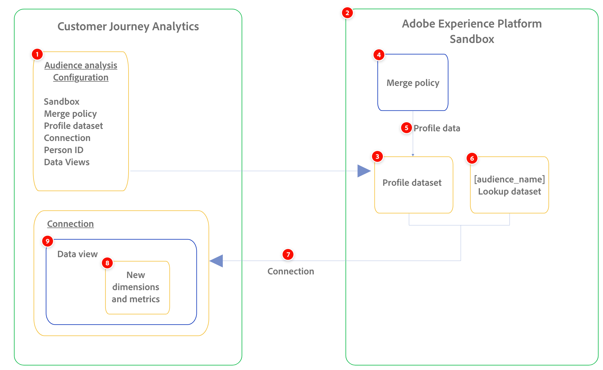

# 對象分析概觀

>[!NOTE]
>
>瞭解對象分析與對象發佈之間的差異：
>
>* **對象分析**：可讓您將Experience Platform設定檔資料集中的對象會籍資料擷取到Customer Journey Analytics連線。
>* **對象發佈**：可讓您建立在Customer Journey Analytics中發現的對象，並將其發佈到Adobe Experience Platform，以用於客戶目標定位和個人化。 如需對象發佈的相關資訊，請參閱[對象發佈概觀](/help/components/audiences/audiences-overview.md)。

對象分析可讓您將對象成員資格資料從Experience Platform設定檔資料集擷取到Customer Journey Analytics連線。 客群會變為可用的新維度，以便在 Analysis Workspace 中使用。

下圖和相關表格高階展示Customer Journey Analytics中的對象分析設定如何讓Experience Platform對象資料可在Analysis Workspace中使用：

| 數字 | 功能 | 函數 |
|---------|----------|---------|
| 1 | 對象分析設定 | Customer Journey Analytics中用於設定受眾分析的設定介面。 |
| 2 | 沙箱 | 必須包含您想要新增至連線的設定檔資料集。 |
| 3 | 輪廓資料集 | 必須包含您要分析的Experience Platform對象資料。 此設定檔資料集已新增至您選取的連線。 |
| 4 | 合併原則 | 與您要分析之Experience Platform對象相關聯的合併原則。 |
| 5 | 設定檔資料 | 與您選取的合併原則相關聯的設定檔資料。 此資料可在Experience Platform資料集中使用。 |
| 6 | 新查詢資料集 | 為建立的新對象維度提供易記名稱。 
系統會自動建立查詢資料集，並將其新增至連線，以及您選取的設定檔資料集。
 |
| 7 | 連線 | 您要新增所選取設定檔資料集的連線。 |
| 8 | 新受眾維度 | 新的對象維度<!--and metrics?-->代表您選取之設定檔資料集中所包含的Experience Platform對象，且可用於Analysis Workspace中的報告。 系統會自動建立這些維度。 |
| 9 | 資料檢視 | 您選取的與連線相關聯的資料檢視。 在Analysis Workspace中分析Experience Platform受眾資料時，您想要使用這些資料檢視。 這些資料檢視會自動設定用於報表的Experience Platform受眾資料。 |

## 設定客群分析

設定對象分析時，您會選取與您要分析之Experience Platform對象相關聯的沙箱和合併原則。 Customer Journey Analytics會建立新的查詢資料集，然後自動將查詢資料集和設定檔資料集新增到您選擇的連線。

>[!IMPORTANT]
>
>對象資料會每晚重新處理和產生，因此對象資料僅供前一天（「昨天」）的分析使用。
>
>在您建立對象分析設定後的次日，便可在Customer Journey Analytics資料檢視中使用對象。

如需詳細資訊，請參閱[設定對象分析](/help/connections/audience-analysis/audience-analysis-configure.md)。

## 管理對象分析設定

您可以在對象分析設定建立後加以管理。 您可以檢視、編輯和刪除組態。

如需有關管理現有對象分析設定的資訊，請參閱[管理對象分析設定](/help/connections/audience-analysis/audience-analysis-manage.md)。

## 在Customer Journey Analytics中分析受眾資料

有了Customer Journey Analytics提供的受眾資料，您就可以針對受眾成員在不同管道中的行為方式獲得可行的深入分析。

例如，您可以追蹤包含在相同電子郵件促銷活動中的個別客戶的行為。 有了Customer Journey Analytics提供的對象，您可以看到有關每個對象成員的下列資訊：

* 從電子郵件點進至網站，最後導致購買

* 最終進行店內購買的受眾成員

如需詳細資訊，請參閱[在Customer Journey Analytics中分析Experience Platform對象](/help/connections/audience-analysis/analyze-audiences.md)。

## 對象分析角色和許可權需求

對象分析需要下列Customer Journey Analytics角色和Experience Platform許可權：

| 功能 | Customer Journey Analytics角色或許可權需求 | Experience Platform許可權需求 |
|---------|----------|----------|
| [建立對象分析設定](/help/connections/audience-analysis/audience-analysis-configure.md) | 系統管理員 | <ul><li>資料集：讀取許可權</li><li>結構描述：讀取、寫入</li><li>身分名稱空間：讀取</li></ul> |
| [在資料檢視中檢視對象分析維度](/help/connections/audience-analysis/audience-analysis-configure.md#view-audience-dimensions-in-the-data-view) | 指派資料檢視的產品設定檔的產品設定檔管理員 
如需詳細資訊，請參閱[存取控制](/help/technotes/access-control.md)。
 | 不適用 |
| 在Analysis Workspace中使用對象分析維度 | 存取已新增對象分析維度的資料檢視 | 不適用 |

## 對象分析使用案例

如需強調Audience Analysis所提供值的使用案例範例，請參閱[Audience Analysis使用案例](/help/connections/audience-analysis/audience-analysis-use-cases.md)。

## 對象分析限制

在[設定對象分析](/help/connections/audience-analysis/audience-analysis-configure.md)時，請考量下列限制：

* 單一沙箱可支援最多100個對象分析設定。

* 一個連線只能與一個對象分析設定相關聯。
