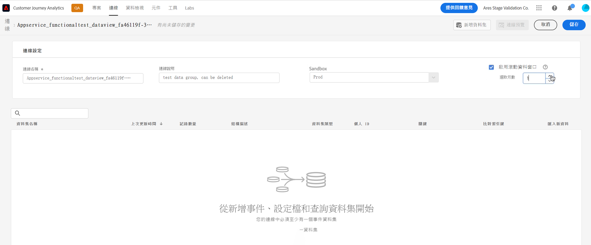
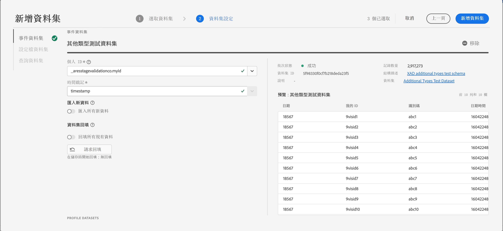
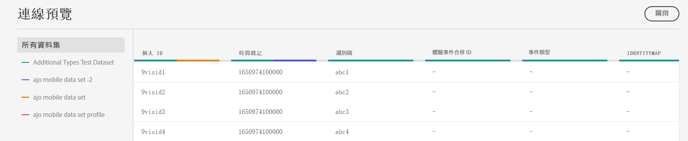
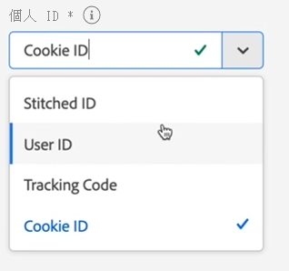
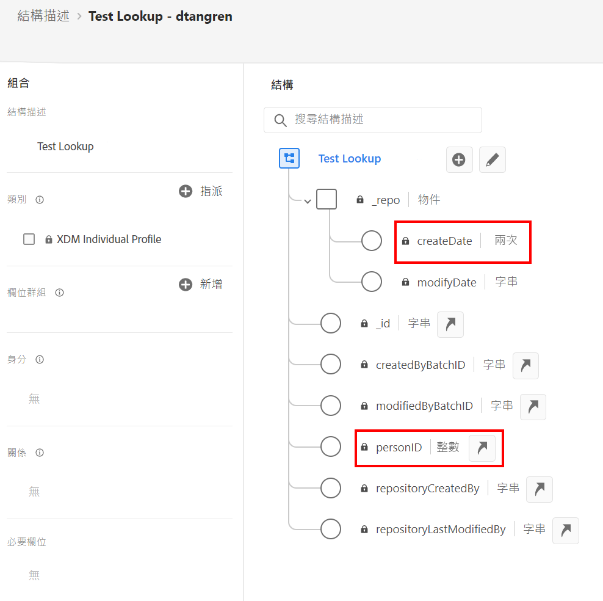
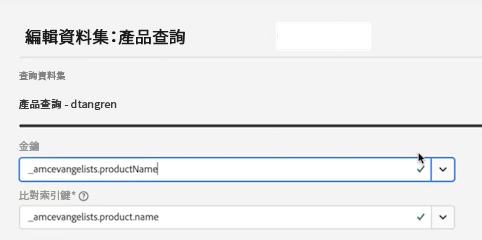
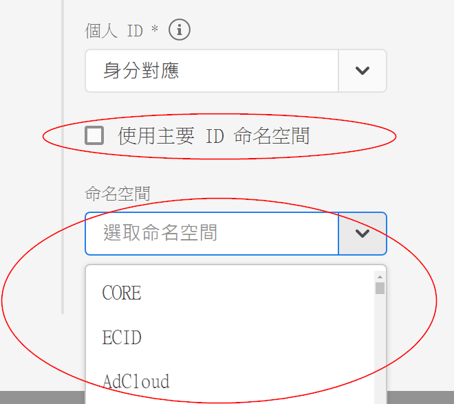

# 建立連線

我們最近在 Customer Journey Analytics (CJA) 中推出了新的連線工作流程。 透過輔助工作流程，新的連線建立和編輯工作流程體驗可將所有資料集和連線組態設定彙整到畫面中央處。  我們提供詳細的資料集選擇、設定和檢閱體驗，包含資料集類型、大小、結構描述、資料集 ID、批次狀態、回填狀態、人員 ID 等重要資訊，以降低連線設定錯誤的風險。 以下是新功能總覽：

* 當您建立連線時，可以啟用滾動資料保留時間窗口。
* 您可以在連線中新增及移除資料集。 (移除資料集會將其從連線中移除，並影響任何關聯的資料檢視及基礎 Analysis Workspace 專案。)
* 您可以為每個資料集啟用及請求回填資料。
* 例如，您可以編輯資料集來請求另一次回填。
* 您可以為每個資料集匯入現有的資料。

>[!VIDEO](https://video.tv.adobe.com/v/343044/?quality=12&learn=on)

## 建立和設定連線 {#create-connection}

1. 在 CJA 中，按一下&#x200B;**[!UICONTROL 連線]**&#x200B;索引標籤。
1. 按一下&#x200B;**[!UICONTROL 建立新連線]**。

   

1. 進行連線設定。

   | 設定 | 說明 |
   | --- | --- |
   | **[!UICONTROL 連線名稱]** | 為連線輸入唯一名稱。 |
   | **[!UICONTROL 連線說明]** | 說明此連線的用途。 |
   | **[!UICONTROL 沙箱]** | 在 Experience Platform 中，選擇您要連線之資料集所屬的沙箱。<p>Adobe Experience Platform 提供的[沙箱](https://experienceleague.adobe.com/docs/experience-platform/sandbox/home.html?lang=zh-Hant)可將單一 Platform 例項分割成個別的虛擬環境，以利開發及改進數位體驗應用程式。您可將沙箱視為內含資料集的「資料獨立單位」。沙箱可用於控制資料集的存取權限。<p>當您選取沙箱後，左側欄會顯示您可以從該沙箱提取的所有資料集。 |
   | **[!UICONTROL 啟用滾動資料時間窗口]** | 勾選這個核取方塊可讓您在連線層級將 CJA 資料保留定義為以月為單位的滾動時段 (1 個月、3 個月、6 個月等)。<p>資料保留是以事件資料集時間戳記為基礎，僅適用於事件資料集。由於無適用的時間戳記，因此基本資料或查詢資料集不存在滾動資料時間窗口設定。 不過，如果您的連線在一個或多個事件資料集之外還包含任何基本資料或查詢資料集，則會為相同時段保留該資料。<p> 主要優點在於您只會儲存或報告適用且實用的資料，並刪除不再實用的舊資料。 這有助於您未超過合約限制，並減少超額使用費用的風險。<p>如果您保留預設值 (未勾選)，保留期間將由 Adobe Experience Platform 資料保留設定取代。如果您在 Experience Platform 中有 25 個月的資料，CJA 將透過回填取得 25 個月的資料。如果您在 Platform 中刪除其中 10 個月的資料，CJA 則會保留剩餘 15 個月的資料。 |
   | **[!UICONTROL 新增資料集]** (請參閱底下) | 如果沒有資料集出現在您的資料集清單中，請新增資料集。 |
   | **[!UICONTROL 資料集名稱]** | 選取一個或多個要拉進 Customer Journey Analytics 中的資料集，然後按一下&#x200B;**[!UICONTROL 新增]**。<p>(如果有很多資料集可供選擇，可使用資料集清單上方的「搜尋資料集」搜尋列，搜尋合適的資料集)。 |
   | **[!UICONTROL 上次更新時間]** | 僅適用於事件資料集，系統會自動將此設定設為 Experience Platform 中以事件為基礎的結構描述中的預設時間戳記欄位。 「不適用」代表此資料集不含任何資料。 |
   | **[!UICONTROL 結構描述]** | 這是之前在 Adobe Experience Platform 中建立資料集所根據的[結構描述](https://experienceleague.adobe.com/docs/experience-platform/xdm/schema/composition.html?lang=zh-Hant)。 |
   | **[!UICONTROL 資料集類型]** | Customer Journey Analytics 會針對您新增至此連線的各個資料集，根據傳入的資料自動設定資料集類型。 有 3 種不同的資料集類型：事件資料、個人基本資料和查詢資料。 請參閱下表提供的資料集類型說明。 |
   | **[!UICONTROL 人員 ID]** | 從可用身分識別的下拉式清單中選取人員 ID。 這些身分識別是在 Experience Platform 的資料集結構中所定義。 若要了解如何以「身分對應」作為人員 ID，請參閱以下說明。<p>重要事項：如果沒有人員 ID 可供選擇，表示結構描述中尚未定義一個或多個人員 ID。 請觀看[這部影片](https://www.youtube.com/watch?v=G_ttmGl_LRU)，了解如何在 Experience Platform 中定義身分識別。 |
   | **[!UICONTROL 索引鍵]** | 僅適用於查詢資料集 (例如 _id)。 |
   | **[!UICONTROL 相符的索引鍵]** | 僅適用於查詢資料集 (例如 _id)。 |
   | **[!UICONTROL 匯入新資料]** | 設定為開啟或關閉。 |
   | **[!UICONTROL 回填資料]** | 您可以要求根據事件時間戳記，將資料回填到資料集。 舉例來說，您可以要求回填最近 7 天的資料、設定適用的人員 ID，並測試連線是否設定正確。 如果一切正常，您就能放心回填剩餘的資料。<p>此外，您也可以啟用按資料集匯入新資料。 例如，啟用匯入新資料僅供查看資料用途。 |
   | **[!UICONTROL 回填狀態]** | 指出是否有任何回填資料在處理中。 |

   {style="table-layout:auto"}

## 新增及設定資料集 {#add-dataset}

當您建立連線時，新工作流程可讓您新增 Experience Platform 資料集。

1. 在「連線設定」對話框中，按一下&#x200B;**[!UICONTROL 新增資料集]**。
1. 選取一個或多個資料集，然後按&#x200B;**[!UICONTROL 下一步]**。

   請注意，至少需要有一個事件資料集成為連線的一部分。
1. 現在請逐一設定資料集。

   

   | 設定 | 說明 |
   | --- | --- |
   | **[!UICONTROL 人員 ID]** | 從可用身分識別的下拉式清單中選取人員 ID。 這些身分識別是在 Experience Platform 的資料集結構中所定義。 若要了解如何以「身分對應」作為人員 ID，請參閱以下說明。<p>如果沒有人員 ID 可以選擇，表示結構中尚未定義一或多個人員 ID。 請觀看這部影片，了解如何在 Experience Platform 中定義身分識別。 |
   | **[!UICONTROL 時間戳記]** | 僅適用於事件資料集，系統會自動將此設定設為 Experience Platform 中以事件為基礎的結構描述中的預設時間戳記欄位。 |
   | **[!UICONTROL 資料來源類型]** | 資料來源類型包括：網路資料、行動應用程式資料、POS資料、CRM資料、調查資料、客服中心資料、產品資料、帳戶資料、交易資料、客戶意見資料及其他。 |
   | **[!UICONTROL 匯入新資料]** | 如果您要建立持續連線，請選取此選項，如此一來，新增到此連線中資料集的任何新資料批次都會自動流入工作區。 可以設定為開啟或關閉。 |
   | **[!UICONTROL 資料集回填]** | 按一下&#x200B;**[!UICONTROL 請求回填]**&#x200B;以回填歷史資料。<ul><li>您可以個別回填每個資料集。</li><li>系統會優先處理新增至連線中資料集的新資料，因此新資料的延遲最低。</li><li>所有回填 (歷史) 資料的匯入速度都會比較慢。 延遲受到您有多少歷史資料所影響。</li><li>Adobe Analytics 來源連接器最多可匯入 13 個月資料 (不論資料量多寡)。</li></ul> |
   | **[!UICONTROL 回填狀態]** | 可能的狀態指標包括：<ul><li>成功</li><li>正在處理 X 個回填</li><li>關閉</li></ul> |
   | **[!UICONTROL 資料集 ID]** | 此 ID 是自動產生的。 |
   | **[!UICONTROL 說明]** | 建立資料集時為其提供的說明。 |
   | **[!UICONTROL 資料集大小]** | 資料集的大小。 |
   | **[!UICONTROL 結構描述]** | 這是之前在 Adobe Experience Platform 中建立資料集所根據的結構描述。 |
   | **[!UICONTROL 資料集]** | 資料集的名稱。 |
   | **[!UICONTROL 預覽]**：`<dataset name>` | 預覽包含日期、我的 ID 和識別碼等欄的資料集。 |
   | **[!UICONTROL 移除]** | 您可以刪除或移除資料集並變更人員 ID，而不需要刪除整個連線。 這樣就能減少資料擷取的相關成本，以及重新建立整個連線和相關資料檢視的繁複流量。 |

   {style="table-layout:auto"}

## 連線預覽 {#preview}

若要預覽您已建立的連線，請在「連線設定」對話框中按一下&#x200B;**[!UICONTROL 連線預覽]**。



此預覽包含列出連線設定的許多欄。 顯示的欄類型取決於您的個別資料集。

## 資料集類型 {#dataset-types}

[!UICONTROL Customer Journey Analytics] 會針對您新增至此連線的各個資料集，根據傳入的資料自動設定資料集類型。

>[!IMPORTANT]
>
>您需要將至少一個事件資料集新增為連線的一部分。

有 3 種不同的資料集類型：[!UICONTROL 事件]資料、[!UICONTROL 設定檔]資料、[!UICONTROL 查詢]資料。

| 資料集類型 | 說明 | 時間戳記 | 結構描述 | 人員 ID |
|---|---|---|---|---|
| **[!UICONTROL 事件]** | 代表及時事件的資料 (例如網站造訪、互動、交易、POS 資料、調查資料、廣告曝光數資料等)。 例如，這可能是典型的點按資料流資料，包含客戶 ID 或 Cookie ID 以及時間戳記。 若使用事件資料，您可以靈活選擇將哪個 ID 當作人員 ID 使用。 | 系統會自動設定為 [!UICONTROL Experience Platform] 中以事件為基礎的結構之預設時間戳記欄位。 | 任何以具有「時間系列」行為的 XDM 類別為依據的內建或自訂結構。 例如「XDM 體驗事件」或「XDM 決策事件」。 | 您可以挑選要包含的人員 ID。 在 Experience Platform 中定義的每個資料集結構，都可以有各自專屬的一組一或多個已定義且與身分識別命名空間相關聯的身分。 其中任何一個都可當作人員 ID 使用。 範例包括 Cookie ID、拼接 ID、使用者 ID、追蹤代碼等。 |
| **[!UICONTROL 查詢]** | 在事件或設定檔資料中找到值或索引鍵後，可使用此資料進一步查詢。 例如，您可以上傳將事件資料中的數值 ID 對應至產品名稱的查詢資料。 如需範例，請參閱這個[使用案例](/help/use-cases/b2b/b2b.md)。 | 不適用 | 除「XDM 個別設定檔」類別外，任何以具有「記錄」行為的 XDM 類別為基礎的內建或自訂結構。 | 不適用 |
| **[!UICONTROL 設定檔]** | 套用至[!UICONTROL 事件]資料中訪客、使用者或客戶的資料。 例如，您可上傳有關客戶的 CRM 資料。 | 不適用 | 任何以「XDM 個別設定檔」類別為基礎的內建或自訂模式。 | 您可以挑選要包含的人員 ID。 在 [!DNL Experience Platform]中定義的每個資料集，都有各自專屬的一組一或多個已定義的人員 ID，例如 Cookie ID、拼接 ID、使用者 ID、追蹤代碼等。<br>**請注意**：如果您建立的連線包含具有不同 ID 的資料集，報表會反映出這一點。 若要確實合併資料集，您需要使用相同的人員 ID。 |

{style="table-layout:auto"}

## 使用數值欄位做為查閱鍵和查閱值 {#numeric}

如果您想將成本或邊界等數值欄位新增到字串鍵欄位，此功能很有用。 它允許數值做為查閱的一部分，當成鍵或值。 在您的查閱結構描述中，您可能會有繫結到 (舉例來說) 您的產品名稱、COGS、行銷活動行銷成本或利潤等的數值。 以下是 Adobe Experience Platform 中的查閱結構描述範例：



我們現在支援將這些值當做量度或維度引進 CJA 報告。 當您設定連線並提取查閱資料集時，可以編輯資料集以選取[!UICONTROL 「索引鍵」]和[!UICONTROL 「相符的索引鍵」]：



當您根據此連線設定資料檢視時，您會將數值作為元件新增到資料檢視中。 然後，任何根據此資料檢視的項目都可以報告這些數值。

## 以「身分對應」作為人員 ID {#id-map}

Customer Journey Analytics 支援以「身分對應」作為人員 ID。 「身分對應」是一種允許使用者上傳索引鍵 -> 值組的對應資料結構。 索引鍵是身分識別命名空間，值是保存身分識別值的結構。 「身分對應」存在於每個上傳的列/事件，並會相應填入每一列。

只要資料集所使用的結構屬於 [ExperienceEvent XDM](https://experienceleague.adobe.com/docs/experience-platform/xdm/home.html) 類別，一律適用「身分對應」。 當您選擇要在 CJA 連線中包含這類資料集，您就可以選擇使用一個欄位作為主要 ID，也可以使用「身分對應」：



如果您選取「身分對應」，系統會提供另外兩個設定選項：

| 選項 | 說明 |
|---|---|
| **[!UICONTROL 使用主要 ID 命名空間]** | 這會指示 CJA 在標示 primary=true 屬性的「身分對應」中逐列尋找身分識別，作為該列的人員 ID。 也就是說，這會是在 Experience Platform 中劃分資料的主要索引鍵，也是 CJA 訪客 ID 的主要候選項目 (取決於 CJA 連線的資料集設定方式)。 |
| **[!UICONTROL 命名空間]** | (未使用「主要 ID 命名空間」時，才能使用此選項)身分識別命名空間是 [Adobe Experience Platform Identity Service](https://experienceleague.adobe.com/docs/experience-platform/identity/namespaces.html) 的元件，用途是作為身分識別相關內容的指標。 如果您指定命名空間，CJA 會針對此命名空間索引鍵搜尋每一列的「身分對應」，並使用該命名空間底下的身分識別，作為該列的人員 ID。 請注意，CJA 無法執行涵蓋所有列的完整資料集掃描，據以判斷哪些命名空間實際存在，下拉式清單會列出所有可能的命名空間。 您需知道資料中指定的命名空間，系統無法自動偵測。 |

{style="table-layout:auto"}

### 「身分對應」邊緣案例 {#id-map-edge}

下表提供邊緣案例出現時的兩個設定選項及其處理方式：

| 選項 | 「身分對應」中沒有 ID | 多個 ID，沒有一個標示為主要 | 多個 ID 標示為主要 | 單一 ID，不一定標示為主要 | ID 標示為主要的無效命名空間 |
|---|---|---|---|---|---|
| **[!UICONTROL 已勾選「使用主要 ID 命名空間」]** | CJA 會捨棄該列。 | 未指定主要 ID，CJA 會捨棄該列。 | 系統會擷取所有命名空間下標示為主要的 ID，彙整成清單，並依字母排序；重新排序後，系統會將第一個命名空間的第一個 ID 視為人員 ID。 | 作為個人 ID 的單一 ID。 | 即使命名空間可能無效 (不在 AEP 中)，CJA 仍會使用該命名空間下的主要 ID 當作個人 ID。 |
| **[!UICONTROL 已選取特定「身分對應」命名空間]** | CJA 會捨棄該列。 | 系統會擷取您所選命名空間下的所有 ID，彙整成清單，並將第一個 ID 視為人員 ID。 | 系統會擷取您所選命名空間下的所有 ID，彙整成清單，並將第一個 ID 視為人員 ID。 | 系統會擷取您所選命名空間下的所有 ID，彙整成清單，並將第一個 ID 視為人員 ID。 | 系統會擷取您所選命名空間下的所有 ID，彙整成清單，並將第一個 ID 視為人員 ID。 (建立連線時只能選取有效的命名空間，因此不可能使用無效的命名空間/ID 作為人員 ID)。 |

{style="table-layout:auto"}

## 計算每日事件平均數量

連線中的每個資料集都必須完成這項計算。

1. 前往 [Adobe Experience Platform Query Services](https://experienceleague.adobe.com/docs/experience-platform/query/home.html)，並建立新查詢。

   查詢如下所示：

   ```
   Select AVG(A.total_events) from (Select DISTINCT COUNT (*) as total_events, date(TIMESTAMP) from analytics_demo_data GROUP BY 2 Having total_events>0) A;
   ```

   此範例中，「analytics_demo_data」是資料集名稱。

1. 執行 `Show Tables`查詢即可顯示 AEP 中的所有資料集。
