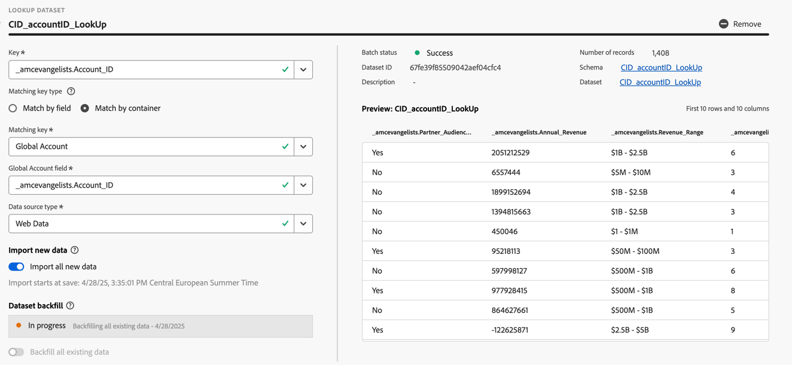
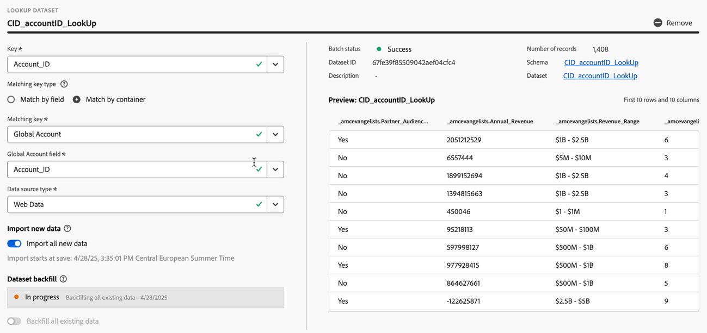

# 建立或編輯連線 {#create-or-edit-a-connection}

>[!CONTEXTUALHELP]
>id="cja_connections_recordsadded"
>title="新增的記錄"
>abstract="所選資料集在所選的時間間隔中新增至連線的記錄 (列) 數。"

>[!CONTEXTUALHELP]
>id="cja_connections_recordsskipped"
>title="略過的記錄"
>abstract="所選資料集在所選的時間間隔中於連線的資料傳輸期間略過的記錄 (列) 數。"

>[!CONTEXTUALHELP]
>id="cja_connections_recordsdeleted"
>title="刪除的記錄"
>abstract="選取的資料集在選取的時間間隔內從連線中移除的記錄 (列) 數。"

>[!CONTEXTUALHELP]
>id="cja_connection_lastadded"
>title="上次新增時間"
>abstract="從任何資料集中傳輸至連線的最後批次的時間戳記。"

>[!CONTEXTUALHELP]
>id="cja_connection_enablerollingdatawindow"
>title="啟用滾動資料時間範圍"
>abstract="在連線層級將資料保留定義為以月為單位的滾動時間範圍。"

>[!CONTEXTUALHELP]
>id="cja_connection_averagenumberofdailyuses"
>title="平均每日使用數"
>abstract="選取整個連線的預期每日事件數範圍。"

>[!CONTEXTUALHELP]
>id="connections_recordsadded"
>title="新增的記錄"
>abstract="所選資料集在所選的時間間隔中新增至連線的記錄 (列) 數。"

>[!CONTEXTUALHELP]
>id="connections_recordsskipped"
>title="略過的記錄"
>abstract="所選資料集在所選的時間間隔中於連線的資料傳輸期間略過的記錄 (列) 數。"

>[!CONTEXTUALHELP]
>id="connections_recordsdeleted"
>title="刪除的記錄"
>abstract="所選資料集在所選的時間間隔內從連線中移除的記錄 (列) 數"

>[!CONTEXTUALHELP]
>id="connection_lastadded"
>title="上次新增時間"
>abstract="從任何資料集中傳輸至連線的最後批次的時間戳記。"

>[!CONTEXTUALHELP]
>id="connection_enablerollingdatawindow"
>title="啟用滾動資料時間範圍"
>abstract="在連線層級將資料保留定義為以月為單位的滾動時間範圍。"

>[!CONTEXTUALHELP]
>id="connection_averagenumberofdailyuses"
>title="平均每日使用數"
>abstract="選取整個連線的預期每日事件數範圍。"

>[!CONTEXTUALHELP]
>id="connection_change_personid"
>title="變更人員 ID"
>abstract="變更人員 ID 會刪除連線中所有現有資料，並根據新的人員 ID 重新收錄資料集中所有資料。這個動作可能會產生成本支出。<br/><br/>當您選擇「**[!UICONTROL 繼續]**」時，報告可能會延遲，直到該程序完成為止。"

>[!CONTEXTUALHELP]
>id="connection_change_accountid"
>title="變更帳戶 ID"
>abstract="變更帳戶 ID 會刪除連線中所有現有資料，並根據新的帳戶 ID 重新收錄資料集中所有資料。這個動作可能會產生成本支出。<br/><br/>當您選擇「**[!UICONTROL 繼續]**」時，報告可能會延遲，直到該程序完成為止。"

>[!CONTEXTUALHELP]
>id="connection_change_globalaccountid"
>title="變更全域帳戶 ID"
>abstract="變更全域帳戶 ID 會刪除連線中所有現有資料，並根據新的全域帳戶 ID 重新收錄資料集中所有資料。這個動作可能會產生成本支出。<br/><br/>當您選擇「**[!UICONTROL 繼續]**」時，報告可能會延遲，直到該程序完成為止。"

>[!CONTEXTUALHELP]
>id="connection_change_opportunityid"
>title="變更機會 ID"
>abstract="變更機會 ID 會刪除連線中所有現有資料，並根據新的機會 ID 重新收錄資料集中所有資料。這個動作可能會產生成本支出。<br/><br/>當您選擇「**[!UICONTROL 繼續]**」時，報告可能會延遲，直到該程序完成為止。"

>[!CONTEXTUALHELP]
>id="connection_change_buyinggroupid"
>title="變更購買群組 ID"
>abstract="變更購買群組 ID 會刪除連線中所有現有資料，並根據新的購買群組 ID 重新收錄資料集中所有資料。這個動作可能會產生成本支出。<br/><br/>當您選擇「**[!UICONTROL 繼續]**」時，報告可能會延遲，直到該程序完成為止。"


透過輔助工作流程，建立連線和編輯工作流程體驗可將所有資料集和連線組態設定彙整到畫面中央處。它提供詳細的資料集選擇、設定和檢閱體驗。並且可讓您指定重要資訊，例如[資料集型別](#dataset-types)、大小、結構描述、資料集ID、批次狀態、回填狀態、身分等等，以降低連線設定錯誤的風險。 以下是功能概觀：

* 當您建立連線時，可以啟用滾動資料保留時間窗口。
* 您可以在連線中新增及移除資料集。 (移除資料集會將其從連線中移除，並影響任何關聯的資料檢視及基礎 Analysis Workspace 專案。)
* 您可以為每個資料集啟用及請求回填資料。
* 例如，您可以編輯資料集來請求另一次回填。
* 您可以為每個資料集匯入現有的資料。


>[!BEGINSHADEBOX]

請參閱  [建立並編輯連線](https://video.tv.adobe.com/v/343044/?quality=12&learn=on){target="_blank"}的示範影片。

>[!ENDSHADEBOX]


## 先決條件

您可以新增至連線的最大資料集數量上限為 100。該組合取決於您公司購買的 Customer Journey Analytics 套件。

如果您不確定自己擁有哪一種 Customer Journey Analytics 套件，請聯絡您的管理員。

| **選取**&#x200B;套件 | **基礎**&#x200B;套件 |
| --- | --- |
| 事件、設定檔、查詢或摘要資料集的任意組合，最多可新增100個 | 每個連線一個事件資料集 |
|  | 每個連線最多 99 個輪廓、查詢或摘要資料集 |

{style="table-layout:auto"}

## 建立連線 {#create-connection}

若要建立連線：

1. 在 Customer Journey Analytics 的頂部選單中選取「**[!UICONTROL 連線]**」，也可以自「**[!UICONTROL 資料管理]**」選取。
1. 選取「**[!UICONTROL 建立新連線]**」。

您現在可以[編輯連線的詳細資料](#edit-a-connection)。

## 編輯連線 {#edit-connection}

編輯連線的方式取決於您已授權的Customer Journey Analytics套件：

* [Customer Journey Analytics](#customer-journey-analytics)
* [Customer Journey Analytics B2B Edition](#customer-journey-analytics-b2b-edition)

### Customer Journey Analytics

在&#x200B;**[!UICONTROL 連線]** > **[!UICONTROL *連線名稱&#x200B;*]**&#x200B;畫面中：


1. 進行連線設定。

   | 設定 | 說明 |
   | --- | --- |
   | **[!UICONTROL 連線名稱]** | 為連線輸入唯一名稱。 |
   | **[!UICONTROL 連線說明]** | 說明此連線的用途。 |
   | **[!UICONTROL 標記]** | 指定標籤以將標籤新增至您的連線，以便您稍後可以使用這些標籤來搜尋連線。 |
   | **[!UICONTROL 啟用滾動資料時間窗口]** | 勾選這個核取方塊可讓您在連線層級將 Customer Journey Analytics 資料保留定義為以月為單位的滾動時段 (1 個月、3 個月、6 個月等)。<p>資料保留是以事件資料集時間戳記為基礎，僅適用於事件資料集。由於無適用的時間戳記，因此設定檔或查詢資料集不存在滾動資料時間窗口設定。不過，如果您的連線在一個或多個事件資料集之外還包含任何設定檔或查詢資料集，則會為相同時段保留該資料。<p> 主要優點在於您只會儲存或報告適用且實用的資料，並刪除不再實用的舊資料。這有助於您未超過合約限制，並減少超額使用費用的風險。<p><ul><li>如果您保留預設值 (未勾選)，Adobe Experience Platform 資料保留設定將取代保留期間。如果您在 Experience Platform 中有 25 個月的資料，Customer Journey Analytics 會透過回填取得 25 個月的資料。如果您在Experience Platform中刪除其中10個月的資料，Customer Journey Analytics則會保留剩餘15個月的資料。</li><li>如果您啟用滾動資料視窗，請在&#x200B;**[!UICONTROL 選取月數]**&#x200B;中指定您啟用滾動資料視窗的月數。 |
   | **[!UICONTROL 沙箱]** | 在Experience Platform中選擇一個沙箱，其中包含您要建立連線的資料集。<p>Adobe Experience Platform 提供的[沙箱](https://experienceleague.adobe.com/zh-hant/docs/experience-platform/sandbox/home)可將單一 Platform 執行個體分割成個別的虛擬環境，以利開發及改進數位體驗應用程式。 您可將沙箱視為內含資料集的「資料獨立單位」。沙箱可用於控制資料集的存取權限。<p>當您選取沙箱後，左側欄會顯示您可以從該沙箱提取的所有資料集。 |
   | **[!UICONTROL 新增資料集]** | 選取 **[!UICONTROL 新增資料集]**&#x200B;以新增資料集。 如果連線尚未有資料集，您也可以在資料集表格中選取&#x200B;**[!UICONTROL 新增資料集]**。 |


   對於您已設定過的資料集，資料集表格會顯示以下欄位：

   | 欄 | 說明 |
   |---|---|
   | **[!UICONTROL 資料集名稱]** | 選取一個或多個要拉進 Customer Journey Analytics 中的資料集，然後選取「**[!UICONTROL 新增]**」。<p>(如果有很多資料集可選擇，可使用資料集清單上方的「搜尋資料集」搜尋列，搜尋合適的資料集)。 |
   |  | 選取以開啟所選資料集的內容功能表。 您可以根據（型別）資料集選取：<ul><li>  **[!UICONTROL 刪除資料集]**&#x200B;至[刪除資料集](#delete-a-dataset)。</li><li> **[!UICONTROL 編輯資料集]**&#x200B;以[編輯資料集](#edit-a-dataset)。</li><li> **[!UICONTROL 過去回填]**&#x200B;以顯示資料集的[過去回填](#past-backfills)。 |
   | **[!UICONTROL 上次更新時間]** | 僅適用於事件資料集，系統會自動將此設定設為 Experience Platform 中以事件為基礎的結構描述中的預設時間戳記欄位。 「不適用」代表此資料集不含任何資料。 |
   | **[!UICONTROL 記錄數量]** | Experience Platform 中資料集的上個月記錄總數。 |
   | **[!UICONTROL 結構描述]** | 在 Adobe Experience Platform 中建立資料集所根據的[結構描述](https://experienceleague.adobe.com/zh-hant/docs/experience-platform/xdm/schema/composition)。 |
   | **[!UICONTROL 資料集類型]** | Customer Journey Analytics會針對您新增至此連線的各個資料集，根據傳入的資料自動設定[資料集型別](#dataset-types)。 有 3 種不同的資料集類型：事件資料、設定檔資料和查詢資料。 請參閱下表提供的資料集類型說明。 |
   | **[!UICONTROL 詳細程度]** | 資料集中資料的詳細程度；僅適用於摘要資料集。 |
   | **[!UICONTROL 資料來源類型]** | 資料集的資料來源類型。不適用於摘要資料集。 |
   | **[!UICONTROL 人員 ID]** | 用於支援資料集人員式報告的人員 ID。 |
   | **[!UICONTROL 索引鍵]** | 用於查詢資料集的索引鍵。 |
   | **[!UICONTROL 比對索引鍵]** | 用於查詢資料集的比對索引鍵。 |
   | **[!UICONTROL 匯入新資料]** | 資料集匯入新資料的狀態： <p>   **[!UICONTROL _x _開啟]**，若資料集設定為匯入新資料，以及<p>   **[!UICONTROL _x 關閉_]**，若資料集設定為不匯入新資料。 |
   | **[!UICONTROL 回填資料]** | 資料集的回填資料狀態。<p>   **[!UICONTROL _x _回填失敗]**，表示回填失敗次數，<p>   **[!UICONTROL _x _回填處理]**，表示處理回填的數量，<p>   **[!UICONTROL _十&#x200B;_回填完成]**，表示回填已完成的數量，以及<p>   **[!UICONTROL _關閉_]**，若未設定為回填。 |

   您可以使用欄位搜尋特定資料集。

### Customer Journey Analytics B2B Edition

[!BADGE B2B Edition]{type=Informative url="https://experienceleague.adobe.com/zh-hant/docs/analytics-platform/using/cja-overview/cja-b2b/cja-b2b-edition" newtab=true tooltip="Customer Journey Analytics B2B Edition"}

在&#x200B;**[!UICONTROL 連線]** > **[!UICONTROL *連線名稱&#x200B;*]**&#x200B;畫面中：


1. 進行連線設定。

   | 設定 | 說明 |
   | --- | --- |
   | **[!UICONTROL 連線名稱]** | 為連線輸入唯一名稱。 |
   | **[!UICONTROL 連線說明]** | 說明此連線的用途。 |
   | **[!UICONTROL 標記]** | 指定標籤以將標籤新增至您的連線，以便您稍後可以使用這些標籤來搜尋連線。 |
   | **[!UICONTROL 主要識別碼]** | 為您的連線選取正確的主要 ID： <ul><li> **[!UICONTROL 人員]**，針對您通常在B2C情境中使用的人員型連線。</li><li> 針對您通常在B2B情境中使用的帳戶型連線， **[!UICONTROL 帳戶]**。</li></ul>新增一個或多個資料集至連線後，您就無法再變更主要ID。 <br/>選取的主要ID會定義連線是以人員為基礎還是以帳戶為基礎。 連線基底決定特定資料集型別可用的[設定](#dataset-settings)。 |
   | **[!UICONTROL 選用容器]** | 如果您已選取 **[!UICONTROL 帳戶]**&#x200B;做為&#x200B;**[!UICONTROL 主要ID]**，請選取其他容器。<ul><li>**[!UICONTROL 全域帳戶]**：可以設定在連線中的全域帳戶。</li><li>**[!UICONTROL 機會]**：可以設定在連線中的機會。</li><li>**[!UICONTROL 購買群組]**：可以設定在連線中的購買群組。</li><ul> |
   | **[!UICONTROL 沙箱]** | 在Experience Platform中選擇一個沙箱，其中包含您要建立連線的資料集。<p>Adobe Experience Platform 提供的[沙箱](https://experienceleague.adobe.com/zh-hant/docs/experience-platform/sandbox/home)可將單一 Platform 執行個體分割成個別的虛擬環境，以利開發及改進數位體驗應用程式。 您可將沙箱視為內含資料集的「資料獨立單位」。沙箱可用於控制資料集的存取權限。<p>當您選取沙箱後，左側欄會顯示您可以從該沙箱提取的所有資料集。 |
   | **[!UICONTROL 啟用滾動資料時間窗口]** | 勾選這個核取方塊可讓您在連線層級將 Customer Journey Analytics 資料保留定義為以月為單位的滾動時段 (1 個月、3 個月、6 個月等)。<p>資料保留是以事件資料集時間戳記為基礎，僅適用於事件資料集。由於無適用的時間戳記，因此設定檔或查詢資料集不存在滾動資料時間窗口設定。不過，如果您的連線在一個或多個事件資料集之外還包含任何設定檔或查詢資料集，則會為相同時段保留該資料。<p> 主要優點在於您只會儲存或報告適用且實用的資料，並刪除不再實用的舊資料。這有助於您未超過合約限制，並減少超額使用費用的風險。<p><ul><li>如果您保留預設值 (未勾選)，Adobe Experience Platform 資料保留設定將取代保留期間。如果您在 Experience Platform 中有 25 個月的資料，Customer Journey Analytics 會透過回填取得 25 個月的資料。如果您在 Platform 中刪除其中 10 個月的資料，Customer Journey Analytics 則會保留剩餘 15 個月的資料。</li><li>如果您啟用滾動資料視窗，請在&#x200B;**[!UICONTROL 選取月數]**&#x200B;中指定您啟用滾動資料視窗的月數。 |
   | **[!UICONTROL 新增資料集]** | 選取 **[!UICONTROL 新增資料集]**&#x200B;至[新增資料集](#add-datasets)。 如果連線尚未有資料集，您也可以在資料集表格中選取&#x200B;**[!UICONTROL 新增資料集]**。 |


   對於您已設定過的資料集，資料集表格會顯示以下欄位：

   | 欄 | 說明 |
   |---|---|
   | **[!UICONTROL 資料集名稱]** | 選取一個或多個要拉進 Customer Journey Analytics 中的資料集，然後選取「**[!UICONTROL 新增]**」。<p>(如果有很多資料集可選擇，可使用資料集清單上方的「搜尋資料集」搜尋列，搜尋合適的資料集)。 |
   |  | 選取以開啟所選資料集的內容功能表。 您可以根據（型別）資料集選取：<ul><li>  **[!UICONTROL 刪除資料集]**&#x200B;至[刪除資料集](#delete-a-dataset)。</li><li> **[!UICONTROL 編輯資料集]**&#x200B;以[編輯資料集](#edit-a-dataset)。</li><li> **[!UICONTROL 過去回填]**&#x200B;以顯示資料集的[過去回填](#past-backfills)。 |
   | **[!UICONTROL 上次更新時間]** | 僅適用於事件資料集，系統會自動將此設定設為 Experience Platform 中以事件為基礎的結構描述中的預設時間戳記欄位。 「不適用」代表此資料集不含任何資料。 |
   | **[!UICONTROL 記錄數量]** | Experience Platform 中資料集的上個月記錄總數。 |
   | **[!UICONTROL 結構描述]** | 在 Adobe Experience Platform 中建立資料集所根據的[結構描述](https://experienceleague.adobe.com/zh-hant/docs/experience-platform/xdm/schema/composition)。 |
   | **[!UICONTROL 資料集類型]** | Customer Journey Analytics會針對您新增至此連線的各個資料集，根據傳入的資料自動設定[資料集型別](#dataset-types)。 有 3 種不同的資料集類型：事件資料、設定檔資料和查詢資料。 請參閱下表提供的資料集類型說明。 |
   | **[!UICONTROL 詳細程度]** | 資料集中資料的詳細程度；僅適用於摘要資料集。 |
   | **[!UICONTROL 資料來源類型]** | 資料集的資料來源類型。不適用於摘要資料集。 |
   | **[!UICONTROL 帳戶ID]** | （僅針對以帳戶為基礎的連線顯示）用來支援資料集以帳戶為基礎的報表的帳戶ID。 |
   | **[!UICONTROL 全域帳戶ID]** | （僅針對以帳戶為基礎的連線顯示）用來支援資料集以帳戶為基礎的報表的全域帳戶ID。 |
   | **[!UICONTROL 購買群組ID]** | （僅針對帳戶型連線顯示）用於查詢購買群組資料的購買群組ID。 |
   | **[!UICONTROL 商機ID]** | （僅針對以帳戶為基礎的連線顯示）用來查詢商機資料的商機ID。 |
   | **[!UICONTROL 人員 ID]** | 用於支援資料集人員式報告的人員 ID。 |
   | **[!UICONTROL 索引鍵]** | 用於查詢資料集的索引鍵。 |
   | **[!UICONTROL 比對索引鍵]** | 用於查詢資料集的比對索引鍵。 |
   | **[!UICONTROL 匯入新資料]** | 資料集匯入新資料的狀態： <p>   **[!UICONTROL _x _開啟]**，若資料集設定為匯入新資料，以及<p>   **[!UICONTROL _x 關閉_]**，若資料集設定為不匯入新資料。 |
   | **[!UICONTROL 回填資料]** | 資料集的回填資料狀態。<p>   **[!UICONTROL _x _回填失敗]**，表示回填失敗次數，<p>   **[!UICONTROL _x _回填處理]**，表示處理回填的數量，<p>   **[!UICONTROL _十&#x200B;_回填完成]**，表示回填已完成的數量，以及<p>   **[!UICONTROL _關閉_]**，若未設定為回填。 |

   您可以使用欄位搜尋特定資料集。

## 資料集 {#datasets}

您[新增一或多個資料集](#add-datasets)或[編輯現有的資料集](#edit-a-dataset)，做為連線工作流程的一部分。


>[!CONTEXTUALHELP]
>id="cja_connection_primaryid"
>title="主要 ID"
>abstract="為您的連線選取正確的主要 ID：B2C 情境的人員。B2B 情境適用的帳戶。"

>[!CONTEXTUALHELP]
>id="cja_connection_optionalcontainers"
>title="選用容器"
>abstract="選取其他容器。<br/><br/>**[!UICONTROL 全域帳戶&#x200B;]**：可以設定在連線中的全域帳戶。<br/>**[!UICONTROL 機會]**：可以設定在連線中的機會。<br/>**[!UICONTROL 購買群組&#x200B;]**：可以設定在連線中的購買群組。"

>[!CONTEXTUALHELP]
>id="cja_connection_accountid"
>title="帳戶 ID"
>abstract="從 Experience Platform 資料集結構描述中所定義之可用身分識別裡選取一個帳戶 ID (帳戶的唯一身分識別碼)。"

>[!CONTEXTUALHELP]
>id="cja_connection_accountfield"
>title="帳戶欄位"
>abstract="選取代表帳戶 ID (帳戶的唯一身分識別碼) 的欄位。"

>[!CONTEXTUALHELP]
>id="cja_connection_globalaccountid"
>title="全域帳戶 ID"
>abstract="從您在 Experience Platform 的資料集結構描述中定義的可用身分識別中，選取全域帳戶 ID (全域帳戶的唯一識別碼)。"

>[!CONTEXTUALHELP]
>id="cja_connection_opportunityid"
>title="機會 ID"
>abstract="從您在 Experience Platform 的資料集結構描述中定義的可用身分識別中，選取機會 ID (機會的唯一身分識別碼)。"

>[!CONTEXTUALHELP]
>id="cja_connection_buyinggroupid"
>title="購買群組 ID"
>abstract="從您在 Experience Platform 的資料集結構描述中定義的可用身分識別中，選取購買群組 ID (購買群組的唯一身分識別碼)。"

>[!CONTEXTUALHELP]
>id="cja_connection_personid"
>title="人員 ID"
>abstract="從您在 Experience Platform 的資料集結構描述中定義的可用身分識別中，選取一個人員 ID (一名人員的唯一識別碼)。"

>[!CONTEXTUALHELP]
>id="cja_connection_matchingkey"
>title="比對索引鍵類型"
>abstract="選取連結方式：根據依欄位比對或依容器比對。<br/><br/>**[!UICONTROL 依欄位比對&#x200B;]**：選取一個欄位，與其中一個事件資料集進行連結。若此清單空白，您可能尚未新增或設定事件資料集。<br/>**[!UICONTROL 依容器比對]**：選取要與其中一個事件資料集連結的容器。"

>[!CONTEXTUALHELP]
>id="cja_connection_importnewdata"
>title="匯入新資料"
>abstract="在 Experience Platform 資料集中新增的任何新批次均會自動新增至此連線中，而且可供分析使用。"

>[!CONTEXTUALHELP]
>id="cja_connection_datasetbackfill"
>title="資料集回填"
>abstract="此選項會從此連線中資料集的 Experience Platform 回填現有 (歷史) 資料。"

>[!CONTEXTUALHELP]
>id="cja_connection_transformdataset"
>title="轉換資料集"
>abstract="此選項將轉換資料集，使其可用於在 B2B 情境中進行人員型查詢。一旦開啟，資料集的轉換便無法復原。"

>[!CONTEXTUALHELP]
>id="cja_connection_connectionmap"
>title="連接圖"
>abstract="連接圖會以視覺化方式顯示事件、人員、帳戶和相關查詢資料集 (如機會、行銷活動成員等) 之間的關係。"

>[!CONTEXTUALHELP]
>id="connection_primaryid"
>title="主要 ID"
>abstract="為您的連線選取正確的主要 ID：B2C 情境的人員。B2B 情境適用的帳戶。"

>[!CONTEXTUALHELP]
>id="connection_optionalcontainers"
>title="選用容器"
>abstract="選取其他容器。<br/><br/>**[!UICONTROL 全域帳戶&#x200B;]**：可以設定在連線中的全域帳戶。<br/>**[!UICONTROL 機會]**：可以設定在連線中的機會。<br/>**[!UICONTROL 購買群組&#x200B;]**：可以設定在連線中的購買群組。"

>[!CONTEXTUALHELP]
>id="connection_personid"
>title="人員 ID"
>abstract="在 Experience Platform 中，從資料集結構描述中所定義的可用身分識別中選取人員 ID。"

>[!CONTEXTUALHELP]
>id="connection_accountid"
>title="帳戶 ID"
>abstract="從 Experience Platform 資料集結構描述中所定義之可用身分識別裡選取一個帳戶 ID (帳戶的唯一身分識別碼)。"

>[!CONTEXTUALHELP]
>id="connection_accountfield"
>title="帳戶欄位"
>abstract="選取代表帳戶 ID (帳戶的唯一身分識別碼) 的欄位。"

>[!CONTEXTUALHELP]
>id="connection_globalaccountid"
>title="全域帳戶 ID"
>abstract="從您在 Experience Platform 的資料集結構描述中定義的可用身分識別中，選取全域帳戶 ID (全域帳戶的唯一識別碼)。"

>[!CONTEXTUALHELP]
>id="connection_opportunityid"
>title="機會 ID"
>abstract="從您在 Experience Platform 的資料集結構描述中定義的可用身分識別中，選取機會 ID (機會的唯一身分識別碼)。"

>[!CONTEXTUALHELP]
>id="connection_buyinggroupid"
>title="購買群組 ID"
>abstract="從您在 Experience Platform 的資料集結構描述中定義的可用身分識別中，選取購買群組 ID (購買群組的唯一身分識別碼)。"

>[!CONTEXTUALHELP]
>id="connection_matchingkey"
>title="比對索引鍵類型"
>abstract="選取連結方式：根據依欄位比對或依容器比對。<br/><br/>**[!UICONTROL 依欄位比對&#x200B;]**：選取一個欄位，與其中一個事件資料集進行連結。若此清單空白，您可能尚未新增或設定事件資料集。<br/>**[!UICONTROL 依容器比對]**：選取要與其中一個事件資料集連結的容器。"

>[!CONTEXTUALHELP]
>id="connection_importnewdata"
>title="匯入新資料"
>abstract="在 Experience Platform 資料集中新增的任何新批次均會自動新增至此連線中，而且可供分析使用。"

>[!CONTEXTUALHELP]
>id="connection_datasetbackfill"
>title="資料集回填"
>abstract="此選項會從此連線中資料集的 Experience Platform 回填現有 (歷史) 資料。"

>[!CONTEXTUALHELP]
>id="connection_transformdataset"
>title="轉換資料集"
>abstract="此選項將轉換資料集，使其可用於在 B2B 情境中進行人員型查詢。一旦開啟，資料集的轉換便無法復原。"

>[!CONTEXTUALHELP]
>id="connection_connectionmap"
>title="連接圖"
>abstract="連接圖會以視覺化方式顯示事件、人員、帳戶和相關查詢資料集 (如機會、行銷活動成員等) 之間的關係。"

>[!CONTEXTUALHELP]
>id="connection_stitching_enable"
>title="啟用身分識別拼接"
>abstract="啟用身分識別拼接來提升此事件資料集，以利進行跨管道分析。"
>additional-url="https://experienceleague.adobe.com/zh-hant/docs/analytics-platform/using/stitching/overview" text="拼接概觀"

>[!CONTEXTUALHELP]
>id="connection_stitching_dialog"
>title="啟用身分識別拼接"
>abstract="啟用身分識別拼接，會從單一或多個資料集中推導出拼接式 ID。此過程可能包括合併來自已驗證和未驗證工作階段的使用者資料。<br/><br/>您有責任遵守適用的法律和規定。而遵守規定包括在合併資料集之前取得必要的最終使用者權限。"
>additional-url="https://experienceleague.adobe.com/zh-hant/docs/analytics-platform/using/stitching/overview" text="拼接概觀"

>[!CONTEXTUALHELP]
>id="connection_persistentid"
>title="人員 ID"
>abstract="從可用的身分識別中選取一個永久性 ID。永久性 ID 是事件資料集中所有事件皆可使用的識別碼。"
>additional-url="https://experienceleague.adobe.com/zh-hant/docs/analytics-platform/using/stitching/overview" text="拼接概觀"

>[!CONTEXTUALHELP]
>id="connection_lookbackwindow"
>title="回顧視窗"
>abstract="選取回顧時間範圍要在重播拼接中使用的適當時段。"
>additional-url="https://experienceleague.adobe.com/zh-hant/docs/analytics-platform/using/stitching/overview" text="拼接概觀"

>[!CONTEXTUALHELP]
>id="connection_namespace_map"
>title="命名空間身分識別圖"
>abstract="選取要從身分識別圖中挑選識別碼時使用的命名空間。"
>additional-url="https://experienceleague.adobe.com/zh-hant/docs/analytics-platform/using/stitching/overview" text="拼接概觀"

>[!CONTEXTUALHELP]
>id="connection_namespace_graph"
>title="命名空間身分識別圖"
>abstract="選取更新身分識別圖中的識別碼時使用的命名空間。"
>additional-url="https://experienceleague.adobe.com/zh-hant/docs/analytics-platform/using/stitching/overview" text="拼接概觀"


### 新增資料集

當您建立或編輯連線時，可以新增一或多個Experience Platform資料集。


1. 在&#x200B;**[!UICONTROL 連線]** > **[!UICONTROL _連線名稱_]**&#x200B;介面中，選取 **[!UICONTROL 新增資料集]**。

1. 在➊ **[!UICONTROL 選取資料集]**&#x200B;步驟中，您會看到Experience Platform資料集清單。

   

   對於每個資料集，清單會顯示：

   | 欄 | 說明 |
   |---|---|
   | **[!UICONTROL 資料集]** | 資料集的名稱。選取名稱即可將您導向 Experience Platform 中的資料集。選取「」可顯示含有資料集更多詳細資訊的快顯視窗。您可以選取「**[!UICONTROL 在 Platform 中編輯]**」，以直接在 Experience Platform 編輯資料集。 |
   | **[!UICONTROL 資料集類型]** | 資料集的類型：事件、輪廓、查詢或摘要。 |
   | **[!UICONTROL 記錄數量]** | Experience Platform 中資料集的上個月記錄總數。 |
   | **[!UICONTROL 結構描述]** | 資料集的結構描述。選取名稱，將您導向 Experience Platform 中的結構描述。 |
   | **[!UICONTROL 上一個批次]** | 在 Experience Platform 攝取的最後一個批次的狀態。請參閱[批次狀態](https://experienceleague.adobe.com/zh-hant/docs/experience-platform/ingestion/batch/troubleshooting#batch-states)以了解更多資訊。 |
   | **[!UICONTROL 資料集 ID]** | 資料集的 ID。 |
   | **[!UICONTROL 最後更新時間]** | 資料集的最後更新時間戳記。 |

   * 若要變更資料集清單中顯示的欄，請選取「」並選取要在「[!UICONTROL 自訂表格]」對話框中顯示的欄。
   * 要搜尋特定資料集，請使用搜尋欄位「」。
   * 要讓所選資料集切換為顯示或隱藏，請選取「」「**[!UICONTROL 隱藏已選取]**」或者「**[!UICONTROL 顯示已選取]**」。
   * 要將已選取資料集清單中的資料集刪除，請使用「」。要刪除所有已選取的資料集，請選取「**[!UICONTROL 全部清除]**」。
   * 若要顯示資料集的詳細資料，請選取。


1. 選取一或多個資料集，然後選取「**[!UICONTROL 下一步]**」。連線中必須至少包含一個事件或摘要資料集。

1. 在&#x200B;**[!UICONTROL 新增資料集]**&#x200B;對話方塊的➋ **[!UICONTROL 資料集設定]**&#x200B;步驟中，逐一設定每個所選資料集[&#128279;](#dataset-settings)的設定。

   

1. 選取&#x200B;**[!UICONTROL 新增資料集]**，將已設定的資料集新增至連線。 如果您尚未提供您要新增的每個資料集的所有必要設定，系統會通知您。

   或者，您可以選取&#x200B;**[!UICONTROL 取消]**&#x200B;以取消新增資料集到連線。 或選取&#x200B;**[!UICONTROL 上一步]**&#x200B;以回到➊ **[!UICONTROL 選取資料集]**&#x200B;步驟。


### 編輯資料集

若要編輯已針對連線設定的資料集，請在連線的&#x200B;**[!UICONTROL 連線]** > **[!UICONTROL _名稱_]**&#x200B;介面中：

1. 針對要編輯的資料集表格中所列的資料集，選取
1. 選取 **[!UICONTROL 編輯資料集]**。

1. 在&#x200B;**[!UICONTROL 編輯資料集： _資料集名稱_]**&#x200B;對話方塊中設定[資料集設定](#dataset-settings)。

   

1. 選取&#x200B;**[!UICONTROL 套用]**&#x200B;以套用資料集設定。 選取「**[!UICONTROL 取消]**」即可取消。


### 資料集設定

新增資料集或編輯現有資料集時，您需要為每個資料集設定資料集設定。 可用的設定取決於[資料集型別](#dataset-types)，對於某些資料集型別，則取決於連線型別(以人員或[!BADGE B2B edition]{type=Informative url="https://experienceleague.adobe.com/zh-hant/docs/analytics-platform/using/cja-overview/cja-b2b/cja-b2b-edition" newtab=true tooltip="Customer Journey Analytics B2B Edition"}帳戶為基礎)。

所有資料集和資料集型別都有[一般設定和詳細資料](#general-dataset-settings-and-details)，例如是否要匯入新資料以及要求回填。

#### 事件資料集

事件資料集的特定設定取決於連線型別。

##### 以個人為基礎的連線


針對以人員為基礎的連線中的事件資料集，您可以指定：

| 設定 | 說明 |
| --- | --- |
| **[!UICONTROL 個人 ID]** | 從可用身分識別的下拉式選單中選取人員ID。 這些身分識別是在Experience Platform的資料集結構中所定義。 如需如何使用身分對應作為人員ID的相關資訊，請參閱[使用身分對應作為人員ID](#id-map)。<p>如果沒有人員ID可以選擇，表示結構描述中未定義人員ID。 有關詳細資訊，請參閱[在 UI 中定義身分識別欄位](https://experienceleague.adobe.com/zh-hant/docs/experience-platform/xdm/ui/fields/identity)。 <p>所選個人 ID 的值會區分大小寫。例如，`abc123` 和 `ABC123` 是兩個不同的值。<p>如果記錄不包含您選取作為事件資料集人員ID之身分的值，則會略過記錄。 |
| **[!UICONTROL 時間戳記]** | 系統會自動將此設定設為Experience Platform中以事件為基礎的結構之預設時間戳記欄位。 |
| **[!UICONTROL 資料來源類型]** | 選取資料來源類型。資料來源型別包括： <ul><li>[!UICONTROL 網頁資料]</li><li>[!UICONTROL 行動應用程式資料]</li><li>[!UICONTROL POS 資料]</li><li>[!UICONTROL CRM 資料]</li><li>[!UICONTROL 調查資料]</li><li>[!UICONTROL 呼叫中心資料]</li><li>[!UICONTROL 產品資料]</li><li> [!UICONTROL 帳戶資料]</li><li> [!UICONTROL 交易資料]</li><li>[!UICONTROL 客戶回饋資料]</li><li> [!UICONTROL 其他]</li></ul>該欄位用於調查正在使用之資料來源的類型。 |
| **[!UICONTROL 資料來源描述]** | 當您選取其他作為資料來源型別時，資料來源的說明。 |


##### 以帳戶為基礎的連線

[!BADGE B2B Edition]{type=Informative url="https://experienceleague.adobe.com/zh-hant/docs/analytics-platform/using/cja-overview/cja-b2b/cja-b2b-edition" newtab=true tooltip="Customer Journey Analytics B2B Edition"}

對於以帳戶為基礎的連線中的事件資料集，您可以指定：


| 設定 | 說明 |
| --- | --- |
| **[!UICONTROL 帳戶ID]** | 從Experience Platform資料集結構描述中定義的可用身分中，選取全域帳戶ID （帳戶的唯一識別碼）。 適用於您已將全域帳戶作為容器新增至連線時。 <p>如果記錄不包含您選取作為事件資料集帳戶ID的身分值，則會略過該記錄。 |
| **[!UICONTROL 全域帳戶ID]** | 從Experience Platform資料集結構描述中定義的可用身分中，選取帳戶ID （帳戶的唯一識別碼）。 當您尚未將全域帳戶作為容器新增至您的連線時適用。 |
| **[!UICONTROL 商機ID]** | 從Experience Platform資料集結構描述中定義的可用身分中，選取機會ID （機會的唯一識別碼）。 |
| **[!UICONTROL 購買群組ID]** | 從Experience Platform資料集結構中定義的可用身分中，選取購買群組ID （購買群組的唯一識別碼）。 |
| **[!UICONTROL 人員 ID]** | 從可用身分識別的下拉式選單中選取人員ID。 這些身分識別是在 Experience Platform 的資料集結構描述中所定義。 如需如何使用身分對應作為人員ID的相關資訊，請參閱[使用身分對應作為人員ID](#id-map)。<p>如果沒有個人 ID 可以選擇，表示結構描述中尚未定義一或多個個人 ID。有關詳細資訊，請參閱[在 UI 中定義身分識別欄位](https://experienceleague.adobe.com/zh-hant/docs/experience-platform/xdm/ui/fields/identity)。 <p>所選個人 ID 的值會區分大小寫。例如，`abc123` 和 `ABC123` 是兩個不同的值。 |
| **[!UICONTROL 時間戳記]** | 系統會自動將此設定設為Experience Platform中以事件為基礎的結構之預設時間戳記欄位。 |
| **[!UICONTROL 資料來源類型]** | 選取資料來源類型。資料來源型別包括： <ul><li>[!UICONTROL 網頁資料]</li><li>[!UICONTROL 行動應用程式資料]</li><li>[!UICONTROL POS 資料]</li><li>[!UICONTROL CRM 資料]</li><li>[!UICONTROL 調查資料]</li><li>[!UICONTROL 呼叫中心資料]</li><li>[!UICONTROL 產品資料]</li><li> [!UICONTROL 帳戶資料]</li><li> [!UICONTROL 交易資料]</li><li>[!UICONTROL 客戶回饋資料]</li><li> [!UICONTROL 其他]</li></ul>該欄位用於調查正在使用之資料來源的類型。 |
| **[!UICONTROL 資料來源描述]** | 當您選取其他作為資料來源型別時，資料來源的說明。 |

#### 輪廓資料集

設定檔資料集的特定設定取決於連線型別。

##### 以個人為基礎的連線


對於以人員為基礎的連線中的設定檔資料集，您可以指定：

| 設定 | 說明 |
| --- | --- |
| **[!UICONTROL 個人 ID]** | 從可用身分識別的下拉式選單中選取人員ID。 這些身分識別是在Experience Platform的資料集結構中所定義。 如需如何使用身分對應作為人員ID的相關資訊，請參閱[使用身分對應作為人員ID](#id-map)。<p>如果沒有人員ID可供選擇，則結構描述中不會定義任何人員ID。 有關詳細資訊，請參閱[在 UI 中定義身分識別欄位](https://experienceleague.adobe.com/zh-hant/docs/experience-platform/xdm/ui/fields/identity)。 <p>所選個人 ID 的值會區分大小寫。例如，`abc123` 和 `ABC123` 是兩個不同的值。 <p>如果記錄不包含您選取作為設定檔資料集人員ID之身分的值，則會略過記錄。 |
| **[!UICONTROL 資料來源類型]** | 選取資料來源類型。資料來源型別包括： <ul><li>[!UICONTROL 網頁資料]</li><li>[!UICONTROL 行動應用程式資料]</li><li>[!UICONTROL POS 資料]</li><li>[!UICONTROL CRM 資料]</li><li>[!UICONTROL 調查資料]</li><li>[!UICONTROL 呼叫中心資料]</li><li>[!UICONTROL 產品資料]</li><li> [!UICONTROL 帳戶資料]</li><li> [!UICONTROL 交易資料]</li><li>[!UICONTROL 客戶回饋資料]</li><li> [!UICONTROL 其他]</li></ul>該欄位用於調查正在使用之資料來源的類型。 |
| **[!UICONTROL 資料來源描述]** | 當您選取其他作為資料來源型別時，資料來源的說明。 |

#### 以帳戶為基礎的連線


對於以帳戶為基礎的連線中的設定檔資料集，您可以指定：

| 設定 | 說明 |
| --- | --- |
| **[!UICONTROL 個人 ID]** | 從可用身分識別的下拉式選單中選取人員ID。 這些身分識別是在Experience Platform的資料集結構中所定義。 如需如何使用身分對應作為人員ID的相關資訊，請參閱[使用身分對應作為人員ID](#id-map)。<p>如果沒有人員ID可供選擇，則結構描述中不會定義任何人員ID。 有關詳細資訊，請參閱[在 UI 中定義身分識別欄位](https://experienceleague.adobe.com/zh-hant/docs/experience-platform/xdm/ui/fields/identity)。 <p>所選個人 ID 的值會區分大小寫。例如，`abc123` 和 `ABC123` 是兩個不同的值。 <p>如果記錄不包含您選取作為設定檔資料集人員ID之身分的值，則會略過記錄。 |
| **[!UICONTROL 全域帳戶欄位]** | 從可用身分識別的下拉式選單中，選取全域帳戶欄位以支援資料集的帳戶型報告。 適用於您已將全域帳戶作為容器新增至連線時。 |
| **[!UICONTROL 帳戶欄位]** | 從可用身分識別的下拉式選單中選取帳戶欄位，以支援資料集的帳戶型報表。 當您尚未將全域帳戶作為容器新增至您的連線時適用。 |
| **[!UICONTROL 資料來源類型]** | 選取資料來源類型。資料來源型別包括： <ul><li>[!UICONTROL 網頁資料]</li><li>[!UICONTROL 行動應用程式資料]</li><li>[!UICONTROL POS 資料]</li><li>[!UICONTROL CRM 資料]</li><li>[!UICONTROL 調查資料]</li><li>[!UICONTROL 呼叫中心資料]</li><li>[!UICONTROL 產品資料]</li><li> [!UICONTROL 帳戶資料]</li><li> [!UICONTROL 交易資料]</li><li>[!UICONTROL 客戶回饋資料]</li><li> [!UICONTROL 其他]</li></ul>該欄位用於調查正在使用之資料來源的類型。 |
| **[!UICONTROL 資料來源描述]** | 當您選取其他作為資料來源型別時，資料來源的說明。 |

#### 查詢資料集

查詢資料集的特定設定取決於連線型別。

##### 以個人為基礎的連線


針對以人員為基礎的連線中的查詢資料集，您可以指定：

| 設定 | 說明 |
|---|---|
| **[!UICONTROL 索引鍵]** | 用於查詢資料集的索引鍵。 <p>如果記錄不包含您為查詢資料集選取之索引鍵的值，則會略過該記錄。 |
| **[!UICONTROL 比對索引鍵]** | 要加入其中一個事件資料集的索引鍵。如果這是空白的清單，您可能尚未新增或設定事件資料集。 |
| **[!UICONTROL 資料來源類型]** | 選取資料來源類型。資料來源型別包括： <ul><li>[!UICONTROL 網頁資料]</li><li>[!UICONTROL 行動應用程式資料]</li><li>[!UICONTROL POS 資料]</li><li>[!UICONTROL CRM 資料]</li><li>[!UICONTROL 調查資料]</li><li>[!UICONTROL 呼叫中心資料]</li><li>[!UICONTROL 產品資料]</li><li> [!UICONTROL 帳戶資料]</li><li> [!UICONTROL 交易資料]</li><li>[!UICONTROL 客戶回饋資料]</li><li> [!UICONTROL 其他]</li></ul>該欄位用於調查正在使用之資料來源的類型。 |
| **[!UICONTROL 資料來源描述]** | 當您選取其他作為資料來源型別時，資料來源的說明。 |
| **[!UICONTROL 轉換資料集]** | 對於特定的 B2B 查詢資料集，您可以對適當的 B2B 人員型報告情境啟用資料集轉換。如需詳細資訊，請參閱[轉換資料集以進行 B2B 查詢](transform-datasets-b2b-lookups.md)。 |


##### 以帳戶為基礎的連線

[!BADGE B2B Edition]{type=Informative url="https://experienceleague.adobe.com/zh-hant/docs/analytics-platform/using/cja-overview/cja-b2b/cja-b2b-edition" newtab=true tooltip="Customer Journey Analytics B2B Edition"}



對於以帳戶為基礎的連線中的查詢資料集，您可以指定：

| 設定 | 說明 |
|---|---|
| **[!UICONTROL 索引鍵]** | 用於查詢資料集的索引鍵。 <p>如果記錄不包含您為查詢資料集選取之索引鍵的值，則會略過該記錄。 |
| **[!UICONTROL 相符的索引鍵型別]** | 選取如何連接資料集：根據&#x200B;**[!UICONTROL 依欄位比對]**&#x200B;或&#x200B;**[!UICONTROL 依容器比對]**。如需詳細資訊，請參閱[依欄位容器比對](/help/getting-started/cja-b2b-concepts-features.md#match-by-container-or-field)。 |
| **[!UICONTROL 比對索引鍵]** | 要加入其中一個事件資料集的索引鍵。若此清單空白，您可能尚未新增或設定事件資料集。<br/><br/>根據您選取的&#x200B;**[!UICONTROL 相符的索引鍵型別]**，選取適當的值：<ul><li>**[!UICONTROL 依欄位比對]**： <br/>從&#x200B;**[!UICONTROL 比對索引鍵]**&#x200B;下拉式功能表中選取欄位，以聯結事件資料集之一。 若此清單空白，您可能尚未新增或設定事件資料集。</li><li>**[!UICONTROL 依容器比對]**： <br/>從&#x200B;**[!UICONTROL 比對索引鍵]**&#x200B;下拉式選單中選取容器，以與其中一個事件資料集聯結。 您在設定連線時包含的容器會決定要選取的可用容器。</li></ul> |
| **[!UICONTROL 全域帳戶欄位]** | 用於帳戶型報表的全域帳戶ID。 |


#### 摘要資料集

摘要資料集的特定設定如下：

| 設定 | 說明 |
|---|---|
| **[!UICONTROL 時間戳記]** | 系統會自動將此設定設為Experience Platform中以事件為基礎的結構之預設時間戳記欄位。 |
| **[!UICONTROL 時區]** | 為時間序列摘要資料選取適當的時區。 |
| **[!UICONTROL 詳細程度]** | 代表彙總摘要資料所使用的時間範圍，目前為小時或天。 衍生自資料集中的資料。 |


#### 一般資料集設定和詳細資訊

每個（資料集型別）都有以下通用設定：

{{common-dataset-settings}}


### 重新內嵌資料

您有時需要將一或多個資料集中的資料重新擷取到連線中。 若要進行此步驟：

1. 針對您想要重新擷取資料的每個資料集：

   1. 變更下列任一專案：

      * 適用於已擷取事件資料集的識別碼（人員ID、帳戶ID或其他ID）。
      * 已內嵌設定檔或查詢資料集的索引鍵、比對索引鍵或比對索引鍵型別（欄位或容器）。

      或者，您可以切換&#x200B;**[!UICONTROL 回填資料集上的所有現有資料回填]**。

   1. **[!UICONTROL 套用]**&#x200B;資料集的變更。

1. **[!UICONTROL 儲存]**&#x200B;連線。 系統會為特定資料集重新內嵌資料。


### 刪除資料集

刪除資料集時，您會收到有關刪除可能產生的影響的通知。 刪除資料集可能會影響所有關聯的連線、資料檢視和專案。 此外，如果您刪除連線中唯一的事件或摘要資料集，系統會提示您新增另一個事件或摘要資料集。 您只能儲存包含至少一個事件或摘要資料集的連線。


### 過去的回填

當您在介面中選取 **[!UICONTROL 過去的回填]**&#x200B;時，**[!UICONTROL 過去的回填： _資料集名稱_]**&#x200B;對話方塊會顯示資料集的最新回填。

## 資料集類型 {#dataset-types}

[!UICONTROL Customer Journey Analytics] 會針對您新增至此連線的各個資料集，根據傳入的資料自動設定資料集類型。

>[!IMPORTANT]
>
>將至少一個事件或摘要資料集新增為連線的一部分。

有不同的資料集類型：[!UICONTROL 事件]資料、[!UICONTROL 輪廓]資料、[!UICONTROL 查詢]資料和[!UICONTROL 摘要]資料。

| 資料集類型 | 說明 | 時間戳記 | 結構描述 | 人員 ID <br/> 帳戶 ID [!BADGE B2B Edition]{type=Informative url="https://experienceleague.adobe.com/zh-hant/docs/analytics-platform/using/cja-overview/cja-b2b/cja-b2b-edition" newtab=true tooltip="Customer Journey Analytics B2B Edition"} |
|---|---|---|---|---|
| **[!UICONTROL 事件]** | 代表及時事件的資料。例如網站造訪、互動、交易、POS 資料、調查資料、廣告印象資料等。該資料可能是典型的點按資料流資料，包含客戶 ID 或 Cookie ID 以及時間戳記。若使用事件資料，您可以靈活地選取要將哪個 ID 當做人員 ID 使用。 | 設定為[!UICONTROL Experience Platform]中以事件為基礎的結構之預設時間戳記欄位。 | 任何以具有&#x200B;*時間序列*&#x200B;行為的XDM類別為基礎的內建或自訂結構描述。 範例包括&#x200B;*XDM體驗事件*&#x200B;或&#x200B;*XDM決定事件*。 | 您可以挑選要包含的人員ID或帳戶ID [!BADGE B2B edition]{type=Informative url="https://experienceleague.adobe.com/zh-hant/docs/analytics-platform/using/cja-overview/cja-b2b/cja-b2b-edition" newtab=true tooltip="Customer Journey Analytics B2B Edition"}。 在 Experience Platform 中定義的每個資料集結構描述，都可以擁有各自專屬的一組以身分識別命名空間定義及關聯的一個或多個身分。這些身分中的任何一個都可做為人員ID或帳戶ID [!BADGE B2B edition]{type=Informative url="https://experienceleague.adobe.com/zh-hant/docs/analytics-platform/using/cja-overview/cja-b2b/cja-b2b-edition" newtab=true tooltip="Customer Journey Analytics B2B Edition"}。 範例包括Cookie ID、拼接ID、使用者ID、追蹤代碼、帳戶ID [!BADGE B2B edition]{type=Informative url="https://experienceleague.adobe.com/zh-hant/docs/analytics-platform/using/cja-overview/cja-b2b/cja-b2b-edition" newtab=true tooltip="Customer Journey Analytics B2B Edition"}等。 |
| **[!UICONTROL 查詢]** | 您可以新增資料集做為所有資料集類型中的查詢欄位：輪廓、查詢和事件資料集 (始終支援後者)。這項附加功能擴展了 Customer Journey Analytics 的功能，以支援複雜的資料模型，包括 B2B。此資料用於尋找在事件、輪廓或查詢資料中找到的值或索引鍵。您最多可以新增兩個查詢層級。(請注意，[衍生欄位](/help/data-views/derived-fields/derived-fields.md)無法用作連線內查詢的比對索引鍵。) 例如，您可能會上傳將事件資料中的數值 ID 對應至產品名稱的查詢資料。有關範例，請參閱「[B2B 範例](/help/use-cases/b2b/example.md)」。 | 不適用 | 除&#x200B;*XDM個別設定檔*&#x200B;類別外，任何以具有&#x200B;*記錄*&#x200B;行為的XDM類別為基礎的內建或自訂結構描述。 | 不適用 |
| **[!UICONTROL 輪廓]** | [!UICONTROL 事件]資料中，套用至您帳戶、人員、使用者或客戶的資料。例如，您可上傳有關客戶的 CRM 資料。 | 不適用 | 任何以&#x200B;*XDM個別設定檔*&#x200B;類別為基礎的內建或自訂結構描述。 | 您可以挑選要包含的人員ID /帳戶ID [!BADGE B2B edition]{type=Informative url="https://experienceleague.adobe.com/zh-hant/docs/analytics-platform/using/cja-overview/cja-b2b/cja-b2b-edition" newtab=true tooltip="Customer Journey Analytics B2B Edition"}。 [!DNL Experience Platform] 中定義的每個資料集，除了摘要資料集以外，皆有其專屬的一組已定義之一個或多個人員 ID 或帳戶 ID [!BADGE B2B Edition]{type=Informative url="https://experienceleague.adobe.com/zh-hant/docs/analytics-platform/using/cja-overview/cja-b2b/cja-b2b-edition" newtab=true tooltip="Customer Journey Analytics B2B Edition"}。例如Cookie ID、拼接ID、使用者ID、追蹤代碼、帳戶ID等。<br>**請注意**：如果您建立的連線包含具有不同 ID 的資料集，報告會反映出這一點。若要合併資料集，您需要使用相同的人員 ID 或帳戶 ID [!BADGE B2B Edition]{type=Informative url="https://experienceleague.adobe.com/zh-hant/docs/analytics-platform/using/cja-overview/cja-b2b/cja-b2b-edition" newtab=true tooltip="Customer Journey Analytics B2B Edition"}。 |
| **摘要** | 未關聯至個人識別碼的時間序列資料。 摘要資料代表不同彙總等級的彙總資料，例如行銷活動。您可以在 Customer Journey Analytics 中使用此資料來支援各種使用案例。如需詳細資訊，請參閱[摘要資料](/help/data-views/summary-data.md)。 | 自動設定為Experience Platform中以事件為基礎的摘要度量結構中的預設時間戳記欄位。 僅支援每小時或每日粒度。 | 任何以&#x200B;*XDM摘要量度*&#x200B;類別為基礎的內建或自訂結構描述。 | 不適用 |

## 連線預覽 {#preview}

若要預覽您已建立的連線，請在「連線設定」對話框中選取「 **[!UICONTROL 連線預覽]**」。


此預覽包含列出連線設定的一些欄。顯示的欄類型取決於您的個別資料集。


## 連線圖

若要查看您連線中資料集之間的關係圖，請在「連線設定」對話框中選取「 **[!UICONTROL 連線圖]**」。


此地圖可協助您更清楚瞭解您如何定義連線，並使用容器和識別碼來設定事件、設定檔、查詢和摘要資料集之間的關係。


## 使用數值欄位做為查閱鍵和查閱值 {#numeric}

如果您想將成本或邊界等數值欄位新增到字串鍵欄位，此查詢功能會很實用。它允許數值做為查閱的一部分，當成鍵或值。 在您的查閱結構描述中，您可能會有繫結到 (舉例來說) 您的產品名稱、COGS、行銷活動行銷成本或利潤等的數值。 以下是 Adobe Experience Platform 中的查閱結構描述範例：


系統現在支援將這些值當做量度或維度引進 Customer Journey Analytics 報告中。當您設定連線並提取查閱資料集時，可以編輯資料集以選取[!UICONTROL 「索引鍵」]和[!UICONTROL 「相符的索引鍵」]：


當您根據此連線設定資料檢視時，您會將數值作為元件新增到資料檢視中。 然後，任何根據此資料檢視的項目都可以報告這些數值。

## 以「身分識別對應」作為人員 ID {#id-map}

Customer Journey Analytics 支援以「身分識別對應」作為人員 ID。 「身分對應」是一種可讓您上傳索引鍵值組的對應資料結構。 索引鍵是身分命名空間，值是保存身分識別值的結構。 「身分識別對應」存在於每個上傳的列/事件，並會相應填入每一列。

只要資料集所使用的結構屬於 [ExperienceEvent XDM](https://experienceleague.adobe.com/zh-hant/docs/experience-platform/xdm/home) 類別，一律適用「身分識別對應」。 當您選擇要在 Customer Journey Analytics 連線中包含這類資料集，您就可以選擇使用一個欄位作為主要 ID，也可以使用「身分識別對應」：


如果您選取「身分識別對應」，系統會提供另外兩個設定選項：

| 選項 | 說明 |
|---|---|
| **[!UICONTROL 使用主要 ID 命名空間]** | 這選項會指示 Customer Journey Analytics 在標示 `primary=true` 屬性的「身分對應」中尋找身分識別，並且使用該身分識別作為該列的人員 ID。此身分識別是在 Experience Platform 中劃分資料的主要索引鍵，此外，此身分識別也是Customer Journey Analytics人員ID的主要候選專案(取決於Customer Journey Analytics連線中資料集的設定方式)。 |
| **[!UICONTROL 命名空間]** | (當您未使用主要 ID 命名空間時，才能使用此選項) 身分命名空間是 [Experience Platform 身分服務](https://experienceleague.adobe.com/zh-hant/docs/experience-platform/identity/features/namespaces)的元件。命名空間是作為身分識別相關內容的指標。如果您指定命名空間，Customer Journey Analytics 會針對此命名空間索引鍵搜尋每一列的「身分對應」，並使用該命名空間底下的身分識別，作為該列的人員 ID。由於Customer Journey Analytics無法執行涵蓋所有列的完整資料集掃描來判斷哪些名稱空間存在，因此下拉式選單中會顯示所有可能的名稱空間。 了解資料中指定了哪些命名空間；系統不會自動偵測這些命名空間。 |

{style="table-layout:auto"}

### 「身分識別對應」邊緣案例 {#id-map-edge}

下表提供邊緣案例出現時的兩個設定選項及其處理方式：

| 選項 | 「身分識別對應」中沒有 ID | 多個 ID，沒有一個標示為主要 | 多個 ID 標示為主要 | 單一 ID，不一定標示為主要 | ID 標示為主要的無效命名空間 |
|---|---|---|---|---|---|
| **[!UICONTROL 已勾選「使用主要 ID 命名空間」]** | Customer Journey Analytics 會刪除該列。 | Customer Journey Analytics 會刪除該列，因為未指定主要 ID。 | 系統會擷取所有命名空間下標示為主要的 ID，彙整成清單，並依字母排序；重新排序後，系統會將第一個命名空間的第一個 ID 視為人員 ID。 | 做為人員 ID 的單一 ID。 | 即使命名空間可能無效 (不存在於 Adobe Experience Platform 中)，Customer Journey Analytics 也會使用該命名空間下的主要 ID 做為人員 ID。 |
| 已選取&#x200B;**[!UICONTROL 特定「身分識別對應」命名空間]** | Customer Journey Analytics 會刪除該列。 | 系統會擷取您所選命名空間下的所有 ID，彙整成清單，並將第一個 ID 視為人員 ID。 | 系統會擷取您所選命名空間下的所有 ID，彙整成清單，並將第一個 ID 視為人員 ID。 | 系統會擷取您所選命名空間下的所有 ID，彙整成清單，並將第一個 ID 視為人員 ID。 | 系統會擷取您所選命名空間下的所有 ID，彙整成清單，並將第一個 ID 視為人員 ID。 (建立連線時只能選取有效的命名空間，因此不可能使用無效的命名空間/ID 作為人員 ID)。 |

{style="table-layout:auto"}

## 計算每日事件平均數量 {#average-number}

連線中的每個資料集都要完成這項計算。

1. 前往 [Adobe Experience Platform Query Services](https://experienceleague.adobe.com/zh-hant/docs/experience-platform/query/home)，並建立查詢。

   查詢如下所示：

   ```
   Select AVG(A.total_events) from (Select DISTINCT COUNT (*) as total_events, date(TIMESTAMP) from analytics_demo_data GROUP BY 2 Having total_events>0) A;
   ```

   在此範例中，「analytics_demo_data」是資料集名稱。

2. 若要顯示 Adobe Experience Platform 中的所有資料集，請執行 `Show Tables` 查詢。


## 大型查詢資料集的演算法修剪

在建立連線時，可以新增大型資料集以進行查詢。例如代表產品目錄的資料集，以便在建立報告和視覺效果時查詢描述性的產品資訊。如此大的查詢資料集可能會超過目前以護欄方式實施的最大 1000 萬個唯一查詢，導致跳過其他的資料。

您可以要求對大型查詢資料集進行演算法修剪。此演算法修剪僅保留查詢資料集中與事件資料集內索引鍵相符的資料。這樣，您便不需要載入整個未修剪的查詢資料集。舊的或不常用的項目被刪除，這可能會對報告產生輕微影響，但會帶來顯著的好處。該演算法會回顧 90 天並每週更新。

請聯絡您的 Adob&#x200B;&#x200B;e 支援團隊，取得更多資訊並啟用此功能。


>[!MORELIKETHIS]
>
>部落格：[如何在 Adobe Customer Journey Analytics 中善用事件、查詢和輪廓資料集](https://experienceleaguecommunities.adobe.com/t5/adobe-analytics-blogs/how-to-leverage-event-lookup-and-profile-datasets-in-adobe/ba-p/681478)


