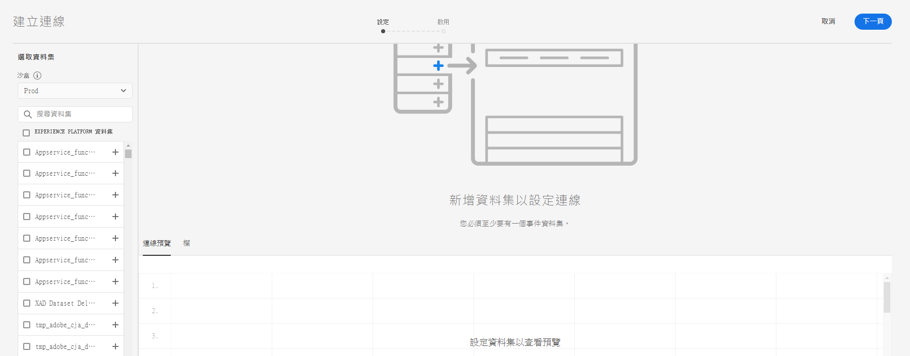
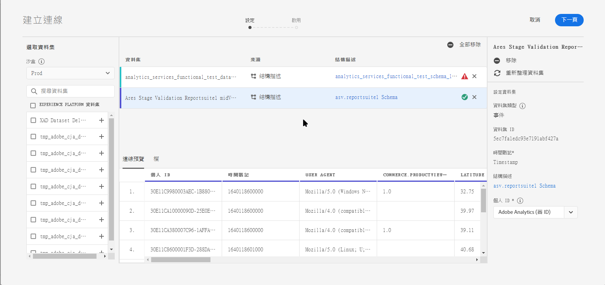
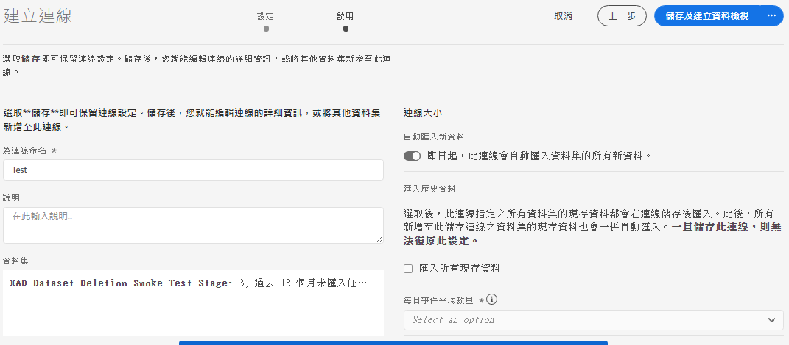

# 建立連線

連線可讓您將資料集從 [!DNL Adobe Experience Platform] 整合到[!UICONTROL 工作區]。若要針對 [!DNL Experience Platform] 資料集製作報表，必須先為 [!DNL Experience Platform] 和[!UICONTROL 工作區]的資料集建立連線。

按一下[這裡](https://docs.adobe.com/content/help/en/platform-learn/tutorials/cja/connecting-customer-journey-analytics-to-data-sources-in-platform.html)，觀看概觀影片。

>[!IMPORTANT]
>
>您可以將多個 [!DNL Experience Platform] 資料集合併為單一連線。

## 選取沙箱和資料集

1. 請前往 [https://analytics.adobe.com](https://analytics.adobe.com)。

1. 按一下&#x200B;**[!UICONTROL 「連線」]**&#x200B;索引標籤。

1. 按一下右上方的&#x200B;**[!UICONTROL 「建立新連結」]**。

   

1. 在 Experience Platform 中，選擇您要連線之資料集所屬的沙箱。

   Adobe Experience Platform 提供的[沙箱](https://docs.adobe.com/content/help/zh-Hant/experience-platform/sandbox/home.html)可將單一 Platform 例項分割成個別的虛擬環境，以利開發及改進數位體驗應用程式。您可將沙箱視為內含資料集的「資料獨立單位」。沙箱可用於控制資料集的存取權限，選取沙箱後，左側欄會顯示您可以從該沙箱提取的所有資料集。

   >[!IMPORTANT]
   >
   >您無法一次存取多個沙箱內的資料。也就是說，您只能合併位於同一個沙箱中的資料集。

1. 選取一或多個要拉進 [!UICONTROL Customer Journey Analytics] 的資料集，然後按一下&#x200B;**[!UICONTROL 「新增」]**。

   (如果有很多資料集可選擇，可使用資料集清單上方的&#x200B;**[!UICONTROL 「搜尋資料集」]**&#x200B;搜尋列，搜尋合適的資料集)。

## 設定資料集

現在您可以在右側設定您所新增的資料集。

1. **[!UICONTROL 資料集類型]**：[!UICONTROL Customer Journey Analytics] 會針對您新增至此連線的各個資料集，根據傳入的資料自動設定資料集類型。

   有 3 種不同的資料集類型：[!UICONTROL 事件]資料、[!UICONTROL 設定檔]資料、[!UICONTROL 查找]資料。

   | 資料集類型 | 說明 | 時間戳記 | 結構 | 人員 ID |
   |---|---|---|---|---|
   | [!UICONTROL 事件] | 代表及時事件的資料 (例如網站造訪、互動、交易、POS 資料、調查資料、廣告曝光數資料等)。例如，這可能是典型的點按資料流資料，包含客戶 ID 或 Cookie ID 以及時間戳記。若使用事件資料，您可以靈活選擇將哪個 ID 當作人員 ID 使用。 | 系統會自動設定為 [!UICONTROL Experience Platform] 中以事件為基礎的結構之預設時間戳記欄位。 | 任何以具有「時間系列」行為的 XDM 類別為依據的內建或自訂結構。例如「XDM 體驗事件」或「XDM 決策事件」。 | 您可以挑選要包含的人員 ID。在 Experience Platform 中定義的每個資料集結構，都可以有各自專屬的一組一或多個已定義且與身分識別命名空間相關聯的身分。其中任何一個都可當作人員 ID 使用。範例包括 Cookie ID、拼接 ID、使用者 ID、追蹤代碼等。 |
   | [!UICONTROL 查找] | (類似傳統 Adobe Analytics 中的「分類」檔案）。此資料用於查找在事件或設定檔資料中找到的值或索引鍵。例如，您可以上傳將事件資料中的數值 ID 對應至產品名稱的查找資料。如需範例，請參閱[此使用案例](/help/use-cases/b2b.md)。 | 不適用 | 除「XDM 個別設定檔」類別外，任何以具有「記錄」行為的 XDM 類別為基礎的內建或自訂結構。 | 不適用 |
   | [!UICONTROL 設定檔] | 類似於[!UICONTROL 「客戶屬性」] - 用於非變更和非臨時屬性。套用至[!UICONTROL 事件]資料中訪客、使用者或客戶的資料。例如，您可上傳有關客戶的 CRM 資料。 | 不適用 | 任何以「XDM 個別設定檔」類別為基礎的內建或自訂模式。 | 您可以挑選要包含的人員 ID。在 [!DNL Experience Platform] 中定義的每個資料集，都有各自專屬的一組一或多個已定義的人員 ID，例如 Cookie ID、拼接 ID、使用者 ID、追蹤代碼等。 **請注意**：如果您建立的連線包含具有不同 ID 的資料集，報表會反映出這一點。若要確實合併資料集，您需要使用相同的人員 ID。 |

1. **[!UICONTROL 資料集 ID]**：此 ID 會自動產生。

1. **[!UICONTROL 時間戳記]**：僅適用於事件資料集，系統會自動將此設定設為 [!UICONTROL Experience Platform] 中以事件為基礎的結構之預設時間戳記欄位。

1. **[!UICONTROL 結構]**：這是在 Adobe Experience Platform 中建立資料集時所依據的[結構](https://docs.adobe.com/content/help/zh-Hant/experience-platform/xdm/schema/composition.html)。

1. **[!UICONTROL 人員 ID]**：您可從可用身分識別的下拉式清單中選取人員 ID。這些身分識別是在 Experience Platform 的資料集結構中所定義。若要了解如何以「身分對應」作為人員 ID，請參閱以下說明。

   >[!IMPORTANT]
   >
   >如果沒有人員 ID 可以選擇，表示結構中尚未定義一或多個人員 ID。[這部影片](https://youtu.be/G_ttmGl_LRU)會說明如何在 Experience Platform 中定義身分識別。

1. 按&#x200B;**[!UICONTROL 「下一步」]**，前往[!UICONTROL 「啟用連線」]對話框。

### 以「身分對應」作為人員 ID

Customer Journey Analytics 現在可支援以「身分對應」作為人員 ID。「身分對應」是一種允許使用者上傳索引鍵/值組的對應資料結構。索引鍵是身分識別命名空間，值是保存身分識別值的結構。「身分對應」存在於每個上傳的列/事件，並會相應填入每一列。

只要資料集所使用的結構屬於 [ExperienceEvent XDM](https://docs.adobe.com/content/help/zh-Hant/experience-platform/xdm/home.html) 類別，一律適用「身分對應」。當您選擇要在 CJA 連線中包含這類資料集，您就可以選擇使用一個欄位作為主要 ID，也可以使用「身分對應」：

如果您選取「身分對應」，系統會提供另外兩個設定選項：

| 選項 | 說明 |
|---|---|
| [!UICONTROL 使用主要 ID 命名空間] | 這會指示 CJA 在標示 primary=true 屬性的「身分對應」中逐列尋找身分識別，作為該列的人員 ID。也就是說，這會是在 Experience Platform 中劃分資料的主要索引鍵，也是 CJA 訪客 ID 的主要候選項目 (取決於 CJA 連線的資料集設定方式)。 |
| [!UICONTROL 命名空間] | (未使用「主要 ID 命名空間」時，才能使用此選項)身分識別命名空間是 [Adobe Experience Platform Identity Service](https://docs.adobe.com/content/help/zh-Hant/experience-platform/identity/namespaces.html) 的元件，用途是作為身分識別相關內容的指標。如果您指定命名空間，CJA 會針對此命名空間索引鍵搜尋每一列的「身分對應」，並使用該命名空間底下的身分識別，作為該列的人員 ID。請注意，CJA 無法執行涵蓋所有列的完整資料集掃描，據以判斷哪些命名空間實際存在，下拉式清單會列出所有可能的命名空間。您需知道資料中指定的命名空間，系統無法自動偵測。 |

### 「身分對應」邊緣案例

下表提供邊緣案例出現時的兩個設定選項及其處理方式：

| 選項 | 「身分對應」中沒有 ID | 沒有 ID 標示為主要 | 多個 ID 標示為主要 | 單一 ID 標示為主要 | 標示為主要的 ID 具有無效的命名空間 |
|---|---|---|---|---|---|
| **已勾選「使用主要 ID 命名空間」** | CJA 會捨棄該列。 | 未指定主要 ID，CJA 會捨棄該列。 | 系統會擷取所有命名空間下標示為主要的 ID，彙整成清單，並依字母排序；重新排序後，系統會將第一個命名空間的第一個 ID 視為人員 ID。 | 以標示為主要的單一 ID 作為人員 ID。 | 即使命名空間可能無效 (不在 AEP 中)，CJA 仍會以該命名空間下的主要 ID 作為人員 ID。 |
| **已選取特定「身分對應」命名空間** | CJA 會捨棄該列。 | 系統會擷取您所選命名空間下的所有 ID，彙整成清單，並將第一個 ID 視為人員 ID。 | 系統會擷取您所選命名空間下的所有 ID，彙整成清單，並將第一個 ID 視為人員 ID。 | 系統會擷取您所選命名空間下的所有 ID，彙整成清單，並將第一個 ID 視為人員 ID。 | 系統會擷取您所選命名空間下的所有 ID，彙整成清單，並將第一個 ID 視為人員 ID。(建立連線時只能選取有效的命名空間，因此不可能使用無效的命名空間/ID 作為人員 ID)。 |

## 啟用連線

1. 若要啟用連線，請定義下列設定：

   | 選項 | 說明 |
   |---|---|
   | [!UICONTROL 連線名稱] | 為連線提供說明名稱。無法儲存無名稱的連線。 |
   | [!UICONTROL 說明] | 新增更多詳細資訊，以便區分此連線與其他連線。 |
   | [!UICONTROL 資料集] | 此連線中包含的資料集。 |
   | [!UICONTROL 從今天開始，自動匯入此連線的所有新資料集。] | 如果要建立持續連線，請選擇此選項，如此一來，新增到此連線中資料集的任何新資料批次，都會自動彙整至]工作區[!UICONTROL 。 |
   | [!UICONTROL 匯入所有現有資料] | 選擇此選項並儲存連線時，此連線中所有資料集來自 [!DNL Experience Platform] 的所有現有 (歷史) 資料都會匯入。日後若有任何新資料集新增至這個已儲存的連線，其所有現有歷史資料也會自動匯入。 **請注意，一旦儲存此連線，便無法變更這項設定。** |

   **請記住：**

   * 如果連線中所有資料集的歷史資料累積大小超過 15 億列，便會出現一則錯誤訊息，說明無法匯入此數量的歷史資料。但是，如果您要新增包含 10 億列歷史資料的資料集並匯入了這些資料，一週之後再新增另一個相同大小的資料集並匯入其歷史資料，這麼做行得通。
   * 系統會為連線中新增的新資料排定優先順序，因此這些資料的延遲最低。
   * 任何回填（歷史）資料的匯入速率會較慢（最多13個月的資料，不論大小）。

1. 按一下&#x200B;**[!UICONTROL 「儲存」]**。

工作流程的下一步是[建立資料檢視](/help/data-views/create-dataview.md)。
