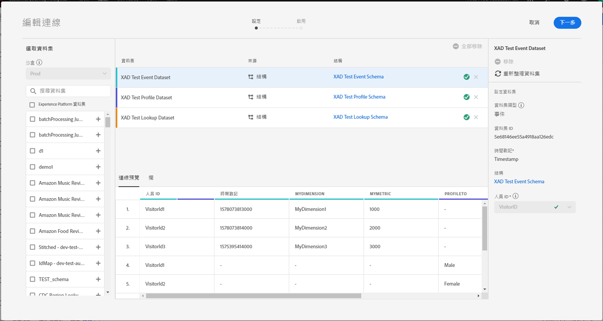
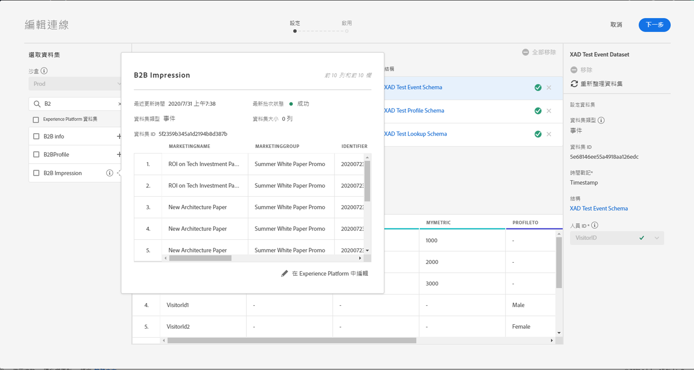
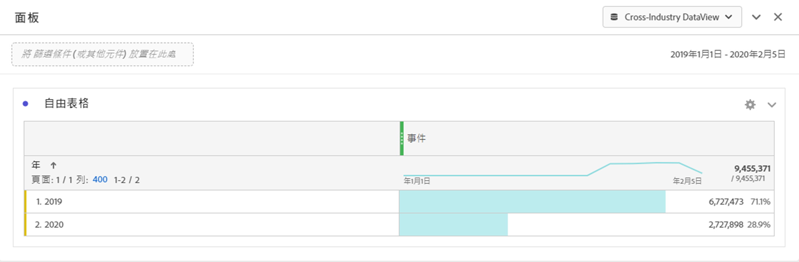
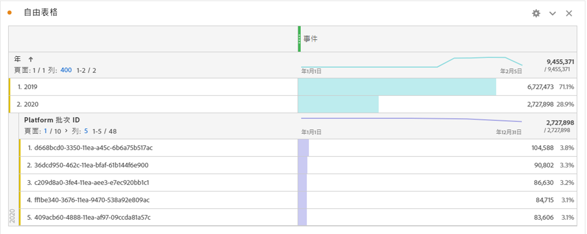

# 估計連接大小

您可能需要知道[!UICONTROL 客戶歷程分析]中目前有多少列資料。 本主題的目的是示範如何報告[!UICONTROL 客戶歷程分析]目前的帳單用途。

1. 在[!UICONTROL 客戶歷程分析]中，按一下&#x200B;**[!UICONTROL 連線]**&#x200B;標籤。
1. 在[!UICONTROL 編輯連接]螢幕上，選擇要確定其使用／連接大小的連接。

   

1. 從左側欄選取屬於您連線的資料集。 在本例中，它是「B2B印象」資料集。

   

1. 按一下其名稱旁的藍色(i)圖示（資訊）。 您會注意到資料集有3.8k列／事件。 此外，若需確切的列數，請按一下預覽表格下方的「在Experience Platform中編輯」。 ****&#x200B;這會將您重新導向至[!UICONTROL Adobe Experience Platform]中的資料集。

   

1. 請注意，此資料集的&#x200B;**[!UICONTROL 總記錄]**&#x200B;總計為3.83k記錄，資料大小為388.59 KB。

1. 對連接中的其他資料集重複步驟1-5，並添加記錄／行數。 最終的匯總數字將是您連線的使用量度，這是您要從[!UICONTROL Adobe Experience Platform]收錄的連線資料集列數。

## 確定收錄的行數

實際在CJA中攝取的事件數取決於您的連線設定。 此外，如果您選取的人員ID錯誤，或者如果此ID無法用於資料集中的某些列，則[!UICONTROL 客戶歷程分析]將忽略這些列。 這樣，您就可以在儲存連線後，找出所收集的實際事件列。

1. 儲存連線後，請建立相同連線的資料檢視，不需任何篩選。
1. 建立工作區專案並選取正確的資料檢視。 建立自由表格，並拖放具有&#x200B;**[!UICONTROL Year]**&#x200B;維度的&#x200B;**[!UICONTROL Events]**&#x200B;量度。 從日期選擇日曆中選擇最大日期範圍。 這可讓您查看收錄至[!UICONTROL 客戶歷程分析]的事件數。

   

   >[!NOTE]
   >
   >這可讓您查看從事件資料集擷取的事件數。 它不包含描述檔和查閱類型資料集。 請依照描述檔和查閱資料集的步驟1-3，並新增數字，以取得此連線的事件總數。

## 除錯差異

您可能注意到所擷取的事件總數為&quot;7650&quot;，但連線在AEP中只有事件資料集&quot;B2B印象&quot;和&quot;3830列&quot;。 為什麼會有差異？ 讓我們進行一些調試。

1. 依&#x200B;**[!UICONTROL 平台資料集ID]**&#x200B;劃分此維度，您會發現兩個大小相同但不同&#x200B;**[!UICONTROL 平台資料集ID]**&#x200B;的資料集。 每個資料集有3825個記錄。 這表示[!UICONTROL 客戶歷程分析]因遺失人員ID或BAVID（大訪客ID）而忽略5個記錄：

   

1. 此外，如果我們登入[!UICONTROL Adobe Experience Platform]，則沒有Id為「5f21c12b732044194bffc1d0」的資料集，因此當建立初始連線時，有人會從[!UICONTROL Adobe Experience Platform]刪除此特定資料集…… 之後，它又新增至[!UICONTROL 客戶歷程分析]，但是由[!UICONTROL Adobe Experience Platform]產生不同的[!UICONTROL 平台資料集ID]。

   閱讀[!UICONTROL 客戶歷程分析]和[!UICONTROL Adobe Experience Platform]中資料集和連線刪除[的涵義。](https://experienceleague.adobe.com/docs/analytics-platform/using/cja-overview/cja-faq.html?lang=en#implications-of-deleting-data-components)