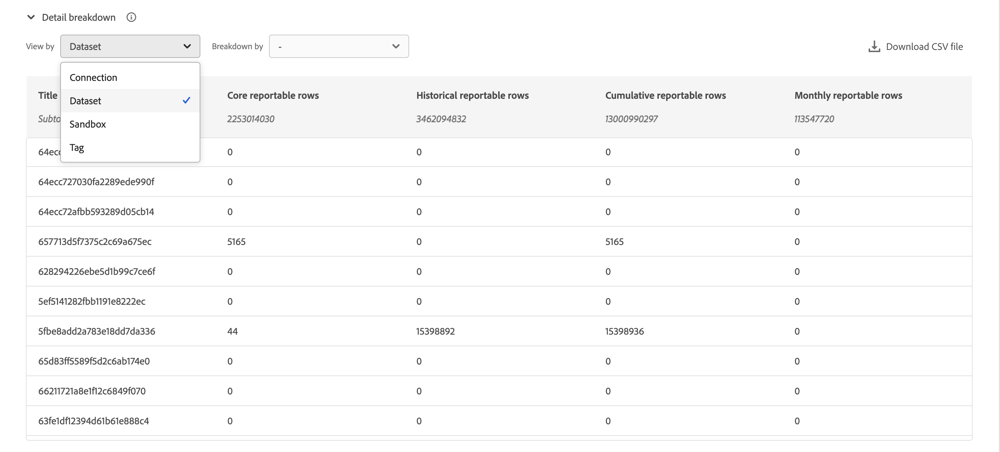

# 管理連線

一旦您[建立或編輯一或多個連線](/help/connections/create-connection.md)，您就可以在&#x200B;**[!UICONTROL 連線]**&#x200B;中管理連線。 連線可讓您：

* 檢視您的所有連線總覽，包括擁有者、沙箱以及連線的建立和修改時間。
* 編輯連線。
* 刪除連線。
* 從連線建立資料檢視。
* 檢視連線中的所有資料集。
* 檢查連線資料集的狀態和擷取程式的狀態。 例如，您的資料何時可用，以便從Analysis Workspace的報告與分析開始。
* 識別因設定錯誤所導致的任何資料差異。 您是否有遺漏任何資料列？如果有的話，遺漏了哪些資料列以及為什麼遺漏？ 您是否將連線設定錯誤並導致Customer Journey Analytics中資料遺失？
* 深入瞭解所有連線中使用已擷取及可報告資料列的情況。

[!UICONTROL 連線]有兩個介面： [[!UICONTROL 清單]](#list)和[[!UICONTROL 使用狀況]](#usage)。

## 清單

[!UICONTROL List]介面是Connections的預設介面。 如果未選取，請選取&#x200B;**[!UICONTROL 清單]**&#x200B;索引標籤以存取介面。

[!UICONTROL List]介面會顯示所有可用連線的表格。 您可以使用搜尋方塊來快速搜尋連線。

表格中有以下欄或圖示。

| 欄或圖示 | 說明 |
| --- | --- |
| [!UICONTROL 名稱] | 連線的易記名稱。 若要檢視連線的詳細資訊，請選取超連結的名稱。 請參閱[連線詳細資料](#connection-details)。 |
|  | 若要檢視有關[!UICONTROL 包含的資料集]、[!UICONTROL 沙箱]、[!UICONTROL 所有者]等專案的資訊，請選取連線名稱旁的。
快顯視窗會顯示詳細資訊。 
 |
|  | 若要[建立連線的資料檢視](#create-a-data-view)，請選取。 只有在尚未有任何資料檢視與連線相關聯時，此圖示才會顯示。 |
|  | 選取以： 
 [編輯](#edit-a-connection)連線。
 [刪除](#delete-a-connection)連線。
 [建立新的資料檢視](#create-a-data-view)。 為連線建立其他資料檢視。 |
| [!UICONTROL 資料集] | 連線中資料集的一個或多個連結。 您可以選取資料集超連結來檢視連線中的資料集。 如果選取的連線中有更多資料集，請選取&#x200B;**[!UICONTROL +*x*更多]**&#x200B;以顯示&#x200B;**[!UICONTROL 包含的資料集]**&#x200B;面板。 此面板會顯示所有資料集的連結，以及搜尋屬於連線之特定資料集的選項。

選取資料集名稱后，系統會在新索引標籤的Experience Platform UI中開啟資料集。 |
| [!UICONTROL 沙箱] | 此連線從中提取其資料集的[Experience Platform沙箱](https://experienceleague.adobe.com/zh-hant/docs/experience-platform/sandbox/home)。 當您初次建立連線時，就會選取這個沙箱。 此沙箱無法變更。 |
| [!UICONTROL 所有者] | 建立連線的人。 |
| [!UICONTROL 匯入新資料] | 為資料集匯入新資料的狀態： 
)    設定為匯入新資料的資料集的&#x200B;**[!UICONTROL _x _On]**，以及
   未設定為匯入新資料的資料集有&#x200B;**[!UICONTROL _x關閉_]**。 |
| [!UICONTROL 建立日期] | 建立連線時的時間戳記。 |
| [!UICONTROL 上次修改日期] | 上次更新連線時的時間戳記。 |
| [!UICONTROL 回填資料] | 跨資料集的回填資料狀態。
   **[!UICONTROL _x _個回填失敗]**資料集間失敗的回填數，
   **[!UICONTROL _x _個回填正在處理]**跨資料集的處理回填數目，
   資料集已完成回填數的&#x200B;**[!UICONTROL _x _個回填已完成]**，以及
   **[!UICONTROL _關閉_]**，以防連線中的資料集未定義回填。 |

若要設定要顯示哪些欄，請選取，這會顯示&#x200B;**自訂表格**&#x200B;對話方塊，讓您開啟或關閉表格中的欄。

### 編輯連線

1. 選取連線名稱旁的
1. 從內容功能表選取 **[!UICONTROL 編輯]**。

或者，您可以：

1. 選取連線列。

1. 從藍色列選取 **[!UICONTROL 編輯]**。

編輯連線時，您可以：

* 開始和停止匯入新資料。
* 為連線重新命名。
* 重新整理資料集。
* 從連線移除資料集

如需詳細資訊，請參閱[建立或編輯連線](create-connection.md)。

### 刪除連線 {#connections-delete}

1. 選取連線名稱旁的。
1. 選取 **[!UICONTROL 刪除]**。

或者，您可以：

1. 選取連線列。

1. 從藍色列中選取 **[!UICONTROL 刪除]**。

當您刪除連線時，**[!UICONTROL 刪除連線]**&#x200B;面板會指出哪些資料檢視已刪除，以及哪些工作區專案會受到影響。

選取&#x200B;**[!UICONTROL 繼續]**&#x200B;以刪除連線。

如需有關刪除連線的詳細資訊，請參閱[刪除關聯](/help/technotes/deletion.md)。

### 建立連線的資料檢視

* 如果沒有資料檢視與連線相關聯：

   1. 選取連線名稱旁的。

* 如果已為連線建立一或多個資料檢視：

   1. 選取連線名稱旁的。
   1. 選取 **[!UICONTROL 建立新的資料檢視]**。

或者，您可以：

1. 選取連線列。

1. 從藍色按鈕列選取 **[!UICONTROL 建立資料檢視]**。

如需詳細資訊，請參閱[建立或編輯資料檢視](/help/data-views/create-dataview.md)。

### 連線詳細資料 {#connection-detail}

若要移至連線的詳細資訊，請在連線表格中選取連線名稱。

連線詳細資訊介面提供連線狀態的詳細檢視。 您可以：

* 檢查連線的資料集及擷取程序的狀態。
* 識別可能導致略過或刪除記錄的設定問題。
* 了解資料何時可用來報告。

| 使用者介面 | 說明 |
| --- | --- |
|  [!UICONTROL 編輯連線] | 若要編輯連線的詳細資料，請選取 **[!UICONTROL 編輯連線]**。 如需詳細資訊，請參閱[建立或編輯連線](create-connection.md)。 |
| 資料集選擇器 | 可讓您選擇連線中的一個或所有資料集。 您無法多重選取資料集。 預設為「[!UICONTROL 所有資料集]」。 |
| 日期範圍選擇器 | 編輯開始日期、結束日期，或選取以開啟日期範圍選取器。 在日期範圍選取器中，使用預先定義的期間之一（例如&#x200B;**[!UICONTROL 最近6個月]**）來選取日期範圍，或使用日曆來選取開始和結束日期。 選取&#x200B;**[!UICONTROL 套用]**&#x200B;以套用新的日期範圍。 |
| [!UICONTROL 可用的事件資料記錄] | 可用於報告的事件資料集列總數，整個連線&#x200B;**為**。 此計數與任何行事曆設定皆無關。 如果您從資料集選擇器選取資料集，或在表格中選取資料集，則計數會變更。 新增資料後，會延遲1-2小時讓資料出現在報告中。 |
| [!UICONTROL 量度] | 彙總已新增、略過和刪除的事件、查詢、設定檔和摘要資料集記錄，以及新增的批次數量。 這些量度是根據&#x200B;**您選取的資料集和日期範圍**。
選取&#x200B;**[!UICONTROL 檢查詳細資料]**&#x200B;以顯示&#x200B;**[!UICONTROL 檢查略過的詳細資料]**&#x200B;快顯視窗。 快顯視窗會列出略過的記錄數，以及所有事件資料集或所選資料集的原因。

選取包含更多資訊的快顯視窗。 由於某些略過的原因，例如[!UICONTROL 空白的訪客ID]，快顯視窗會顯示EQS的範例PSQL (查詢服務的Experience Platform)，您可以在[查詢服務](https://experienceleague.adobe.com/zh-hant/docs/experience-platform/query/home)中使用以查詢資料集中略過的記錄。 選取 **[!UICONTROL 複製EQS的範例PSQL]**&#x200B;以複製SQL。 |
| [!UICONTROL 新增的記錄] | 指出在選取的時段內，針對您選取的資料集和日期範圍&#x200B;**新增了多少列。**&#x200B;每 10 分鐘更新一次。 |
| [!UICONTROL 略過的記錄] | 針對您選取的資料集和日期範圍&#x200B;**，指出在選取的時段內已略過多少列。**&#x200B;略過記錄的原因包括：遺漏時間戳記、遺漏或無效的個人ID等。 每 10 分鐘更新一次。 
無效的個人ID （例如`undefined`或`00000000`，或[!UICONTROL 個人ID]中任何數字與字母的組合，在指定月份中出現的次數超過100萬次）是無法歸因於任何特定使用者或個人的ID。 這些列無法擷取到系統中，並導致容易出錯的擷取和報告。 若要修正無效的人員 ID，請選擇下列 3 種方法：<ul><li>使用[拼接](/help/stitching/overview.md)以有效的使用者ID填入未定義或全零的使用者ID。</li><li>將使用者ID留空，在擷取期間這些使用者ID會遭截斷（偏好使用無效或全零的使用者ID）。</li><li>在擷取資料之前，請先修正系統中任何無效的使用者 ID。</li></ul> |
| [!UICONTROL 筆記錄]已刪除 | 針對&#x200B;**資料集以及您選取的日期範圍**&#x200B;指示在所選的時段內刪除了多少列。 例如，可能有人已刪除[!DNL Experience Platform]中的資料集。 每 10 分鐘更新一次。
在某些情況下，此值還可以包含取代的記錄，例如拼接或某些查詢資料集更新。 請參考此範例：
<ul><li>您上傳一筆記錄到XDM個別設定檔資料集，Customer Journey Analytics會將其設定為擷取為設定檔查詢資料。 在連線詳細資料中，此資料集將顯示已新增1筆記錄。</li><li>您將原始記錄的副本上傳到同一個AEP資料集，該資料集現在包含兩個記錄。 Customer Journey Analytics會從設定檔查詢資料集中擷取其他記錄。 Customer Journey Analytics發現其已擷取該人員ID的連線設定檔記錄，會刪除其舊版，並新增新的設定檔資料。 在連線詳細資料中，此動作將代表1筆新增記錄和1筆刪除記錄，因為Customer Journey Analytics只會保留任何內嵌人員ID的最新設定檔查詢資料。</li><li>AEP資料集總共包含兩個剛好相同的記錄。 另外，Customer Journey Analytics連線詳細資料會顯示其擷取資料的狀態：為此設定檔資料集新增了2筆記錄並刪除1筆記錄。 </li></ul> |
|  _搜尋資料集名稱或識別碼_ | 資料集搜尋欄位。 您可以依資料集名稱或[!UICONTROL 資料集ID]來搜尋資料集表格。 |
| [!UICONTROL 資料集資料表] | 屬於連線之一部分的資料集。 |
| [!UICONTROL 資料集] | 屬於連線之一部分的資料集名稱。 您可以選取超連結，在新標籤中在Experience Platform UI中開啟資料集。 您可以選取列或核取方塊，僅顯示所選資料集的詳細資訊。 |
| [!UICONTROL 資料集 ID] | 由Experience Platform自動產生。 |
| [!UICONTROL 新增的記錄] | 在選取的時間間隔內新增到連線的資料集記錄（列）數。 |
| [!UICONTROL 略過的記錄] | 在選取的時間間隔內，資料傳輸期間為連線略過的資料集記錄（列）數。 |
| [!UICONTROL 刪除的記錄] | 在選取的時間間隔內，從連線中移除的資料集記錄（列）數。 |
| [!UICONTROL 批次已新增] | 已新增到連線的資料集批次數量。 |
| [!UICONTROL 上次新增時間] | 來自資料集（已新增至連線）的最新批次時間戳記。 |
| [!UICONTROL 資料來源類型] | 資料集的來源型別。 建立連線時，您可以定義來源型別。 |
| [!UICONTROL 資料集類型] | 此資料集的資料集型別。 型別可以是[!UICONTROL 事件]、[!UICONTROL 設定檔]、[!UICONTROL 查詢]或[!UICONTROL 摘要]。 [了解更多](https://experienceleague.adobe.com/en/docs/analytics-platform/using/cja-connections/create-connection) |
| 結構描述 | 資料集所根據的Experience Platform結構描述。 |
| [!UICONTROL 匯入新資料] | 為資料集匯入新資料的狀態： 
   **[!UICONTROL _x _On]**（如果資料集已設定為匯入新資料），並且
   **[!UICONTROL _x關閉_]** （如果資料集已設定為不匯入新的資料匯入）。 |
| [!UICONTROL 轉換資料] | 適用的B2B查詢資料集的轉換狀態。 請參閱[轉換資料集以進行 B2B 查詢](transform-datasets-b2b-lookups.md)，了解更多資訊。
   **[!UICONTROL _x _On]**用於啟用轉換的適用資料集， 
   未啟用轉換的適用資料集有&#x200B;**[!UICONTROL _x關閉_]**，並且
所有其他資料集的&#x200B;**[!UICONTROL N/A]**，不適用於轉換。 |
| [!UICONTROL 回填資料] | 資料集的回填資料狀態。
   **[!UICONTROL _x _個回填失敗]**因為回填失敗的數目，
   **[!UICONTROL _x _個正在處理]**個處理回填的回填，
   已完成&#x200B;**[!UICONTROL _x _個回填]**個回填已完成，以及
   未設定回填時&#x200B;**[!UICONTROL _關閉_]**。 |
| [!UICONTROL 匯入新資料] | 為資料集匯入新資料的狀態： 
   **[!UICONTROL _x _On]**（如果資料集已設定為匯入新資料），並且
   **[!UICONTROL _x關閉_]** （如果資料集已設定為不匯入新資料）。 |
| [!UICONTROL 回填資料] | 資料集的回填資料狀態。
   **[!UICONTROL _x _個回填失敗]**因為回填失敗的數目，
   **[!UICONTROL _x _個正在處理]**個處理回填的回填，
   已完成&#x200B;**[!UICONTROL _x _個回填]**個回填已完成，以及
   **[!UICONTROL _關閉_]**，以防未設定回填。 |

>[!IMPORTANT]
>
>2021年8月13日之前擷取的任何資料都不會反映在[!UICONTROL 連線]介面中。

#### 「連線」面板

在資料集表格中未選取資料集時，「連線」介面右側的面板會顯示連線選項和詳細資訊。

| 選項 | 說明 |
| --- | --- |
|  [!UICONTROL 重新整理] | 若要重新整理連線並允許反映最近新增的記錄，請選取 **[!UICONTROL 重新整理]**。 |
| **[!UICONTROL 刪除]** | [刪除](#delete-a-connection)此連線。 |
|  **[!UICONTROL 建立資料檢視]** | [根據此連線建立資料檢視](#create-a-data-view)。 如需詳細資訊，請參閱[資料檢視](https://experienceleague.adobe.com/en/docs/analytics-platform/using/cja-dataviews/data-views)。 |
| [!UICONTROL 連線名稱] | 連線的易記名稱。 |
| [!UICONTROL 連線說明] | 更詳細的說明，說明此連線的用途。 |
| [!UICONTROL 沙箱] | 此連線從中提取其資料集的[Experience Platform沙箱](https://experienceleague.adobe.com/zh-hant/docs/experience-platform/sandbox/home)。當您初次建立連線時，就會選取這個沙箱。 此沙箱無法變更。 |
| [!UICONTROL 連線 ID] | 此ID會在Experience Platform中產生。 您可以使用來複製識別碼。 |
| [!UICONTROL 使用連線的資料檢視] | 列出所有使用此連線的資料檢視。 |
| [!UICONTROL 匯入新資料] | 為資料集匯入新資料的狀態： 
   **[!UICONTROL _x _On]**有多少資料集已設定為匯入新資料，以及
   **[!UICONTROL _x關閉_]**&#x200B;關閉了多少資料集的新資料匯入。 |
| [!UICONTROL 回填資料] | 資料集的回填資料狀態。
   **[!UICONTROL _x _個回填失敗]**資料集間失敗的回填數，
   **[!UICONTROL _x _個回填正在處理]**跨資料集的處理回填數目，
   資料集已完成回填數的&#x200B;**[!UICONTROL _x _個回填已完成]**，以及
   **[!UICONTROL _關閉_]**，以防連線中的資料集未定義回填。 |
| 轉換資料 | 適用的B2B查詢資料集的轉換狀態。 請參閱[轉換資料集以進行 B2B 查詢](transform-datasets-b2b-lookups.md)，了解更多資訊。
   **[!UICONTROL _x _On]**啟用轉換的資料集數目。 |
| [!UICONTROL 建立者] | 建立連線的使用者名稱。 |
| [!UICONTROL 上次修改日期] | 上次變更連線的時間戳記。 |
| [!UICONTROL 上次修改者] | 上次修改連線的人員。 |

#### 資料集面板

在資料集表格中選取資料集時，「連線」介面右側的面板會顯示所選資料集的詳細資訊。

| 詳細資料 | 說明 |
| --- | --- |
| [!UICONTROL 人員 ID] | 在Experience Platform的資料集結構描述中定義的身分。 此身分識別是您在建立連線時所選取的人員ID。 如果您建立的連線包含具有不同ID的資料集，報表會反映這一點。 若要合併資料集，您必須在資料集中使用相同的人員ID。 |
| [!UICONTROL 索引鍵] | 您為查詢資料集指定的金鑰。 |
| [!UICONTROL 比對索引鍵] | 您為查詢資料集指定的相符索引鍵。 |
| [!UICONTROL 時間戳記] | 為事件資料集定義的時間戳記。 |
| [!UICONTROL 可用記錄] | 在透過行事曆選取的特定時段中，為此資料集擷取的總列數。 在新增資料後，資料會立即出現在報告中，不需要等候。 但是，當您建立全新的連線時，會有[延遲](https://experienceleague.adobe.com/en/docs/analytics-platform/using/cja-overview/cja-faq)。 |
| [!UICONTROL 新增的記錄] | 在選取的時段內新增了多少列。 |
| [!UICONTROL 刪除的記錄] | 在選取的時段內刪除了多少記錄。 |
| [!UICONTROL 批次已新增] | 已將多少資料批次新增到這個資料集內。 |
| [!UICONTROL 略過的記錄] | 在選取的時段內擷取資料時，略過了多少列。
略過記錄的原因包括：遺漏時間戳記、遺漏或無效的個人ID等。 每 10 分鐘更新一次。
無效的個人ID （例如`undefined`或`00000000`，或[!UICONTROL 個人ID]中任何數字與字母的組合，在指定月份中出現的次數超過100萬次）是無法歸因於任何特定使用者或個人的ID。 這些列無法擷取到系統中，並導致容易出錯的擷取和報告。 若要修正無效的人員 ID，請選擇下列 3 種方法：<ul><li>使用[拼接](/help/stitching/overview.md)以有效的使用者ID填入未定義或全零的使用者ID。</li><li>將使用者ID留空，在擷取期間會略過該使用者ID （偏好使用無效或全零的使用者ID）。</li><li>在擷取資料之前，請先修正系統中任何無效的使用者 ID。</li></ul> |
| [!UICONTROL 上次新增時間] | 上次新增批次的時間戳記。 |
| [!UICONTROL 匯入新資料] | 為資料集匯入新資料的狀態： 
   **[!UICONTROL _x _On]**（如果資料集已設定為匯入新資料），並且
   **[!UICONTROL _x關閉_]** （如果資料集已設定為不匯入新資料）。 |
| [!UICONTROL 回填資料] | 資料集的回填資料狀態。
   **[!UICONTROL _x _個回填失敗]**因為回填失敗的數目，
   **[!UICONTROL _x _個正在處理]**個處理回填的回填，
   已完成&#x200B;**[!UICONTROL _x _個回填]**個回填已完成，以及
   **[!UICONTROL _關閉_]**，以防未設定回填。
若要顯示對話方塊以概覽資料集過去的回填，請選取「 」  **[!UICONTROL 過去的回填]**。 |
| [!UICONTROL 資料來源類型] | 將資料集新增至連線時所定義的資料來源型別。 |
| [!UICONTROL 資料集類型] | [!UICONTROL 事件]、[!UICONTROL 設定檔]、[!UICONTROL 查詢]或[!UICONTROL 摘要]。 [了解更多](https://experienceleague.adobe.com/en/docs/analytics-platform/using/cja-connections/create-connection) |
| [!UICONTROL 結構描述] | 此資料集所根據的Experience Platform結構描述。 |
| [!UICONTROL 資料集 ID] | 此資料集ID會在Experience Platform中產生。 |

## 使用情況 {#connections-usage}

<!-- markdownlint-disable MD034 -->

>[!CONTEXTUALHELP]
>id="cja_connections_usage_keyusagemetrics"
>title="關鍵使用情況量度"
>abstract="提供核心和歷史可報告列數的每月資料和總資料。"
<!-- markdownlint-enable MD034 -->

<!-- markdownlint-disable MD034 -->

>[!CONTEXTUALHELP]
>id="cja_connections_usage_monthlyingestedrows"
>title="每月攝取列數"
>abstract="測量每月新增至系統的記錄總數，以提供對資料增長和攝取率的深入分析。"
<!-- markdownlint-enable MD034 -->

<!-- markdownlint-disable MD034 -->

>[!CONTEXTUALHELP]
>id="cja_connections_usage_monthlyreportablerows"
>title="每月可報告列數"
>abstract="追蹤可供報告的列數。可報告列數是指已攝取的列數減去攝取期間略過和刪除的列數。可報告列數是計費和資料使用情況的關鍵量度。"
<!-- markdownlint-enable MD034 -->

<!-- markdownlint-disable MD034 -->

>[!CONTEXTUALHELP]
>id="cja_connections_usage_detailbreakdown"
>title="詳細劃分"
>abstract="您可以依據連線、資料集、沙箱和標記來檢視詳細量度，並且可選擇下載資料的 CSV 檔案。"
<!-- markdownlint-enable MD034 -->

<!-- markdownlint-disable MD034 -->

>[!CONTEXTUALHELP]
>id="cja_connections_usage_otherdatasets"
>title="其他資料集"
>abstract="2024 年 9 月之前的數月在資料集層級收集資料，且為了提高清晰度，該資料顯示為「*其他資料集*」。從 2024 年 9 月開始在粒度資料集層級收集資料，*其他資料集*&#x200B;將不再顯示。"
<!-- markdownlint-enable MD034 -->

<!-- markdownlint-disable MD034 -->

>[!CONTEXTUALHELP]
>id="cja_connections_usage_unknowndatasetsorconnections"
>title="未知的資料集或連線"
>abstract="未知的資料集或連線使用其 ID 顯示。"
<!-- markdownlint-enable MD034 -->

<!-- markdownlint-disable MD034 -->

>[!CONTEXTUALHELP]
>id="cja_connections_usage_datanotavailable"
>title="資料無法使用"
>abstract="由於系統限制，無法取得 2024 年 9 月之前的歷史資料。從 2024 年 9 月起收集和顯示量度。此圖表在時間軸上顯示過去 18 個月，而取得可用資料之後將會顯示未來的資料。"
<!-- markdownlint-enable MD034 -->

<!-- markdownlint-disable MD034 -->

>[!CONTEXTUALHELP]
>id="cja_connections_corereportablerows"
>title="核心可報告列數"
>abstract="顯示過去 13 個月的可用總列數。例如，在 2024 年 2 月 1 日，此數字顯示事件時間戳記從 2023 年 1 月到 2024 年 1 月的可用總列數。"
<!-- markdownlint-enable MD034 -->

<!-- markdownlint-disable MD034 -->

>[!CONTEXTUALHELP]
>id="cja_connections_historicalreportablerows"
>title="歷史可報告列數"
>abstract="顯示超過 13 個月以前可用的總列數。例如，在 2024 年 2 月 1 日，此數字顯示事件時間戳記早於 2023 年 1 月的可用總列數。"

<!-- markdownlint-enable MD034 -->

<!-- markdownlint-disable MD034 -->

>[!CONTEXTUALHELP]
>id="connections_usage_keyusagemetrics"
>title="關鍵使用情況量度"
>abstract="提供核心和歷史可報告列數的每月資料和總資料。"
<!-- markdownlint-enable MD034 -->

<!-- markdownlint-disable MD034 -->

>[!CONTEXTUALHELP]
>id="connections_usage_monthlyingestedrows"
>title="每月攝取列數"
>abstract="測量每月新增至系統的記錄總數，以提供對資料增長和攝取率的深入分析。"
<!-- markdownlint-enable MD034 -->

<!-- markdownlint-disable MD034 -->

>[!CONTEXTUALHELP]
>id="connections_usage_monthlyreportablerows"
>title="每月可報告列數"
>abstract="追蹤可供報告的列數。可報告列數是指已攝取的列數減去攝取期間略過和刪除的列數。可報告列數是計費和資料使用情況的關鍵量度。"
<!-- markdownlint-enable MD034 -->

<!-- markdownlint-disable MD034 -->

>[!CONTEXTUALHELP]
>id="connections_usage_detailbreakdown"
>title="詳細劃分"
>abstract="您可以依據連線、資料集、沙箱和標記來檢視詳細量度，並且可選擇下載資料的 CSV 檔案。"
<!-- markdownlint-enable MD034 -->

<!-- markdownlint-disable MD034 -->

>[!CONTEXTUALHELP]
>id="connections_usage_otherdatasets"
>title="其他資料集"
>abstract="2024 年 9 月之前的數月在資料集層級收集資料，且為了提高清晰度，該資料顯示為「*其他資料集*」。從 2024 年 9 月開始在粒度資料集層級收集資料，*其他資料集*&#x200B;將不再顯示。"
<!-- markdownlint-enable MD034 -->

<!-- markdownlint-disable MD034 -->

>[!CONTEXTUALHELP]
>id="connections_usage_unknowndatasetsorconnections"
>title="未知的資料集或連線"
>abstract="未知的資料集或連線使用其 ID 顯示。"
<!-- markdownlint-enable MD034 -->

<!-- markdownlint-disable MD034 -->

>[!CONTEXTUALHELP]
>id="connections_usage_datanotavailable"
>title="資料無法使用"
>abstract="由於系統限制，無法取得 2024 年 9 月之前的歷史資料。從 2024 年 9 月起收集和顯示量度。此圖表在時間軸上顯示過去 18 個月，而取得可用資料之後將會顯示未來的資料。"
<!-- markdownlint-enable MD034 -->

<!-- markdownlint-disable MD034 -->

>[!CONTEXTUALHELP]
>id="connections_corereportablerows"
>title="核心可報告列數"
>abstract="顯示過去 13 個月的可用總列數。例如，在 2024 年 2 月 1 日，此數字顯示事件時間戳記從 2023 年 1 月到 2024 年 1 月的可用總列數。"
<!-- markdownlint-enable MD034 -->

<!-- markdownlint-disable MD034 -->

>[!CONTEXTUALHELP]
>id="connections_historicalreportablerows"
>title="歷史可報告列數"
>abstract="顯示超過 13 個月以前可用的總列數。例如，在 2024 年 2 月 1 日，此數字顯示事件時間戳記早於 2023 年 1 月的可用總列數。"

<!-- markdownlint-enable MD034 -->

<!-- markdownlint-disable MD034 -->

>[!CONTEXTUALHELP]
>id="connections_breakdown_corereportablerows"
>title="核心可報告列數"
>abstract="核心可報告列是快照值，而非彙總總計。 這些值會根據所選日期範圍中的最後一個月動態更新。 如果客戶選取1月至3月，則值將反映3月的快照。"

>[!CONTEXTUALHELP]
>id="connections_breakdown_historicalreportablerows"
>title="歷史可報告列數"
>abstract="歷史可報告列是快照值，而非彙總總計。 這些值會根據所選日期範圍中的最後一個月動態更新。 如果客戶選取1月至3月，則值將反映3月的快照。"

>[!CONTEXTUALHELP]
>id="connections_breakdown_cumulativereportablerows"
>title="累計可報告的列"
>abstract="累積可報告列是快照值，而不是彙總總計。 這些值會根據所選日期範圍中的最後一個月動態更新。 如果客戶選取1月至3月，則值將反映3月的快照。"

<!-- markdownlint-enable MD034 -->

[!UICONTROL Usage]介面會顯示所有連線中擷取及可報告資料列的使用情形。 如果未選取，請選取&#x200B;**[!UICONTROL 使用方式]**&#x200B;索引標籤以存取介面。

此介面可支援您判斷您的Customer Journey Analytics使用方式是否符合合約所議定的內容。 除了監控用途以外，您也可以使用「使用情況」介面來規劃Customer Journey Analytics授權續約。

「使用情況」介面會使用下列量度

| 量度名稱 | 說明 |
|---|---|
| 歷史可報告列數 | 超過13個月的期間列數。 |
| 核心可報告列數 | 過去13個月的列數。 |
| 攝取的列 | 特定期間擷取了多少列。 |
| 可報告的列 | 在特定時段內，您有多少列資料屬於連線。 |
| 累積列 | 到特定月份為止，擷取了多少列。 |

>[!NOTE]
>
>系統會從2024年7月起，針對核心、歷史和總計記錄收集資料。 如需舊版歷史資料，請洽詢您的客戶經理。
>

「使用方式」介麵包含兩個面板：

* **[!UICONTROL 金鑰使用量度]**&#x200B;面板：提供核心和歷史資料可報告列。 面板也會追蹤核心和歷史資料列與上個月相比的百分比變更。

  該面板會顯示在視覺效果中：

   * **[!UICONTROL 可報告的核心資料列]**。

     您在過去13個月內有多少可報告列。 摘要數字是上個月的核心可報告列數（例如741M） （例如2024年12月）。

   * **[!UICONTROL 歷史資料可報告資料列]**。

     在超過13個月的期間中有多少可報告列。 摘要數字是上個月（例如2024年12月）的歷史可報告列數（例如127M）。

  當您將滑鼠游標停留在視覺效果中的任何棧疊長條圖上時，快顯視窗會顯示該長條圖特定部分的列數（例如）。

  

* 顯示下列三個子面板的組合面板：

+++ 攝取的列

  **[!UICONTROL 擷取的列]**&#x200B;子面板會測量每月新增到系統的記錄總數，提供資料成長與擷取率的深入分析。 子面板提供本月總擷取列數和上個月變更的摘要。

  

  您可以將滑鼠停留在視覺效果中的資料點上，以顯示包含更多詳細資訊的快顯視窗。

+++

+++ 可報告的列

  **[!UICONTROL 可報告列]**&#x200B;視覺效果會從擷取的列減去略過和刪除的列，以作為計費和資料使用的關鍵量度，藉此追蹤可用於報告的列數。 子面板提供兩個摘要：

   * **[!UICONTROL 上個月總計]**：截至本月為止可報告資料列總數的摘要。
   * **[!UICONTROL 本月]**：本月可報告列總數及上個月變更的摘要。

  

  您可以將滑鼠停留在視覺效果中的資料點上，以顯示包含更多詳細資訊的快顯視窗。

+++

+++ 詳細劃分

  您可以使用&#x200B;**[!UICONTROL 詳細資料劃分]**&#x200B;表格，依連線、資料集、沙箱和標籤來檢視詳細的量度。 資料集是使用ID而非名稱來報告，因為資料集名稱可以在報告期間修改。 使用id回報未知的資料集或連線。

  2024 年 9 月之前的數月在資料集層級收集資料，且為了提高清晰度，該資料顯示為「[!UICONTROL 其他資料集]」。從2024年9月開始，資料會在精細資料集層級收集，而[!UICONTROL 其他資料集]將不再出現。

   * 若要變更劃分，請選取&#x200B;**[!UICONTROL 檢視依據]**&#x200B;和&#x200B;**[!UICONTROL 劃分依據]**&#x200B;的組合。

     | **[!UICONTROL 檢視者]**&#x200B;選項 | **[!UICONTROL 劃分依據]**&#x200B;選項 |
     |---|---|
     | **[!UICONTROL 連線]** | **[!UICONTROL -]**&#x200B;和&#x200B;**[!UICONTROL 資料集]** |
     | **[!UICONTROL 資料集]** | **[!UICONTROL -]** |
     | **[!UICONTROL 沙箱]** | **[!UICONTROL 連線]** |
     | **[!UICONTROL 標記]** | **[!UICONTROL 連線]** |

  

+++

  您可以定義要報告的&#x200B;**[!UICONTROL 時間範圍]** （以月為單位）。 使用選取時間範圍。

>[!MORELIKETHIS]
>
>[檢視、疑難排解及修改連線設定](https://experienceleague.adobe.com/en/docs/customer-journey-analytics-learn/tutorials/connections/connections-details-experience-in-cja)教學課程。
