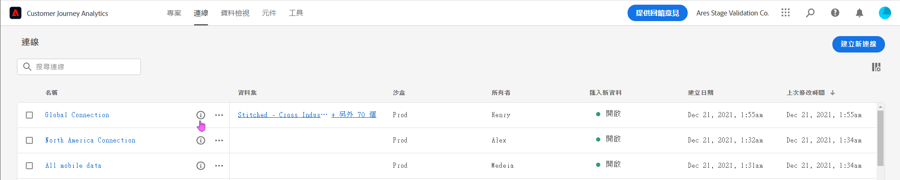
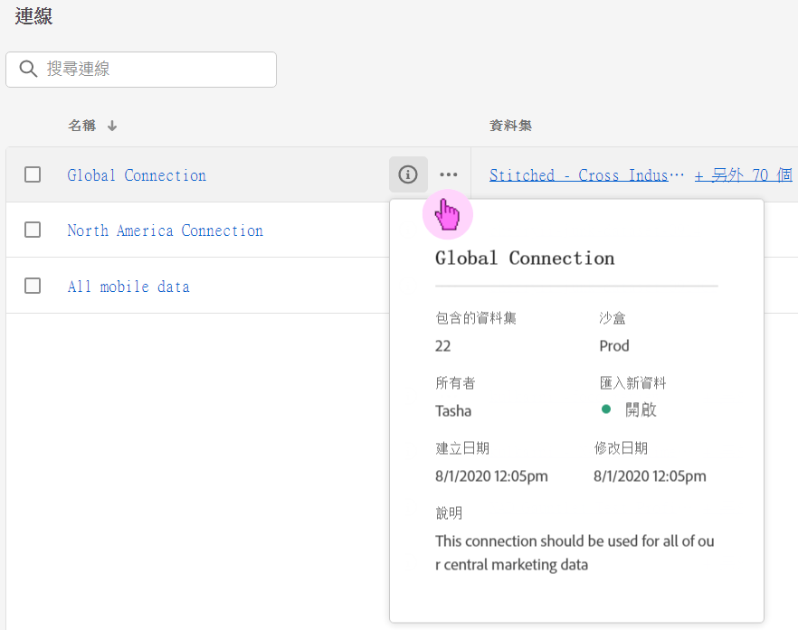
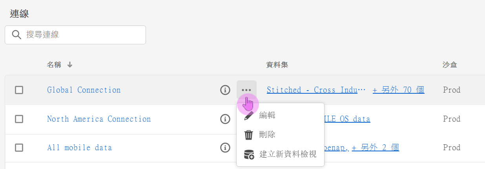
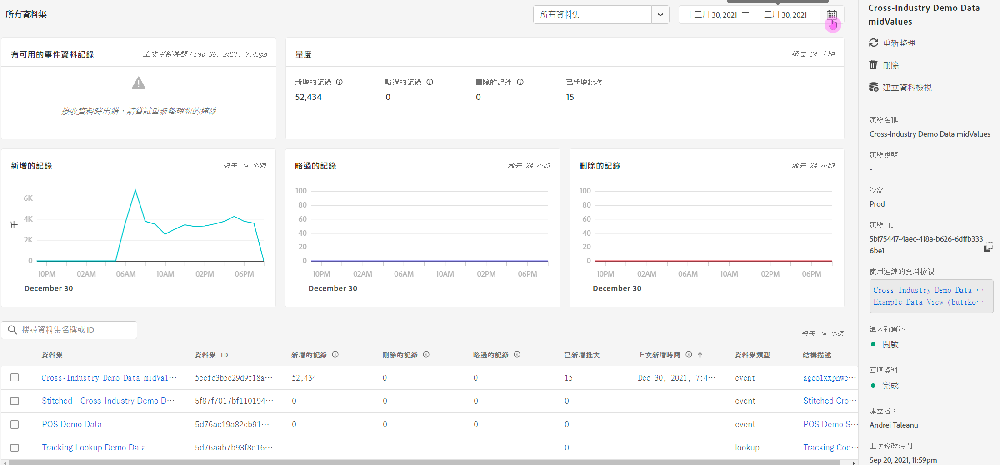

# 管理連線

當管理員使用者已[建立一個或多個連線](/help/connections/create-connection.md)時，他們就可以在[!UICONTROL 連線]管理員中管理連線。 連線體驗的最新更新在「連線詳細資料」頁面中新增了兩個重要功能，我們將在此頁面的以下部分中進一步說明：

* 它可讓您檢查連線資料集和擷取程式&#x200B;**的**&#x200B;狀態。 此狀態檢查可讓您知道您的資料何時可用，好讓您可以前往 Analysis Workspace 並開始分析。

* 它可讓您&#x200B;**識別因設定錯誤所導致的任何資料差異**。 您是否有遺漏任何資料列？如果有的話，遺漏了哪些資料列以及為什麼遺漏？您是否將連線設定錯誤並導致 CJA 中有資料遺漏？

>[!NOTE]
> 此功能將於 2021 年 9 月 20 日正式推出。

## 連線管理員 {#connections-manager}

連線管理員可讓您進行以下作業：

* 檢視您的所有連線總覽，包括所有者、沙箱以及建立和修改連線的時間。
* 檢視連線中的所有資料集。
* 檢查連線的狀態。
* 刪除連線。
* 為連線重新命名。
* 從連線建立資料檢視。

| 設定 | 說明 |
| --- | --- |
| [!UICONTROL 名稱] | 連線的易記名稱。 當您按一下有超連結的名稱時，您可進入「連線詳細資料」頁面，如底下所述。 |
| 連線資訊 | 按一下連線名稱旁邊的資訊圖示可檢視以下資訊： |
| 編輯連線 | 按一下連線名稱旁邊的省略符號 (...)，然後按一下「[!UICONTROL 編輯]」。 如需詳細資訊，請參閱底下的「編輯連線」。 |
| 刪除連線 | 按一下連線名稱旁邊的省略符號 (...)，然後按一下「[!UICONTROL 刪除]」。 下面的「刪除連線」標頭底下有更多資訊。 |
| 建立資料檢視 | 按一下連線名稱旁邊的省略符號 (...)，然後按一下「[!UICONTROL 建立資料檢視]」。 這個操作會根據此連線建立新的資料檢視。 [了解更多](https://experienceleague.adobe.com/docs/analytics-platform/using/cja-dataviews/data-views.html?lang=zh-Hant) |
| [!UICONTROL 資料集] | 屬於連線之一部分的資料集。 您可以按一下超連結來檢視連線中的所有資料集。 按一下資料集即可在新的索引標籤中使用 Adobe Experience Platform 開啟該資料集。 |
| [!UICONTROL 沙箱] | 此連線從中提取其資料集的 [Adobe Experience Platform 沙箱](https://experienceleague.adobe.com/docs/experience-platform/sandbox/home.html?lang=zh-Hant)。 當您初次建立連線時，就會選取這個沙箱。 此沙箱無法變更。 |
| [!UICONTROL 所有者] | 建立連線的人。 |
| [!UICONTROL 匯入資料集] | 可讓您啟用或停用原本稱為「資料串流」的東西。 |
| [!UICONTROL 建立日期] | 初次建立連線的日期。 |
| [!UICONTROL 上次修改日期] | 上次更新連線的日期。 |

### 刪除連線 {#connections-delete}

只有管理員才有刪除連線的權限。 非管理員不會出現這個動作。

1. 按一下連線名稱旁邊的省略符號 (...)。
1. 按一下「[!UICONTROL 刪除]」。

當您在 [!UICONTROL Customer Journey Analytics] 中刪除連線時，將會出現錯誤訊息來指示以下情況：

* 之前根據已刪除的連線建立的任何資料檢視將不再有效。
* 同樣地，如果有任何 Workspace 專案與所刪除連線中的資料檢視相依，也將停止運作。

[了解更多](/help/getting-started/cja-deletion.md)有關刪除之影響的資訊。

### 搜尋連線或資料集

您可以在[!UICONTROL 連線]標題底下使用上方搜尋列來搜尋連線。

### 排序連線

若要排序連線，請按一下每個欄標題，並且向上或向下排序。

## 「連線詳細資料」頁面 {#connection-detail}

新的「連線詳細資料」頁面為您提供極為詳細的連線狀態檢視。

此頁面可讓您：

* 檢查連線的資料集及擷取程序的狀態。
* 識別可以被略過或導致記錄刪除的設定問題。
* 了解資料何時可用來報告。

>[!IMPORTANT]
>2021 年 8 月 13 日之前擷取的任何資料，都不會反映在此[!UICONTROL 「連線」]對話框中。

以下是 Widget 和設定的說明：

| Widget/設定 | 說明 |
| --- | --- |
| 資料集選擇器 | 可讓您選擇連線中的一個或所有資料集。 您無法多重選取資料集。 預設為「[!UICONTROL 所有資料集]」。 |
| 行事曆/日期範圍 | 日期範圍會指示您將資料新增到連線中的時間。 所有標準行事曆預設集都會納入其中。 您可以自訂日期範圍，但是下拉式清單中不會出現任何自訂日期範圍。 |
| [!UICONTROL 可用的事件資料記錄]  Widget | 代表在&#x200B;**整個連線**&#x200B;中可用來報告的總事件資料集列數。 此計數與任何行事曆設定皆無關。 如果您從資料集選擇器選取資料集，或是選取表格中的資料集，此計數就會改變。 (請注意，在新增資料後，可能要等候 1-2 個小時，資料才會出現在報告中。) |
| [!UICONTROL 量度] Widget | 針對&#x200B;**資料集以及您選取的日期範圍**&#x200B;彙總已新增/略過/刪除的事件記錄，以及已新增的批次數量。 |
| [!UICONTROL 新增的記錄] Widget | 指出在選取的時段內，針對您選取的資料集和日期範圍&#x200B;**新增了多少列。**&#x200B;每 10 分鐘更新一次。**注意**：**[!UICONTROL 新增的記錄]**&#x200B;資料此時僅包括事件資料，不包括設定檔或查詢資料。 |
| [!UICONTROL 略過的記錄] Widget | 針對您選取的資料集和日期範圍&#x200B;**，指出在選取的時段內已略過多少列。**&#x200B;略過記錄的原因包括：遺漏時間戳記、遺漏個人 ID 等。 每 10 分鐘更新一次。**注意**：**[!UICONTROL 略過的記錄]**&#x200B;此時僅包括事件資料，不包括設定檔或查詢資料。 |
| [!UICONTROL 刪除的記錄] Widget | 針對&#x200B;**資料集以及您選取的日期範圍**&#x200B;指示在所選的時段內刪除了多少列。 例如，可能有人已刪除 Experience Platform 中的資料集。 每 10 分鐘更新一次。**注意**：**[!UICONTROL 刪除的記錄]**&#x200B;此時僅包括事件資料，不包括設定檔或查詢資料。 |
| 資料集搜尋方塊 | 您可以依據資料集名稱或[!UICONTROL 資料集 ID] 來進行搜尋。 |
| [!UICONTROL 資料集] | 顯示屬於連線之一部分的資料集。 您可以按一下超連結來檢視連線中的所有資料集。 |
| [!UICONTROL 資料集 ID] | Adobe Experience Platform 會自動產生這個 ID。 |
| [!UICONTROL 批次] | 指示已將多少批次新增到這個資料集。 |
| [!UICONTROL 上次新增時間] | 顯示上次將批次新增到此資料集的時間戳記。 |
| [!UICONTROL 資料集類型] | 此資料集的資料集類型可以是[!UICONTROL 事件]、[!UICONTROL 查詢]或[!UICONTROL 描述檔]。 [了解更多](https://experienceleague.adobe.com/docs/analytics-platform/using/cja-connections/create-connection.html?lang=zh-Hant#configure-dataset) |
| 結構描述 | 此連線中的資料集所根據的 Adobe Experience Platform 結構描述。 |
| **連線層級的右側邊欄** |  |
| [!UICONTROL 重新整理] | 重新整理連線，以反映最近新增的記錄。 |
| [!UICONTROL 刪除] | 刪除此連線。 |
| [!UICONTROL 建立資料檢視] | 根據此連線建立新的資料檢視。 [了解更多](https://experienceleague.adobe.com/docs/analytics-platform/using/cja-dataviews/data-views.html?lang=en) |
| [!UICONTROL 連線名稱] | 顯示連線的易記名稱。 |
| [!UICONTROL 連線說明] | 顯示更詳細的說明，在理想情況下可描述此連線的用途。 |
| [!UICONTROL 沙箱] | 此連線從中提取其資料集的 [Adobe Experience Platform 沙箱](https://experienceleague.adobe.com/docs/experience-platform/sandbox/home.html?lang=en)。當您初次建立連線時會選取這個沙箱。 此沙箱無法變更。 |
| [!UICONTROL 連線 ID] | 系統會在 Adobe Experience Platform 中產生這個 ID。 |
| [!UICONTROL 使用連線的資料檢視] | 列出所有使用此連線的資料檢視。 |
| [!UICONTROL 匯入新資料] | （開啟/關閉）指出是否應將新批次資料新增至歷史（回填）資料。 |
| [!UICONTROL 回填資料] | 追蹤 3 種狀態下的回填 (歷史) 資料：[!UICONTROL 佇列中]、[!UICONTROL 處理中] (有指示進度百分比) 及[!UICONTROL 完成]。 |
| [!UICONTROL 建立者] | 顯示建立連線的人員的名稱。 |
| [!UICONTROL 修改時間] | 顯示上次變更連線的日期和時間。 |
| [!UICONTROL 上次修改者：] | 顯示上次修改連接的人員。 |
| **資料集層級的右側邊欄** |  |
| [!UICONTROL 人員 ID] | 顯示在 Experience Platform 的最新結構描述中所定義的身分識別。 這是您在建立連線時所選擇的人員 ID。 如果您建立的連線包含有不同 ID 的資料集，則報告將會反映這個情況。 若要確實合併資料集，您需要在資料集間使用相同的人員ID。 |
| [!UICONTROL 可用記錄] | 代表在透過行事曆選取的特定時段中，為此資料集擷取的總列數。 在新增資料後，資料會立即出現在報告中，不需要等候。 (一個例外情況是當您建立全新連線時，將會發生[延遲](https://experienceleague.adobe.com/docs/analytics-platform/using/cja-overview/cja-faq.html?lang=zh-Hant#3.-getting-data-into-customer-journey-analytics))。 |
| [!UICONTROL 新增的記錄] | 指出在選取的時段內新增了多少列。 **注意**：**[!UICONTROL 新增的記錄]**&#x200B;資料此時僅包括事件資料，不包括設定檔或查詢資料。 |
| [!UICONTROL 刪除的記錄] | 指示在所選時段內刪除了多少記錄。 **注意**：**[!UICONTROL 刪除的記錄]**&#x200B;此時僅包括事件資料，不包括設定檔或查詢資料。 |
| [!UICONTROL 已新增批次] | 指出有多少個資料批次新增至此資料集。 |
| [!UICONTROL 略過的記錄] | 指出在選取的時段內擷取期間已略過多少列。 **注意**：**[!UICONTROL 略過的記錄]**&#x200B;此時僅包括事件資料，不包括設定檔或查詢資料。 |
| [!UICONTROL 上次新增時間] | 指示上次添加批的時間。 |
| [!UICONTROL 資料集類型] | 可能是[!UICONTROL 事件]、[!UICONTROL 查詢]或[!UICONTROL 描述檔]。 [了解更多](https://experienceleague.adobe.com/docs/analytics-platform/using/cja-connections/create-connection.html?lang=en#configure-dataset) |
| [!UICONTROL 結構描述] | 顯示此資料集所根據的Adobe Experience Platform結構。 |
| [!UICONTROL 資料集 ID] | 系統會在 Adobe Experience Platform 中產生這個 ID。 |

### 編輯連線

可讓管理員編輯連線。 選取連線，然後按一下「[!UICONTROL 編輯連線]」，進入此對話框。 您可以在這裡進行以下作業︰

* 開始及停止匯入新資料。 此程序先前稱為「資料串流」。
* 為連線重新命名。
* 重新整理資料集。
* 從連線移除資料集

## 設定滾動窗口 [!UICONTROL 連線] 資料保留

>[!IMPORTANT]
>請連絡客戶服務或您的Adobe客戶經理，以實作此設定。 尚未透過 CJA UI 提供。

此設定可讓您將CJA資料保留定義為月（3個月、6個月等）的滾動式期間， [!UICONTROL 連接] 級別(不在 [!UICONTROL 資料集] 級別)。 資料保留是以事件資料集時間戳記為基礎，僅適用於事件資料集。由於無適用的時間戳記，因此基本資料或查詢資料集不存在資料保留設定。主要優點在於您只會儲存或報告適用且實用的資料，並刪除不再實用的舊資料。這有助於您未超過合約限制，並減少超額使用費用的風險。