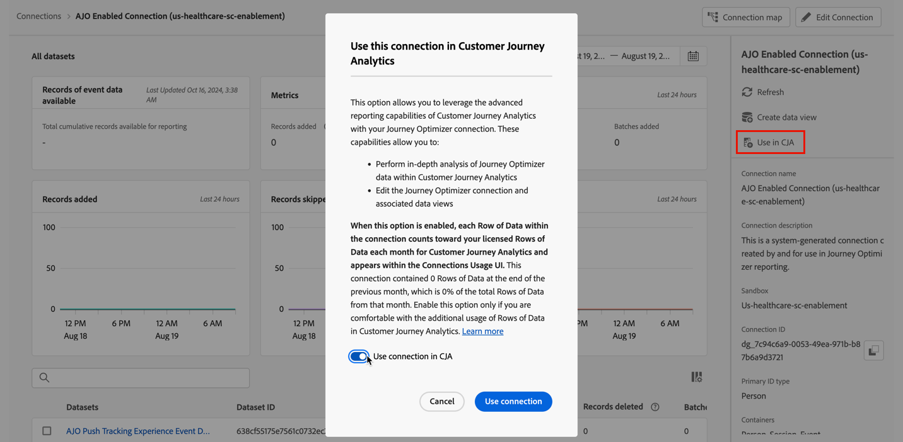

# 管理連線 {#manage-connections}

>[!CONTEXTUALHELP]
>id="connections_use_ajo"
>title="使用 Journey Optimizer 連線"
>abstract="運用 Journey Optimizer 的進階 Customer Journey Analytics 報告功能。"

>[!CONTEXTUALHELP]
>id="connections_cancel_ajo"
>title="取消 Journey Optimizer 連線"
>abstract="取消 Journey Optimizer 的進階 Customer Journey Analytics 報告功能。"

[建立一或編輯多個連線](/help/connections/create-connection.md)後，您就可以在「**[!UICONTROL 連線]**」中管理這些連線。您可以透過[!UICONTROL 連線]介面：

* 檢視您的所有連線總覽，包括所有者、沙箱以及建立和修改連線的時間。
* 編輯連線。
* 刪除連線。
* 從連線建立資料檢視。
* 檢視連線中的所有資料集。
* 查看連線資料集狀態和攝取過程的狀態。例如，您的資料何時可用，以便您可以開始在 Analysis Workspace 中進行報告和分析。
* 識別因設定錯誤所導致的任何資料差異。 您是否有遺漏任何資料列？如果有的話，遺漏了哪些資料列以及為什麼遺漏？您是否將連設定錯誤並導致 Customer Journey Analytics 中的資料遺失？
* 了解所有連線中已攝取和可報告資料行的使用情況。

[!UICONTROL 連線]有兩個介面： [[!UICONTROL 清單]](#list)和[[!UICONTROL 使用狀況]](#usage)。

## 清單

 **[!UICONTROL 清單]**&#x200B;介面是連線的預設介面。如果未選取，請選取「**[!UICONTROL 清單]**」標記以存取介面。

[!UICONTROL 清單]介面會顯示所有可用連線的表格。

### 搜尋連線

您可以使用「搜尋」框快速搜尋連線。

### 將篩選器套用至連線清單

若要將篩選器套用至連線清單，請選取篩選器圖示，然後從下列篩選器選項中選取：

| 篩選條件選項 | 說明 |
|---------|----------|
| **[!UICONTROL 資料集]** | 只會顯示與您選取的資料集相關聯的連線。 |
| **[!UICONTROL 所有者]** | 只會顯示您所選取人員擁有的連線。 |
| **[!UICONTROL 沙箱]** | 系統只會顯示您選取的沙箱中可用的連線。 |
| **[!UICONTROL 在 CJA 中使用]** | 選取「**[!UICONTROL 開啟]**」，僅顯示已啟用與 Customer Journey Analytics 搭配使用的連線。選取「**[!UICONTROL 關閉]**」，僅顯示未啟用與 Customer Journey Analytics 搭配使用的連線。 |

### 可用欄

表格中有以下欄或圖示。

| 欄或圖示 | 說明 |
| --- | --- |
| **[!UICONTROL _名稱_]** | 連線的易記名稱。 若要查看[連線的詳細資訊](#connection-details)，請選取帶有超連結的名稱。 |
|  | 若要檢視有關[!UICONTROL 包含的資料集]、 [!UICONTROL 沙箱]、 [!UICONTROL 所有者]等資訊，請選取連線名稱旁邊的   。
快顯視窗會顯示資料集的詳細資訊。 
 |
|  | 若要為連線[建立資料檢視](#create-a-data-view) ，請選取「」。只有在沒有資料檢視與連線有關聯時，此圖示才會顯示。 |
|  | 選取「」開啟內容選單。您可以選取： 
「 **[!UICONTROL 編輯]**」來[編輯](#edit-a-connection)連線。
「 **[!UICONTROL 刪除]**」來[刪除](#delete-a-connection)連線。
「 **[!UICONTROL 建立新的資料視圖]**」來[建立連線的新資料視圖](#create-a-data-view)。
「 **[!UICONTROL 連線對應]**」以檢視連線的[連線對應](#map-a-connection)。 |
| [!BADGE B2B edition]{type=Informative url="https://experienceleague.adobe.com/zh-hant/docs/analytics-platform/using/cja-overview/cja-b2b/cja-b2b-edition" newtab=true tooltip="Customer Journey Analytics B2B Edition"} **[!UICONTROL 連線類型&#x200B;]** | 連線類型：**[!UICONTROL 個人]**&#x200B;或&#x200B;**[!UICONTROL 帳戶]**&#x200B;型連線。 |
| **[!UICONTROL 資料集]** | 前往屬於連線一部分的資料集的一個或多個連結。您可以選取資料集超連結，即可檢視連線中的所有資料集。 如果選取的連線包含更多資料集，請選取 **[!UICONTROL +*x* 更多]**&#x200B;以顯示&#x200B;**[!UICONTROL 包含的資料集]**&#x200B;面板。此面板會顯示所有資料集的連結以及可搜尋屬於連線的特定資料集的選項。

選取資料集名稱會在新分頁中的 Experience Platform 介面中開啟該資料集。 |
| **[!UICONTROL 沙箱]** | [Adobe Experience Platform 沙箱](https://experienceleague.adobe.com/zh-hant/docs/experience-platform/sandbox/home)，此連線會從這個沙箱提取其資料集 。 您在建立連線時選取此沙箱。一旦儲存連線後，您就無法變更沙箱。 |
| **[!UICONTROL 所有者]** | 建立連線的人。 |
| **[!UICONTROL 匯入新資料]** | 資料集匯入新資料的狀態： 
    **[!UICONTROL _x _開啟]**，表示資料集設定為匯入新資料，以及
   **[!UICONTROL _x 關閉_]**，表示資料集未設定為匯入新資料。 |
| **[!UICONTROL 建立日期]** | 建立連線時的時間戳記。 |
| **[!UICONTROL 上次修改日期]** | 上次更新連線的時間戳記。 |
| **[!UICONTROL 回填資料]** | 所有資料集回填資料的狀態。
   **[!UICONTROL _x _回填失敗]**，表示所有資料集回填失敗的次數，
   **[!UICONTROL _x _回填處理]**，表示所有資料集處理回填的次數，
   **[!UICONTROL _x _回填完成]**，表示資料集回填已完成的數量，以及
   **[!UICONTROL _關閉_]**，若連線中的資料集未定義回填。 |
| **[!UICONTROL 整合]** | 顯示透過連線啟用的任何 Experience Platform 應用程式。 |
| **[!UICONTROL 在 CJA 中使用]** | 顯示連線是否已啟用，以便與 Customer Journey Analytics 搭配使用。 |

若要設定在表格中顯示哪些欄，請選取「」。在「自訂表格」對話框中，選取要顯示的欄。

### 編輯連線

若要編輯連線：

1. 選取連線名稱旁的「」
1. 從內容選單中選取  **[!UICONTROL 「編輯」]**。

或者，您可以：

1. 立即選取連線。

1. 選取藍色動作列中的「 **[!UICONTROL 編輯」]**。

如需詳細資訊，請參閱「[建立或編輯連線](create-connection.md)」。

### 刪除連線 {#connections-delete}

若要刪除連線：

1. 選取連線名稱旁的「」。
1. 選取  **[!UICONTROL 「刪除」]**。

或者，您可以：

1. 立即選取連線。

1. 選取藍色動作列中的「 **[!UICONTROL 刪除」]**。

刪除連線時，「**[!UICONTROL 刪除連線]**」面板會指示哪些資料視圖被刪除以及哪些工作區專案受到影響。

* 在「➊ **[!UICONTROL 資訊]**」中，會顯示刪除連線的影響。

  

  選取「**[!UICONTROL 繼續]**」以確認刪除。

* 在「➋ **[!UICONTROL 確認]**」中，在「**[!UICONTROL 連線類型名稱]**」中輸入連線名稱，然後選取「**[!UICONTROL 刪除]**」來刪除連線。選取「**[!UICONTROL 取消]**」進行取消。

請參閱「[刪除影響](/help/technotes/deletion.md)」，了解有關刪除連線的詳細資訊。

### 建立連線的資料檢視

若要建立連線的資料視圖：

1. 選取連線名稱旁的「」。
1. 選取  **[!UICONTROL 「建立新的資料檢視」]**。

或者，您可以：

1. 立即選取連線。

1. 選取藍色動作列的「 **[!UICONTROL 建立資料視圖」]**。

如需更多資訊，請參閱[建立或編輯資料視圖](/help/data-views/create-dataview.md)。

### Journey Optimizer 連線

您可以在 Customer Journey Analytics 中使用 Journey Optimizer 連線，為連線帶來下列額外值：

* 在 Customer Journey Analytics 中執行 Journey Optimizer 資料的深入分析 (使用 Journey Optimizer 中的&#x200B;**[!UICONTROL 在 CJA 中分析]**&#x200B;按鈕)。

  如需更多資訊，請參閱 Journey Optimizer 文件中的[在 Customer Journey Analytics 中分析](https://experienceleague.adobe.com/zh-hant/docs/journey-optimizer/using/reporting/channel-report/report-cja-manage#cja-template)。

* 編輯 Journey Optimizer 連線和相關的資料視圖。

  如需關於編輯選項的詳細資訊，請參閱[編輯連線](#edit-a-connection)。

>[!IMPORTANT]
>
>當您如本區段所述，啟用 Journey Optimizer 連線並與 Customer Journey Analytics 搭配使用時，連線中的每一列資料都會計入您每月的 Customer Journey Analytics 授權資料列，並顯示在「連線使用情況」介面中。若您熟悉如何在 Customer Journey Analytics 中透過其他方式使用列，請選取連線上的「**[!UICONTROL 在 CJA 中使用]**」選項。
>
>**如果您在 2024 年 10 月至 2025 年 10 月期間同時擁有 Customer Journey Analytics 和 Journey Optimizer 的權益，請參閱下列關於[啟用 AJO 的連線](https://view.adobe.com/viewer/1ed94fc35c7860b260766c620889e7a0#1)**&#x200B;的文件。

若要啟用此功能，您的組織需擁有 Customer Journey Analytics 的存取權。如果您沒有存取權，請聯絡您的 Adobe 銷售代表。

#### 使用 Journey Optimizer 連線 {#use-connection-in-cja}

若要在 Customer Journey Analytics 中使用 Journey Optimizer 連線：

1. 找到您要與 Customer Journey Analytics 搭配使用的 Journey Optimizer 連線。

   1. 在「**[!UICONTROL 連線]**」索引標籤中選取「 **[!UICONTROL 篩選器]**」。

   1. 在「**[!UICONTROL 在 CJA 中使用]**」區段內，選取「**[!UICONTROL 關閉]**」。

      這會顯示目前未設定為可在 Customer Journey Analytics 中使用之所有 Journey Optimizer 連線。

      

1. 選取 Journey Optimizer 連線的名稱。

1. 選取「 **[!UICONTROL 在 CJA 中使用]**」。

   

   接著顯示「**[!UICONTROL 在 Customer Journey Analytics 中使用此連線]**」對話框。

1. 啟用切換，「**[!UICONTROL 在 CJA 中使用連線]**」。

1. 選取「**[!UICONTROL 使用連線]**」。<!-- double-check these dialog button names -->

#### 移除 Journey Optimizer 連線 {#remove-connection-in-cja}

您可以隨時從 Customer Journey Analytics 移除 Journey Optimizer 連線。不過，在使用連線後從 Customer Journey Analytics 中移除連線會導致下列結果：

* Journey Optimizer 連線和任何關聯的資料視圖都會重設為預設狀態，且無法再編輯。

* 所有與連線相關聯的自訂衍生欄位都會被刪除。

* 您在 Customer Journey Analytics 中無法再執行 Journey Optimizer 資料的深入分析。

  這表示 Journey Optimizer 中的「**[!UICONTROL 在 CJA 中分析]**」按鈕已停用。

>[!IMPORTANT]
>
>Customer Journey Analytics 中此連線的計費包括移除連線的整個月份。

若要從 Customer Journey Analytics 中移除此連線：

1. 找到您要從 Customer Journey Analytics 移除的 Journey Optimizer 連線。

   1. 在「**[!UICONTROL 連線]**」索引標籤中選取「 **[!UICONTROL 篩選器]**」。

   1. 在「**[!UICONTROL 在 CJA 中使用]**」區段內，選取「**[!UICONTROL 開啟]**」。

      這會顯示目前設定為可在 Customer Journey Analytics 中使用之所有 Journey Optimizer 連線。

      

1. 若要檢視連線，請選取您要從 Customer Journey Analytics 移除的 Journey Optimizer 連線名稱。

1. 檢視 Journey Optimizer 連線時，請選取「**[!UICONTROL 從 CJA 移除]**」。

   接著顯示「**[!UICONTROL 從 Customer Journey Analytics 移除此連線]**」對話框：

   

1. 停用選項，「**[!UICONTROL 從 CJA 中移除連線]**」。

1. 選取「**[!UICONTROL 移除連線]**」。

### 對應連線

若要檢視詳細說明連線中資料集間之關係的[連線圖](/help/connections/create-connection.md#connection-map)：

1. 選取連線名稱旁的「」。
1. 選取「 **[!UICONTROL 連線圖]**」。

### 連線詳細資料 {#connection-detail}

若要了解連線的詳細資料，請在連線表格中選取帶有超連結的連線名稱。

連線詳細資訊介面會提供連線狀態的詳細檢視。您可以：

* 檢查連線的資料集及攝取程序的狀態。
* 識別可以造成記錄被略過或被刪除的設定問題。
* 了解資料何時可用來報告。

| 使用者介面 | 說明 |
| --- | --- |
|  **[!UICONTROL 編輯連線]**。 | 若要編輯連線的詳細資訊，請選取  **[!UICONTROL 「編輯連線」]**。如需詳細資訊，請參閱「[建立或編輯連線](create-connection.md)」。 |
| **[!UICONTROL *資料集選擇器&#x200B;*]** | 選取一個或多個資料集，顯示連線中的詳細資料。您無法多重選取資料集。 預設為「**[!UICONTROL 所有資料集]**」。 |
| **[!UICONTROL *日期範圍選擇器&#x200B;*]** | 選取要顯示連線中詳細資料的資料範圍。編輯開始日期、結束日期，或選取「」，以開啟日期範圍選擇器。在日期範圍選擇器中，使用預先定義時間段之一 (例如&#x200B;**[!UICONTROL 過去 6 個月]**) 選取日期範圍，或使用行事曆來選取開始日期和結束日期。選取「**[!UICONTROL 套用]**」，將新的日期範圍套用至連線詳細資料。 |
| **[!UICONTROL 有可用的事件資料記錄]** | 在&#x200B;**整個連線**&#x200B;中可用來報告的總事件資料集列數。 此計數與任何日期範圍或資料集選取範圍無關。 |
| [!UICONTROL **[!UICONTROL 量度]**] | 匯總新增、跳過和刪除的事件、查詢、輪廓和摘要資料集記錄以及新增的批次數。這些量度是根據&#x200B;**您選取的資料集和日期範圍**&#x200B;而決定。
選取「**[!UICONTROL 檢查詳細資訊]**」，以顯示「**[!UICONTROL 查看略過的詳細資料]**」快顯視窗。快顯視窗列有所有事件資料集或選取資料集的略過記錄數和原因。

選取「」快顯視窗，取得更多資訊。若要了解一些略過的原因 (例如[!UICONTROL 訪客 ID 為空])，快顯視窗會顯示 **[!UICONTROL EQS (Experience Platform for Query Service) 的範例 PSQL]**，您可以在[查詢服務](https://experienceleague.adobe.com/zh-hant/docs/experience-platform/query/home)中用來查詢資料集中被略過的記錄。選取  **[!UICONTROL 「複製 EQS 的範例 PSQL」]**&#x200B;以複製 SQL。 |
| **[!UICONTROL 新增的記錄]** | 視覺化圖表指出在選取的時段內，**針對您選取的資料集和日期範圍**&#x200B;新增了多少列。每 10 分鐘更新一次。 |
| **[!UICONTROL 略過的記錄]** | 視覺化圖表指出在選取的時段內，**針對您選取的資料集和日期範圍**&#x200B;略過了多少列。略過記錄的原因包括：遺漏時間戳記、遺漏或無效的個人 ID 或帳戶 ID [!BADGE B2B Edition]{type=Informative url="https://experienceleague.adobe.com/zh-hant/docs/analytics-platform/using/cja-overview/cja-b2b/cja-b2b-edition" newtab=true tooltip="Customer Journey Analytics B2B Edition"} 等。每 10 分鐘更新一次。 
無效 ID (例如`undefined`、`00000000`，或[!UICONTROL 個人 ID] 在指定月份中出現超過 100 萬次的事件) 無法歸因於任何特定使用者或人員。這些資料列無法將攝取資料擷取至系統中，並導致容易出錯的攝取和報告。若要修復無效的個人 ID 或帳戶 ID [!BADGE B2B Edition]{type=Informative url="https://experienceleague.adobe.com/zh-hant/docs/analytics-platform/using/cja-overview/cja-b2b/cja-b2b-edition" newtab=true tooltip="Customer Journey Analytics B2B Edition"}，您有 3 個選項：<ul><li>使用[拼接](/help/stitching/overview.md)以有效的使用者 ID 填入未定義或全零的使用者 ID。</li><li>將使用者 ID 留空，然後在攝取期間略過 (這是比較適合無效或全零使用者 ID 的做法)。</li><li>在攝取資料之前，請先修正系統中任何無效的使用者 ID。</li></ul> |
| **[!UICONTROL 刪除的記錄]** | 視覺化圖表指出在選取的時段內，**針對您選取的資料集和日期範圍**&#x200B;刪除了多少列。例如，可能有人已刪除 [!DNL Experience Platform] 中的資料集。每 10 分鐘更新一次。
在某些情況下，該值還可以包括已取代的記錄，例如拼接或某些查詢資料集更新。考慮此範例：
<ul><li>您將一筆記錄上傳到 XDM 輪廓資料集，Customer Journey Analytics 會將其設定為以輪廓查詢資料來攝取。在連線詳細資料中，該資料集將顯示已新增 1 筆記錄。</li><li>您將原始記錄的副本上傳到同一個 AEP 資料集，該資料集現在包含兩個記錄。Customer Journey Analytics 會從輪廓或帳戶 [!BADGE B2B Edition]{type=Informative url="https://experienceleague.adobe.com/zh-hant/docs/analytics-platform/using/cja-overview/cja-b2b/cja-b2b-edition" newtab=true tooltip="Customer Journey Analytics B2B Edition"} 查詢資料集中攝取更多記錄。Customer Journey Analytics 發現連線中已攝取該個人 ID 或帳戶 ID [!BADGE B2B Edition]{type=Informative url="https://experienceleague.adobe.com/zh-hant/docs/analytics-platform/using/cja-overview/cja-b2b/cja-b2b-edition" newtab=true tooltip="Customer Journey Analytics B2B Edition"} 的輪廓或帳戶記錄，因此會刪除其早期版本並新增輪廓資料。在連線詳細資料中，此動作代表新增 1 筆記錄和刪除 1 筆記錄，因為 Customer Journey Analytics 僅會保留任何已攝取之個人 ID 或帳戶 ID [!BADGE B2B Edition]{type=Informative url="https://experienceleague.adobe.com/zh-hant/docs/analytics-platform/using/cja-overview/cja-b2b/cja-b2b-edition" newtab=true tooltip="Customer Journey Analytics B2B Edition"} 的最新輪廓資料。</li><li>總體來說，AEP 資料集包含兩筆完全相同的記錄。另外，Customer Journey Analytics 連線詳細資料會顯示其攝取資料的狀態：此輪廓資料集新增了 2 筆記錄，刪除了 1 筆記錄。 </li></ul> |
|  | 資料集搜尋欄位。您可以依據資料集名稱或資料集 ID 來搜尋資料集表格。 |
| [!UICONTROL 資料集表格] | 屬於連線之一部分的資料集。如需進一步說明，請參閱下方表格。選取「」單一資料集，僅顯示所選取之資料集的連線詳細資料。這等同於從&#x200B;**[!UICONTROL _資料集選取器_]**&#x200B;選取資料集。 |

資料集表格會顯示每個資料集的以下欄：

| 欄 | 說明 |
| --- | --- |
| **[!UICONTROL 資料集]** | 資料集名稱。您可以選取超連結，會在新分頁的 Experience Platform UI 中開啟資料集。您可以選取資料列或核取方塊，只顯示所選資料集的詳細資訊。 |
| **[!UICONTROL 資料集 ID]** | Experience Platform 產生的資料集 ID。 |
| **[!UICONTROL 新增的記錄]** | 在所選日期範圍期間，新增至連線的資料集記錄 (列) 數。 |
| **[!UICONTROL 略過的記錄]** | 在所選日期範圍期間，在連線的資料傳輸期間略過的資料集記錄 (列) 數。 |
| **[!UICONTROL 刪除的記錄]** | 在所選日期範圍期間，從連線中移除的資料集記錄 (列) 數。 |
| **[!UICONTROL 新增的批次]** | 在所選日期範圍期間，已新增至連線的批次數量。 |
| **[!UICONTROL 上次新增時間]** | 新增至連線之最後批次的時間戳記。 |
| **[!UICONTROL 資料來源類型]** | 來源類型。當您將資料集新增到連線時，可以定義來源類型。 |
| **[!UICONTROL 資料集類型]** | [資料集類型](create-connection.md#dataset-types)。類型可以是&#x200B;**[!UICONTROL 事件]**、**[!UICONTROL 輪廓]**、**[!UICONTROL 查詢]**&#x200B;或&#x200B;**[!UICONTROL 摘要]**。臨時或關聯式資料集以 **[!UICONTROL (臨時)]** 或 **[!UICONTROL (關聯式)]** 做為識別。例如，**[!UICONTROL 事件 (臨時)]** 或 **[!UICONTROL 查詢 (關聯式)]**。 |
| **[!UICONTROL 已拼接]** | 如果資料集[在連線UI](/help/stitching/use-stitching-ui.md)中啟用拼接功能，則值為&#x200B;**[!UICONTROL true]**。 否則，值為&#x200B;**[!UICONTROL false]**。 此資料表中未將拼接程式[的](/help/stitching//use-stitching.md)請求結果拼接資料集識別為已拼接，預設值為&#x200B;**[!UICONTROL false]**。 |
| **[!UICONTROL 結構描述]** | 此資料集所根據的 Experience Platform 結構描述。 |
| **[!UICONTROL 匯入新資料]** | 資料集匯入新資料的狀態： 
   **[!UICONTROL _x _開啟]**，若資料集設定為匯入新資料，以及
   **[!UICONTROL _x 關閉_]**，若資料集設定為不匯入新資料。 |
| **[!UICONTROL 轉換資料]** | 適用 B2B 查詢資料集的轉換狀態。請參閱[轉換資料集以進行 B2B 查詢](transform-datasets-b2b-lookups.md)，了解更多資訊。
   **[!UICONTROL _x _開啟]**，表示已啟用進行轉換的適用資料集， 
   **[!UICONTROL _x 關閉_]**，表示未啟用進行轉換的適用資料集，以及
**[!UICONTROL N/A]** 於所有其他資料集，不適用於轉換。 |
| **[!UICONTROL 回填資料]** | 資料集的回填資料狀態。
   **[!UICONTROL _x _回填失敗]**，表示回填失敗次數，
   **[!UICONTROL _x _回填處理]**，表示處理回填的數量，
   **[!UICONTROL _x _回填完成]**，表示回填已完成的數量，以及
   **[!UICONTROL _關閉_]**，若未設定為回填。 |

>[!IMPORTANT]
>
>2021 年 8 月 13 日之前攝取的任何資料，都不會反映在此[!UICONTROL 「連線」]介面中。
>

#### 連線面板

當資料集表格中未選取個別資料集時，右側面板會顯示連線選項和詳細資料。

| 選項 | 說明 |
| --- | --- |
|  **[!UICONTROL 重新整理]** | 若要重新整理連線並允許反映最近新增的記錄，請選取  **[!UICONTROL 「重新整理」]**。 |
| **[!UICONTROL 刪除]** | [刪除](#delete-a-connection)此連線。 |
|  **[!UICONTROL 建立資料檢視]** | 根據此連線[建立資料檢視](#create-a-data-view)。請參閱「[資料檢視](https://experienceleague.adobe.com/zh-hant/docs/analytics-platform/using/cja-dataviews/data-views)」，了解更多資訊。 |
| **[!UICONTROL 在 CJA 中使用]** | 在 Customer Journey Analytics 中使用 Journey Optimizer 連線，讓您的 Journey Optimizer 連線發揮更大價值。如需更多資訊，請參閱[在 Customer Journey Analytics 中使用 Journey Optimizer 連線](#use-a-journey-optimizer-connection-in-customer-journey-analytics)。 |
| **[!UICONTROL 連線名稱]** | 連線的易記名稱。 |
| **[!UICONTROL 連線說明]** | 更詳細的說明，且可描述此連線的用途。 |
| **[!UICONTROL 沙箱]** | [Adobe Experience Platform 沙箱](https://experienceleague.adobe.com/zh-hant/docs/experience-platform/sandbox/home)，此連線會從這個沙箱提取其資料集 。 您在建立連線時選取此沙箱。一旦儲存連線後，您就無法變更沙箱。 |
| **[!UICONTROL 連線 ID]** | 針對連線產生的識別碼。您可以使用「」複製這個值。 |
| [!BADGE B2B Edition]{type=Informative url="https://experienceleague.adobe.com/zh-hant/docs/analytics-platform/using/cja-overview/cja-b2b/cja-b2b-edition" newtab=true tooltip="Customer Journey Analytics B2B Edition"} **[!UICONTROL 主要 ID 類型&#x200B;]** | 連線的主要 ID 類型：**[!UICONTROL 個人]**，是個人型連線；**[!UICONTROL 帳戶]**，則是帳戶型連線。 |
| [!BADGE B2B Edition]{type=Informative url="https://experienceleague.adobe.com/zh-hant/docs/analytics-platform/using/cja-overview/cja-b2b/cja-b2b-edition" newtab=true tooltip="Customer Journey Analytics B2B Edition"} **[!UICONTROL 容器&#x200B;]** | 針對連線設定的容器。 |
| **[!UICONTROL 使用連線的資料視圖]** | 使用此連線的資料視圖。 |
| **[!UICONTROL 匯入新資料]** | 資料集匯入新資料的狀態： 
   **[!UICONTROL _x _開啟]**，表示有多少資料集設定為匯入新資料，以及
   **[!UICONTROL _x 關閉_]**，表示有多少個新資料集匯入已關閉。 |
| **[!UICONTROL 回填資料]** | 資料集回填資料的狀態。
   **[!UICONTROL _x _回填失敗]**，表示所有資料集回填失敗的次數，
   **[!UICONTROL _x _回填處理]**，表示所有資料集處理回填的次數，
   **[!UICONTROL _x _回填完成]**，表示資料集回填已完成的數量，以及
   **[!UICONTROL _關閉_]**，若連線中的資料集未定義回填。 |
| **[!UICONTROL 轉換資料]** | 適用 B2B 查詢資料集的轉換狀態。請參閱[轉換資料集以進行 B2B 查詢](transform-datasets-b2b-lookups.md)，了解更多資訊。
   **[!UICONTROL _x _開啟]**，表示已啟用進行轉換的資料集數量。 |
| **[!UICONTROL 建立者]** | 建立連線的個人名稱。 |
| **[!UICONTROL 上次修改日期]** | 連接最後一次變更的時間戳。 |
| **[!UICONTROL 上次修改者]** | 最後修改連線之個人的名稱。 |

#### 資料集面板

在資料集表格中選取資料集列時，連線介面右側的面板會顯示所選取之資料集的詳細資訊。

| 詳細資料 | 說明 |
| --- | --- |
| [!BADGE B2B Edition]{type=Informative url="https://experienceleague.adobe.com/zh-hant/docs/analytics-platform/using/cja-overview/cja-b2b/cja-b2b-edition" newtab=true tooltip="Customer Journey Analytics B2B Edition"} **[!UICONTROL 全域帳戶 ID ]** | 您指定為連線之全域帳戶 ID 的身分識別。僅適用於已設定全域帳戶容器的帳戶型連線。 |
| [!BADGE B2B Edition]{type=Informative url="https://experienceleague.adobe.com/zh-hant/docs/analytics-platform/using/cja-overview/cja-b2b/cja-b2b-edition" newtab=true tooltip="Customer Journey Analytics B2B Edition"} **[!UICONTROL 帳戶 ID ]** | 您指定為連線之帳戶 ID 的身分識別。僅適用於未設定全域帳戶容器的帳戶型連線。 |
| **[!UICONTROL 個人 ID]** | 您指定為連線之個人 ID 的身分識別。 |
| **[!UICONTROL 索引鍵]** | 您為查詢資料集指定的索引鍵。 |
| **[!UICONTROL 比對索引鍵]** | 您為查詢資料集指定的比對索引鍵。 |
| **[!UICONTROL 時間戳記]** | 為事件資料集定義的時間戳記。 |
| **[!UICONTROL 可用記錄]** | 在透過行事曆選取的特定時段中，為此資料集攝取的資料列總數。 在新增資料後，資料會立即出現在報告中，不需要等候。 然而，當你建立全新連線時， 會有[延遲](https://experienceleague.adobe.com/zh-hant/docs/analytics-platform/using/cja-overview/cja-b2c-overview/cja-faq)。 |
| **[!UICONTROL 新增的記錄]** | 在所選日期範圍期間，新增至連線的資料集記錄 (列) 數。 |
| **[!UICONTROL 略過的記錄]** | 在所選日期範圍期間，在連線的資料傳輸期間略過的資料集記錄 (列) 數。 |
| **[!UICONTROL 新增的批次]** | 已新增至連線的批次數量。 |
| **[!UICONTROL 刪除的記錄]** | 在所選日期範圍期間，從連線中移除的資料集記錄 (列) 數。 |
| **[!UICONTROL 上次新增時間]** | 新增至連線之最後批次的時間戳記。 |
| **[!UICONTROL 匯入新資料]** | 資料集匯入新資料的狀態： 
   **[!UICONTROL _x _開啟]**，若資料集設定為匯入新資料，以及
   **[!UICONTROL _x 關閉_]**，若資料集設定為不匯入新資料。 |
| **[!UICONTROL 回填資料]** | 資料集的回填資料狀態。
   **[!UICONTROL _x _回填失敗]**，表示回填失敗次數，
   **[!UICONTROL _x _回填處理]**，表示處理回填的數量，
   **[!UICONTROL _十&#x200B;_回填完成]**，表示回填已完成的數量，以及
   **[!UICONTROL _關閉_]**，若未設定為回填。
若要顯示含資料集過去回填概觀的對話框，請選取  **[!UICONTROL 過去的回填]** |
| **[!UICONTROL 資料來源類型]** | 將資料集新增至連線時定義的資料來源類型。 |
| **[!UICONTROL 資料集類型]** | [資料集類型](create-connection.md#dataset-types)。類型可以是&#x200B;**[!UICONTROL 事件]**、**[!UICONTROL 輪廓]**、**[!UICONTROL 查詢]**&#x200B;或&#x200B;**[!UICONTROL 摘要]**。臨時或關聯式資料集以 **[!UICONTROL (臨時)]** 或 **[!UICONTROL (關聯式)]** 做為識別。例如，**[!UICONTROL 事件 (臨時)]** 或 **[!UICONTROL 查詢 (關聯式)]**。 |
| **[!UICONTROL 結構描述]** | 此資料集所根據的 Adobe Experience Platform 結構描述。 |
| **[!UICONTROL 資料集 ID]** | 資料集 ID，在 Experience Platform 中所產生。 |

## 使用情況 {#connections-usage}

>[!CONTEXTUALHELP]
>id="connections_usage_keyusagemetrics"
>title="關鍵使用情況量度"
>abstract="提供核心和歷史可報告列數的每月資料和總資料。"

>[!CONTEXTUALHELP]
>id="connections_usage_monthlyingestedrows"
>title="每月攝取列數"
>abstract="測量每月新增至系統的記錄總數，以提供對資料增長和攝取率的洞察。"

>[!CONTEXTUALHELP]
>id="connections_usage_monthlyreportablerows"
>title="每月可報告列數"
>abstract="追蹤可供報告的列數。可報告列數是指已攝取的列數減去攝取期間略過和刪除的列數。可報告列數是計費和資料使用情況的關鍵量度。"

>[!CONTEXTUALHELP]
>id="connections_usage_detailbreakdown"
>title="詳細劃分"
>abstract="您可以依據連線、資料集、沙箱和標記來檢視詳細量度，並且可選擇下載資料的 CSV 檔案。"

>[!CONTEXTUALHELP]
>id="connections_usage_otherdatasets"
>title="其他資料集"
>abstract="2024 年 9 月之前的數月在資料集層級收集資料，且為了提高清晰度，該資料顯示為&#x200B;*其他資料集*。從 2024 年 9 月開始，會在精細資料集層級收集資料，*其他資料集*&#x200B;則不再顯示。"

>[!CONTEXTUALHELP]
>id="connections_usage_unknowndatasetsorconnections"
>title="未知的資料集或連線"
>abstract="未知的資料集或連線使用其 ID 顯示。"

>[!CONTEXTUALHELP]
>id="connections_usage_datanotavailable"
>title="資料無法使用"
>abstract="由於系統限制，無法取得 2024 年 9 月之前的歷史資料。從 2024 年 9 月起收集和顯示量度。此圖表會在時間軸上顯示過去 18 個月，且未來資料會在資料可用時顯示。"

>[!CONTEXTUALHELP]
>id="connections_corereportablerows"
>title="核心可報告列數"
>abstract="在當前月份往前推 13 個月內的可用總列數，以及相較於前一個月的百分比變化。例如，在 2024 年 2 月 1 日，此數字顯示事件時間戳記從 2023 年 1 月到 2024 年 1 月的可用總列數。"

>[!CONTEXTUALHELP]
>id="connections_historicalreportablerows"
>title="歷史可報告列數"
>abstract="在當前月份往前推 13 個月以上的時間點之可用總列數，以及相較於前一個月的變更百分比。例如，在 2024 年 2 月 1 日，此數字會顯示事件時間戳記早於 2023 年 1 月的可用總列數。"

>[!CONTEXTUALHELP]
>id="connections_averagerowsize"
>title="平均列大小"
>abstract="當月每一列資料攝取和儲存所使用的平均儲存量 (以 kB 為單位)，以及相較於前一個月的百分比變化。"

>[!CONTEXTUALHELP]
>id="connections_coredatavolume"
>title="核心資料量"
>abstract="儲存在磁碟上且附有當月時間戳記的資料總量 (以 TB 為單位)，以及相較於前一個月的變更百分比。"

>[!CONTEXTUALHELP]
>id="connections_breakdown_corereportablerows"
>title="核心可報告列數"
>abstract="核心可報告列數是快照的值，而不是彙總總計。這些值會依所選日期範圍內的最後一個月進行動態更新。如果客戶選取 1 月至 3 月，則此值會反映 3 月的快照。"

>[!CONTEXTUALHELP]
>id="connections_breakdown_historicalreportablerows"
>title="歷史可報告列數"
>abstract="歷史可報告列數是快照的值，而不是彙總總計。這些值會依所選日期範圍內的最後一個月進行動態更新。如果客戶選取 1 月至 3 月，則此值會反映 3 月的快照。"

>[!CONTEXTUALHELP]
>id="connections_breakdown_cumulativereportablerows"
>title="累計可報告列數"
>abstract="累計可報告列數是快照的值，而不是彙總總計。這些值會依所選日期範圍內的最後一個月進行動態更新。如果客戶選取 1 月至 3 月，則此值會反映 3 月的快照。"

[!UICONTROL 使用情況]介面是顯示所有連線中攝取和可報告的行的使用情況。如果未選取，請選取「**[!UICONTROL 使用情況]**」標記以存取介面。

此介面可幫助您確定 Customer Journey Analytics 使用情況是否與合約的協議相符。除了監控目的之外，您還可以使用「使用情況」介面來規劃 Customer Journey Analytics 許可證續約。

「使用情況」介面是使用以下量度：

| 量度名稱 | 說明 |
|---|---|
| **歷史可報告列數** | 超過 13 個月的時段的列數。 |
| **核心可報告列數** | 過去 13 個月的列數。 |
| **核心資料量** | 儲存在磁碟上的資料總量。 |
| **平均列大小** | 攝取和儲存的每一列資料使用的平均儲存數量。 |
| **攝取列數** | 特定時期內攝取多少列。 |
| **可報告列數** | 在特定時期內，做為連線一部分的資料有多少列？ |
| **累計的列數** | 截至特定月份已攝取多少資料列。 |

>[!NOTE]
>
>從 2024 年 7 月開始，收集核心、歷史和總計記錄的資料。請聯絡您的客戶經理以取得早期的歷史資料。
>

「使用情況」介面由兩個面板組成：

* 顯示的「**[!UICONTROL 主要使用量度]**」面板：

   * 四個摘要視覺化圖表顯示上個月的總數和百分比變化：

      * **[!UICONTROL 核心資料可報告列數]**。在當前月份往前推 13 個月內的可用總列數，以及相較於前一個月的百分比變化。例如，在 2024 年 2 月 1 日，此數字顯示事件時間戳記從 2023 年 1 月到 2024 年 1 月的可用總列數。
      * **[!UICONTROL 歷史資料可報告列數]**。在當前月份往前推 13 個月以上的時間點之可用總列數，以及相較於前一個月的變更百分比。例如，在 2024 年 2 月 1 日，此數字會顯示事件時間戳記早於 2023 年 1 月的可用總列數。
      * **[!UICONTROL 核心資料量]**。儲存在磁碟上且附有當月時間戳記的資料總量 (以 TB 為單位)，以及相較於前一個月的變更百分比。
      * **[!UICONTROL 平均列大小]**。當月每一列資料攝取和儲存所使用的平均儲存量 (以 kB 為單位)，以及相較於前一個月的百分比變化。

   * 顯示過去 13 個月&#x200B;**[!UICONTROL 核心與歷史資料可報告列數]**&#x200B;的堆疊垂直長條圖視覺化圖表。

     當您將滑鼠停留在視覺化圖表中的任何堆疊長條圖上時，會有一個快顯視窗顯示該長條圖特定部分的列數。在以下範例中顯示當月的核心資料可報告列數 (2025 年 8 月：9 億 3600 萬 (936,347,325))。

     

* 合併面板，顯示三個子面板：

  +++ 攝取列數

  **[!UICONTROL 攝取的資料列數]**&#x200B;子面板會測量每月新增至系統的記錄總數，提供對資料增長和攝取率的洞察。子面板提供了本月總攝取資料列數以及與上個月相比變化的摘要。

  

  您可以將滑鼠停留在視覺效果中的資料點上，以顯示包含更多詳細資料的快顯視窗。

  +++

  +++ 可報告列數

  **[!UICONTROL 可報告的資料列數]**&#x200B;視覺效果可透過從攝取的資料列數中減去略過和刪除的列數來追蹤可用於報告的資料列數，作為計費和資料使用的關鍵量度。此子面板會提供兩個摘要：

   * **[!UICONTROL 上月總計]**：截至本月的可報告資料列總數摘要。
   * **[!UICONTROL 本月]**：本月可報告資料列總數及與上月相比變化的摘要。

  

  您可以將滑鼠停留在視覺效果中的資料點上，以顯示包含更多詳細資料的快顯視窗。

  +++

  +++ 詳細劃分

  您可以使用&#x200B;**[!UICONTROL 詳細劃分]**&#x200B;表格，按連線、資料集、沙箱和標記來檢視詳細的量度。資料集的報告是使用 ID 而非名稱，因為可在報告期間修改資料集名稱。不明資料集或連線的報告是使用 ID 來進行。

  2024 年 9 月之前的數月在資料集層級收集資料，且為了提高清晰度，該資料顯示為「[!UICONTROL 其他資料集]」。從 2024 年 9 月開始，依詳細程度資料集層級收集資料，而[!UICONTROL 其他資料集]不會再顯示。

   * 若要變更劃分，請選取一個&#x200B;**[!UICONTROL 檢視方式]**&#x200B;和&#x200B;**[!UICONTROL 劃分方式]**&#x200B;的組合。

     | **[!UICONTROL 「檢視方式」]**&#x200B;選項 | **[!UICONTROL 「劃分」]**&#x200B;選項 |
     |---|---|
     | **[!UICONTROL 連線]** | **[!UICONTROL -]** 和&#x200B;**[!UICONTROL 資料集]** |
     | **[!UICONTROL 資料集]** | **[!UICONTROL -]** |
     | **[!UICONTROL 沙箱]** | **[!UICONTROL 連線]** |
     | **[!UICONTROL 標記]** | **[!UICONTROL 連線]** |

  

  +++

  您可以定義在幾個月後進行報告的&#x200B;**[!UICONTROL 時間範圍]**。使用來選取時間範圍。

>[!MORELIKETHIS]
>
>[檢視、疑難排解和修改連線設定](https://experienceleague.adobe.com/zh-hant/docs/customer-journey-analytics-learn/tutorials/connections/connections-details-experience-in-cja)教學課程。
>[管理您的 Customer Journey Analytics 使用情況](/help/technotes/estimate-usage.md)
>
