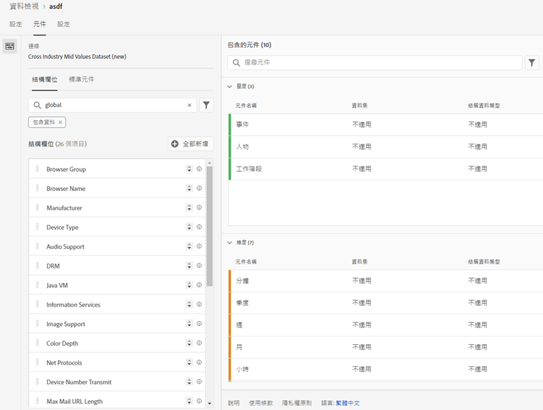
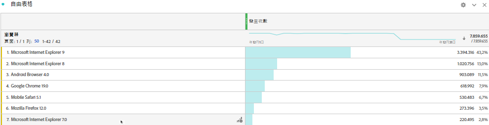

# 將標準查詢新增至資料集

>[!IMPORTANT]
>標準查詢僅適用於 CJA 中的 Analytics 資料連接器資料來源。您可以將其用於標準 Adobe Analytics 實施、[Adobe Experience Platform Web SDK](https://experienceleague.adobe.com/docs/experience-platform/edge/home.html) 或 Experience Platform 資料收集 API。

標準查詢 (也稱為 Adobe 提供的查詢) 可增強 Customer Journey Analytics 針對部分維度/屬性建立報表的能力，這些維度/屬性本身雖不實用，但與其他資料結合後效用甚大； 像是結合行動裝置和作業系統的屬性以及瀏覽器維度 (例如瀏覽器版本編號)，便是很實用的應用方式。「標準查詢」類似於查詢資料集。 標準查詢適用於採用 Experience Cloud 的所有組織。 內含特定 XDM 結構描述欄位的所有事件資料集，都會自動套用全域查詢 (請參閱底下的特定欄位說明)。 Adobe 正在分類的每個結構描述位置會有標準查詢資料集存在。

在傳統 Adobe Analytics 中，這些維度會自行顯示，但在 CJA 中，您必須在建立資料檢視時主動納入這些維度。 在連線工作流程中，您會選取被標記為有包含標準查詢索引鍵的資料集。 資料檢視 UI 會自動知道要納入可用於報告的所有標準查詢維度。 所有區域和帳戶的查詢檔案都會自動保持在最新狀態。這些檔案會儲存在與客戶相關聯區域的組織中。

## 搭配使用標準查詢與 Adobe Data Connector 資料集

標準查詢資料集會在報表時間自動套用。 如果您使用 Analytics 資料連接器，並引進 Adobe 為其提供標準查詢的維度，我們就會自動套用此標準查詢。 如果事件資料集包含 XDM 欄位，我們就能為該資料集套用標準查詢。

<!--
### Specific IDs that need to be populated

The following IDs need to be populated in the specific XDM mixins for this functionality to work:

* Environment Details Mixin – device/typeID value populated - Must match Device Atlas IDs and will populate device data.
* Adobe Analytics ExperienceEvent Template Mixin or Adobe Analytics ExperienceEvent Full Extension Mixin with analytics/environment/browserIDStr and analytics/environment/operatingSystemIDStr. Both must match the Adobe IDs and  populate browser and OS data, respectively.

You need these mixins with the three IDs populated (device/typeID, environment/browserIDStr, and environment/operatingSystemIDStr). The lookup dimensions will then be pulled automatically by CJA and will be available in the Data View.

The catch here is that they can only populate those IDs today if they have a direct relationship with Device Atlas. They are Device Atlas IDs, and they provide an API to allow a customer to look them up. This is a significant hurdle, and we may just want to take the reference to this capability out of the product documentation until we have a productized way to expose the Device Atlas ID lookup functionality.
-->

### 可用的標準查詢欄位

* `browser`
   * `browser`, `group_id`, `id`
* `browser_group`
   * `browser_group`, `id`
* `os`
   * `os`, `group_id`, `id`
* `os_group`
   * `os_group`, `id`
* `mobile_audio_support - multi`
* `mobile_color_depth`
* `mobile_cookie_support`
* `mobile_device_name`
* `mobile_device_number_transmit`
* `mobile_device_type`
* `mobile_drm - multi`
* `mobile_image_support - multi`
* `mobile_information_services`
* `mobile_java_vm - multi`
* `mobile_mail_decoration`
* `mobile_manufacturer`
* `mobile_max_bookmark_url_length`
* `mobile_max_browser_url_length`
* `mobile_max_mail_url_length`
* `mobile_net_protocols - multi`
* `mobile_os`
* `mobile_push_to_talk`
* `mobile_screen_height`
* `mobile_screen_size`
* `mobile_screen_width`
* `mobile_video_support - multi`

## 標準查詢維度報表

若要使用標準查詢維度來建立報表，請在 Customer Journey Analytics 中建立資料檢視時將其加入：

您可以在 Analysis Workspace 中看見查詢資料：

