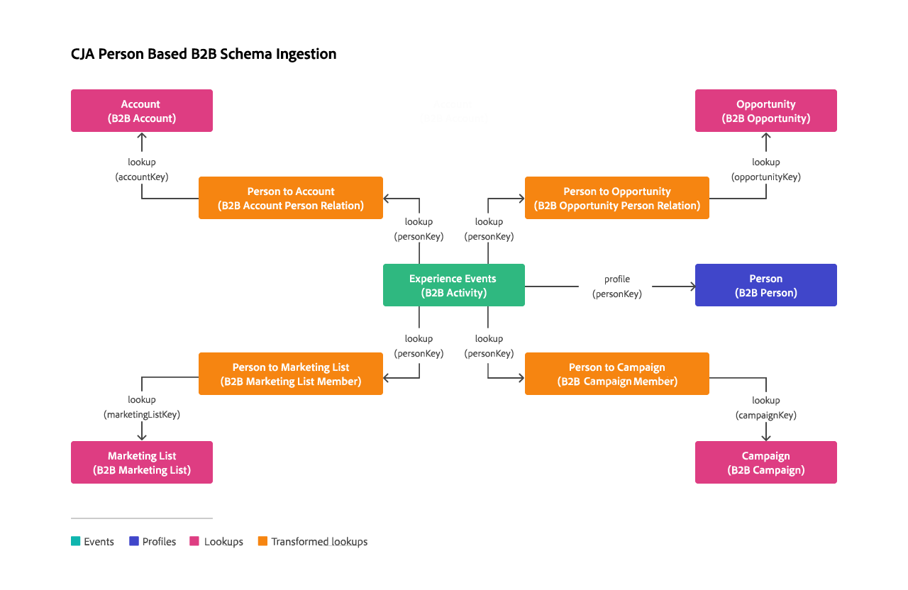

# 轉換資料集以進行 B2B 查詢

若要支援對B2B資料（包括帳戶、商機、行銷清單和行銷活動）進行以人員為基礎的查詢，轉換B2B查詢資料集可改善資料準確度。

根據下列類別，此轉換僅適用於包含B2B查詢結構描述資料的資料集：

* [XDM 商業帳戶個人關係](https://experienceleague.adobe.com/en/docs/experience-platform/xdm/classes/b2b/business-account-person-relation)
* [XDM 商業機會個人關係](https://experienceleague.adobe.com/en/docs/experience-platform/xdm/classes/b2b/business-opportunity-person-relation)
* [XDM 業務行銷清單會員](https://experienceleague.adobe.com/en/docs/experience-platform/xdm/classes/b2b/business-marketing-list-members)
* [XDM 商業活動會員](https://experienceleague.adobe.com/en/docs/experience-platform/xdm/classes/b2b/business-campaign-members)

>[!NOTE]
>
>每個ID最多有10,000個專案的限制。 此限制表示在任何特定人員ID中，您只能有10,000個帳戶、10,000個機會、10,000個行銷清單或10,000個行銷活動。

>[!PREREQUISITES]
>
>為了讓內嵌正常運作，您必須驗證B2B查詢資料集是否已針對下列欄位填入資料（如B2B查詢結構中所定義）：
>
>| 包含符合結構描述的資料的資料集 | 填入資料的欄位 |
>|---|---|
>| XDM 商業帳戶個人關係 | `accountPersonID` |
>| XDM商業機會人員 | `opportunityPersonID` |
>| XDM業務行銷清單 | `marketingListMemberID` |
>| XDM 商業活動會員 | `campaign.sourceKey` |
>

若要為B2B查詢資料集啟用轉換：

* 驗證每個資料集的&#x200B;**[!UICONTROL 索引鍵]**&#x200B;和&#x200B;**[!UICONTROL 相符索引鍵]**&#x200B;的建議值。 如果您變更建議值的值，將會看到要求您繼續的警告。 您必須確定：

   * 您為&#x200B;**Key**&#x200B;選取的值是以人員ID資料型別為基礎。
   * 您為&#x200B;**比對索引鍵**&#x200B;選取的值已定義為事件資料集的主要身分欄位。

* 選取匯入新資料和資料集回填的選項。

* 選取&#x200B;**[!UICONTROL 轉換資料集以進行B2B查詢]**。

  此選項將轉換資料集，使其可用於在 B2B 情境中進行人員型查詢。

  >[!IMPORTANT]
  >
  >一旦開啟，且儲存連線時，轉換便無法復原。 您無法修改金鑰、比對金鑰和轉換資料集組態。 您只能移除、新增，然後重新設定資料集。

若要為已經屬於現有連線的一或多個資料集啟用轉換：

1. 從連線中移除資料集。
1. 儲存連線。
1. 開啟資料集的轉換時，將資料集新增到連線。

## 背景資訊

對於根據上述四個結構描述類別的結構描述，未轉換的資料集可以包含單一人員識別碼的多列。 以人員為基礎的查詢只會符合該人員識別碼的最近一次出現，而無法正確以人員ID為基礎的帳戶、商機、行銷清單或行銷活動查詢。

轉換會修改四個結構描述類別（下圖中的橘色）中每個類別的資料集，以便針對每個人員識別碼在查詢資料集中（下圖中的粉紅色）建立相關資料（帳戶、商機、行銷清單或行銷活動）的（物件）陣列。 此轉換可讓以人員ID為基礎的查詢正確運作。

