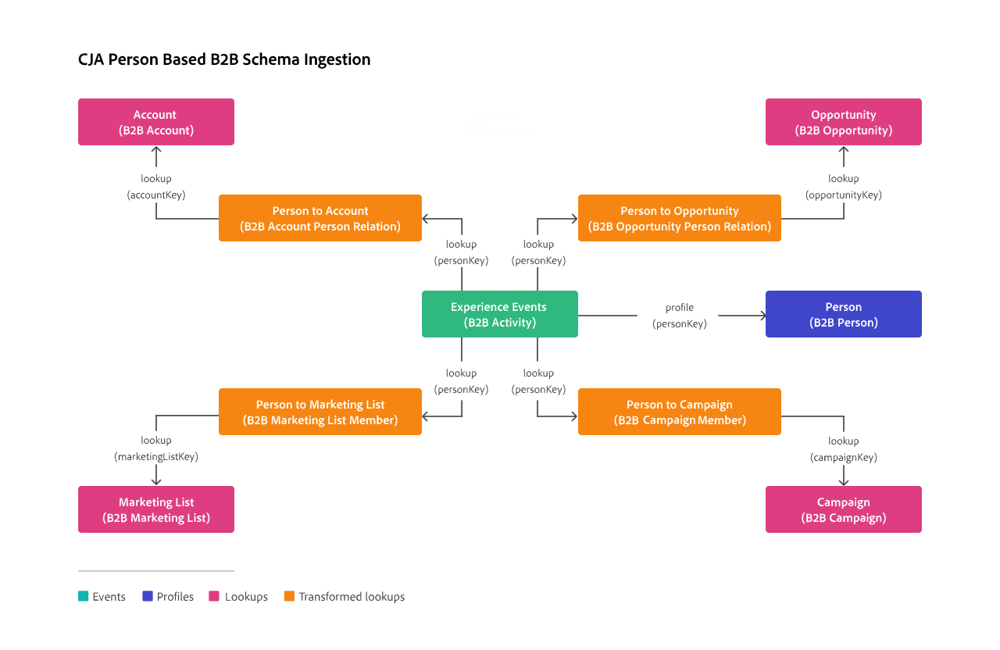

# 轉換B2B查詢的資料集

若要支援對B2B資料（包括帳戶、商機、行銷清單和行銷活動）以人員為基礎的查詢，需要轉換B2B查詢資料集。

根據下列類別，此轉換僅適用於包含B2B查詢結構描述資料的資料集：

* XDM 商業帳戶個人關係
* XDM 商業機會個人關係
* XDM 業務行銷清單會員
* XDM 商業活動會員

若要啟用這類資料集的轉換：

* 請確定您選取正確的識別碼 **[!UICONTROL 索引鍵]** 和 **[!UICONTROL 比對索引鍵]**，例如 `personKey.sourceKey`.

* 選取匯入新資料和資料集回填的選項。

* 選取 **[!UICONTROL 轉換B2B查詢的資料集]**.

  此選項會轉換資料集，以便用於B2B案例中的人員型查詢。

  >[!IMPORTANT]
  >
  >一旦開啟，且儲存連線時，轉換便無法復原。 儲存連線後，您無法修改資料集的轉換設定，除非移除資料集並再次新增至連線。

若要為已經屬於現有連線的一或多個資料集啟用轉換：

1. 從連線中移除資料集。
1. 儲存連線。
1. 開啟資料集的轉換時，將資料集新增到連線

## 背景資訊

對於根據上述四個結構描述類別的結構描述，未轉換的資料集可以包含單一人員識別碼的多列。 以人員為基礎的查詢只會符合該人員識別碼的最近一次出現，而無法正確以人員ID為基礎的帳戶、商機、行銷清單或行銷活動查詢。

轉換會修改四個結構描述類別（下圖中的橘色）中每個類別的資料集，以便針對每個人員識別碼在查詢資料集中（下圖中的粉紅色）建立相關資料（帳戶、商機、行銷清單或行銷活動）的（物件）陣列。 此轉換可讓以人員ID為基礎的查詢正確運作。

