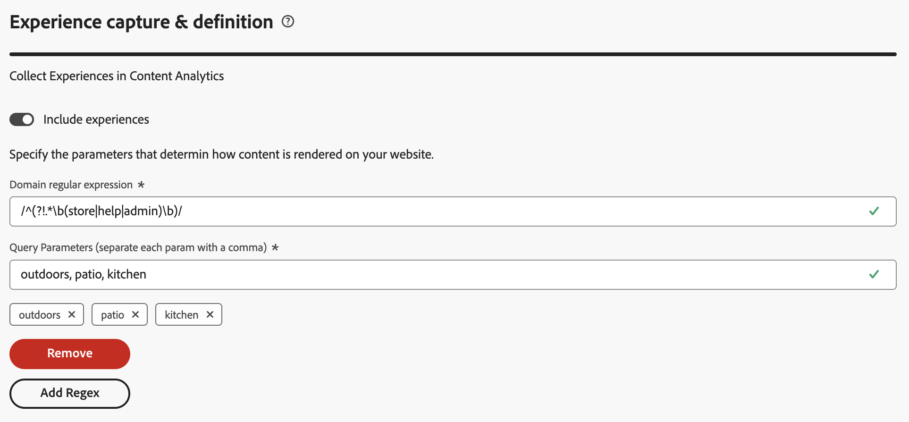

# Content Analytics 引導式設定

引導式設定可協助您快速輕鬆地設定 Content Analytics。 引導式設定會使用精靈來設定要求，可為您的組織自動設定 Content Analytics。 在「**[!UICONTROL 設定]**」畫面上，您可以建立新設定或編輯現有設定。

>[!IMPORTANT]
>
>您組織中每個沙箱只能有一個 Content Analytics 設定。

>[!NOTE]
>
>設定精靈支援多個資料檢視和管道，且與僅支援一個資料檢視和僅支援Web管道的舊版不同。 您必須先選取沙箱和連線，才能在[資料檢視](#data-views)區段中選取一或多個資料檢視。 **[!UICONTROL 體驗擷取]**、**[!UICONTROL 資料彙集]**&#x200B;和&#x200B;**[!UICONTROL 標題覆寫]**&#x200B;的組態是通道相依的，是您在[通道](#channels)區段中設定的每個通道的一部分。

存取 Content Analytics 設定

* 從 Customer Journey Analytics 主要選單中，選取「**[!UICONTROL 資料管理]** > **[!UICONTROL Content Analytics 設定]**」。

在 **[!UICONTROL Content Analytics 設定]**&#x200B;畫面中，您可以看到現有 Content Analytics 設定的表格。

對於每個設定，都提供下列詳細資訊：

| 欄 | 說明 |
|---|---|
| **[!UICONTROL 名稱]** | 設定的名稱。 |
| **[!UICONTROL 建立者]** | 建立設定的技術帳戶。 |
| **[!UICONTROL 建立日期]** | 建立設定時的時間戳記。 |
| **[!UICONTROL 修改日期]** | 上次修改設定時的時間戳記。 |
| **[!UICONTROL 沙箱]** | 組織內的沙箱，其中已經 (預計) 設定並已經 (預計) 實施 Content Analytics。 |
| **[!UICONTROL 狀態]** | 設定的狀態。 此狀態代表已完成設定的已啟用通道數。 使用開啟包含更多詳細資訊的快顯視窗。 |

您可以使用  來自訂表格。 選取「**[!UICONTROL 自訂表格]**」對話框中顯示哪些欄，然後選取「**[!UICONTROL 套用]**」以套用變更。

在 Content Analytics **[!UICONTROL 設定]**&#x200B;畫面中，您可以建立新設定或編輯現有設定。

建立新設定：

* 選取「**[!UICONTROL 建立設定]**」。 此動作會開啟[引導式設定精靈](#guided-configuration-wizard)。

編輯現有設定：

* 選取「」，然後選取「」來&#x200B;**[!UICONTROL 編輯]** 現有 Content Analytics 設定。 此動作會開啟[引導式設定精靈](#guided-configuration-wizard)。

## 引導式設定精靈

引導式設定精靈包含四個區段（[詳細資料](#details)、[連線](#connection)、[資料檢視](#data-view)和[管道](#channels)），每個區段都會提示您提供正確設定和設定Content Analytics所需的詳細資料。 在轉到下一部分之前，請先完成每個部分，因為部分中的某些設定可能取決於前面部分中的配置值。

### 詳細資料 {#onboarding-details}

>[!CONTEXTUALHELP]
>id="aca_onboarding_details_button"
>title="詳細資料"
>abstract="請提供連線的名稱。 在「**[!UICONTROL 資料視圖]**」、「**[!UICONTROL 經驗擷取與定義]**」和「**[!UICONTROL 資料收集]**」區段中，您提供更多詳細資訊以確保可以正確設定 Content Analytics。"

>[!CONTEXTUALHELP]
>id="aca_onboarding_details_name_header"
>title="詳細資料"
>abstract="此指南會設定所需需求，以設定 Content Analytics。 請提供此設定的名稱"

>[!CONTEXTUALHELP]
>id="aca_onboarding_connection_boldheader"
>title="連線"
>abstract="**Connection**"

>[!CONTEXTUALHELP]
>id="aca_onboarding_connection_header"
>title="連線"
>abstract="從 Customer Journey Analytics 中選取您想要與 Content Analytics 資料合併的現有連線。"

每個設定都需要一個唯一的名稱。 例如，`Example Content Analytics configuration`。 儲存或實施設定時需要該名稱。

對於每個設定，您也需要選取要為其設定Content Analytics的沙箱。

* **[!UICONTROL 名稱]**：每個設定都需要唯一的名稱。 例如，`Example Content Analytics configuration`。 儲存或實施設定時需要該名稱。

* **[!UICONTROL 沙箱]**：設定需要沙箱。 從您有權存取的沙箱清單中選取一個沙箱，並選取您要用於Content Analytics的資料收集位置。

  如果您變更已為其定義連線和選擇性資料檢視的設定沙箱，您會收到需要重新設定連線和資料檢視的通知。

### 連線

您必須選取要新增Content Analytics資料收集的連線。

如果您尚未為您的設定選取連線：

1. 使用 **[!UICONTROL 選取連線]**&#x200B;以開啟&#x200B;**[!UICONTROL 選取連線]**&#x200B;對話方塊，其中會列出沙箱上可用的所有連線。
1. 在&#x200B;**[!UICONTROL 選取連線]**&#x200B;對話方塊中，選取您要使用的連線。 您只能選取一個連線。
1. 選取&#x200B;**[!UICONTROL 使用連線]**。

如果您已選取連線，但想要變更該連線：

1. 選取 **[!UICONTROL 編輯]**。
1. 在&#x200B;**[!UICONTROL 選取連線]**&#x200B;對話方塊中，修改您要使用的連線。
1. 選取&#x200B;**[!UICONTROL 使用連線]**。

### 資料檢視 {#onboarding-data-view}

>[!CONTEXTUALHELP]
>id="ac_onboarding_dataview_button"
>title="資料視圖"
>abstract="如要設定 Content Analytics，您需選取一個現有的資料視圖。 這樣您才可以將 Content Analytics 資料與其他資料合併。"

>[!CONTEXTUALHELP]
>id="aca_onboarding_dataview_header"
>title="資料視圖"
>abstract="從 Customer Journey Analytics 中選取您想要與 Content Analytics 資料合併的現有資料視圖。"

>[!CONTEXTUALHELP]
>id="aca_onboarding_dataview_header_alt"
>title="資料視圖"
>abstract="從 Customer Journey Analytics 中選取您想要與 Content Analytics 資料合併的現有資料視圖。 "

>[!CONTEXTUALHELP]
>id="aca_onboarding_dataview_change_dialog"
>title="新的資料釋圖"
>abstract="您已經為這個設定選取新的資料視圖。 新的資料視圖將會更新並納入 Content Analytics 的量度和維度。 而這些量度和維度將會從原先選取的資料視圖中移除。  若有不同的連線與新的資料視圖相關聯，則該連線會更新並納入 Content Analytics 資料集。 Content Analytics 資料集不會從原先選取的連線中移除。"

>[!CONTEXTUALHELP]
>id="aca_onboarding_dataview_current_cleanup_labels_dialog"
>title="清除所選取的資料檢視"
>abstract="您選取了已針對 Content Analytics 佈建的資料檢視。 該現有的 Content Analytics 設定會被移除，而且資料檢視會使用您的新設定進行佈建。"

>[!CONTEXTUALHELP]
>id="aca_onboarding_dataview_prev_cleanup_labels_dialog"
>title="清除先前的資料檢視"
>abstract="您已選取一個新的資料檢視。 先前所選取之資料檢視的 Content Analytics 設定已移除。"

>[!CONTEXTUALHELP]
>id="aca_onboarding_dataview_new_dialog"
>title="新的資料釋圖"
>abstract="您已經為這個設定選取新的資料視圖。 新的資料視圖將會更新並納入 Content Analytics 的量度和維度。 現在資料視圖中類似的量度和維度將會被移除。 若有不同的連線與新的資料視圖相關聯，則該連線會更新並納入 Content Analytics 資料集。 請注意，現有設定中的 Content Analytics 資料集不會被移除。"

>[!CONTEXTUALHELP]
>id="ac_onboarding_dataviews_button"
>title="資料視圖"
>abstract="若要設定 Content Analytics，您需要選擇一個或多個資料釋圖。 這樣您才可以將 Content Analytics 資料與其他資料合併。"

>[!CONTEXTUALHELP]
>id="aca_onboarding_dataviews_header"
>title="資料視圖"
>abstract="從 Customer Journey Analytics 中選取一或多個您想要與 Content Analytics 資料合併的現有資料釋圖。"

>[!CONTEXTUALHELP]
>id="aca_onboarding_dataviews_header_alt"
>title="資料視圖"
>abstract="從 Customer Journey Analytics 中選取一或多個您想要與 Content Analytics 資料合併的現有資料釋圖。 "

>[!CONTEXTUALHELP]
>id="aca_onboarding_dataviews_new_dialog"
>title="所選資料釋圖"
>abstract="您已修改此設定的所選資料釋圖。 所選資料釋圖將會更新，並納入 Content Analytics 的量度與維度。 這些量度和維度將會從先前選取但已取消選取的資料視圖中移除。  若有不同的連線與所選資料檢視相關聯，則該連線會更新並納入 Content Analytics 資料集。 Content Analytics 資料集不會從原先選取的連線中移除。  所有所選資料視圖會繼承此設定所包含的管道。"

>[!CONTEXTUALHELP]
>id="aca_onboarding_dataviews_change_dialog"
>title="所選資料釋圖"
>abstract="您已修改此設定的所選資料釋圖。 所選資料釋圖將會更新，並納入 Content Analytics 的量度與維度。 這些量度和維度將會從先前選取但已取消選取的資料視圖中移除。  若有不同的連線與所選資料視圖相關聯，則該連線會更新並納入 Content Analytics 資料集。 Content Analytics 資料集不會從原先選取的連線中移除。  所有所選資料視圖會繼承此設定所包含的管道。"

>[!CONTEXTUALHELP]
>id="aca_onboarding_dataviews_current_cleanup_labels_dialog"
>title="所選資料釋圖"
>abstract="您已修改此設定的所選資料釋圖。 所選資料釋圖將會更新，並納入 Content Analytics 的量度與維度。 這些量度和維度將會從先前選取但已取消選取的資料視圖中移除。  若有不同的連線與所選資料視圖相關聯，則該連線會更新並納入 Content Analytics 資料集。 Content Analytics 資料集不會從原先選取的連線中移除。  所有所選資料視圖會繼承此設定所包含的管道。"

>[!CONTEXTUALHELP]
>id="aca_onboarding_dataviews_prev_cleanup_labels_dialog"
>title="所選資料釋圖"
>abstract="您已修改此設定的所選資料釋圖。 所選資料釋圖將會更新，並納入 Content Analytics 的量度與維度。 這些量度和維度將會從先前選取但已取消選取的資料視圖中移除。  若有不同的連線與所選資料視圖相關聯，則該連線會更新並納入 Content Analytics 資料集。 Content Analytics 資料集不會從原先選取的連線中移除。  所有所選資料視圖會繼承此設定所包含的管道。"

>[!CONTEXTUALHELP]
>id="aca_onboarding_channels_button"
>title="管道"
>abstract="啟用並設定此設定的一或多個管道。"

>[!CONTEXTUALHELP]
>id="aca_onboarding_channels_header"
>title="管道"
>abstract="啟用並設定此設定的一或多個管道。 此設定中所有資料釋圖保留已啟用的管道。"

您的設定需要選取一或多個[資料檢視](/help/data-views/data-views.md)。

如果您尚未選取設定的資料檢視：

1. 使用 **[!UICONTROL 選取資料檢視]**&#x200B;以開啟&#x200B;**[!UICONTROL 資料檢視]**&#x200B;對話方塊，其中會列出您已為Content Analytics設定的連線可用的所有資料檢視。
1. 在&#x200B;**[!UICONTROL 資料檢視]**&#x200B;對話方塊中，選取您要使用的一或多個資料檢視。
1. 選取&#x200B;**[!UICONTROL 「儲存」]**。

如果您已選取一或多個資料檢視，但想要變更該選取專案：

1. 選取 **[!UICONTROL 編輯資料檢視選擇]**。
1. 在&#x200B;**[!UICONTROL 資料檢視]**&#x200B;對話方塊中，修改您要使用的資料檢視選擇。
1. 選取&#x200B;**[!UICONTROL 「儲存」]**。

選取&#x200B;**[!UICONTROL 儲存]**&#x200B;後，您會看到&#x200B;**[!UICONTROL 選取的資料檢視]**&#x200B;對話方塊，通知您將Content Analytics納入選取的資料檢視的含意。 選取&#x200B;**[!UICONTROL 繼續]**&#x200B;以繼續，或選取&#x200B;**[!UICONTROL 取消]**&#x200B;以取消。

**[!UICONTROL 資料檢視]**&#x200B;對話方塊中有下列動作：

* 若要搜尋特定資料檢視，請使用欄位。
* 若要篩選可用資料釋圖的清單，請選取「」。 您可以篩選[!UICONTROL 所有者]上的清單。 使用 **[!UICONTROL 隱藏篩選器]**&#x200B;以隱藏區段窗格。
* 若要定義在表格中顯示哪些欄，請選取「」。 選取「**[!UICONTROL 自訂表格]**」對話框中顯示哪些欄，然後選取「**[!UICONTROL 套用]**」以套用變更。

### 管道

在&#x200B;**[!UICONTROL 管道]**&#x200B;區段中，選取要為Content Analytics啟用的管道。 您可以選取&#x200B;**[!UICONTROL 行動裝置]**&#x200B;與&#x200B;**[!UICONTROL 網頁]**&#x200B;之間。

* 若要選取您尚未設定的管道，請選取&#x200B;**[!UICONTROL 啟用]**。
* 若要選取已設定但您想要變更設定的管道，請選取&#x200B;**[!UICONTROL 編輯設定]**。

然後，您可以更詳細地設定頻道。 該組態會因您啟用並設定或編輯[行動裝置](#mobile)或[網頁](#web)頻道的組態而有所不同。

#### Mobile {#mobile}

<!-- For updated ACA -->

>[!CONTEXTUALHELP]
>id="aca_onboarding_datacollection_mobile_experience_locations_boldheader"
>title="行動體驗位置資料收集"
>abstract="**應排除的體驗位置**"

>[!CONTEXTUALHELP]
>id="aca_onboarding_datacollection_mobile_experience_locations_header"
>title="行動體驗位置資料彙集"
>abstract="指定在收集 Content Analytics 資料時，應&#x200B;**排除**&#x200B;哪些體驗位置。 請確定您排除了可識別個人身分的體驗位置。"

>[!CONTEXTUALHELP]
>id="aca_onboarding_datacollection_mobile_asset_locations_boldheader"
>title="行動資產位置資料彙集"
>abstract="**應排除的資產位置**"

>[!CONTEXTUALHELP]
>id="aca_onboarding_datacollection_mobile_asset_locations_header"
>title="行動資產位置資料彙集"
>abstract="指定在收集 Content Analytics 資料時，應&#x200B;**排除**&#x200B;哪些資產位置。 請確定您排除了可識別個人身分的資產位置。"

>[!CONTEXTUALHELP]
>id="aca_onboarding_datacollection_mobile_asset_urls_boldheader"
>title="行動資產 URL 資料彙集"
>abstract="**應排除的資產 URL**"

>[!CONTEXTUALHELP]
>id="aca_onboarding_datacollection_mobile_asset_urls_header"
>title="行動資產 URL 資料彙集"
>abstract="指定在收集 Content Analytics 資料時，應&#x200B;**排除**&#x200B;哪些資產 URL。 請確定您排除了可識別個人身分的資產 URL。"

針對行動裝置頻道，您可以設定[體驗擷取和定義](#experience-capture-and-definition)、[資料集合](#data-collection)和[標題覆寫](#header-overrides)。

##### 體驗擷取與定義 {#mobile-experience-capture-and-definition}

在此區段中，您可以選取將體驗包含在您透過Content Analytics收集的行動資料中。  對於行動裝置頻道，體驗是指您使用適用於Content Analytics的Adobe Experience Platform SDK註冊為體驗。

依預設，**[!UICONTROL 包含體驗]**&#x200B;已停用。

只有在您已檢測行動應用程式來註冊體驗並追蹤體驗檢視和體驗點按次數時，才考慮加入體驗。

##### 資料收集 {#mobile-data-collection}

資料收集設定可讓您定義要為Content Analytics收集哪些資料（體驗位置、資產位置、資產URL）。 請勿在該資料收集過程中收集任何個人識別資訊。

若要設定資料收集：

* 使用現有的行動標籤屬性或建立新的行動標籤屬性。

   * 若要使用現有的行動標籤屬性：

      1. 選取「**[!UICONTROL 選擇現有]**」。
      2. 從「**[!UICONTROL 標記屬性]**」下拉式選單中選取一個現有屬性。 您可以開始輸入文字，搜尋和限制可供使用的選項。 您無法選取其他已實作Content Analytics設定已使用的標籤屬性。

   * 若要建立新的行動標籤屬性：

      1. 選取「**[!UICONTROL 新建]**」。
      1. 指定&#x200B;**[!UICONTROL 標記名稱]**，例如 `ACA Test for Documentation`。
      1. 指定&#x200B;**[!UICONTROL 網域]**，例如 `example.com`。

* 指出在收集Content Analytics的資料時，應該排除哪些體驗位置。 請確定您排除了可識別個人身分的體驗位置。

  指定&#x200B;**[!UICONTROL 要排除的體驗位置]**&#x200B;的&#x200B;**[!UICONTROL 規則運算式字串]**。  例如： `^(?!.*documentation).*`從Content Analytics排除所有檔案體驗位置。

* 指示在收集Content Analytics的資料時，應該排除哪些資產位置。 請確定您排除了可識別個人身分的資產位置。

  為&#x200B;**[!UICONTROL 要排除的資產位置]**&#x200B;指定&#x200B;**[!UICONTROL 規則運算式字串]**。  例如： `^(?!.*(logo\.jpg)).*$`從Content Analytics排除所有含標誌JPEG影像的資產位置。

* 指示在收集Content Analytics的資料時應排除哪些資產URL。 請確定您排除了可識別個人身分的資產 URL。

  指定&#x200B;**[!UICONTROL 要排除的資產URL的**&#x200B;[!UICONTROL &#x200B;規則運算式字串&#x200B;]&#x200B;**]**。  例如： `^(?!.*(logo\.jpg)).*$`從Content Analytics排除所有參照標誌JPEG影像的資產URL。

##### 標頭覆寫 {#mobile-header-overrides}

<!-- needs modification for mobile channel -->

您可以選擇在&#x200B;**[!UICONTROL 標頭覆寫]**&#x200B;區段中指定標頭名稱和密碼標頭值。  此標題會覆寫設定，確保Content Analytics傳送自訂HTTP標題來擷取行動應用程式資產，略過機器人偵測或流量閘道技術。

1. 啟用&#x200B;**[!UICONTROL 設定標頭覆寫]**。
1. 輸入&#x200B;**[!UICONTROL 標頭名稱]**。 例如，`x-asset-service`。
1. 輸入&#x200B;**[!UICONTROL 標頭值]**。 您指定的任何內容都是機密，不會顯示在使用者介面中（除非您明確選取在輸入期間公開值）。

##### 儲存 {#mobile-save}

設定行動裝置頻道後，選取&#x200B;**[!UICONTROL 儲存]**&#x200B;以儲存設定。 選取&#x200B;**[!UICONTROL 取消]**&#x200B;以取消設定。

#### Web {#web}

對於Web管道，您可以設定[體驗擷取和定義](#experience-capture-and-definition-1)、[資料集合](#data-collection-1)和[標題覆寫](#header-overrides-1)。

>[!CONTEXTUALHELP]
>id="aca_onboarding_experiences_button"
>title="體驗擷取與定義"
>abstract="您可以選取在透過 Content Analytics 收集的資料中納入體驗。 選取時，您必須定義一個或多個正則表達式和查詢參數的組合，以定義您想要包含的體驗 URL。"

>[!CONTEXTUALHELP]
>id="aca_onboarding_experiences_header"
>title="體驗擷取與定義"
>abstract="在 Content Analytics 中收集體驗"

>[!CONTEXTUALHELP]
>id="aca_onboarding_experiences_parameters_header"
>title="體驗擷取與定義"
>abstract="指定用於判斷內容在網站上如何轉譯的參數。"

>[!CONTEXTUALHELP]
>id="aca_onboarding_experiencecapture_new_include_experiences"
>title="體驗擷取與定義"
>abstract="啟用後，便會收集體驗資料、產生體驗屬性，以及提供體驗報告。"

>[!CONTEXTUALHELP]
>id="aca_onboarding_experiencecapture_edit_include_experiences"
>title="體驗擷取與定義"
>abstract="啟用後，便會收集體驗資料、產生體驗屬性，以及提供體驗報告。   使用「 **[!UICONTROL 編輯]**」修改與目前設定關聯之標記屬性中的體驗資料收集設定。"

>[!CONTEXTUALHELP]
>id="aca_onboarding_experiencecapture_edit_button"
>title="體驗擷取與定義"
>abstract="您必須在 Adobe Content Analytics 擴充功能中編輯體驗資料收集的設定。"

>[!CONTEXTUALHELP]
>id="aca_onboarding_datacollection_button"
>title="資料收集"
>abstract="定義您要使用的標記屬性，或建立一個新屬性。 並且使用規則運算式定義想要包括或排除的頁面和資產。 對於與標記無關的實作，請選取「**[!UICONTROL 新建]**」。  標記屬性便會建立，但您無需使用它。"
>additional-url="https://experienceleague.adobe.com/zh-hant/docs//analytics-platform/using/content-analytics/configuration/tags-agnostic" text="Content Analytics JavaScript 程式庫"

>[!CONTEXTUALHELP]
>id="aca_onboarding_datacollection_tag_header"
>title="資料收集"
>abstract="**提供標記屬性**"

>[!CONTEXTUALHELP]
>id="aca_onboarding_datacollection_pages_excluded_boldheader"
>title="資料收集"
>abstract="**要包含/排除的頁面**"

>[!CONTEXTUALHELP]
>id="aca_onboarding_datacollection_pages_excluded_header"
>title="資料收集"
>abstract="在收集 Content Analytics 資料時，指名應&#x200B;**包含**&#x200B;或&#x200B;**排除**&#x200B;哪些頁面。 請確定您排除了可識別個人身分的頁面。"

>[!CONTEXTUALHELP]
>id="aca_onboarding_datacollection_assets_excluded_boldheader"
>title="資料收集"
>abstract="**要包含/排除的資產**"

>[!CONTEXTUALHELP]
>id="aca_onboarding_datacollection_assets_excluded_header"
>title="資料收集"
>abstract="在收集 Content Analytics 資料時，指名應&#x200B;**包含**&#x200B;或&#x200B;**排除**&#x200B;哪些資產。 請確定您排除了可識別個人身分的資產。"

>[!CONTEXTUALHELP]
>id="aca_onboarding_datacollection_experiences_edit_button"
>title="資料收集"
>abstract="您可以在頁面設定，使用目前設定相關的 Adobe Content Analytics 擴充功能設定。"

>[!CONTEXTUALHELP]
>id="aca_onboarding_datacollection_assets_edit_button"
>title="資料收集"
>abstract="您可以在資產設定，使用目前設定相關的 Adobe Content Analytics 擴充功能設定。"

>[!CONTEXTUALHELP]
>id="aca_onboarding_datacollection_tags_disabled_description "
>title="標記屬性已停用"
>abstract="Content Analytics 擴充功能已經啟用。"

<!-- For updated ACA -->

>[!CONTEXTUALHELP]
>id="aca_onboarding_datacollection_web_pages_boldheader"
>title="網頁資料收集"
>abstract="**要包含/排除的頁面**"

>[!CONTEXTUALHELP]
>id="aca_onboarding_datacollection_web_pages_header"
>title="網頁資料收集"
>abstract="在收集 Content Analytics 資料時，指名應&#x200B;**包含**&#x200B;或&#x200B;**排除**&#x200B;哪些頁面。"

>[!CONTEXTUALHELP]
>id="aca_onboarding_datacollection_web_assets_boldheader"
>title="網頁資產資料收集"
>abstract="**要包含/排除的資產**"

>[!CONTEXTUALHELP]
>id="aca_onboarding_datacollection_web_assets_header"
>title="網頁資產資料收集"
>abstract="在收集 Content Analytics 資料時，指名應&#x200B;**包含**&#x200B;或&#x200B;**排除**&#x200B;哪些資產。 請確定您排除了可識別個人身分的資產。"

##### 體驗擷取與定義 {#web-experience-capture-and-definition}

在此區段中，您可以選取將體驗包含在您使用Content Analytics收集的網頁資料中。  體驗由網頁上的所有文字組成，這些文字可使用最初使用者造訪的URL重現。

依預設，**[!UICONTROL 包含體驗]**&#x200B;為關閉狀態。 選取後，定義您要包含體驗的URL。

唯有當以下情況適用時才考慮納入體驗：

* 網站上的頁面必須能夠使用頁面 URL 進行複製。
* 任何給定使用者看到的文字內容都可以使用頁面 URL 進行複製，並且不需要依賴 cookie 或其他個人化機制。

>[!IMPORTANT]
>
>實施 [Content Analytics 版本設定](manual.md#versioning)，收集您根據 Content Analytics 對體驗 (頁面) 所做的變更。

###### 全新設定 {#new-experiences-configuration}

若要將體驗包含在全新或未實施的設定中：

1. 啟用&#x200B;**[!UICONTROL 包含體驗]**。 啟用體驗的切換會影響以下內容：

   * Content Analytics 擴充功能中的資料收集
   * 從 Content Analytics 事件資料產生體驗屬性的過程
   * Customer Journey Analytics 中的報告範本。

1. 選取&#x200B;**[!UICONTROL 新增Regex]**&#x200B;以新增網域規則運算式和查詢引數的組合。
1. 定義影響頁面內容的&#x200B;**[!UICONTROL 網域規則運算式]**&#x200B;和&#x200B;**[!UICONTROL 查詢引數]**&#x200B;組合，以指定內容在您網站上的呈現方式。
   1. 輸入&#x200B;**[!UICONTROL 網域規則運算式]**，例如 `/^(?!.*\b(store|help|admin)\b)/`。 確保使用 `/` 逸出規則運算式。 網域規則運算式會指出這些參數適用於哪些 URL。 例如，您可能有多個網站，並且每個網站都由不同的參數來推動內容。 若查詢參數適用於您的所有頁面，那麼您可以使用 `.*` 來指出所有頁面。
   1. 指定&#x200B;**[!UICONTROL 查詢引數]**&#x200B;的逗號分隔清單，例如`outdoors, patio, kitchen`。
1. 如果要刪除網域規則運算式和查詢參數的組合，請選取「**[!UICONTROL 刪除]**」。
1. 若要新增另一個規則運算式和查詢參數組合，請選取「**[!UICONTROL 新增規則運算式]**」。

###### 已實施的設定 {#implemented-experiences-configuration}

若要在已實施的設定中編輯現有體驗或包含新體驗，請執行下列操作：

* 切換「**[!UICONTROL 包含體驗]**」將其啟用或停用：

   * 從 Content Analytics 事件資料產生體驗屬性的過程
   * Customer Journey Analytics 中的報告範本。

* 選取「」**[!UICONTROL 「編輯]**」以進一步編輯Content Analytics中體驗的資料收集組態。 您會被重新導向至標記屬性中與目前設定相關的 [Adobe Content Analytics 擴充功能](https://experienceleague.adobe.com/zh-hant/docs/experience-platform/tags/extensions/client/content-analytics/overview#configure-event-segmenting)。

##### 資料收集 {#web-data-collection}

資料收集設定可讓您定義要為Content Analytics收集哪些資料（頁面、資產）。 請勿在該資料收集過程中收集任何個人識別資訊。

若要設定資料收集：

* 使用現有的Web標籤屬性或建立新的Web標籤屬性。

   * 若要使用現有的Web標籤屬性：

      1. 選取「**[!UICONTROL 選擇現有]**」。
      2. 從「**[!UICONTROL 標記屬性]**」下拉式選單中選取一個現有屬性。 您可以開始輸入文字，搜尋和限制可供使用的選項。 您無法選取其他已實作Content Analytics設定已使用的標籤屬性。

   * 若要建立新的Web標籤屬性：

      1. 選取「**[!UICONTROL 新建]**」。
      1. 指定&#x200B;**[!UICONTROL 標記名稱]**，例如 `ACA Test for Documentation`。
      1. 指定&#x200B;**[!UICONTROL 網域]**，例如 `example.com`。

     如果您想要使用[Content Analytics Javascript程式庫](/help/content-analytics/config/tags-agnostic.md)為Web Channel建立與Tags無關的實作，請使用新的Tags屬性。 Tags屬性已建立，但您無法在不可知的實作中使用屬性。 不過，不可知的實作需要您執行引導式設定精靈至少一次。

* 在收集 Content Analytics 資料時，指明應包括或排除哪些頁面。 請確定您排除了可識別個人身分的頁面。

  為&#x200B;**[!UICONTROL 要包含/排除]**&#x200B;的頁面指定&#x200B;**[!UICONTROL 規則運算式字串]**。  例如：`^(?!.*documentation).*`從 Content Analytics 中排除所有文件頁面。

* 在收集 Content Analytics 資料時，指明應包括或排除哪些資產。 請確定您排除了可識別個人身分的資產。

  為&#x200B;**[!UICONTROL 要包含/排除]**&#x200B;的資產指定&#x200B;**[!UICONTROL 規則運算式字串]**。  例如：`^(?!.*(logo\.jpg)).*$`，在 Content Analytics 中排除所有標誌的 JPEG 影像。

##### 標頭覆寫 {#web-header-overrides}

>[!CONTEXTUALHELP]
>id="aca_onboarding_datacollection_header_overrides_boldheader"
>title="標頭覆寫"
>abstract="**標頭覆寫**"

>[!CONTEXTUALHELP]
>id="aca_onboarding_datacollection_header_overrides_header"
>title="標頭覆寫"
>abstract="可繞過機器人偵測或流量閘口的進階功能。 Content Analytics 在呼叫您的端點時會包含自訂的 HTTP 標頭。"

<!-- needs modification for mobile channel -->

您可以選擇在&#x200B;**[!UICONTROL 標頭覆寫]**&#x200B;區段中指定標頭名稱和密碼標頭值。  此標題覆寫設定可確保Content Analytics傳送自訂HTTP標題以略過您已實作的機器人偵測或流量閘道技術。

1. 啟用&#x200B;**[!UICONTROL 設定標頭覆寫]**。
1. 輸入&#x200B;**[!UICONTROL 標頭名稱]**。 例如，`x-asset-service`。
1. 輸入&#x200B;**[!UICONTROL 標頭值]**。 您指定的任何內容都是機密，不會顯示在使用者介面中（除非您明確選取在輸入期間公開值）。

#### 儲存 {#web-save}

指定網頁頻道的詳細資料後，選取&#x200B;**[!UICONTROL 儲存]**&#x200B;以儲存設定。 選取&#x200B;**[!UICONTROL 取消]**&#x200B;以取消設定。

### 摘要 {#summary}

在您提供所有必要的詳細資訊後，摘要就會提供關於建立或修改成品的詳細資訊。

* 當您實施新設定時，您會看到&#x200B;**[!UICONTROL 您幾乎已準備好實施 _Content Analytics 的設定名稱_]**&#x200B;摘要。

* 對於已實施的配置，您會看到 **[!UICONTROL 您已實施 _配置名稱_ 用於 Content Analytics]** 概括。

### 動作 {#actions}

>[!CONTEXTUALHELP]
>id="aca_onboarding_implementation_warning_dialog"
>title="確認實作"
>abstract="如果您選取「**[!UICONTROL 實作]**」，將會根據您在此工作流程中提供的輸入來設定 Content Analytics。 系統會預設為根據一般適用於 Content Analytics 的情況選擇若干設定，但是您 (作為資料控管方) 必須檢視每個成品的設定，以確認所實作的設定均遵守您的隱私權原則、合約權利與義務，以及適用法律規定的同意要求。  請注意，必須先手動發佈與這個設定關聯的標記資料庫，才能開始收集資料。  為了衍生影像和文字的屬性，Adobe 會使用以下方式獲得屬性：<ol><li>根據已設定的資料收集設定，在使用者造訪網站時所擷取的頁面 URL，以及</li><li>託管影像的 URL。</li></ol>您不可以標記託管在第三方網站上的影像。"

建立或編輯設定時，您有以下選項：

* **[!UICONTROL 捨棄]**：做為設定之一部分所做的全部變更都會被捨棄。
* **[!UICONTROL 儲存以供之後使用]**：針對設定所做的變更會予以儲存。 您可以在之後的階段重新造訪設定，進行進一步的變更或實施該設定。 僅需要[!UICONTROL 名稱]的值即可儲存設定。
* **[!UICONTROL 實施]**：儲存並實施設定的設定或變更。 所有標示為的欄位都必須有適當的值。 實施包括：

   * **[!UICONTROL Customer Journey Analytics]** 設定：
      * 所選的資料檢視已更新，其中包含Content Analytics維度和量度。
      * 與所選取之資料檢視關連的連線已修訂為會包含 Content Analytics 事件和屬性資料集。
      * Content Analytics 報告範本已新增至 Workspace。

   * **[!UICONTROL Adobe Experience Platform]** 設定：
      * 建立結構描述來模擬 Content Analytics 事件、設定資產屬性和 (如果已設定) 體驗屬性。
      * 建立資料集來收集 Content Analytics 事件、設定資產屬性和 (如果已設定) 體驗屬性。
      * 建立使用特徵化服務從 Content Analytics 事件產生和更新內容屬性的資料流。

   * **[!UICONTROL 資料收集]**&#x200B;設定：
      * 全新或現有的標記屬性已設定為支援 Content Analytics 資料收集。 此設定意味著包含標記的 Adob&#x200B;&#x200B;e Content Analytics 擴充功能。
      * 為 Content Analytics 事件建立資料流。
      * Adobe Content Analytics 擴充功能已設定為會確保將 Content Analytics 事件傳送至 Content Analytics 的資料流。
      * 如果沒有為Tags屬性設定Web SDK或Mobile SDK，則會建立新的Web SDK或Mobile SDK設定，以僅傳送Content Analytics事件。
      * 如果為「標籤」屬性設定了「Web SDK」或「Mobile SDK」，則不會變更現有的「Web SDK」或「Mobile SDK」設定。

* **[!UICONTROL 儲存]**：對已實施設定進行的變更已儲存，並且實施已更新。
* **[!UICONTROL 退出]**。 退出引導式設定。 對已實施設定進行的所有變更都會被捨棄。

## 發佈 {#publish}

若要開始收集您Content Analytics設定的資料，您需要[手動](manual.md)為您啟用的管道發佈已建立的標籤屬性。

>[!MORELIKETHIS]
>
>[手動設定](manual.md)
>

