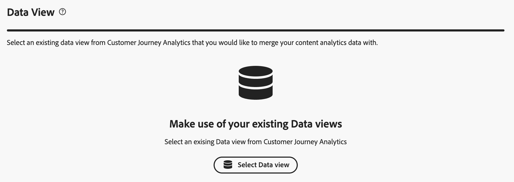

# Content Analytics 引導式設定

引導式設定可協助您快速輕鬆地設定 Content Analytics。引導式設定會使用精靈來設定要求，可為您的組織自動設定 Content Analytics。在「**[!UICONTROL 設定]**」畫面上，您可以建立新設定或編輯現有設定。

>[!IMPORTANT]
>
>您組織中每個沙箱只能有一個 Content Analytics 設定。

存取 Content Analytics 設定

* 從 Customer Journey Analytics 主要選單中，選取「**[!UICONTROL 資料管理]** > **[!UICONTROL Content Analytics 設定]**」。

在 **[!UICONTROL Content Analytics 設定]**&#x200B;畫面中，您可以看到現有 Content Analytics 設定的表格。

每個設定都提供以下詳細資訊：

| 欄 | 說明 |
|---|---|
| **[!UICONTROL 名稱]** | 設定的名稱。 |
| **[!UICONTROL 建立者]** | 建立設定的技術帳戶。 |
| **[!UICONTROL 建立日期]** | 建立設定時的時間戳記。 |
| **[!UICONTROL 修改日期]** | 上次修改設定時的時間戳記。 |
| **[!UICONTROL 沙箱]** | 組織內的沙箱，其中已經 (預計) 設定並已經 (預計) 實施 Content Analytics。 |
| **[!UICONTROL 狀態]** | 設定的狀態。狀態可能是：  **[!UICONTROL 草稿]**：設定僅儲存供之後使用，尚未部署。  **[!UICONTROL 失敗]**：設定失敗。您可以選取「**[!UICONTROL 編輯]**」，取得關於失敗的資訊。Adobe 會主動解決任何實施失敗的問題。您可以聯絡客戶服務部門了解詳情。 **[!UICONTROL 完成]**：設定已完成並成功實施。 |

您可以使用  來自訂表格。選取「**[!UICONTROL 自訂表格]**」對話框中顯示哪些欄，然後選取「**[!UICONTROL 套用]**」以套用變更。

在 Content Analytics **[!UICONTROL 設定]**&#x200B;畫面中，您可以建立新設定或編輯現有設定。

建立新設定：

* 選取「**[!UICONTROL 建立設定]**」。此動作會開啟[引導式設定精靈](#guided-configuration-wizard)。

編輯現有設定：

* 選取「」，然後選取「」來&#x200B;**[!UICONTROL 編輯]** 現有 Content Analytics 設定。此動作會開啟[引導式設定精靈](#guided-configuration-wizard)。

## 引導式設定精靈

引導式設定精靈由四個部分組成 ([詳細資料](#details)、[資料檢視](#data-view)、[體驗擷取與定義](#experience-capture-and-definition)和[資料收集](#data-collection))，每個部分都會提示您正確設立和設定 Content Analytics 所需的詳細資訊。在轉到下一部分之前，請先完成每個部分，因為部分中的某些設定可能取決於前面部分中的配置值。

### 詳細資料 {#onboarding-details}

<!-- markdownlint-disable MD034 -->

>[!CONTEXTUALHELP]
>id="aca_onboarding_details_button"
>title="詳細資料"
>abstract="請提供連線的名稱。在「**[!UICONTROL 資料視圖]**」、「**[!UICONTROL 經驗擷取與定義]**」和「**[!UICONTROL 資料收集]**」區段中，您提供更多詳細資訊以確保可以正確設定 Content Analytics。"

>[!CONTEXTUALHELP]
>id="aca_onboarding_details_name_header"
>title="詳細資料"
>abstract="此指南會設定所需需求，以設定 Content Analytics。請提供此設定的名稱"

<!-- markdownlint-enable MD034 -->

每個設定都需要一個唯一的名稱。例如，`Example Content Analytics configuration`。儲存或實施設定時需要該名稱。

### 資料檢視 {#onboarding-data-view}

<!-- markdownlint-disable MD034 -->

>[!CONTEXTUALHELP]
>id="ac_onboarding_dataview_button"
>title="資料檢視"
>abstract="如要設定 Content Analytics，您需選取一個現有的資料視圖。這樣您才可以將內容分析資料與其他資料合併。"

>[!CONTEXTUALHELP]
>id="aca_onboarding_dataview_header"
>title="資料檢視"
>abstract="從 Customer Journey Analytics 中選取您想要與內容分析資料合併的現有資料視圖。"

>[!CONTEXTUALHELP]
>id="aca_onboarding_dataview_header_alt"
>title="資料檢視"
>abstract="從 Customer Journey Analytics 中選取您想要與內容分析資料合併的現有資料視圖。 "

>[!CONTEXTUALHELP]
>id="aca_onboarding_dataview_change_dialog"
>title="新的資料檢視"
>abstract="選取新的資料視圖會導致更新該資料視圖，以包括 Content Analytics 量度和維度。若有必要，相關連線也會更新並包括 Content Analytics 資料集。目前已針對 Content Analytics 進行設定的連線和資料視圖並未修改。"

>[!CONTEXTUALHELP]
>id="aca_onboarding_dataview_current_cleanup_labels_dialog"
>title="清除所選取的資料檢視"
>abstract="您選取了已針對 Content Analytics 佈建的資料檢視。該現有的 Content Analytics 設定會被移除，而且資料檢視會使用您的新設定進行佈建。"

>[!CONTEXTUALHELP]
>id="aca_onboarding_dataview_prev_cleanup_labels_dialog"
>title="清除先前的資料檢視"
>abstract="您已選取一個新的資料檢視。先前所選取之資料檢視的 Content Analytics 設定已移除。"

>[!CONTEXTUALHELP]
>id="aca_onboarding_dataview_new_dialog"
>title="新的資料檢視"
>abstract="您已經為這個設定選取新的資料視圖。新的資料視圖將會更新並納入 Content Analytics 的量度和維度。現在資料視圖中類似的量度和維度將會被移除。 若有不同的連線與新的資料視圖相關聯，則該連線會更新並納入 Content Analytics 資料集。請注意，現有設定中的 Content Analytics 資料集不會被移除。"

<!-- markdownlint-enable MD034 -->

您的設定需要選取「[資料檢視](/help/data-views/data-views.md)」。

1. 選取資料檢視

   * 若要為設定選取新的資料檢視，請使用  **[!UICONTROL 選取資料檢視]**。

     

   * 若要修改設定的資料檢視，請選取「 **[!UICONTROL 編輯]**」。

     

   在兩種情境中，您都會看到一個&#x200B;**[!UICONTROL 資料檢視]**&#x200B;對話框，您可以在其中為您的設定選取資料檢視。

   

   對於新的設定，清單僅會顯示與沒有使用中設定之沙箱關聯的資料檢視。此外，您只能看到與您有權存取的沙箱，以及您有權修改的連線關聯的資料檢視。

   如果您編輯現有設定，則清單僅會顯示已與現有設定關聯之沙箱內可用的資料檢視。

   您可以執行下列動作:

   * 若要搜尋特定資料檢視，請使用欄位。
   * 若要篩選可用的資料檢視清單，請選取。 您可以篩選[!UICONTROL 連線]、[!UICONTROL 擁有者]和[!UICONTROL 沙箱]上的清單。 使用  **[!UICONTROL 隱藏區段]**&#x200B;來隱藏區段窗格。
   * 若要定義在表格中顯示哪些欄，請選取「」。選取「**[!UICONTROL 自訂表格]**」對話框中顯示哪些欄，然後選取「**[!UICONTROL 套用]**」以套用變更。

1. 選取  您想要使用的資料檢視。
1. 選取「**[!UICONTROL 儲存]**」，確認所選取的資料檢視。選取「**[!UICONTROL 取消]**」即可取消。

在 Customer Journey Analytics 中，[資料檢視](/help/data-views/data-views.md)與 Customer Journey Analytics [連線](/help/connections/overview.md)相連結。連線是以您組織內的沙箱為基礎。儲存設定後，**[!UICONTROL 沙箱]**&#x200B;欄位會根據所選取的資料檢視自動填入沙箱的名稱。

### 體驗擷取與定義 {#onboarding-experiences}

<!-- markdownlint-disable MD034 -->

>[!CONTEXTUALHELP]
>id="aca_onboarding_experiences_button"
>title="體驗擷取與定義"
>abstract="您可以選取在透過 Content Analytics 收集的資料中納入體驗。選取時，您必須定義一個或多個正則表達式和查詢參數的組合，以定義您想要包含的體驗 URL。"

>[!CONTEXTUALHELP]
>id="aca_onboarding_experiences_header"
>title="體驗擷取與定義"
>abstract="在 Content Analytics 中收集體驗"

>[!CONTEXTUALHELP]
>id="aca_onboarding_experiences_parameters_header"
>title="體驗擷取與定義"
>abstract="指定用於判斷內容在網站上如何轉譯的參數。"

>[!CONTEXTUALHELP]
>id="aca_onboarding_experiencecapture_new_include_experiences"
>title="體驗擷取與定義"
>abstract="啟用後，便會收集體驗資料、產生體驗屬性，以及提供體驗報告。"

>[!CONTEXTUALHELP]
>id="aca_onboarding_experiencecapture_edit_include_experiences"
>title="體驗擷取與定義"
>abstract="啟用後，便會收集體驗資料、產生體驗屬性，以及提供體驗報告。  使用「 **[!UICONTROL 編輯]**」修改與目前設定關聯之標記屬性中的體驗資料收集設定。"

>[!CONTEXTUALHELP]
>id="aca_onboarding_experiencecapture_edit_button"
>title="體驗擷取與定義"
>abstract="您必須在 Adobe Content Analytics 擴充功能中編輯體驗資料收集的設定。"

<!-- markdownlint-enable MD034 -->

在此區段中，您可以選取在透過 Content Analytics 收集的資料中納入體驗。體驗是網頁上的所有內容，可以使用初始使用者造訪該網頁時使用的 URL 進行複製。

依預設，**[!UICONTROL 包含體驗]**&#x200B;為關閉狀態。選取後，您必須定義要包含體驗的 URL。

唯有當以下情況適用時才考慮納入體驗：

* 網站上的頁面必須能夠使用頁面 URL 進行複製。
* 任何給定使用者看到的文字內容都可以使用頁面 URL 進行複製，並且不需要依賴 cookie 或其他個人化機制。

>[!IMPORTANT]
>
>實施 [Content Analytics 版本設定](manual.md#versioning)，收集您根據 Content Analytics 對體驗 (頁面) 所做的變更。

#### 全新設定 {#new-experiences-configuration}

若要將體驗包含在全新或未實施的設定中：

1. 啟用&#x200B;**[!UICONTROL 包含體驗]**。啟用體驗的切換會影響以下內容：

   * Content Analytics 擴充功能中的資料收集
   * 從 Content Analytics 事件資料產生體驗屬性的過程
   * Customer Journey Analytics 中的報告範本。

1. 指定用於決定內容在您的網站上如何進行轉譯的參數。參數為&#x200B;**[!UICONTROL 網域規則運算式]**&#x200B;和&#x200B;**[!UICONTROL 查詢參數]**&#x200B;的零個或多個組合。查詢參數會指出哪些參數會影響頁面內容。在定義獨特體驗時，此輸入讓 Content Analytics 能忽略任何不影響頁面內容的參數。
   1. 輸入&#x200B;**[!UICONTROL 網域規則運算式]**，例如 `/^(?!.*\b(store|help|admin)\b)/`。確保使用 `/` 逸出規則運算式。網域規則運算式會指出這些參數適用於哪些 URL。例如，您可能有多個網站，並且每個網站都由不同的參數來推動內容。若查詢參數適用於您的所有頁面，那麼您可以使用 `.*` 來指出所有頁面。
   1. 指定以逗號分隔的&#x200B;**[!UICONTROL 查詢參數清單，]**&#x200B;例如`outdoors, patio, kitchen`。
1. 如果要刪除網域規則運算式和查詢參數的組合，請選取「**[!UICONTROL 刪除]**」。
1. 若要新增另一個規則運算式和查詢參數組合，請選取「**[!UICONTROL 新增規則運算式]**」。

#### 已實施的設定 {#implemented-experiences-configuration}

若要在已實施的設定中編輯現有體驗或包含新體驗，請執行下列操作：

* 切換「**[!UICONTROL 包含體驗]**」將其啟用或停用：

   * 從 Content Analytics 事件資料產生體驗屬性的過程
   * Customer Journey Analytics 中的報告範本。

* 選取「 **[!UICONTROL 編輯]**」，進一步編輯 Content Analytics 體驗的資料收集設定。您會被重新導向至標記屬性中與目前設定相關的 [Adobe Content Analytics 擴充功能](https://experienceleague.adobe.com/zh-hant/docs/experience-platform/tags/extensions/client/content-analytics/overview#configure-event-segmenting)。

### 資料收集 {#onboarding-data-collection}

在此區段中，您可以設定要如何收集內容分析資料。

<!-- markdownlint-disable MD034 -->

>[!CONTEXTUALHELP]
>id="aca_onboarding_datacollection_button"
>title="資料收集"
>abstract="定義您要使用的標記屬性，或建立一個新屬性。並且使用規則運算式定義想要包括或排除的頁面和資產。"

>[!CONTEXTUALHELP]
>id="aca_onboarding_datacollection_tag_header"
>title="資料收集"
>abstract="**提供標記屬性**"

>[!CONTEXTUALHELP]
>id="aca_onboarding_datacollection_pages_excluded_boldheader"
>title="資料收集"
>abstract="**要包含/排除的頁面**"

>[!CONTEXTUALHELP]
>id="aca_onboarding_datacollection_pages_excluded_header"
>title="資料收集"
>abstract="在收集 Content Analytics 資料時，指明應&#x200B;**包含**&#x200B;或&#x200B;**排除**&#x200B;哪些頁面"

>[!CONTEXTUALHELP]
>id="aca_onboarding_datacollection_assets_excluded_boldheader"
>title="資料收集"
>abstract="**要包含/排除的資產**"

>[!CONTEXTUALHELP]
>id="aca_onboarding_datacollection_assets_excluded_header"
>title="資料收集"
>abstract="在收集 Content Analytics 資料時，指明應&#x200B;**包含**&#x200B;或&#x200B;**排除**&#x200B;哪些資產"

>[!CONTEXTUALHELP]
>id="aca_onboarding_datacollection_experiences_edit_button"
>title="資料收集"
>abstract="您可以在頁面設定，使用目前設定相關的 Adobe Content Analytics 擴充功能設定。"

>[!CONTEXTUALHELP]
>id="aca_onboarding_datacollection_assets_edit_button"
>title="資料收集"
>abstract="您可以在資產設定，使用目前設定相關的 Adobe Content Analytics 擴充功能設定。"

>[!CONTEXTUALHELP]
>id="aca_onboarding_datacollection_tags_disabled_description "
>title="標記屬性已停用"
>abstract="Content Analytics 擴充功能已經啟用。"

<!-- markdownlint-enable MD034 -->

#### 全新設定 {#new-configuration}

在新的設定中，您需要定義要使用現有的標記屬性，或建立新的標記屬性。同時，您需要使用規則運算式定義想要包括或排除的頁面和資產。

* 若要使用現有的標記屬性：

  

   1. 選取「**[!UICONTROL 選擇現有]**」。
   2. 從&#x200B;**[!UICONTROL 標籤屬性]**&#x200B;下拉式功能表中選取現有的屬性。 您可以開始輸入文字，搜尋和限制可供使用的選項。您無法選取已被其他已實施之 Content Analytics 設定所使用的標記屬性。

* 若要建立新的標記屬性：

  

   1. 選取「**[!UICONTROL 新建]**」。
   1. 指定&#x200B;**[!UICONTROL 標記名稱]**，例如 `ACA Test for Documentation`。
   1. 指定&#x200B;**[!UICONTROL 網域]**，例如 `example.com`。

* 在收集 Content Analytics 資料時，指明應包括或排除哪些頁面。

  針對&#x200B;**[!UICONTROL 要包括/排除的頁面]**&#x200B;指定規則運算式字串。 例如：`^(?!.*documentation).*`從 Content Analytics 中排除所有文件頁面。

* 在收集 Content Analytics 資料時，指明應包括或排除哪些資產。

  針對&#x200B;**[!UICONTROL 要包括/排除的資產]**&#x200B;指定規則運算式字串。 例如：`^(?!.*(logo\.jpg|\.svg)).*$`從 Content Analytics 中排除所有標誌 JPEG 和 SVG 影像。

>[!IMPORTANT]
>
>若您現有的 Web SDK 實施使用 [JavaScript 資料庫](https://experienceleague.adobe.com/zh-hant/docs/experience-platform/web-sdk/install/library)而非[標記擴充功能](https://experienceleague.adobe.com/zh-hant/docs/experience-platform/tags/extensions/client/web-sdk/web-sdk-extension-configuration)，請手動從新建立的標記屬性中將自動包含的 Web SDK 擴充功能移除。
>

#### 現有設定 {#existing-configuration}

對於現有設定，您無法編輯標記屬性。但是，您可以編輯要包括或排除的頁面和資產。

* 若要編輯在為 Content Analytics 收集資料時應包括或排除哪些頁面，請選取「**[!UICONTROL 體驗]**」下方的「 **[!UICONTROL 編輯]**」。您會被重新導向至與目前 Content Analytics 設定標記屬性關聯的 [Adobe Content Analytics 擴充功能](https://experienceleague.adobe.com/zh-hant/docs/experience-platform/tags/extensions/client/content-analytics/overview#configure-event-segmenting)。您可以編輯規則運算式以包括或排除頁面。請確保您有[發佈](#publish)您的變更。

* 若要編輯在為 Content Analytics 收集資料時應包括或排除哪些資產，請選取「**[!UICONTROL 資產]**」下方的「 **[!UICONTROL 編輯]**」。您會被重新導向至與目前 Content Analytics 設定標記屬性關聯的 [Adobe Content Analytics 擴充功能](https://experienceleague.adobe.com/zh-hant/docs/experience-platform/tags/extensions/client/content-analytics/overview#configure-event-segmenting)。您可以編輯規則運算式以包括或排除資產。請確保您有[發佈](#publish)您的變更。

### 摘要 {#summary}

在您提供所有必要的詳細資訊後，摘要就會提供關於建立或修改成品的詳細資訊。

* 當您實施新設定時，您會看到&#x200B;**[!UICONTROL 您幾乎已準備好實施 _Content Analytics 的設定名稱_]**&#x200B;摘要。

* 對於已實施的配置，您會看到 **[!UICONTROL 您已實施 _配置名稱_ 用於 Content Analytics]** 概括。

### 動作 {#actions}

<!-- markdownlint-disable MD034 -->

>[!CONTEXTUALHELP]
>id="aca_onboarding_implementation_warning_dialog"
>title="確認實作"
>abstract="如果您選取「**[!UICONTROL 實作]**」，將會根據您在此工作流程中提供的輸入來設定 Content Analytics。系統會預設為根據一般適用於 Content Analytics 的情況選擇若干設定，但是您 (作為資料控管方) 必須檢視每個成品的設定，以確認所實作的設定均遵守您的隱私權原則、合約權利與義務，以及適用法律規定的同意要求。  請注意，必須先手動發佈與這個設定關聯的標記資料庫，才能開始收集資料。  為了衍生影像和文字的屬性，Adobe 會使用以下方式獲得屬性：<ol><li>根據已設定的資料收集設定，在使用者造訪網站時所擷取的 URL，以及</li><li>託管影像的 URL。</li></ol>您不可以標記託管在第三方網站上的影像。"

<!-- markdownlint-enable MD034 -->

建立或編輯設定時，您有以下選項：

* **[!UICONTROL 捨棄]**：做為設定之一部分所做的全部變更都會被捨棄。
* **[!UICONTROL 儲存以供之後使用]**：針對設定所做的變更會予以儲存。您可以在之後的階段重新造訪設定，進行進一步的變更或實施該設定。僅需要[!UICONTROL 名稱]的值即可儲存設定。
* **[!UICONTROL 實施]**：儲存並實施設定的設定或變更。所有標示為  必要的欄位都需要有適當的值。實施包括：

   * **[!UICONTROL Customer Journey Analytics]** 設定：
      * 所選取的資料檢視已更新，以納入 Content Analytics 維度和量度。
      * 與所選取之資料檢視關連的連線已修訂為會包含 Content Analytics 事件和屬性資料集。
      * Content Analytics 報告範本已新增至 Workspace。

   * **[!UICONTROL Adobe Experience Platform]** 設定：
      * 建立結構描述來模擬 Content Analytics 事件、設定資產屬性和 (如果已設定) 體驗屬性。
      * 建立資料集來收集 Content Analytics 事件、設定資產屬性和 (如果已設定) 體驗屬性。
      * 建立使用特徵化服務從 Content Analytics 事件產生和更新內容屬性的資料流。

   * **[!UICONTROL 資料收集]**&#x200B;設定：
      * 全新或現有的標記屬性已設定為支援 Content Analytics 資料收集。此設定意味著包含標記的 Adob&#x200B;&#x200B;e Content Analytics 擴充功能。
      * 為 Content Analytics 事件建立資料流。
      * Adobe Content Analytics 擴充功能已設定為會確保將 Content Analytics 事件傳送至 Content Analytics 的資料流。
      * 如果沒有為標記屬性設定 Web SDK，則會建立僅傳送 Content Analytics 事件的全新 Web SDK 設定。
      * 若有針對此標記屬性設定 Web SDK，現有 Web SDK 設定不會有任何變更。

* **[!UICONTROL 儲存]**：對已實施設定進行的變更已儲存，並且實施已更新。
* **[!UICONTROL 退出]**。退出引導式設定。對已實施設定進行的所有變更都會被捨棄。

## 發佈 {#publish}

若要開始為您的 Content Analytics 設定收集資料，您需要[手動](manual.md)發佈在您選取&#x200B;**[!UICONTROL 實施]**&#x200B;後所建立的標記屬性。

>[!MORELIKETHIS]
>
>[手動設定](manual.md)
>
