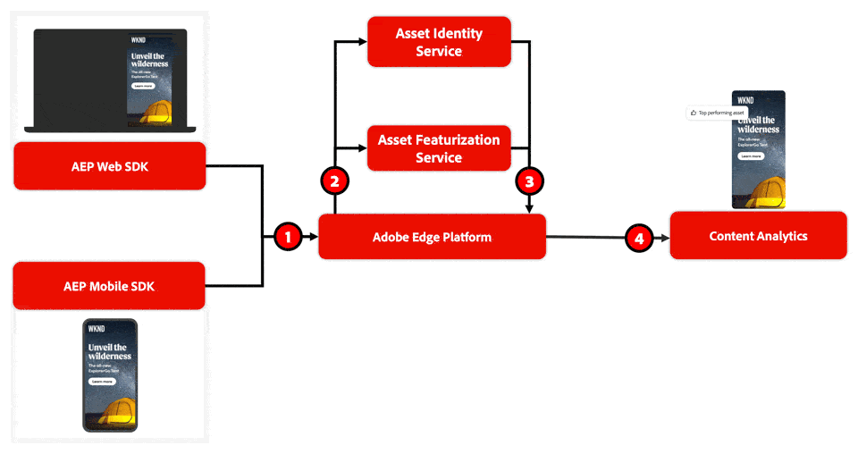

# Content Analytics 概觀

Content Analytics 能幫助行銷人員了解內容如何影響企業已定義的關鍵績效指標。 除了行為資料外，Content Analytics還收集有關內容使用方式以及內容如何推動影響的資料。 例如，客戶對於特定語調、特定色調或特定主題的反應是否較好？ 這些資訊與專門設計的報告工作流程和範本，可以幫助您在 Customer Journey Analytics 中進行更好的分析，並獲得有關客戶歷程資料的更深入洞察。

Content Analytics 會使用人工智慧式和機器學習式的&#x200B;**特徵化服務**，將內容劃分為元件和屬性。 透過在所有內容上建立結構化的中繼資料設定檔，您可以分析哪些內容以及該內容的哪些屬性可推動業務成果。

除了結構化中繼資料設定檔的建立之外，Content Analytics 還提供&#x200B;**身分識別服務**，使用單一識別碼來識別資產和體驗。 身分識別服務可以識別完全相同資產出現在多個地方的情況。 當這種情況發生時，此資產的實例將被視為相同資產，這樣可以更全面地了解內容的使用和消費。

## 值

Content Analytics 確實不斷提升其價值：

1. 內容&#x200B;**使用方式**：透過 Content Analytics，可以獲得哪些資產正獲得曝光度，以及資產是在哪裡獲得曝光度的洞察。 這些見解可協助您檢視您的網頁和行動屬性上是否未妥善使用或過度使用資產。
1. 內容&#x200B;**參與度**：Content Analytics 可以提供參與度洞察，例如某些屬性的資產平均點擊率。 這些洞察可以幫助您確定特定類型的體驗是否仍然有效。
1. 內容歷程：此外，當結合Experience Platform中所有其他可用的資料時，您可以獲得內容歷程的其他深入分析；例如，除了參與之外，特定內容是否會導致轉換。 例如，特定內容是否會導致轉換，以及參與度。 了解這些事情後，您就可以確定內容類型的投資報酬率。
1. 內容&#x200B;**個人化**：最終，Content Analytics 可讓您根據自己的分析採取行動，並使用這些洞察來確定如何花錢在內容上。 例如，我應該向特定客群發送特定類型的內容嗎？ 哪些內容能為我提供高度個人化的機會？

## 術語

Content Analytics 會使用以下關鍵用語：

* **體驗**：體驗是網頁上的所有文字，可以使用最初使用者用來造訪網頁的URL來複製。 或是文字、資產和按一下以動作在行動應用程式中的組合。 每次體驗都會有一個唯一識別碼。
* **資產**：資產是獨立且獨特的內容，例如影像。 每項資產亦會獲得一個唯一識別碼和一個感知 ID。 感知 ID 是與視覺上相同的資產共用的識別碼。 可感知ID有助於去除重複資產，這些資產可能具有不同的資產URL，因此具有不同的資產ID，但在感知上完全相同。
* **屬性**：屬性是與體驗或資產相關的描述性中繼資料元素。 屬性的範例有：攝影風格、可讀性、說服策略、物件顏色、背景顏色。

## 運作方式

Content Analytics使用來自Experience Platform事件資料集的網頁和行動影像檢視資料來[收集內容事件資料](config/datacollection.md)。 這些內容體驗事件需要使用Experience Platform Edge Network （網頁SDK、行動SDK、伺服器API）來收集資料。 行為資料可以使用Web SDK、Mobile SDK或Analytics Source Connector來收集。

1. 當使用者造訪針對Content Analytics[&#128279;](config/configuration.md)、Experience Platform Web或Mobile SDK設定的網站或應用程式時，會記錄曝光次數以及與內容的互動。
1. 身分和功能化服務會處理這些互動。 過程包括一項獲取服務，其會重新檢視定義互動之已設定 URL 的公開版本。 對於所有這些獲取到的 URL，身分識別服務是唯一識別體驗和資產的服務。 此外，功能化服務會套用AI/ML服務，探索體驗和資產中繼資料及屬性。
1. 這些服務 ([元件、屬性和身分識別](/help/content-analytics/report/components.md)) 的結果將用於更新 Experience Platform 中相關的特定 Content Analytics 資料集。
1. 您可以在Customer Journey Analytics設定（[連線](/help/connections/overview.md)、[資料檢視](/help/data-views/data-views.md)和[Workspace](/help/analysis-workspace/home.md)）中使用Content Analytics資料，以及行為資料和其他查詢資料。 該設定提供了對您的內容進行獨特巨集層級深入分析的基礎。  您可以使用[Content Analytics範本](/help/content-analytics/report/report.md#template)快速開始您的Content Analytics報表和分析。

>[!NOTE]
>
>Content Analytics 利用 AI/ML 服務，可能會產生不準確或誤導性的結果。 因此，請運用您的判斷力來檢閱和驗證 AI/ML 所產生的輸出。
>
>您可以使用&#x200B;**[!UICONTROL 意見回饋]**&#x200B;索引標籤，可從主介面上的  找到，提供有關 AI/ML 產生之輸出的意見回饋。
>

>[!NOTE]
>
>如果您已授權Privacy and Security Shield附加元件，請注意DULE標籤或客戶自控金鑰不會涵蓋受Content Analytics約束的體驗和資產。 此外，Content Analytics 不是符合 HIPAA 標準的服務。
>

>[!IMPORTANT]
>
>Content Analytics僅支援英文版的功能。
>

>[!MORELIKETHIS]
>
>[Content Analytics報告](report/report.md)
>[設定 Content Analytics](config/configuration.md)
>[在 Customer Journey Analytics 中計算退回與退回率](https://experienceleaguecommunities.adobe.com/adobe-analytics-3/calculating-bounces-bounce-rate-in-adobe-customer-journey-analytics-options-and-implications-12722)
>

