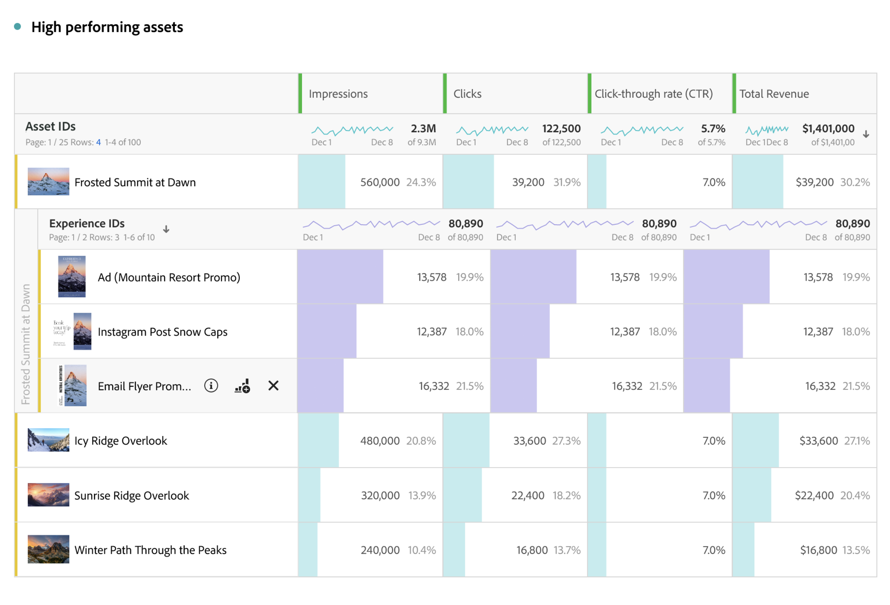

# Content Analytics 報告概觀

您可以在 [Analysis Workspace 中製作報告、執行分析並獲得有關 Content Analytics 的深入分析](/help/analysis-workspace/home.md)。特定的 Workspace [範本](#template) 已可使用，讓您可以立即存取預先填入相關內容深入分析的 Workspace 專案。

若要在 Content Analytics 從頭開始製作報告：

1. [在 Workspace 中建立一個新的 &#x200B;](/help/analysis-workspace/build-workspace-project/create-projects.md) 或 [&#x200B; 以開啟現有的 &#x200B;](/help/analysis-workspace/build-workspace-project/open-projects.md) 專案。
1. 請務必為 Content Analytics 報告[選取一個資料視圖](/help/analysis-workspace/c-panels/panels.md#data-view)。Content Analytics 報告僅適用於針對 Content Analytics [設定](/help/content-analytics/config/configuration.md)的資料視圖。
1. 將 [自由格式表格](/help/analysis-workspace/visualizations/freeform-table/freeform-table.md)視覺化拖曳到畫布上。
1. 使用[特定的Content Analytics元件](components.md)和其他一般[元件](/help/components/overview.md) （如區段、日期範圍、註解）來建置您的Content Analytics深入分析。

## 縮圖

根據您在專案中使用的 Content Analytics 特定維度，將會顯示資產和維度的縮圖。

依預設會顯示相關 Content Analytics 維度的縮圖。若要設定 Content Analytics 維度的縮圖顯示：

* 將滑鼠停留在 Content Analytics 維度的標題列上。例如，「**[!UICONTROL 資產 ID]**」或「**[!UICONTROL 體驗 ID]**」。
* 選取。
* 在「**[!UICONTROL 列設定]**」快顯視窗中，在「**[!UICONTROL 設定]**」下方，勾選或取消勾選「**[!UICONTROL 顯示縮圖]**」。

## 預覽

對於顯示縮圖的 Content Analytics 維度列，可以開啟預覽快顯視窗。

若要開啟包含以下詳細資訊的預覽：

* 選取「」。您會看到以下詳細資訊。

  | 體驗預覽 | 資產預覽 |
  |---|---|
  |  |  |
  | 維度的名稱 (例如「**[!UICONTROL 體驗 ID]」)** | 資產維度的名稱 (例如「**[!UICONTROL 資產 ID]」)** |
  | **[!UICONTROL 印象 (所有時間)]**：體驗的印象。 | **[!UICONTROL 印象 (所有時間)]**：資產的印象次數。 |
  | **[!UICONTROL 資產]**：此體驗包含的資產數量。 選取「」「**[!UICONTROL 劃分]**」以檢查資產。 | **[!UICONTROL 體驗]**：顯示此資產的體驗次數。 選取「」「**[!UICONTROL 劃分]**」以檢查資產。 |
  | **[!UICONTROL 第一印象]**：對體驗的第一印象日期。 | **[!UICONTROL 第一印象]**：對資產的第一印象日期。 |
  | **[!UICONTROL 最近的印象]**：對體驗的最近印象日期。 | **[!UICONTROL 最近的印象]**：對資產的最近印象日期。 |
  | **[!UICONTROL 體驗屬性]**：體驗的 [屬性](/help/content-analytics/report/components.md#experience-attributes)。 | **[!UICONTROL 資產屬性]**：資產的 [屬性](/help/content-analytics/report/components.md#asset-attributes)。 |

## 範本

Content Analytics [範本](/help/analysis-workspace/templates/use-templates.md)可協助您瞭解哪些內容和內容屬性表現最佳。 此範本是 [Web 管道和參與度使用案例](/help/analysis-workspace/templates/use-templates.md#web-engagement)的一部分，詳細說明您的內容在精細度的表現情況。您可以查看個別資產或特定屬性的效能。

您可以根據所學到的內容展現才華。例如在首頁推廣高效能資產、針對特定區段將內容個人化以納入高效能屬性，或者淘汰已開始過時的內容。

若要使用範本：

1. 從主選單中選取「**[!UICONTROL Workspace]**」。
1. 確訂您選取了針對 Content Analytics 設定的資料視圖。
1. 搜尋或使用區段(**[!UICONTROL 頻道]**&#x200B;的&#x200B;**[!UICONTROL 網頁]**&#x200B;和&#x200B;**[!UICONTROL 使用案例]**&#x200B;**的**&#x200B;4&rbrace;參與[!UICONTROL )來尋找及選取]Content Analytics **[!UICONTROL 範本。]**
1. 選取&#x200B;**[!UICONTROL 使用範本]**。
1. 在「**[!UICONTROL 設定您的範本]**」對話框中，從「**[!UICONTROL 選取轉換量度]**」對話框選取一個量度。例如「**[!UICONTROL 資產點按率]**」。
1. 選取「**[!UICONTROL 繼續]**」。

**[!UICONTROL Content Analytics 概觀]**&#x200B;專案會在 [Analysis Workspace](/help/analysis-workspace/home.md) 中開啟。此專案由四個[面板](/help/analysis-workspace/c-panels/panels.md)組成，其中各個面板提供[自由格式表格](/help/analysis-workspace/visualizations/freeform-table/freeform-table.md)和[視覺效果](/help/analysis-workspace/visualizations/freeform-analysis-visualizations.md)來回答一個特定問題：

* **哪些內容表現最佳?**
此面板可幫助您瞭解哪些體驗及其中的資產正推動參與度和轉換率。體驗是在特定時間擷取的一個完整網頁。體驗可以包含文字和多個單獨的影像資產。資產是個別的影像。

  面板由以下視覺效果組成：

   * **體驗**。

     >[!NOTE]
     >
     >這些視覺效果只有在 Content Analytics 設定中[包含體驗](/help/content-analytics/config/guided.md#experience-capture-and-definition)時才會顯示。
     > 

      * **體驗點按率**：[摘要變更](/help/analysis-workspace/visualizations/summary-number-change.md)視覺效果，顯示體驗點按率。
      * **轉換率最高的體驗**：[橫條圖](/help/analysis-workspace/visualizations/horizontal-bar.md)視覺效果顯示根據所選取轉換量度的最高轉換率體驗。
      * **績優體驗**：針對績優體驗的[自由格式表格](/help/analysis-workspace/visualizations/freeform-table/freeform-table.md) (包括[縮圖](#thumbnails)和[預覽](#previews))。

   * **資產**

      * **資產點按率**
[摘要變更](/help/analysis-workspace/visualizations/summary-number-change.md)顯示資產點按率的視覺效果。
      * **轉換率最高的資產**
[橫條圖](/help/analysis-workspace/visualizations/horizontal-bar.md)視覺效果顯示根據所選取轉換量度的最高轉換率資產。
      * **績優資產**
針對績優資產的[自由格式表格](/help/analysis-workspace/visualizations/freeform-table/freeform-table.md) (包括[縮圖](#thumbnails)和[預覽](#previews))。
      * **資產 - 檢視與轉換。**
[散佈圖](/help/analysis-workspace/visualizations/scatterplot.md)視覺效果顯示資產檢視量與資產轉換量的散佈圖。

* **哪些資產屬性有助於轉換?**
Content Analytics 使用 AI 和 GenAI 自動指派每個資產中繼資料，例如主體、場景、前景顏色等。屬性是描述資產或經驗內容的 AI 指派中繼資料標記。例如：<code>前景顏色：紅色</code> 是自動指派的屬性。視覺效果有助於確定資產的哪些屬性對轉換最有貢獻。

  面板由以下視覺效果組成：

   * **轉換率最高的資產屬性**
[橫條圖](/help/analysis-workspace/visualizations/horizontal-bar.md)顯示根據所選取轉換量度的最高轉換率資產屬性。
   * **相較於前 30 天，轉換率最高的資產屬性**
[橫條圖](/help/analysis-workspace/visualizations/horizontal-bar.md)視覺效果顯示根據所選取的轉換量度，相較於前 30 天，轉換率最高的資產屬性。
   * **轉換率最高的資產屬性資料**
[自由格式表格](/help/analysis-workspace/visualizations/freeform-table/freeform-table.md)顯示根據所選取轉換量度的最高轉換屬性。選取表格中的一列來更新屬性趨勢視覺效果。
   * **屬性趨勢**
[線條圖](/help/analysis-workspace/visualizations/line.md)視覺效果顯示所選取轉換率最高之資產屬性的屬性趨勢。
   * **資產前景顏色**
範例[自由格式表格](/help/analysis-workspace/visualizations/freeform-table/freeform-table.md)比較來自單一資產屬性類別：前景顏色的項目效能。您可以用其他資產屬性類別維度取代此資產屬性。

* **哪些體驗屬性有助於轉換？**

  >[!NOTE]
  >
  >此面板僅在 Content Analytics 設定中[包含體驗](/help/content-analytics/config/guided.md#experience-capture-and-definition)時顯示。
  > 

  資產屬性著重於影像的視覺特性，而體驗屬性則著重於頁面中的文字。以下的視覺化圖表可以讓您探索哪些體驗屬性有助於轉換。這些屬性也使用 AI 和 GenAI 模型自動指派。

  面板由以下視覺效果組成：

   * **轉換率最高的體驗屬性**
[橫條圖](/help/analysis-workspace/visualizations/horizontal-bar.md)顯示根據所選取轉換量度的最高轉換率體驗屬性。
   * **相較於前 30 天，轉換率最高的體驗屬性**
[橫條圖](/help/analysis-workspace/visualizations/horizontal-bar.md)視覺效果顯示根據所選取的轉換量度，相較於前 30 天，轉換率最高的體驗屬性。
   * **轉換率最高的體驗屬性資料**
[自由格式表格](/help/analysis-workspace/visualizations/freeform-table/freeform-table.md)顯示根據所選取轉換量度的最高轉換體驗。選取表格中的一列來更新線條圖視覺效果。
   * **線條圖**
[線條圖](/help/analysis-workspace/visualizations/line.md)視覺化顯示所選取最高轉換率體驗屬性的趨勢。
   * **體驗關鍵字**
[自由格式表格](/help/analysis-workspace/visualizations/freeform-table/freeform-table.md)顯示根據所選取轉換量度的熱門體驗關鍵字。

* **資產會出現在我網站上的什麼地方?**
面板是由一個自由格式表格組成，其中詳細說明您網站上瀏覽次數最多的資產所出現的位置。

  此面板由一個視覺化內容組成：

   * **檢視次數最多的資產出現在哪裡?**
您可以按維度劃分任何資產，以協助您進一步了解該影像出現的位置。

     在範例[自由格式表格](/help/analysis-workspace/visualizations/freeform-table/freeform-table.md) (包括[縮圖](#thumbnails)和[預覽](#previews))，使用「**[!UICONTROL 資產感知 ID]**」而非「[!UICONTROL 資產 Id]」。完全相同的影像有時可能會透過不同的影像 URL 重複出現在您的網站上。[!UICONTROL 資產感知 ID] 屬性有助於將這些重複項目分組到單一 ID 之下。

     由於資產可能會在頁面上變更，因此每個資產都按&#x200B;**[!UICONTROL 體驗 Id]** 劃分，以識別資產出現在該頁面的哪個版本。您可以用其他維度取代[!UICONTROL 體驗 Id]，以協助您了解資產在您網站上的位置。例如「[!UICONTROL 頁面名稱]」、「[!UICONTROL 頁面 URL]」或「[!UICONTROL 網站區段]」。

     您也可以用[!UICONTROL 資產感知 ID] 交換[!UICONTROL 資產 ID]，以取得參照特定影像 URL 的位置記錄。

>[!MORELIKETHIS]
>
>[Content Analytics 元件](components.md)
>&#x200B;>[使用範本](/help/analysis-workspace/templates/use-templates.md#web-engagement)
>
