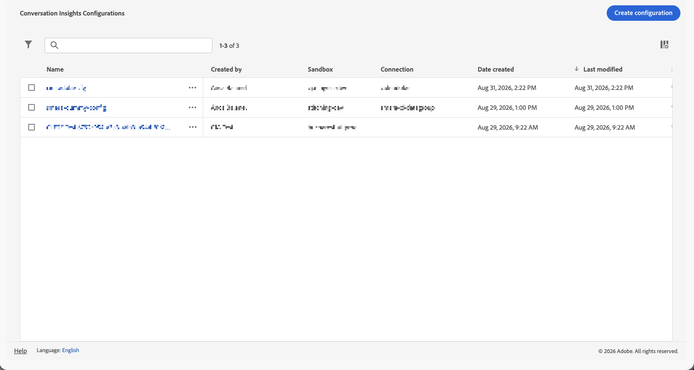

# 管理交談見解設定

在您[建立交談見解設定](/help/conversation-insights/conversation-insights-configure.md)之後，您可以檢視、編輯或刪除這些設定。

只有系統管理員可以管理「交談見解」設定。

如需對話深入分析的相關資訊，請參閱[對話深入分析概觀](/help/conversation-insights/conversation-insights-overview.md)。

## 檢視和篩選現有設定

若要檢視您現有的交談見解設定：

1. 在Customer Journey Analytics中，選取&#x200B;**[!UICONTROL 資料管理]** > **[!UICONTROL 交談見解設定]**。

   

   以下各欄提供各個設定的相關資訊：

   * **[!UICONTROL Name]**： Conversation Insights設定的名稱。
   * **[!UICONTROL 建立者]**：建立組態的使用者。

   * **[!UICONTROL 沙箱]**：包含您新增至連線的設定檔資料集的Experience Platform沙箱。

   * **[!UICONTROL 連線]**：您新增至您設定的連線。

   * **[!UICONTROL 建立日期]**：組態的建立日期和時間。

   * **[!UICONTROL 上次修改日期]**：上次修改組態的日期。

   * **[!UICONTROL 狀態]**：組態的狀態。 可能的值包括：
      **[!UICONTROL Complete]**、 **[!UICONTROL 擱置中]**&#x200B;或 **[!UICONTROL 失敗]**。

   若要設定要在表格中顯示哪些欄，請選取。 在&#x200B;**[!UICONTROL 自訂資料表]**&#x200B;對話方塊中，選取要顯示的資料行。 然後選取&#x200B;**[!UICONTROL 套用]**。

1. （選擇性）若要篩選設定清單，請選取，然後依下列任一條件篩選：

   * **[!UICONTROL 連線]**

   * **[!UICONTROL 建立者]**

   * **[!UICONTROL 沙箱]**

   * **[!UICONTROL 狀態]**

## 建立設定

若要建立新的「交談見解」設定：

1. 選取「**[!UICONTROL 建立設定]**」。
1. 使用[**[!UICONTROL 建立設定]**](./conversation-insights-configure.md)對話方塊來設定交談見解。

## 編輯設定

若要編輯現有的交談深入分析設定：

1. 執行以下任一操作：

   * 選取您要編輯的組態名稱。
   * 選取您要編輯的組態旁邊的核取方塊，然後從藍色動作列選取 **[!UICONTROL 編輯]**。
   * 針對您要編輯的組態選取。 從內容功能表選取 **[!UICONTROL 編輯]**。

1. 使用組態&#x200B;_&#x200B;**[&#128279;](./conversation-insights-configure.md)對話方塊的**&#x200B;組態/_&#x200B;名稱來設定交談見解。

## 刪除設定

若要刪除現有的交談深入分析設定：

1. 執行以下任一操作：

   * 選取您要刪除之組態旁邊的核取方塊，然後從藍色動作列中選取 **[!UICONTROL 刪除]**。
   * 針對您要編輯的組態選取。 從內容功能表選取 **[!UICONTROL 刪除]**。

1. 在&#x200B;**[!UICONTROL 刪除組態]**&#x200B;對話方塊中，選取&#x200B;**[!UICONTROL 刪除]**&#x200B;以刪除組態。 選取「**[!UICONTROL 取消]**」進行取消。
