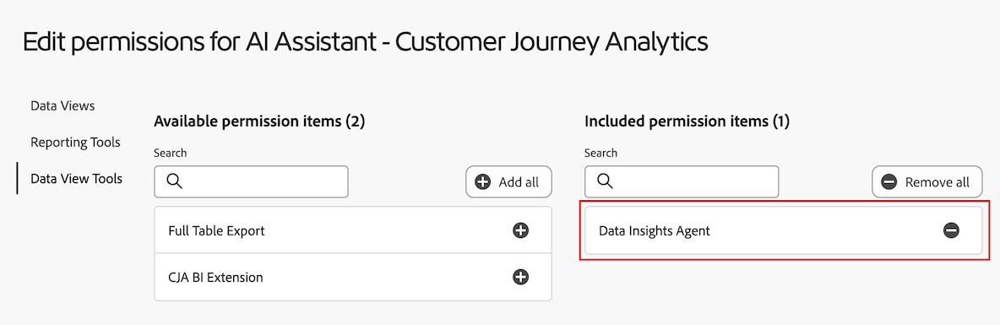

# 在Customer Journey Analytics中使用Data Insights Agent以視覺效果呈現資料

>[!AVAILABILITY]
>
>本文中說明的功能自2025年5月28日起分階段發行時可供所有符合資格的客戶使用，但可能尚未在您的環境中使用。 當該功能供一般用途時，此備註將被刪除。如需Customer Journey Analytics發行程式的相關資訊，請參閱[Customer Journey Analytics功能發行](/help/release-notes/releases.md)。

>[!AVAILABILITY]
>
>Data Insights Agent在限定時間內可供符合資格的客戶使用。 對Data Insights Agent的存取將於2025年11月30日結束。 若要繼續使用Data Insights Agent而不中斷，請洽詢您的Adobe客戶代表，以進一步瞭解授權Data Insights Agent。

Data Insights Agent可透過Customer Journey Analytics中的AI助理存取，是具創造性的AI交談代理程式，可快速並有效率地回答有關您資料的問題。 它使用來自資料視圖的元件和您的實際資料，在 Analysis Workspace 建立相關的視覺效果。

使用Data Insights Agent來回答Analysis Workspace中以資料為中心的問題，可節省您原本要在Analysis Workspace中手動建立視覺效果和熟悉資料檢視元件所花費的無數時間。

## 範圍內功能與範圍外功能

| 功能 | 在範圍中 | 超出範圍 |
| --- | --- | --- |
| **視覺效果型別** | <ul><li>折線圖</li><li>多折線圖</li><li>自由格式表格</li><li>長條圖</li><li>環形圖</li><li>摘要數字</li></ul> | <ul><li>流量</li><li>流失</li><li>同類群組表格</li><li>區域圖和堆疊區域圖</li><li>堆疊長條圖</li><li>項目符號</li><li>組合</li><li>直方圖</li><li>橫條圖、堆疊橫條圖</li><li>關鍵量度摘要</li><li>散佈圖</li><li>摘要變更</li><li>文字</li><li>樹狀圖</li><li>文氏圖表</li></ul> |
| **Workspace動作和代理程式功能** | <ul><li>建立和更新視覺效果
產生自由格式表格和相關的視覺效果 (例如折線、長條、環形圖等)。
例如，*從2月到5月，SKU間的利潤是多少？*
</li><li>提出後續追蹤問題
從任何先前的提示回應內容中的提示。 例如：
 <ul><li>提示 1：*三月份的趨勢事件。*</li><li>提示 2：*改為顯示三至四月的資料*</li></ul> </li><li>超出範圍提示偵測
如果您提交超出範圍的提示，例如&#x200B;*匯出此專案*，Data Insights Agent會通知您問題超出範圍。
</li></ul> | <ul><li>共用</li><li>匯出</li><li>下載</li><li>管理使用者偏好</li><li>管理資料視圖</li><li>Analytics 儀表板應用程式</li><li>歸因</li><li>內嵌摘要或回應
Data Insights Agent無法在聊天邊欄中以使用者提示的摘要回應進行內嵌回應。 範圍外提示的範例為，*提供上次提示的見解摘要*&#x200B;以及&#x200B;*總結線條視覺效果的亮點。*
</li></ul> |
| **釐清問題** | 如果您提出的問題，沒有足夠上下文可供Data Insights Agent回答，或問題過於寬泛，Data Insights Agent會以澄清問題或建議的選項來回應。 
下列澄清問題為元件相關問題的範例：
<ul><li>量度：*您指的是哪一個「收入」量度？*</li><li>維度：*您想聚焦於下列哪個「地區」？*</li><li>區段：*您想套用哪個「客戶」區段？*</li><li>日期範圍：*您所說的「上個月」是指上一個完整月份，還是過去 30 天？*</li></ul>
以下澄清問題為維度專案相關問題的範例：
 <ul><li>您是指哪個「商店名稱」？ (例如：商店 #5274、商店 #2949 等等。)</li></ul> | 釐清問題僅限於元件和維度項目。Data Insights Agent無法釐清資料檢視、視覺效果、資料精細度、比較和範圍等專案。 當澄清無法使用的問題時，代理程式會預設為您最可能要求的內容。 如果它傳回非預期的視覺效果或資料詳細程度，您可以提出後續問題或調整視覺效果和資料。 |
| **資料可驗證性和正確性** | 檢視產生的自由表格和資料視覺效果，即可確認資料可驗證性和正確性。 
例如，如果您要求Data Insights Agent針對上個月&#x200B;*的*&#x200B;趨勢訂單，您可確認已在新產生的面板、資料視覺效果和自由表格中選取正確的量度（「訂單」）和日期範圍（「上個月」）。 | Data Insights Agent不會通知您新增了哪些元件或視覺效果。
 |
| **回饋機制** | <ul><li>肯定</li><li>否定</li><li>標記</li></ul> |  |

## 在Customer Journey Analytics中管理對Data Insights Agent的存取

下列引數可控管Customer Journey Analytics中Data Insights Agent的存取權：

* **解決方案存取**：在2025年11月30日之前，所有Customer Journey Analytics客戶都可透過有限存取方案使用Data Insights Agent。 在 Adobe Analytics 中不支援。

* **合約存取**：如果您無法在AI助理中使用Data Insights Agent，請聯絡您組織的管理員或Adobe帳戶團隊。 您必須同意與創作AI相關的特定法律條款，組織才能使用Data Insights Agent。

* **許可權**：必須先在[!UICONTROL Adobe Admin Console]中授與必要的許可權，使用者才能存取Data Insights Agent。

  若要授與許可權，[產品設定檔管理員](https://helpx.adobe.com/tw/enterprise/using/manage-product-profiles.html)必須在[!UICONTROL Admin Console]中完成下列步驟：
   1. 在&#x200B;**[!UICONTROL Admin Console]**&#x200B;中，選取&#x200B;**[!UICONTROL 產品]**&#x200B;索引標籤以檢視&#x200B;**[!UICONTROL 所有產品和服務]**&#x200B;頁面。
   1. 選取&#x200B;**[!UICONTROL Customer Journey Analytics]**。
   1. 在&#x200B;**[!UICONTROL 產品設定檔]**&#x200B;索引標籤上，選取您要為其提供[!UICONTROL AI助理：產品知識]存取權的產品設定檔標題。
   1. 在特定產品設定檔中，選取&#x200B;**[!UICONTROL 許可權]**&#x200B;標籤。

      Admin Console中的

   1. 在提供的表格中&#x200B;**[!UICONTROL 報告工具]**&#x200B;列，選取編輯圖示。
   1. 捲動至或搜尋&#x200B;**[!UICONTROL AI助理：產品知識]**，然後選取此許可權旁的加號圖示。

      **[!UICONTROL AI助理：產品知識]**&#x200B;許可權已新增到&#x200B;**[!UICONTROL 包含的許可權專案]**&#x200B;欄。

      。

   1. 選取&#x200B;**[!UICONTROL 資料檢視工具]**&#x200B;標籤，然後選取&#x200B;**[!UICONTROL Data Insights Agent]**&#x200B;許可權旁的加號圖示。

      **[!UICONTROL Data Insights Agent]**&#x200B;許可權已新增至&#x200B;**[!UICONTROL 包含的許可權專案]**&#x200B;欄。

      。

   1. 選取&#x200B;**[!UICONTROL 資料檢視]**&#x200B;標籤，以選擇要為Data Insights Agent啟用的資料檢視。

      >[!IMPORTANT]
      >
      >啟用資料檢視時，請考量下列事項：
      >* 每個IMS組織最多可以啟用50個資料檢視。 如果您在指定組織的所有產品設定檔中啟用超過50個資料檢視，Data Insights Agent將使用50個最常用的資料檢視。
      >* Data Insights Agent可以參照包含的資料檢視，並在您在Admin Console中啟用檢視的同一天提供。

   1. 搜尋或捲動至您要啟用的資料檢視，然後選取每個資料檢視名稱旁的加號圖示。

      您新增的每個資料檢視都會顯示在&#x200B;**[!UICONTROL 包含的許可權專案]**&#x200B;欄中。

      。

   1. 選取「**[!UICONTROL 儲存]**」以儲存權限。

  如需存取控制的詳細資訊，請參閱[存取控制](/help/technotes/access-control.md#access-control)。

## 在AI助理中存取Data Insights Agent

1. 前往 [experience.adobe.com](https://experience.adobe.com/)，並使用您的 Adobe ID 登入。

2. 在 Experience Cloud 首頁上選取「**Customer Journey Analytics**」。

3. 在專案頁面頂部的橫幅中選取「**[!UICONTROL 空白專案]**」，即可開啟一個新的空白專案。

4. 請確認為面板選取的資料檢視是已啟用與Data Insights Agent搭配使用的資料檢視，如[在Customer Journey Analytics中管理Data Insights Agent的存取權](#manage-access-to-data-insights-agent-in-customer-journey-analytics)中所述。

5. 選取頁面右上角的 AI 助理聊天圖示。

   如果您沒有看到聊天圖示，請聯絡您的管理員，以便他們可以在 Admin Conole 中啟用以下功能：

   * 報告工具： **[!UICONTROL AI助理：產品知識]**

   * 資料檢視工具： **[!UICONTROL Data Insights Agent]**

   如需詳細資訊，請參閱[在Customer Journey Analytics中管理Data Insights Agent的存取權](#manage-access-to-data-insights-agent-in-customer-journey-analytics)。

   

6. 在頁面底部的&#x200B;**[!UICONTROL 詢問Customer Journey Analytics]**&#x200B;對話方塊中，使用Data Insights Agent詢問資料視覺效果問題。

   如需詳細資訊，請參閱下列範例。

### 範例 1

例如，假設您想知道您的公司在七月的訂單狀況。

**提示：**&#x200B;輸入&#x200B;*「七月訂單趨勢」。*

**回應：** Data Insights Agent透過檢視資料檢視中的資料（包括量度和元件）來收集深入分析。 它將提示轉換為資料範圍內的正確維度和量度。

如您所見，它自動產生了一張線圖和一個自由格式表格顯示七月的訂單。

### 範例 2

接下來，您想了解不同區域的收入比較。

**提示：**&#x200B;在提示視窗中，輸入&#x200B;*「依照區域顯示收入」。*

**回應：** Data Insights Agent聰明地瞭解「地區」的意思是「客戶地區」。 它產生一張最能清楚顯示各區域收入的長條圖：

### 範例 3

接著，除了瞭解按地區劃分的收入之外，您也要檢視依地區劃分的利潤資料。 與其重複先前的提示，您可以要求Data Insights Agent更新最新的視覺效果和自由表格。

**提示：**&#x200B;在提示視窗中，輸入&#x200B;*「新增利潤」。*

**回覆：**&#x200B;**[!UICONTROL 長條圖]**&#x200B;仍然提供最簡潔的答案，但利潤量度已以欄位形式新增至自由格式表格中：

### 範例 4

最後，一起來看看依照產品類別劃分的收入。

**提示：**&#x200B;在提示視窗中，輸入&#x200B;*「依照產品類別劃分的收入比例」。*

**回應：**&#x200B;再次，Data Insights Agent會挑選最適合的視覺效果（在此案例中是&#x200B;**[!UICONTROL 環形圖]**&#x200B;視覺效果）來回答問題。

## 資料視覺效果提示範例

以下是Data Insights Agent用來回應這些提示的常見提示和視覺效果範例。

| 範例提示 | 預期中的視覺效果 |
| --- | --- |
| 請顯示[月]的利潤 | 折線圖
預設情況下，詢問特定時間範圍內的趨勢或量度，系統預設會傳回折線圖視覺效果。 |
| [月]的訂單趨勢 | 折線圖 |
| 依照區域顯示[月]的收入 | 長條圖 |
| 依照產品類別劃分的收入份額 | 環形圖 |
| 一月至五月，依照星期排序的訂單 | 長條圖 |
| 依照性別顯示三月到六月的訂單 | 長條圖 |
| 從二月到五月，各個 SKU 的利潤是多少？ | 長條圖 |
| [月]依照商店名稱劃分的收入 | 長條圖 |
| [月]利潤最高的 10 個 SKU 是什麼？ | 長條圖 |
| 依照月份劃分的購買比例 | 環形圖 |
| [月]總利潤 | 摘要數字
詢問特定時間範圍內的量度「總和」，系統應該會傳回摘要數字視覺效果。 |

## 提示最佳作法

Data Insights Agent會處理每個使用者提示所提供的內容，並嘗試以自由格式表格方式，以最適當的視覺效果和元件聰明地回應。

回覆可能會隨著提示中使用的特定詞組而有所差異，語言的細微變化也會導致不同的結果。

為了獲得最佳結果，請考慮下列準則：

* **明確：**&#x200B;包含確切的辭彙，以縮小回應範圍。 以下為特定提示的範例：「上個月在加州的銷售」

* **使用清除量度、維度和區段：**&#x200B;新增特定量度（例如「收入」）、維度（例如「網站名稱」）、區段(例如「iPhone使用者」)和日期範圍（例如「過去三個月」），有助於Data Insights Agent聚焦於正確的資料。

* **直接提問：**&#x200B;直接措辭問題可讓Data Insights Agent更輕鬆地提供清晰、相關的深入分析。 以下是在提示中詢問直接問題的範例：「今年按產品類別的平均收入是多少？」

請檢閱下表，瞭解您可以搭配Data Insights Agent在提示中使用的辭彙和片語範例，以及您可以預期的回應型別。

這些範例旨在協助您熟悉特定字詞或結構如何影響Data Insight Agent的輸出，以確保更精確且有價值的深入分析。 Data Insights Agent使用創作AI，因此視覺效果或選取的資料在類似提示中可能會稍有不同。

| 期望結果 | 範例術語和詞組 |
| --- | --- |
| 摘要數字視覺效果 | <ul><li>總計</li></ul> |
| 比較元件 | <ul><li>比較</li><li>vs</li><li>對比</li><li>每週</li><li>每月</li><li>每季</li><li>每年</li></ul> |
| 環形圖視覺效果 | <ul><li>比例</li><li>份額</li><li>分佈</li><li>百分比</li><li>貢獻</li><li>部分</li><li>構成項目</li></ul> |
| 折線圖視覺效果 | <ul><li>趨勢</li><li>[時間範圍]中的[量度]</li></ul> |
| 長條圖視覺效果 | <ul><li>依照[維度]劃分的[量度]</li></ul> |

<!--

## Beta testing expectations and requested feedback

After posing each question, carefully review the assistant's provided answer. It's crucial to evaluate the generated visualizations comprehensively before providing feedback. 

Consider the following when evaluating a response from Data Insights Agent: 

* Chat rail response or template: Evaluate the textual response provided. Is the response appropriate given the context of your prompt? 

* Visualization/chart: Evaluate the visualization. Is it the appropriate or expected visualization for your question, or would you have expected a different visualization?  

* Freeform table: Evaluate the freeform table. Is the freeform table data correct? Is it breaking down data where requested? Are the applied segments those that you requested or expected? 

* Error Message / Out-of-Scope: If a generic error message is given stating the question is out of scope, provide feedback on whether you think the out-of-scope message is appropriate, given your prompt. Was your prompt actually in scope? 

**For every response, give a thumbs up or thumbs down, based on the response.**

Following the thumbs up or thumbs down selection, please make a selection for the relevant multi-select feedback boxes. If you want to provide additional feedback, add notes in the open text box.

## Questions and Contact

* Send questions and feedback in the Beta Slack channel: #data-insights-agent-in-cja-beta

-->

