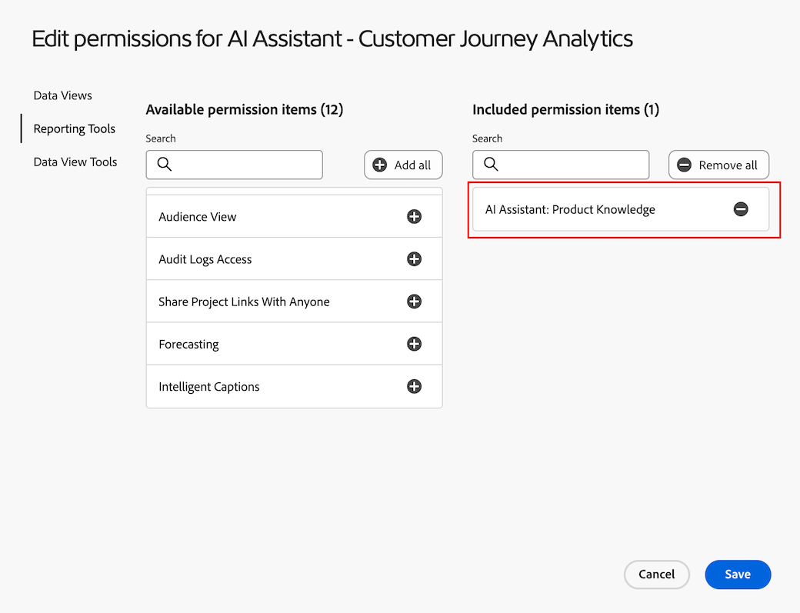

# 使用Customer Journey Analytics中的資料分析代理程式以視覺效果呈現資料

資料深入分析代理程式是Customer Journey Analytics中AI助理的一部分，是一種創作性的AI交談代理，可快速並有效回答有關您資料的問題。 它會使用您資料檢視中的元件，並使用您的實際資料，在Analysis Workspace中建置相關的視覺效果。

使用資料見解代理程式來回答Analysis Workspace中以資料為中心的問題，可以節省無數時間，讓您在Analysis Workspace中手動建立視覺效果，並熟悉資料檢視元件。

AI助理中的

## Beta的範圍內與範圍外功能

### 範圍中的Beta功能

| 支援的功能 | 說明 |
| --- | --- |
| **建置和更新視覺效果** | 產生自由表格和相關聯的視覺效果（例如線條、長條圖、環形圖等）。
範例： *從2月到5月，SKU的利潤是多少？* |
| **支援的視覺效果型別** | <ul><li>折線圖</li><li>多行</li><li>自由表格</li><li>長條圖</li><li>環形圖</li><li>摘要數字</li></ul> |
| **範圍外提示偵測** | 如果您提交超出範圍的提示（例如「匯出此專案」），資料分析代理程式會回應，讓您知道問題超出範圍。 |
| **澄清問題** | 如果您提出的問題，沒有足夠內容讓資料分析代理程式回答，或問題過於一般，資料分析代理程式會以澄清問題或建議的選項回應。 範例： 
**元件**<ul><li>量度： *您指的是哪個「收入」量度？*</li><li>Dimension： *您想要著重下列哪個「地區」？*</li><li>區段： *您要套用哪個「帳戶」區段？*</li><li>日期範圍： *以「上個月」表示，您是指「上個月」還是「過去30天」？*</li></ul>**Dimension專案**：您指的是哪個「商店名稱」？ (例如，商店#5274、商店#2949等)。 |
| **多圈** | 資料前瞻分析代理程式會使用任何先前提示的內容來回應提示，讓使用者可以更新視覺效果並詢問後續問題。 範例: <ul><li>提示1： *自3月*&#x200B;起的趨勢事件</li><li>提示2： *改為顯示三月到四月的資料*</li></ul> |
| **可驗證性** | 可透過產生的自由表格和資料視覺效果確認資料可驗證性和正確性。 例如，如果使用者詢問&#x200B;*上個月*&#x200B;的趨勢訂單，您可以確認在新產生的面板、資料視覺效果和自由表格中選取了正確的量度（「訂單」）和日期範圍（「上個月」）。 |
| **意見反應** | <ul><li>豎起大拇指</li><li>向下拇指</li><li>標幟</li></ul> |

### 範圍外的Beta功能

| 不支援的功能 | 說明 |
| --- | --- |
| **內嵌摘要或回應** | 資料深入分析代理程式無法在聊天邊欄中以使用者提示的摘要回答進行內嵌回應。 範圍外提示範例：<ul><li>*提供上次提示的見解摘要。*</li><li>*從線條視覺效果摘要醒目提示。*</li></ul> |
| **澄清問題** | 澄清的問題僅限於元件和維度專案。 資料深入分析代理程式無法釐清資料檢視、視覺效果、資料精細度、比較和範圍等專案。 當澄清無法使用的問題時，代理程式會預設為您最可能要求的內容。 如果它傳回非預期的視覺效果或資料詳細程度，您就可以使用多圈/更新功能來調整視覺效果和資料。 |
| **Workspace動作/功能** | 除了建立和更新視覺效果外，資料深入分析代理程式無法在Workspace中為使用者執行動作。 例如，它無法執行下列任一項作業：<ul><li>內容動作UI按鈕（新增至圖表、新面板、新表格）</li><li>共用</li><li>匯出</li><li>下載</li><li>管理使用者偏好設定</li><li>組織</li><li>管理資料檢視</li><li>Analytics儀表板應用程式</li><li>歸因</li></ul> |
| **不支援的視覺效果型別** | <ul><li>流量</li><li>流失</li><li>同類群組表格</li><li>區域圖、棧疊區域圖</li><li>堆疊長條圖</li><li>項目符號</li><li>組合</li><li>直方圖</li><li>橫條圖、棧疊橫條圖</li><li>關鍵量度摘要</li><li>散佈圖</li><li>摘要變更</li><li>文字</li><li>樹狀圖</li><li>文氏圖表</li></ul> |

## 在Customer Journey Analytics中管理資料深入分析代理程式的存取權

下列引數可控管Customer Journey Analytics中資料前瞻分析代理程式的存取權：

* **解決方案存取**：資料深入分析代理程式可供Customer Journey Analytics Prime和Ultimate客戶使用。 在Adobe Analytics中無法使用。

* **合約存取**：如果您無法在AI助理中使用資料深入分析代理程式，請聯絡您組織的管理員或Adobe客戶代表。 您必須同意特定GenAI相關法律條款，組織才能使用資料分析代理程式。

* **許可權**：在[!UICONTROL Adobe Admin Console]中，[!UICONTROL 報告工具] **[!UICONTROL AI Assistant：資料視覺效果]**&#x200B;許可權決定此工具的存取權。  [產品設定檔管理員](https://helpx.adobe.com/tw/enterprise/using/manage-product-profiles.html)需要遵守 [!UICONTROL Admin Console]中的以下步驟：
   1. 導覽至&#x200B;**[!UICONTROL Admin Console]** > **[!UICONTROL 產品及服務]** > **[!UICONTROL Customer Journey Analytics]** > **[!UICONTROL 產品設定檔]**
   1. 選取您要為其提供[!UICONTROL AI助理存取權的產品設定檔標題：產品知識]。
   1. 在特定的產品設定檔中，選取「**[!UICONTROL 權限]**」。
   1. 選取「」，可編輯「**[!UICONTROL 報告工具]**」。
   1. 選取以新增&#x200B;**AI小幫手：產品知識**&#x200B;和&#x200B;**AI小幫手：資料分析**&#x200B;至&#x200B;**[!UICONTROL 包含的許可權專案]**。

      。

   1. 選取「**[!UICONTROL 儲存]**」以儲存權限。

請參閱[存取控制概觀](/help/technotes/access-control.md#access-control)，了解更多資訊。

## 存取AI助理中的資料深入分析代理程式

1. 前往[experience.adobe.com](https://experience.adobe.com/)並使用您的Adobe ID登入。

2. 從Experience Cloud首頁選取&#x200B;**Customer Journey Analytics**。

3. 在專案頁面頂端的橫幅中選取&#x200B;**[!UICONTROL 空白專案]**&#x200B;以開啟新的空白專案。

4. 確認面板的選取資料檢視與啟用搭配資料深入分析代理程式進行Beta測試的資料檢視相同。

   如果您不確定，請聯絡Beta Slack頻道。

5. 在頁面的右上角區域選取AI助理聊天圖示。

   如果您沒有看到聊天圖示，請聯絡您的管理員，以便他們在Admin Console中啟用以下功能：

   * **[!UICONTROL AI助理：產品知識]**

   * **[!UICONTROL AI小幫手：資料分析]**

   如需其他詳細資料，管理員可以看到[這些指示](https://experienceleague.adobe.com/zh-hant/docs/experience-platform/ai-assistant/access)。

   

6. 在頁面底部的&#x200B;**[!UICONTROL 詢問Customer Journey Analytics]**&#x200B;對話方塊中，使用資料深入分析代理程式詢問資料視覺效果問題。

   如需詳細資訊，請參閱下列範例。

### 範例 1

例如，假設您對您的企業在7月收到的訂單感興趣。

**提示：**&#x200B;輸入&#x200B;*「7月趨勢訂單」。*

**回應：**&#x200B;資料深入分析代理程式會透過檢視資料檢視中的資料（包括量度和元件）來收集深入分析。 系統會將提示轉譯為資料範圍內正確的維度和量度。

如您所見，系統會自動產生線圖和自由表格，以顯示7月的訂單。

### 範例 2

接下來，您想要瞭解依地區比較收入的方式。

**提示：**&#x200B;在提示視窗中，輸入&#x200B;*「依地區顯示收入」*

**回應：**&#x200B;資料深入分析代理程式聰明地瞭解「地區」的意思，即「客戶地區」。 這會產生一個長條圖，最能依地區顯示收入：

### 範例 3

接著，除了瞭解按地區劃分的收入之外，您還要檢視依地區劃分的利潤資料。 與其重複先前的提示，您可以要求資料前瞻分析代理程式更新最新的視覺效果和自由表格。

**提示：**&#x200B;在提示視窗中，輸入&#x200B;*「新增利潤」*。

**回應：** **[!UICONTROL 長條]**&#x200B;圖表仍提供最簡明的答案，但利潤量度已新增為自由表格中的欄：

### 範例 4

最後，我們來依照產品類別檢視收入。

**提示：**&#x200B;在提示視窗中，輸入&#x200B;*「依產品類別區分的收入比例」。*

**回應：**&#x200B;再次強調，資料深入分析代理程式會挑選最適合的視覺效果（在此案例中是&#x200B;**[!UICONTROL 環形圖]**&#x200B;視覺效果）來回答問題。

## 範例資料視覺效果提示

以下是資料深入分析代理程式用於回應這些提示的一些常見提示和視覺效果範例。

| 範例提示 | 預期的視覺效果 |
| --- | --- |
| 顯示[個月]的利潤 | 折線圖
依預設，詢問特定時間範圍內的趨勢或量度會傳回線條視覺效果。 |
| [個月]的趨勢訂單 | 折線圖 |
| 在[個月]內依地區顯示收入 | 長條圖 |
| 依產品類別劃分的收入份額 | 環形圖 |
| 按周中某日（從1月到5月）的訂單 | 長條圖 |
| 依性別顯示從3月到6月的訂單 | 長條圖 |
| 從2月到5月，SKU利潤如何 | 長條圖 |
| [個月]內依商店名稱區分的收入 | 長條圖 |
| 在[月]中，依利潤排列的前10名SKU為何？ | 長條圖 |
| 按月份和年份的購買比例 | 環形圖 |
| [個月]的總利潤 | 摘要數字
在特定時間範圍內詢問量度的「總計」時，應該會傳回「摘要數字」視覺效果。 |

## 提示最佳實務

資料深入分析代理程式會處理每個使用者提示所提供的內容，並嘗試以自由表格形式聰明地回應最適當的視覺效果和元件。

回應可能會因提示中所使用的特定字詞和短語而有所不同，而語言的微小變化可能會導致不同的結果。

若要獲得最佳結果，請考量下列准則：

* 明確：包含確切的辭彙以縮小回應。 以下為特定提示的範例：「上個月的加州銷售額」

* 使用清楚的量度和區段：新增特定量度（例如「收入」）、維度（例如「網站名稱」）、區段(例如「iPhone使用者」)和日期範圍（例如「過去三個月」），有助於Data Insights Agent聚焦於正確的資料。

* 提出直接問題：直接措辭化問題可讓資料見解代理程式更輕鬆地提供清晰、相關的見解。 以下是在提示中詢問直接問題的範例：「今年按產品類別的平均收入是多少？」

請檢閱下表範例辭彙和片語，這些辭彙和片語可用於資料分析代理程式的提示中，以及您可以期待的回應型別。

這些範例旨在協助您熟悉特定字詞或結構如何影響資料分析代理程式的輸出，以確保更精確且有價值的分析。 資料深入分析代理程式使用創作AI，因此視覺效果或選取的資料在類似提示中可能會稍有不同。

| 所要的結果 | 辭彙和短語範例 |
| --- | --- |
| 摘要數字視覺效果 | <ul><li>總計</li></ul> |
| 比較元件 | <ul><li>比較</li><li>與</li><li>對比</li><li>周對周</li><li>逐月</li><li>季比季</li><li>逐年比較</li></ul> |
| 環形圖視覺效果 | <ul><li>比例</li><li>共用</li><li>分佈</li><li>百分比</li><li>貢獻</li><li>部分</li><li>零件</li></ul> |
| 折線圖視覺效果 | <ul><li>趨勢</li><li>在[時間範圍]內的[量度]</li></ul> |
| 長條圖視覺效果 | <ul><li>由[Dimension]進行的[量度]</li></ul> |

## Beta測試期望和要求的意見回饋

提出每個問題後，請仔細檢閱助理提供的答案。 提供意見回饋之前，請務必全面評估產生的視覺效果。

評估資料深入分析代理程式的回應時，請考量下列事項：

* 聊天邊欄回應或範本：評估提供的文字回應。 根據您的提示內容，回應是否適當？

* 視覺效果/圖表：評估視覺效果。 這是您問題的適當或預期的視覺效果，還是您預期不同的視覺效果？

* 自由表格：評估自由表格。 自由格式表格資料正確嗎？ 它是否在請求時劃分資料？ 套用的區段是否為您要求或預期的區段？

* 錯誤訊息/超出範圍：如果提供了一般錯誤訊息，指出問題超出範圍，請提供回饋意見，說明在提供提示的情況下，您是否認為超出範圍的訊息適當。 您的提示是否確實在範圍中？

**根據每個回應，向上或向下縮圖表示回應。**

在按一下向上或向下縮圖選取專案後，請選取相關的多重選取意見回饋方塊。 如果您想提供其他意見反應，請在開啟的文字方塊中新增附註。

## 問題與連絡人

* 在Beta Slack頻道中傳送問題和意見回饋： #data-insights-agent-in-cja-beta
