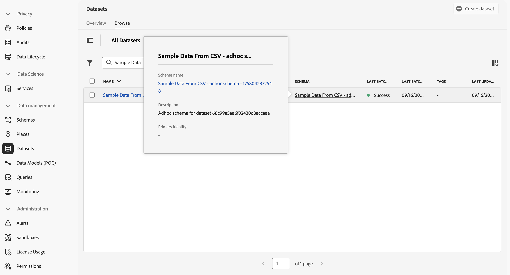

# 擷取及使用臨時資料

本快速入門手冊說明如何將臨時資料擷取到Adobe Experience Platform，然後在Customer Journey Analytics中使用該資料。

若要完成此操作，您必須：

- **在Experience Platform中以CSV檔案建立資料集**，以定義您要收集之資料的模型（結構描述）以及收集資料（資料集）的位置。

- **在Experience Platform中使用來源聯結器**，將您的資料匯入已設定的資料集。

- 在 Customer Journey Analytics 中&#x200B;**設定連線**。此連線應 (至少) 包含您的 Adobe Experience Platform 資料集。

- 在 Customer Journey Analytics 中&#x200B;**設定資料檢視**，定義您要在 Analysis Workspace 中使用的量度和維度。

- 在 Customer Journey Analytics 中&#x200B;**設定專案**，建立您的報告和視覺效果。

>[!NOTE]
>
>本快速入門手冊是一份簡化的指南，說明如何使用將臨時資料擷取到Adobe Experience Platform並在Customer Journey Analytics中使用。 強烈建議在提及時研究其他資訊。

## 使用CSV檔案建立資料集

針對此快速入門，您想要使用代表查詢資料並包含類似以下所示資訊的CSV檔案。

| _id | tracking_code | ad_group | campaign_name |
| ---: | :---          | :---        | :---          |
| 1 | abc123 | abc-adgroup | 123行銷活動 |
| 2 | def123 | def-adgroup | 123行銷活動 |
| 3 | ghi123 | ghi-adgroup | 123行銷活動 |
| 4 | abc456 | abc-adgroup | 456行銷活動 |
| 5 | def456 | def-adgroup | 456行銷活動 |

>[!NOTE]
>
>針對以記錄為基礎的（查詢、設定檔）資料，使用臨時資料集和結構描述。 臨機資料集和結構描述不太適合，不應考慮用於時間序列（事件、摘要）資料。

您不需要針對臨機操作資料建立XDM結構描述。 Adobe Experience Platform支援的工作流程會根據CSV檔案中的資料：

1. 建立符合CSV檔案欄的臨時結構描述。
1. 根據包含CSV檔案資料的臨時結構描述建立資料集。

若要啟動工作流程：

1. 在Adobe Experience Platform UI的左側邊欄中，選取&#x200B;**[!UICONTROL 工作流程]**。
1. 選取 **[!UICONTROL 從CSV檔案建立資料集]**。
1. 從右窗格中選取&#x200B;**[!UICONTROL 啟動]**。
1. 在&#x200B;**[!UICONTROL 工作流程]** > **[!UICONTROL 從CSV檔案建立資料集]**&#x200B;精靈中：
   1. 在&#x200B;**[!UICONTROL 設定資料集]**&#x200B;步驟中：
      1. 輸入資料集的&#x200B;**[!UICONTROL 名稱]**。 例如：`Sample Data From CSV`。
      1. 新增選用的&#x200B;**[!UICONTROL 描述]**。 例如：`Sample data from a CSV file`。
      1. 新增一或多個選用的&#x200B;**[!UICONTROL 標籤]**，或選取一或多個現有的&#x200B;**[!UICONTROL 標籤]**。

         

      1. 選取&#x200B;**[!UICONTROL 「下一步」]**。
   1. 在&#x200B;**[!UICONTROL 新增資料]**&#x200B;步驟中：
      1. 選取「**[!UICONTROL 選擇檔案]**」以從您的電腦或網路選取CSV檔案。 或者，將檔案從電腦或網路上的位置拖放到&#x200B;**[!UICONTROL 拖放檔案]**。 已上傳檔案，且顯示&#x200B;**[!UICONTROL 範例資料]**。
      1. 啟用或停用&#x200B;**[!UICONTROL 錯誤診斷]**&#x200B;以及&#x200B;**[!UICONTROL 根據您的偏好設定啟用部分擷取]**。 當您&#x200B;**[!UICONTROL 啟用部分擷取]**&#x200B;時，您可以定義&#x200B;**[!UICONTROL 錯誤臨界值%]**。

         

      1. 選取&#x200B;**[!UICONTROL 「完成」]**。

資料已準備並上傳。 資料成功上傳後，系統會將您重新導向至Adobe Experience Platform UI中的&#x200B;**[!UICONTROL 資料集]**。 您從CSV **[!UICONTROL 資料集看到]**&#x200B;範例資料的&#x200B;**[!UICONTROL 資料集活動]**，狀態為 **[!UICONTROL 處理中]**。

若要檢查臨機操作資料：

1. 在Adobe Experience Platform UI的左側邊欄中，選取&#x200B;**[!UICONTROL 資料集]**。
1. 選取&#x200B;**[!UICONTROL 資料集]**&#x200B;中的&#x200B;**[!UICONTROL 瀏覽]**&#x200B;索引標籤。 您應該會看到您的資料集已列出。
1. 從&#x200B;**[!UICONTROL 結構描述]**&#x200B;資料行中選取結構描述的名稱。 例如： **[!UICONTROL CSV的範例資料……]**。

   

1. 在快顯視窗中，選取&#x200B;**[!UICONTROL 結構描述名稱]**。 例如：**[!UICONTROL 來自CSV的範例資料 — 臨時結構描述 — XXXXXXXXXXX]**。 系統會將您重新導向至&#x200B;**[!UICONTROL 結構描述]** > **[!UICONTROL 來自CSV的範例資料 — 臨時結構描述 — XXXXXXXXXXX]**&#x200B;介面。

在&#x200B;**[!UICONTROL 結構描述]** > **[!UICONTROL 來自CSV的範例資料 — 臨機結構描述 — XXXXXXXXXXX]**&#x200B;介面中：

- 選取&#x200B;**[!UICONTROL 結構描述]** > **[!UICONTROL 來自CSV的範例資料 — 臨機結構描述 — XXXXXXXXXXX]**&#x200B;下最上層的租使用者名稱稱物件，以顯示物件中的欄位。 物件內的欄位代表CSV檔案的結構。 系統會根據臨機操作資料的上傳自動建立方案。

  

## 設定連線

若要在Customer Journey Analytics中使用Adobe Experience Platform資料集，請建立包含工作流程產生的隨選資料的連線。

連線可讓您將資料集從 Adobe Experience Platform 整合到工作區。若要針對這些資料集製作報表，必須先為Adobe Experience Platform和Workspace中的資料集建立連線。

若要建立連線，請執行以下操作：

1. 在Customer Journey Analytics UI中，選取頂端功能表中的&#x200B;**[!UICONTROL 連線]** （選擇性的從&#x200B;**[!UICONTROL 資料管理]**）。

1. 選取&#x200B;**[!UICONTROL 「建立新連線」]**。

1. 在&#x200B;**[!UICONTROL 「無標題連線」]**&#x200B;畫面中：

   1. 在&#x200B;**[!UICONTROL 「連線設定」]**&#x200B;中為連線命名並提供說明。

   1. 從&#x200B;**[!UICONTROL 「資料設定」]**&#x200B;的&#x200B;**[!UICONTROL 「沙箱」]**&#x200B;清單中選取正確沙箱，並從&#x200B;**[!UICONTROL 「每日事件平均數」]**&#x200B;清單中選取每日事件數。

      

   1. 選取&#x200B;**[!UICONTROL 「新增資料集」]**。

1. 在&#x200B;**[!UICONTROL 新增資料集]**&#x200B;的&#x200B;**[!UICONTROL 選取資料集]**&#x200B;步驟：

   1. 選取您先前建立的資料集，例如&#x200B;**[!UICONTROL CSV的範例資料]**，以及您要加入連線中的任何其他資料集。

      

   1. 選取&#x200B;**[!UICONTROL 「下一步」]**。

1. 在&#x200B;**[!UICONTROL 新增資料集]**&#x200B;的&#x200B;**[!UICONTROL 資料集設定]**&#x200B;步驟：

   針對您的臨時資料集：

   1. 選取臨時資料集的型別。 例如： **[!UICONTROL 查詢]**。
   1. 從臨時結構描述中定義的可用金鑰中選取&#x200B;**[!UICONTROL 金鑰]**。
   1. 從您新增為連線一部分的事件資料集中選取&#x200B;**[!UICONTROL 相符的索引鍵]**。
   1. 從&#x200B;**[!UICONTROL 「資料來源類型」]**&#x200B;清單中選取正確的資料來源。如果您指定&#x200B;**[!UICONTROL 「其他」]**，請為您的資料來源新增說明。

   1. 根據您的偏好設定，設定&#x200B;**[!UICONTROL 匯入所有新資料]**&#x200B;和&#x200B;**[!UICONTROL 資料集回填現有資料]**。

      

   1. 選取&#x200B;**[!UICONTROL 「新增資料集」]**。

   1. 選取&#x200B;**[!UICONTROL 「儲存」]**。

如需特定資料集可用設定的詳細資訊，請參閱[特定資料集設定](/help/connections/create-connection.md#adhoc-dataset)。

>[!IMPORTANT]
>
>除了不將臨時資料集和結構描述用於時間序列資料的一般建議之外，您應該&#x200B;**不**&#x200B;將&#x200B;**[!UICONTROL 從CSV建立資料集]**&#x200B;工作流程用於時間序列資料。 產生臨時結構描述的工作流程會將所有欄位定義為字串型別，您之後無法修改。 當您新增以時間序列為基礎的資料集（事件或摘要）至連線時，此型別的資料集需要至少一個日期時間型別的欄位定義。  如果您需要使用臨時時間序列資料，您應該考慮[使用API來建立臨時結構描述](https://experienceleague.adobe.com/zh-hant/docs/experience-platform/xdm/tutorials/ad-hoc#token_type=bearer&expires_in=43197438)，然後使用[從結構描述建立資料集](https://experienceleague.adobe.com/zh-hant/docs/experience-platform/catalog/datasets/user-guide#schema)工作流程。

建立[連線](/help/connections/overview.md)之後，您可以執行各種管理工作，例如[選取並合併資料集](/help/connections/combined-dataset.md)、[檢查連線資料集的狀態和資料擷取的狀態](/help/connections/manage-connections.md)等等。

## 設定資料檢視

資料檢視是特定於 Customer Journey Analytics 的容器，可讓您決定如何詮釋來自連線的資料。它指定 Analysis Workspace 中可用的所有維度和量度，以及這些維度和量度從哪些欄取得資料。資料檢視是為了在 Analysis Workspace 中報告資料而定義的。

若要建立資料檢視，請執行以下操作：

1. 在Customer Journey Analytics UI中，選取頂端功能表中的&#x200B;**[!UICONTROL 資料檢視]** （可選擇從&#x200B;**[!UICONTROL 資料管理]**&#x200B;進行）。

1. 選取&#x200B;**[!UICONTROL 「建立新的資料檢視」]**。

1. 在&#x200B;**[!UICONTROL 設定]**&#x200B;步驟：

   1. 從[連線](#set-up-a-connection)清單中選取您的&#x200B;**[!UICONTROL 連線]**。

   1. 為連線命名，並 (可選) 提供說明。

      

   1. 選取&#x200B;**[!UICONTROL 「儲存並繼續」]**。

1. 在&#x200B;**[!UICONTROL 元件]**&#x200B;步驟：

   1. 新增您要包含在&#x200B;**[!UICONTROL METRICS]**&#x200B;或&#x200B;**[!UICONTROL DIMENSIONS]**&#x200B;元件方塊中的任何臨時結構描述欄位和/或標準元件。
   1. 選擇性地使用[衍生欄位](/help/data-views/derived-fields/derived-fields.md)將任何臨時欄位從預設字串型別和格式修改為其他型別或格式。

   1. 選取&#x200B;**[!UICONTROL 「儲存並繼續」]**。

1. 在&#x200B;**[!UICONTROL 設定]**&#x200B;步驟：

   保留設定原樣並選取&#x200B;**[!UICONTROL 「儲存並完成」]**。

如需如何建立和編輯資料檢視的詳細資訊，請參閱[資料檢視總覽](../data-views/data-views.md)。 以及哪些元件可用於資料檢視，以及如何使用區段和工作階段設定。

## 設定專案

Analysis Workspace是一款彈性的瀏覽器工具，可讓您快速建立分析，並根據您的資料分享見解。 您可以使用工作區專案合併資料元件、表格和視覺效果，進行分析並與貴組織的任何人分享。

若要建立專案，請執行以下操作：

1. 在Customer Journey Analytics UI中，選取頂端功能表中的&#x200B;**[!UICONTROL 專案]**。

1. 在左側導覽中選取&#x200B;**[!UICONTROL 「專案」]**。

1. 選取&#x200B;**[!UICONTROL 「建立專案」]**。

1. 選取&#x200B;**[!UICONTROL 「空白專案」]**。

1. 從清單中選取您的[資料檢視](#set-up-a-data-view)。

1. 若要建立您的第一個報表，請在[!UICONTROL 面板]的[!UICONTROL 自由表格]上開始拖放維度和量度。 包括那些以您的臨機操作資料為基礎的量度或維度。

如需如何使用元件、視覺效果和面板建立專案和建立分析的詳細資訊，請參閱 [Analysis Workspace 概觀](../analysis-workspace/home.md)。

>[!SUCCESS]
>
>您已完成所有步驟。一開始先定義您要收集哪些隨選資料（CSV檔案）。 您使用該工作流程從CSV檔案建立臨時資料集和結構描述。 您在Customer Journey Analytics中定義連線，以使用擷取的臨機操作資料和其他資料。 您的資料檢視定義可讓您指定要使用的維度和量度，最後，您建立了第一個可視覺化和分析資料的專案。
