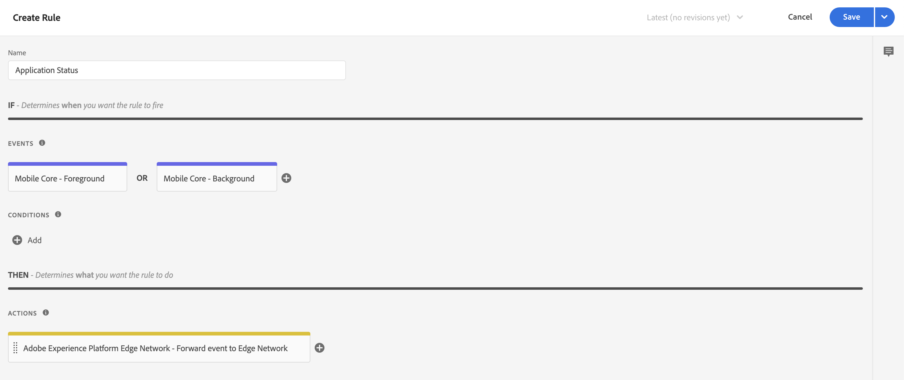
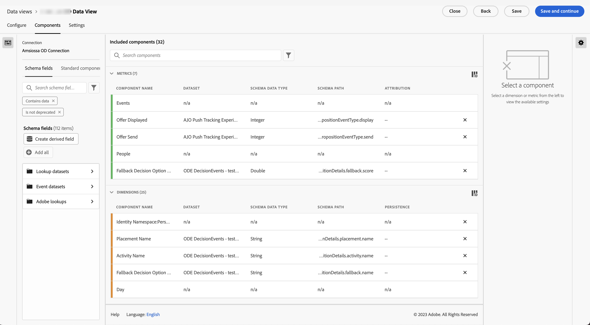

# 透過Adobe Experience Platform Mobile SDK內嵌資料

本快速入門手冊說明如何使用Adobe Experience Platform Mobile SDK和Edge Network將行動應用程式追蹤資料直接擷取到Adobe Experience Platform。 然後將這些資料用於Customer Journey Analytics。

若要完成此操作，您必須：

- 在 Adobe Experience Platform 中&#x200B;**設定結構和資料集**，定義您要收集的資料的模型 (結構)，以及實際收集資料的位置 (資料集)。

- **設定資料流**&#x200B;以設定 Adobe Experience Platform Edge Network，將收集的資料路由至您在 Adobe Experience Platform 中設定的資料集。

- **使用標籤** 以輕鬆針對行動應用程式中的資料設定規則和資料元素。 然後，確定資料已傳送至 Adobe Experience Platform Edge Network 上設定的資料流。

- **部署和驗證**。擁有一個讓您可反覆進行標籤開發作業的環境，一旦所有內容均經過驗證，就可以在您的生產環境中實時發布。

- 在 Customer Journey Analytics 中&#x200B;**設定連線**。此連線應 (至少) 包含您的 Adobe Experience Platform 資料集。

- 在 Customer Journey Analytics 中&#x200B;**設定資料檢視**，定義您要在 Analysis Workspace 中使用的量度和維度。

- 在 Customer Journey Analytics 中&#x200B;**設定專案**，建立您的報告和視覺效果。

>[!NOTE]
>
>本快速入門手冊是一份簡化的指南，說明如何將從應用程式收集的資料擷取到Adobe Experience Platform中，並用於Customer Journey Analytics。 強烈建議在提及時研究其他資訊。

## 設定結構和資料集

若要將資料擷取至 Adobe Experience Platform，您必須先定義要收集的資料。所有擷取至 Adobe Experience Platform 的資料都必須符合標準的非正常結構，才能由下游能力和功能識別並處理。Experience Data Model (XDM)是標準架構，提供結構形式的結構。

定義結構後，您可以使用一個或多個資料集來儲存及管理資料收集。資料集是資料集合（通常是表格）的儲存和管理結構，其中包含結構（欄）和欄位（列）。

擷取至 Adobe Experience Platform 的所有資料都必須符合預先定義的結構，才能以資料集形式持續保存。

### 設定結構

您想要使用行動應用程式從設定檔追蹤一些最基本的資料，例如場景名稱、識別。
您首先需要定義用來模型化此資料的結構描述。

若要設定您的結構：

1. 在 Adobe Experience Platform UI 的左側邊欄中，選取[!UICONTROL 「資料管理」]中的&#x200B;**[!UICONTROL 「結構」]**。

1. 選取 **[!UICONTROL 建立結構描述]**..
1. 在建立架構精靈的選取類別步驟中：

   1. 選取 **[!UICONTROL 體驗事件]**.

      

      >[!INFO]
      >
      >    體驗事件結構描述是用來建立 _行為_ 的設定檔（像是場景名稱、要新增至購物車的推播按鈕）。 個別設定檔結構可用來建立設定檔&#x200B;_屬性_ (例如姓名、電子郵件、性別) 模型。

   1. 選取&#x200B;**[!UICONTROL 「下一步」]**。

1. 在 [!UICONTROL 名稱和稽核步驟] 的 [!UICONTROL 建立結構描述] 精靈：

   1. 輸入 **[!UICONTROL 結構描述顯示名稱]** 適用於您的結構描述和（選用） a **[!UICONTROL 說明]**.

      

   1. 選取&#x200B;**[!UICONTROL 「完成」]**。

1. 在範例結構描述的結構標籤中：

   1. 在[!UICONTROL 「欄位群組」]中選取&#x200B;**[!UICONTROL 「+ 新增」]**。

      

      欄位群組是可重複使用的物件和屬性集合，可讓您輕鬆擴充結構。

   1. 在 [!UICONTROL 新增欄位群組] 對話方塊中，選取 **[!UICONTROL AEP Mobile SDK ExperienceEvent]** 欄位群組。

      

      您可以選取預覽按鈕，以查看屬於此欄位群組之欄位的預覽，例如 `application > name`。

      

      選取&#x200B;**[!UICONTROL 「返回」]**&#x200B;來關閉預覽。

   1. 選取&#x200B;**[!UICONTROL 「新增欄位群組」]**。

1. 在[!UICONTROL 「結構」]面板中，選取結構名稱旁的 **[!UICONTROL +]**。

   

1. 在 [!UICONTROL 欄位屬性] 面板，輸入 `identification` 作為 [!UICONTROL 欄位名稱]， **[!UICONTROL 識別]** 作為 [!UICONTROL 顯示名稱]，選取 **[!UICONTROL 物件]** 作為 [!UICONTROL 型別] 並選取 **[!UICONTROL ExperienceEvent Core v2.1]** 作為 [!UICONTROL 欄位群組].

   >[!NOTE]
   >
   >如果該欄位群組無法使用，請尋找另一個包含身分欄位的欄位群組。 或 [建立新的欄位群組](https://experienceleague.adobe.com/docs/experience-platform/xdm/ui/resources/field-groups.html?lang=en) 和 [新增身分欄位](https://experienceleague.adobe.com/docs/experience-platform/xdm/ui/fields/identity.html?lang=en#define-a-identity-field) (按讚 `ecid`， `crmId`，以及您所需的其他欄位群組)並選取該新欄位群組。

   

   識別物件會將識別功能新增至結構描述。 針對您的情況，您想使用Experience CloudID和電子郵件地址，以行動應用程式識別設定檔。 有許多其他屬性可用來追蹤您的人員身分識別（例如客戶ID、忠誠度ID）。

   選取&#x200B;**[!UICONTROL 「套用」]**&#x200B;將此物件加入您的結構。

1. 在剛剛新增的識別物件中選取 **[!UICONTROL ecid]** 欄位，然後在右側面板的[!UICONTROL 「身分命名空間」]清單中，選取&#x200B;**[!UICONTROL 「身分」]**&#x200B;和&#x200B;**[!UICONTROL 「主要身分」]**&#x200B;和 **[!UICONTROL ECID]**。

   

   您正在指定 Experience Cloud Identity 作為 Adobe Experience Platform Identity 服務可用於結合 (拼接) 設定檔行為與相同 ECID 的主要身分。

   選取&#x200B;**[!UICONTROL 「套用」]**。您會看到指紋圖示出現在 ecid 屬性中。

1. 在剛剛新增的識別物件中選取&#x200B;**[!UICONTROL 「電子郵件」]**&#x200B;欄位，然後在[!UICONTROL 「欄位屬性」]面板的[!UICONTROL 「身分命名空間」]清單中選取&#x200B;**[!UICONTROL 「身分」]**&#x200B;和&#x200B;**[!UICONTROL 「電子郵件」]**。

   

   您正在指定電子郵件地址作為 Adobe Experience Platform Identity 服務可用於結合 (拼接) 設定檔行為的另一個身分。

   選取&#x200B;**[!UICONTROL 「套用」]**。您會看到指紋圖示出現在電子郵件屬性中。

   選取&#x200B;**[!UICONTROL 「儲存」]**。

1. 選取顯示結構名稱之結構的根元素，然後選取&#x200B;**[!UICONTROL 「設定檔」]**&#x200B;切換。

   系統會提示您啟用設定檔的結構。啟用後，根據此結構將資料擷取至資料集時，該資料就會合併至即時客戶設定檔中。

   如需詳細資訊，請參閱[啟用結構以用於即時客戶設定檔](https://experienceleague.adobe.com/docs/experience-platform/xdm/tutorials/create-schema-ui.html?lang=zh-Hant#profile)。

   >[!IMPORTANT]
   >
   >    儲存啟用設定檔的結構後，便無法再為設定檔停用該結構。

   

1. 選取&#x200B;**[!UICONTROL 「儲存」]**，即可儲存您的結構。

您已建立最低架構，為您可從行動應用程式擷取的資料建立模型。 該結構可讓您使用 Experience Cloud Identity 和電子郵件地址來識別設定檔。為設定檔啟用結構描述後，即可確保從行動應用程式擷取的資料會新增至即時客戶設定檔。

在行為資料旁邊，您還可以從行動應用程式擷取設定檔屬性資料（例如訂閱電子報的設定檔詳細資料）。

若要擷取設定檔資料，您可以：

- 根據 XDM 個別設定檔架構類別建立結構。

- 將「設定檔核心 v2」欄位群組新增至結構。

- 根據「設定檔核心 v2」欄位群組新增識別物件。

- 將Experience CloudID定義為主要識別碼，並將電子郵件定義為識別碼。

- 啟用該設定檔結構

請參閱[在 UI 中建立和編輯結構](https://experienceleague.adobe.com/docs/experience-platform/xdm/ui/resources/schemas.html)，了解有關向結構添加和刪除欄位群組和個別欄位的詳細資訊。

### 設定資料集

您已使用您的結構定義資料模型。您現在必須定義結構，才能使用資料集儲存及管理該資料。

若要設定您的資料集：

1. 在 Adobe Experience Platform UI 的左側邊欄中，選取[!UICONTROL 「資料管理」]中的&#x200B;**[!UICONTROL 「資料集」]**。

2. 選取&#x200B;**[!UICONTROL 「建立資料集」]**。

   

3. 選取&#x200B;**[!UICONTROL 「從結構建立資料集」]**。

   

4. 選取您先前建立的結構並選取&#x200B;**[!UICONTROL 「下一個」]**。

5. 為資料集命名，並 (可選) 提供說明。

   

6. 選取&#x200B;**[!UICONTROL 「完成」]**。

7. 選取&#x200B;**[!UICONTROL 「設定檔」]**&#x200B;切換。

   系統會提示您啟用設定檔的資料集。資料集一經啟用，即可透過擷取的資料豐富即時客戶設定檔。

   >[!IMPORTANT]
   >
   >    只有當資料集所遵循的結構同樣啟用設定檔時，您才能啟用設定檔的資料集。

   

請參閱[資料集 UI 指南](https://experienceleague.adobe.com/docs/experience-platform/catalog/datasets/user-guide.html?lang=zh-Hant)，了解如何檢視、預覽、建立、刪除資料集的詳細資訊。以及為即時客戶設定檔啟用資料集的方法。

## 設定資料流

資料流代表實作 Adobe Experience Platform Web 和 Mobile SDK 時的伺服器端設定。使用 Adobe Experience Platform SDK 收集資料時，資料會傳送至 Adobe Experience Platform Edge Network。是決定要將資料轉送至哪些服務的資料流。

在設定中，您想要將從行動應用程式收集到的資料傳送到Adobe Experience Platform中的資料集。

若要設定您的資料流：

1. 在 Adobe Experience Platform UI 中，從左側邊欄的[!UICONTROL 「資料收集」]中選取&#x200B;**[!UICONTROL 「資料流」]**。

2. 選取「**[!UICONTROL 新資料流]**」。

3. 命名並描述您的資料流。從[!UICONTROL 「事件結構」]清單中選取您的結構。

   

4. 選取&#x200B;**[!UICONTROL 「儲存」]**。

5. 選取&#x200B;**[!UICONTROL 「新增服務」]**。

6. 在[!UICONTROL 「新增服務畫面」]中：

   1. 從[!UICONTROL 「服務」]清單中選取&#x200B;**[!UICONTROL 「Adobe Experience Platform」]**。

   2. 確保已選取&#x200B;**[!UICONTROL 「啟用」]**。

   3. 從[!UICONTROL 「事件資料集」]清單中選取您的資料集。

      

   4. 保留其他設定並選取&#x200B;**[!UICONTROL 「儲存」]**&#x200B;以儲存資料流。

您的資料流現在已設定為將從行動應用程式收集的資料轉送到Adobe Experience Platform中的資料集。

請參閱[資料流概觀](https://experienceleague.adobe.com/docs/experience-platform/edge/datastreams/overview.html?lang=zh-Hant)，了解如何設定資料流以及如何處理敏感資料的詳細資訊。

## 使用標籤

若要在您的網站上實作程式碼以實際收集資料，請使用Adobe Experience Platform中的標籤功能。 此標記管理解決方案可讓您部署程式碼以及其他標記需求。 標籤透過Adobe Experience Platform Mobile SDK擴充功能，提供與Adobe Experience Platform的緊密整合。

### 建立標籤

1. 在 Adobe Experience Platform UI 的左側邊欄中，選取[!UICONTROL 「資料收集」]中的&#x200B;**[!UICONTROL 「標籤」]**。

2. 選取&#x200B;**[!UICONTROL 「新屬性」]**。

   為標籤命名，選取 **[!UICONTROL 行動]**. 選取&#x200B;**[!UICONTROL 「儲存」]**&#x200B;以繼續。

   

### 設定您的標籤

建立標籤後，您必須使用正確的擴充功能加以設定，並根據您要如何追蹤網站及將資料傳送至 Adobe Experience Platform 來設定資料元素和規則。

若要設定，請從清單中選取您新建立的標籤 [!UICONTROL 標籤屬性].

#### **擴充功能**

將Adobe Platform Edge Network擴充功能新增至您的標籤，以確保您可以（透過資料流）傳送資料給Adobe Experience Platform。

若要建立和設定Adobe Experience Platform Mobile SDK擴充功能：

1. 選取 **[!UICONTROL 擴充功能]** 在左側邊欄中。 您會看到行動核心和設定檔擴充功能已經可用。

1. 在頂端列中選取 **[!UICONTROL 「目錄」]**。

1. 搜尋或捲動至 **[!UICONTROL Adobe Experience Platform Edge Network]** 擴充功能和Select **[!UICONTROL 安裝]** 以安裝。

1. 為您的[!UICONTROL 生產環境]和 (可選) [!UICONTROL 中繼環境]以及[!UICONTROL 開發環境]選取您的沙箱和先前建立的資料流。

   

1. 輸入您的 **[!UICONTROL 邊緣網路網域]** 底下 [!UICONTROL 網域設定]. 通常會使用 `<organizationName>.data.adobedc.net`.

1. 選取&#x200B;**[!UICONTROL 「儲存」]**。

另請參閱 [設定Adobe Experience Platform Edge Network擴充功能](https://developer.adobe.com/client-sdks/documentation/edge-network) 以取得詳細資訊。

您也想從目錄中設定下列其他擴充功能：

- 身分。
- AEP保證。
- 同意。

另請參閱 [設定標籤屬性](https://experienceleague.adobe.com/docs/platform-learn/implement-mobile-sdk/initial-configuration/configure-tags.html?lang=en) 在Experience Platform的行動應用程式教學課程中，取得擴充功能及其設定的詳細資訊。

#### **資料元素**

資料元素是資料字典 (或資料地圖) 的建置組塊。使用資料元素，在行銷和廣告技術之間收集、組織和傳遞資料。您可以在標籤中設定可從行動應用程式資料或事件讀取的資料元素，並可將資料傳送至Adobe Experience Platform。

例如，您想要從行動應用程式收集電信業者名稱。

若要定義電信業者名稱資料元素，請執行下列步驟：

1. 選取左側邊欄中的&#x200B;**[!UICONTROL 「資料元素」]**。

2. 選取&#x200B;**[!UICONTROL 「新增資料元素」]**。

3. 在[!UICONTROL 「新增資料元素」]對話框中：

   - 為您的資料元素命名，例如 `Carrier Name`。

   - 選取 **[!UICONTROL 行動核心]** 從 [!UICONTROL 副檔名] 清單。

   - 選取 **[!UICONTROL 電信業者名稱]** 從 [!UICONTROL 資料元素型別] 清單。

     

   - 選取&#x200B;**[!UICONTROL 「儲存」]**。

您可以建立所需數量的資料元素，並在規則中使用這些元素。

#### **規則**

Adobe Experience Platform 中的標籤會遵循規則型系統。它們會尋找使用者互動與相關資料。當符合列於您規則中的準則時，規則會觸發您識別的擴充功能、指令碼或用戶端代碼。您可以使用規則，透過Adobe Experience Platform Edge Network擴充功能將資料（例如XDM物件）傳送至Adobe Experience Platform。

例如，您想要在使用行動應用程式時（在前景）或未使用行動應用程式時（推送回背景）傳送事件資料。

定義規則：

1. 選取左側邊欄中的&#x200B;**[!UICONTROL 「規則」]**。

2. 選取&#x200B;**[!UICONTROL 「建立新規則」]**。

3. 在[!UICONTROL 「建立規則」]對話框：

   - 為規則命名，例如 `Application Status`。

   - 在[!UICONTROL 「事件」]下選取&#x200B;**[!UICONTROL 「+ 新增」]**。

   - 在[!UICONTROL 「事件設定」]對話框：

      - 選取 **[!UICONTROL 行動核心]** 從 [!UICONTROL 副檔名] 清單。

      - 選取 **[!UICONTROL 前景]** 從 [!UICONTROL 事件型別] 清單。

      - 選取&#x200B;**[!UICONTROL 「保留變更」]**。

   - 按一下  旁邊 [!UICONTROL 行動核心 — 前景].

      - 選取 **[!UICONTROL 行動核心]** 從 [!UICONTROL 副檔名] 清單。

      - 選取 **[!UICONTROL 背景]** 從 [!UICONTROL 事件型別] 清單。

      - 選取&#x200B;**[!UICONTROL 「保留變更」]**。

   - 按一下  在下方新增 [!UICONTROL 動作]. 在[!UICONTROL 動作設定] 對話框：

      - 選取 **[!UICONTROL Adobe Experience Platform Edge Network]** 從 [!UICONTROL 副檔名] 清單。

      - 選取 **[!UICONTROL 將事件轉送至Edge Network]** 從 [!UICONTROL 動作型別] 清單。

      - 選取&#x200B;**[!UICONTROL 「保留變更」]**。

   - 您的規則應如下所示：

     

   - 選取&#x200B;**[!UICONTROL 「儲存」]**。

以上只是定義規則的範例，此規則會將包含應用程式狀態的XDM資料傳送至Adobe Edge網路和Adobe Experience Platform。

您可以在標籤中以各種方式使用規則來操控變數 (使用您的資料元素)。

如需詳細資訊，請參閱[規則](https://developer.adobe.com/client-sdks/documentation/lifecycle-for-edge-network/#configure-a-rule-to-forward-lifecycle-metrics-to-platform)。

### 建置並發佈您的標籤

定義資料元素和規則後，您需要建置並發佈標籤。建立程式庫組建時，必須將其指派至一個環境。隨後組建的擴充功能、規則和資料元素會經過編譯，並放入指派的環境中。每個環境都會提供唯一的內嵌程式碼，可讓您將指派的組建整合至您的網站。

若要建置並發佈您的標籤：

1. 從左側邊欄中選取&#x200B;**[!UICONTROL 「發佈流程」]**。

2. 選取&#x200B;**[!UICONTROL 「選擇工作程式庫」]**，然後選取&#x200B;**[!UICONTROL 「新增程式庫…」]**。

3. 在[!UICONTROL 「建立程式庫」]對話框：

   - 為程式庫命名。

   - 從&#x200B;**[!UICONTROL 「環境」]**&#x200B;清單中選取[!UICONTROL 「開發 (開發)」]。

   - 選取&#x200B;**[!UICONTROL 「+ 新增所有變更的資源」]**。

     

   - 選取&#x200B;**[!UICONTROL 「儲存並建置至開發」]**。

   您的標籤已儲存並為您的開發環境建置。 綠色圓點表示在開發環境中成功建置標籤。

4. 您可以選取&#x200B;**[!UICONTROL 「...」]**&#x200B;來重建程式庫或將程式庫移至中繼環境或生產環境。

Adobe Experience Platform標籤支援從簡單到複雜的發佈工作流程，應該能因應您的Adobe Experience Platform Edge Network部署。

如需詳細資訊，請參閱[發佈概觀](https://developer.adobe.com/client-sdks/documentation/getting-started/create-a-mobile-property/#publish-the-configuration)。

### 擷取您的標籤程式碼

最後，您必須在要追蹤的行動應用程式中使用標籤。

若要取得說明如何設定行動應用程式以及在應用程式中使用標籤的程式碼指示：

1. 選取左側邊欄中的&#x200B;**[!UICONTROL 「環境」]**。

2. 從環境清單中，選擇正確的安裝  按鈕。

   在 [!UICONTROL 行動安裝指示] 對話方塊中，選取適當的平台([!UICONTROL iOS]， [!UICONTROL Android])。 然後使用副本  您想要用來設定和初始化行動應用程式的每個相關程式碼片段旁的按鈕：

   

3. 選取&#x200B;**[!UICONTROL 「關閉」]**。

您原本可以根據部署Adobe Experience Platform Mobile SDK的程式中，選取其他環境（測試、生產），而不是開發環境的程式碼。

如需詳細資訊，請參閱[環境](https://experienceleague.adobe.com/docs/experience-platform/tags/publish/environments/environments.html?)。

## 部署和驗證。

您現在可以在行動應用程式中部署程式碼。 部署後，您的行動應用程式就會開始將資料收集到Adobe Experience Platform中。

驗證您的實作、視需要更正實作，並在更正後，使用「標籤」的發佈工作流程功能，將其部署至中繼和生產環境。

另請參閱 [在行動應用程式教學課程中實作Adobe Experience Cloud](https://experienceleague.adobe.com/docs/platform-learn/implement-mobile-sdk/overview.html) 以取得更多詳細資訊。

## 設定連線

若要在 Customer Journey Analytics 中使用 Adobe Experience Platform 資料，您可以建立連線，其中包含設定結構、資料集和工作流程所產生的資料。

連線可讓您將資料集從 Adobe Experience Platform 整合到工作區。若要針對這些資料集製作報表，必須先為Adobe Experience Platform和工作區的資料集建立連線。

若要建立連線，請執行以下操作：

1. 在 Customer Journey Analytics UI 中，選取頂部導覽中的&#x200B;**[!UICONTROL 「連線」]**。

2. 選取&#x200B;**[!UICONTROL 「建立新連線」]**。

3. 在[!UICONTROL 「無標題連線」]畫面中：

   在[!UICONTROL 「連線設定」]中為連線命名並提供說明。

   從[!UICONTROL 「資料設定」]的[!UICONTROL 「沙箱」]清單中選取正確沙箱，並從[!UICONTROL 「每日事件平均數」]清單中選取每日事件數。

   

   選取&#x200B;**[!UICONTROL 「新增資料集」]**。

   在[!UICONTROL 新增資料集]的[!UICONTROL 選取資料集]步驟：

   - 選取您先前建立的資料集和/或您要納入連線中的其他相關資料集(例如來自Adobe Journey Optimizer的推送追蹤體驗事件資料和推送設定檔資料)

     

   - 選取&#x200B;**[!UICONTROL 「下一步」]**。

   在[!UICONTROL 新增資料集]的[!UICONTROL 資料集設定]步驟：

   - 對於每個資料集：

      - 在 Adobe Experience Platform 中，從資料集結構描述中所定義的可用身分中選取[!UICONTROL 人員 ID]。

      - 從[!UICONTROL 「資料來源類型」]清單中選取正確的資料來源。如果您指定&#x200B;**[!UICONTROL 「其他」]**，請為您的資料來源新增說明。

      - 根據您的偏好設定，設定&#x200B;**[!UICONTROL 匯入所有新資料]**&#x200B;和&#x200B;**[!UICONTROL 資料集回填現有資料]**。

     

   - 選取&#x200B;**[!UICONTROL 「新增資料集」]**。

   選取&#x200B;**[!UICONTROL 「儲存」]**。

如需如何建立和管理連線，以及如何選取和合併資料集的詳細資訊，請參閱[連線概觀](../connections/overview.md)。

## 設定資料檢視

資料檢視是特定於 Customer Journey Analytics 的容器，可讓您決定如何詮釋來自連線的資料。它指定 Analysis Workspace 中可用的所有維度和量度，以及這些維度和量度從哪些欄取得資料。資料檢視是為了在 Analysis Workspace 中報告資料而定義的。

若要建立資料檢視，請執行以下操作：

1. 在 Customer Journey Analytics UI 中，選取頂部導覽中的&#x200B;**[!UICONTROL 「資料檢視」]**。

2. 選取&#x200B;**[!UICONTROL 「建立新的資料檢視」]**。

3. 在[!UICONTROL 設定]步驟：

   從[!UICONTROL 「連線」]清單中選取您的連線。

   為連線命名，並 (可選) 提供說明。

   

   選取&#x200B;**[!UICONTROL 「儲存並繼續」]**。

4. 在[!UICONTROL 元件]步驟：

   將您要納入的任何結構欄位和/或標準元件新增至[!UICONTROL 量度]或[!UICONTROL 維度]元件框。

   

   選取&#x200B;**[!UICONTROL 「儲存並繼續」]**。

5. 在[!UICONTROL 設定]步驟：

   

   保留設定原樣並選取&#x200B;**[!UICONTROL 「儲存並完成」]**。

如需如何建立和編輯資料檢視、可在資料檢視中使用哪些元件，以及如何使用篩選器和工作階段設定的詳細資訊，請參閱[資料檢視概觀](../data-views/data-views.md)。

## 設定專案

Analysis Workspace 是彈性的瀏覽器工具，可讓您根據資料快速建立分析及分享見解。您可以使用工作區專案合併資料元件、表格和視覺效果，進行分析並與貴組織的任何人分享。

若要建立專案，請執行以下操作：

1. 在 Customer Journey Analytics UI 中，選取頂部導覽中的&#x200B;**[!UICONTROL 「專案」]**。

2. 在左側導覽中選取&#x200B;**[!UICONTROL 「專案」]**。

3. 選取&#x200B;**[!UICONTROL 「建立專案」]**。

   

   選取&#x200B;**[!UICONTROL 「空白專案」]**。

   

4. 從清單中選取您的資料檢視。

   。

5. 若要建立您的第一個報表，請開始將維度和量度拖放至 [!UICONTROL 自由表格] 在 [!UICONTROL 面板] . 例如，拖曳 `Events` 作為量度和 `Push Title` 作為維度，劃分依據 `Event Type` 以取得您行動應用程式的推播通知概觀，以及發生什麼事。

   

如需如何使用元件、視覺效果和面板建立專案和建立分析的詳細資訊，請參閱 [Analysis Workspace 概觀](../analysis-workspace/home.md)。

>[!SUCCESS]
>
>您已完成所有步驟。從定義您要收集的資料 (結構)，以及要將其儲存在 Adobe Experience Platform 中的何處 (資料集) 開始，您已在 Edge Network 上設定資料流，確保資料可轉送至該資料集。接著，您定義並部署包含擴充功能(Adobe Experience Platform Edge Network和其他專案)、資料元素和規則的標籤，從行動應用程式擷取資料，並將資料傳送至資料流。 您在Customer Journey Analytics中定義連線，以使用您的行動應用程式推播通知追蹤資料和其他資料。 您的資料檢視定義可讓您指定要使用的維度和量度，並最終建立您的第一個專案，以視覺化呈現和分析您的行動應用程式資料。
