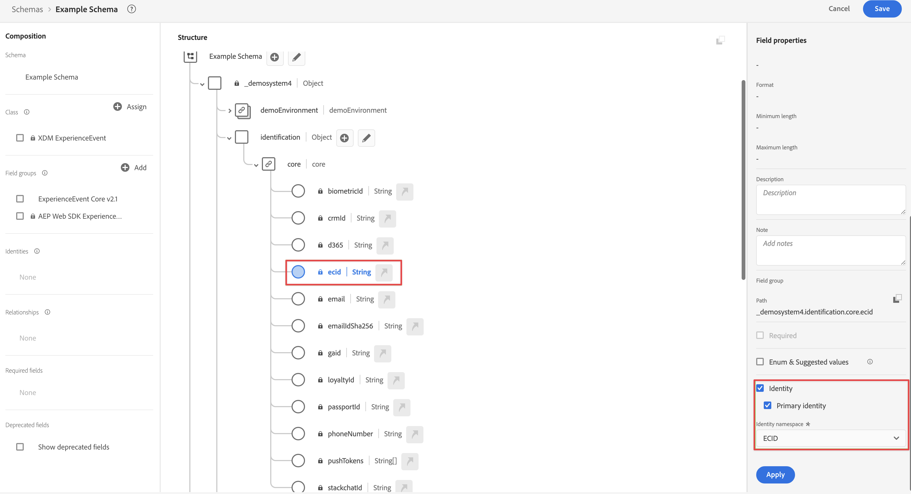

# 透過 Adobe Experience Platform Web SDK 和 Edge Network 擷取資料

本快速入門指南說明如何使用 Adobe Experience Platform Web SDK 和 Edge Network，將網站追蹤資料直接擷取至 Adobe Experience Platform，然後在 Customer Journey Analytics 中使用該資料。

若要完成此操作，您必須：

- 在 Adobe Experience Platform 中&#x200B;**設定結構和資料集**，定義您要收集的資料的模型 (結構)，以及實際收集資料的位置 (資料集)。

- **設定資料流**&#x200B;以設定 Adobe Experience Platform Edge Network，將收集的資料路由至您在 Adobe Experience Platform 中設定的資料集。

- **使用標籤**，輕鬆針對網站上資料層的資料設定規則和資料元素。然後，確定資料已傳送至 Adobe Experience Platform Edge Network 上設定的資料流。

- **部署和驗證**。擁有一個讓您可反覆進行標籤開發作業的環境，一旦所有內容均經過驗證，就可以在您的生產環境中實時發布。

- 在 Customer Journey Analytics 中&#x200B;**設定連線**。此連線應 (至少) 包含您的 Adobe Experience Platform 資料集。

- 在 Customer Journey Analytics 中&#x200B;**設定資料檢視**，定義您要在 Analysis Workspace 中使用的量度和維度。

- 在 Customer Journey Analytics 中&#x200B;**設定專案**，建立您的報告和視覺效果。

>[!NOTE]
>
>此為簡化的指南，說明如何將從您網站收集的資料擷取至 Adobe Experience Platform，並在 Customer Journey Analytics 中使用該資料。強烈建議在提及時研究其他資訊。


## 設定結構和資料集

若要將資料擷取至 Adobe Experience Platform，您必須先定義要收集的資料。所有擷取至 Adobe Experience Platform 的資料都必須符合標準的非正常結構，才能由下游能力和功能識別並處理。體驗資料模型 (XDM) 是以結構形式提供此結構的標準框架。

定義結構後，您可以使用一個或多個資料集來儲存及管理資料收集。資料集是資料集合的儲存和管理結構，通常是包含方案 (欄) 和欄位 (列) 的表格。 

擷取至 Adobe Experience Platform 的所有資料都必須符合預先定義的結構，才能以資料集形式持續保存。

### 設定結構

您想要追蹤來自造訪您網站之設定檔的一些最少量資料，例如頁面名稱、身分識別。
為此，您首先需要定義用於建立此資料模型的結構。

若要設定您的結構：

1. 在 Adobe Experience Platform UI 的左側邊欄中，選取[!UICONTROL 「資料管理」]中的&#x200B;**[!UICONTROL 「結構」]**。

2. 選取&#x200B;**[!UICONTROL 「建立結構」]**。從選項清單中選取&#x200B;**[!UICONTROL 「XDM ExperienceEvent」]**。

   

   >[!INFO]
   >
   >    體驗事件結構可用來建立設定檔&#x200B;_行為_ (例如頁面檢視、新增至購物車) 模型。個別設定檔結構可用來建立設定檔&#x200B;_屬性_ (例如姓名、電子郵件、性別) 模型。


3. 在[!UICONTROL 「無標題結構」]畫面中：

   1. 輸入結構的顯示名稱與 (可選) 說明。

      

   2. 在[!UICONTROL 「欄位群組」]中選取&#x200B;**[!UICONTROL 「+ 新增」]**。

      

      欄位群組是可重複使用的物件和屬性集合，可讓您輕鬆擴充結構。

   3. 在[!UICONTROL 「新增欄位群組」]對話框中，從清單中選取&#x200B;**[!UICONTROL 「AEP Web SDK ExperienceEvent」]**&#x200B;欄位群組。

      

      您可以選取預覽按鈕，以查看屬於此欄位群組之欄位的預覽，例如 `web > webPageDetails > name`。

      

      選取&#x200B;**[!UICONTROL 「返回」]**&#x200B;來關閉預覽。

   4. 選取&#x200B;**[!UICONTROL 「新增欄位群組」]**。

4. 在[!UICONTROL 「結構」]面板中，選取結構名稱旁的 **[!UICONTROL +]**。

   

5. 在[!UICONTROL 「欄位屬性」]面板中，輸入 `Identification` 作為名稱，**[!UICONTROL 「識別」]**&#x200B;作為[!UICONTROL 顯示名稱]，選取&#x200B;**[!UICONTROL 「物件」]**&#x200B;作為[!UICONTROL 類型]，並選取&#x200B;**[!UICONTROL 「ExperienceEvent 核心 v2.1」]**&#x200B;作為[!UICONTROL 欄位群組]。

   

   這會將識別功能新增至您的結構。在您的案例中，您想使用 Experience Cloud ID 和電子郵件地址識別造訪您網站的設定檔。有許多其他屬性可用來追蹤您的人員身分識別（例如客戶ID、忠誠度ID）。

   選取&#x200B;**[!UICONTROL 「套用」]**&#x200B;將此物件加入您的結構。

6. 在剛剛新增的識別物件中選取 **[!UICONTROL ecid]** 欄位，然後在右側面板的[!UICONTROL 「身分命名空間」]清單中，選取&#x200B;**[!UICONTROL 「身分」]**&#x200B;和&#x200B;**[!UICONTROL 「主要身分」]**&#x200B;和 **[!UICONTROL ECID]**。

   

   您正在指定 Experience Cloud Identity 作為 Adobe Experience Platform Identity 服務可用於結合 (拼接) 設定檔行為與相同 ECID 的主要身分。

   選取&#x200B;**[!UICONTROL 「套用」]**。您會看到指紋圖示出現在 ecid 屬性中。

7. 在剛剛新增的識別物件中選取&#x200B;**[!UICONTROL 「電子郵件」]**&#x200B;欄位，然後在[!UICONTROL 「欄位屬性」]面板的[!UICONTROL 「身分命名空間」]清單中選取&#x200B;**[!UICONTROL 「身分」]**&#x200B;和&#x200B;**[!UICONTROL 「電子郵件」]**。

   

   您正在指定電子郵件地址作為 Adobe Experience Platform Identity 服務可用於結合 (拼接) 設定檔行為的另一個身分。

   選取&#x200B;**[!UICONTROL 「套用」]**。您會看到指紋圖示出現在電子郵件屬性中。

   選取&#x200B;**[!UICONTROL 「儲存」]**。

8. 選取顯示結構名稱之結構的根元素，然後選取&#x200B;**[!UICONTROL 「設定檔」]**&#x200B;切換。

   系統會提示您啟用設定檔的結構。啟用後，根據此結構將資料擷取至資料集時，該資料就會合併至即時客戶設定檔中。

   如需詳細資訊，請參閱[啟用結構以用於即時客戶設定檔](https://experienceleague.adobe.com/docs/experience-platform/xdm/tutorials/create-schema-ui.html?lang=zh-Hant#profile)。

   >[!IMPORTANT]
   >
   >    儲存啟用設定檔的結構後，便無法再為設定檔停用該結構。

   

9. 選取&#x200B;**[!UICONTROL 「儲存」]**，即可儲存您的結構。

您已建立最小結構，以建立可從您網站擷取的資料的模型。該結構可讓您使用 Experience Cloud Identity 和電子郵件地址來識別設定檔。透過啟用設定檔的結構，即可確保將從您網站擷取的資料新增至即時客戶設定檔。

除了行為資料之外，您也可以從您的網站擷取設定檔屬性資料 (例如訂閱電子報的設定檔詳細資訊)。

若要擷取此設定檔資料，您可以：

- 根據 XDM 個別設定檔架構類別建立結構。

- 將「設定檔核心 v2」欄位群組新增至結構。

- 根據「設定檔核心 v2」欄位群組新增識別物件。

- 將 ecid 定義為主要識別碼，將電子郵件定義為識別碼。

- 啟用該設定檔結構

請參閱[在 UI 中建立和編輯結構](https://experienceleague.adobe.com/docs/experience-platform/xdm/ui/resources/schemas.html)，了解有關向結構添加和刪除欄位群組和個別欄位的詳細資訊。

### 設定資料集

您已使用您的結構定義資料模型。您現在必須定義結構以儲存和管理該資料。這將透過資料集完成。

若要設定您的資料集：

1. 在 Adobe Experience Platform UI 的左側邊欄中，選取[!UICONTROL 「資料管理」]中的&#x200B;**[!UICONTROL 「資料集」]**。

2. 選取&#x200B;**[!UICONTROL 「建立資料集」]**。

   

3. 選取&#x200B;**[!UICONTROL 「從結構建立資料集」]**。

   

4. 選取您先前建立的結構並選取&#x200B;**[!UICONTROL 「下一個」]**。

5. 為資料集命名，並 (可選) 提供說明。

   

6. 選取&#x200B;**[!UICONTROL 「完成」]**。

7. 選取&#x200B;**[!UICONTROL 「設定檔」]**&#x200B;切換。

   系統會提示您啟用設定檔的資料集。資料集一經啟用，即可透過擷取的資料豐富即時客戶設定檔。

   >[!IMPORTANT]
   >
   >    只有當資料集所遵循的結構同樣啟用設定檔時，您才能啟用設定檔的資料集。

   

請參閱[資料集 UI 指南](https://experienceleague.adobe.com/docs/experience-platform/catalog/datasets/user-guide.html?lang=zh-Hant)，了解如何檢視、預覽、建立、刪除資料集的詳細資訊。以及為即時客戶設定檔啟用資料集的方法。

## 設定資料流

資料流代表實作 Adobe Experience Platform Web 和 Mobile SDK 時的伺服器端設定。使用 Adobe Experience Platform SDK 收集資料時，資料會傳送至 Adobe Experience Platform Edge Network。此資料流決定資料要轉送到哪些服務。

在設定中，您想要將從網站收集的資料傳送至 Adobe Experience Platform 中的資料集。

若要設定您的資料流：

1. 在 Adobe Experience Platform UI 中，從左側邊欄的[!UICONTROL 「資料收集」]中選取&#x200B;**[!UICONTROL 「資料流」]**。

2. 選取「**[!UICONTROL 新資料流]**」。

3. 命名並描述您的資料流。從[!UICONTROL 「事件結構」]清單中選取您的結構。

   

4. 選取&#x200B;**[!UICONTROL 「儲存」]**。

5. 選取&#x200B;**[!UICONTROL 「新增服務」]**。

6. 在[!UICONTROL 「新增服務畫面」]中：

   1. 從[!UICONTROL 「服務」]清單中選取&#x200B;**[!UICONTROL 「Adobe Experience Platform」]**。

   2. 確保已選取&#x200B;**[!UICONTROL 「啟用」]**。

   3. 從[!UICONTROL 「事件資料集」]清單中選取您的資料集。

      

   4. 保留其他設定並選取&#x200B;**[!UICONTROL 「儲存」]**&#x200B;以儲存資料流。

您的資料流現在已設定為將從您網站收集的資料轉送至 Adobe Experience Platform 中的資料集。

請參閱[資料流概觀](https://experienceleague.adobe.com/docs/experience-platform/edge/datastreams/overview.html?lang=zh-Hant)，了解如何設定資料流以及如何處理敏感資料的詳細資訊。


## 使用標籤

使用 Adobe Experience Platform 中的「標籤」功能，在您的網站上實作程式碼，以實際收集資料。此標記管理解決方案可讓您部署程式碼以及其他標記需求。 標籤可使用 Adobe Experience Platform Web SDK 擴充功能與 Adobe Experience Platform 緊密整合。

### 建立標籤

1. 在 Adobe Experience Platform UI 的左側邊欄中，選取[!UICONTROL 「資料收集」]中的&#x200B;**[!UICONTROL 「標籤」]**。

2. 選取&#x200B;**[!UICONTROL 「新屬性」]**。

   為標籤命名，選取 **[!UICONTROL Web]** 並輸入域名。選取&#x200B;**[!UICONTROL 「儲存」]**&#x200B;以繼續。

   

### 設定您的標籤

建立標籤後，您必須使用正確的擴充功能加以設定，並根據您要如何追蹤網站及將資料傳送至 Adobe Experience Platform 來設定資料元素和規則。

從[!UICONTROL 「標籤屬性」]清單中選擇您新建立的標籤，並將其打開。


#### **擴充功能**

將 Adobe Platform Web SDK 擴充功能新增至您的標籤，以確保您可以 (透過您的資料流) 將資料傳送至 Adobe Experience Platform。

若要建立及設定 Adobe Experience Platform Web SDK 擴充功能：

1. 選取左側邊欄中的&#x200B;**[!UICONTROL 「擴充功能」]**。

2. 在頂端列中選取 **[!UICONTROL 「目錄」]**。

3. 搜尋或捲動至 Adobe Experience Platform Web SDK 擴充功能，然後選取&#x200B;**[!UICONTROL 「安裝」]**&#x200B;以進行安裝。

   

4. 為您的[!UICONTROL 生產環境]和 (可選) [!UICONTROL 中繼環境]以及[!UICONTROL 開發環境]選取您的沙箱和先前建立的資料流。

   

   選取&#x200B;**[!UICONTROL 「儲存」]**。

如需詳細資訊，請參閱[設定 Adobe Experience Platform Web SDK 擴充功能](https://experienceleague.adobe.com/docs/experience-platform/edge/extension/web-sdk-extension-configuration.html)。

您也想要設定 Experience Cloud ID 服務擴充功能，以便輕鬆使用 Experience Cloud ID。Experience CloudID服務可識別所有Adobe Experience Cloud解決方案中的人員。

若要建立及設定 Experience Cloud ID 服務擴充功能：

1. 選取左側邊欄中的&#x200B;**[!UICONTROL 「擴充功能」]**。

2. 在頂端列中選取 **[!UICONTROL 「目錄」]**。

3. 搜尋或捲動至 Experience Cloud ID 服務擴充功能，然後選取&#x200B;**[!UICONTROL 「安裝」]**&#x200B;以進行安裝。

   

4. 將所有設定保留為預設值。

5. 選取&#x200B;**[!UICONTROL 「儲存」]**。

#### **資料元素**

資料元素是資料字典 (或資料地圖) 的建置組塊。使用資料元素，在行銷和廣告技術之間收集、組織和傳遞資料。您可在標籤中設定從資料層讀取的資料元素，可用來將資料傳送至 Adobe Experience Platform。

資料元素的類型不同。您先設定資料元素，擷取訪客在您的網站上檢視的頁面名稱。

若要定義頁面名稱資料元素：

1. 選取左側邊欄中的&#x200B;**[!UICONTROL 「資料元素」]**。

2. 選取&#x200B;**[!UICONTROL 「新增資料元素」]**。

3. 在[!UICONTROL 「新增資料元素」]對話框中：

   - 為您的資料元素命名，例如 `Page Name`。

   - 從&#x200B;**[!UICONTROL 「擴充功能」]**&#x200B;清單中選取[!UICONTROL 「核心」]。

   - 從[!UICONTROL 「資料元素類型」]清單中選取&#x200B;**[!UICONTROL 「頁面資訊」]**。

   - 從[!UICONTROL 「屬性」]清單中選取&#x200B;**[!UICONTROL 「標題」]**。

      

      或者，您也可以使用資料層變數的值，例如`pageName`和 [!UICONTROL JavaScript 變數] 資料元素類型來定義該資料元素。

      

   - 選取&#x200B;**[!UICONTROL 「儲存」]**。

您現在想要設定資料元素，以參考由 Adobe Experience Platform Web SDK 自動提供且可透過 Experience Cloud ID 服務擴充功能使用的Experience Cloud ID。

若要定義 ECID 資料元素：

1. 選取左側邊欄中的&#x200B;**[!UICONTROL 「資料元素」]**。

2. 選取&#x200B;**[!UICONTROL 「新增資料元素」]**。

3. 在[!UICONTROL 「新增資料元素」]對話框中：

   - 為您的資料元素命名，例如 `ECID`。

   - 從[!UICONTROL 「擴充功能」]清單中選取&#x200B;**[!UICONTROL 「Experience Cloud ID 服務」]**。

   - 從[!UICONTROL 「資料元素類型」]清單中選取 **[!UICONTROL ECID]**。

      

   - 選取&#x200B;**[!UICONTROL 「儲存」]**。

最後，您現在想要將任何特定資料元素對應至先前定義的結構。您可以定義另一個資料元素，以呈現 XDM 結構。

若要定義 XDM 物件資料元素：

1. 選取左側邊欄中的&#x200B;**[!UICONTROL 「資料元素」]**。

2. 選取&#x200B;**[!UICONTROL 「新增資料元素」]**。

3. 在[!UICONTROL 「新增資料元素」]對話框中：

   - 為您的資料元素命名，例如 `XDM - Page View`。

   - 從[!UICONTROL 「擴充功能」]清單中選取&#x200B;**[!UICONTROL 「Adobe Experience Platform Web SDK」]**。

   - 從[!UICONTROL 「資料元素類型」]清單中選取&#x200B;**[!UICONTROL 「XDM 物件」]**。

   - 從[!UICONTROL 「沙箱」]清單中選取您的沙箱。

   - 從[!UICONTROL 「結構」]清單中選取您的結構。

   - 將您的結構中定義的 `identification > core > ecid`屬性對應至 ECID 資料元素。選取圓柱體圖示，即可輕鬆從資料元素清單中挑選 ECID 資料元素。

      

      


   - 將您的結構中定義的 `web > webPageDetails > name`屬性對應至頁面名稱資料元素。

      

   - 選取&#x200B;**[!UICONTROL 「儲存」]**。


#### **規則**

Adobe Experience Platform 中的標籤會遵循規則型系統。它們會尋找使用者互動與相關資料。當符合列於您規則中的準則時，規則會觸發您識別的擴充功能、指令碼或用戶端代碼。您可以使用規則，透過 Adobe Experience Platform Web SDK 擴充功能將資料 (例如 XDM 物件) 傳送至 Adobe Experience Platform。

定義規則：

1. 選取左側邊欄中的&#x200B;**[!UICONTROL 「規則」]**。

2. 選取&#x200B;**[!UICONTROL 「建立新規則」]**。

3. 在[!UICONTROL 「建立規則」]對話框：

   - 為規則命名，例如 `Page View`。

   - 在[!UICONTROL 「事件」]下選取&#x200B;**[!UICONTROL 「+ 新增」]**。

   - 在[!UICONTROL 「事件設定」]對話框：

      - 從&#x200B;**[!UICONTROL 「擴充功能」]**&#x200B;清單中選取[!UICONTROL 「核心」]。

      - 從[!UICONTROL 「事件類型」]清單中選取&#x200B;**[!UICONTROL 「視窗已載入」]**。

         

      - 選取&#x200B;**[!UICONTROL 「保留變更」]**。
   - 在[!UICONTROL 「動作」]下方選取&#x200B;**[!UICONTROL 「+ 新增」]**。

   - 在[!UICONTROL 動作設定] 對話框：

      - 從[!UICONTROL 「擴充功能」]清單中選取&#x200B;**[!UICONTROL 「Adobe Experience Platform Web SDK」]**。

      - 從[!UICONTROL 「動作類型」]清單中選取&#x200B;**[!UICONTROL 「傳送事件」]**。

      - 從[!UICONTROL 「類型」]清單中選取&#x200B;**[!UICONTROL 「web.webpagedetails.pageViews」]**。

      - 選取[!UICONTROL 「XDM 資料」]旁的圓柱體圖示，然後從資料元素清單中選擇&#x200B;**[!UICONTROL 「XDM – 頁面檢視」]**。

         

      - 選取&#x200B;**[!UICONTROL 「保留變更」]**。
   - 您的規則應如下所示：

      

   - 選取&#x200B;**[!UICONTROL 「儲存」]**。


這只是定義規則的範例，此規則會將 XDM 資料 (包含其他資料元素的值) 傳送至 Adobe Experience Platform。

您可以在標籤中以各種方式使用規則來操控變數 (使用您的資料元素)。

如需詳細資訊，請參閱[規則](https://experienceleague.adobe.com/docs/experience-platform/tags/ui/rules.html)。

### 建置並發佈您的標籤

定義資料元素和規則後，您需要建置並發佈標籤。建立程式庫組建時，必須將其指派至一個環境。隨後組建的擴充功能、規則和資料元素會經過編譯，並放入指派的環境中。每個環境都會提供唯一的內嵌程式碼，可讓您將指派的組建整合至您的網站。

若要建置並發佈您的標籤：

1. 從左側邊欄中選取&#x200B;**[!UICONTROL 「發佈流程」]**。

2. 選取&#x200B;**[!UICONTROL 「選擇工作程式庫」]**，然後選取&#x200B;**[!UICONTROL 「新增程式庫…」]**。

3. 在[!UICONTROL 「建立程式庫」]對話框：

   - 為程式庫命名。

   - 從&#x200B;**[!UICONTROL 「環境」]**&#x200B;清單中選取[!UICONTROL 「開發 (開發)」]。

   - 選取&#x200B;**[!UICONTROL 「+ 新增所有變更的資源」]**。

      

   - 選取&#x200B;**[!UICONTROL 「儲存並建置至開發」]**。

   如此可儲存並建置開發環境的標籤。綠色圓點表示在開發環境中成功建置標籤。

4. 您可以選取&#x200B;**[!UICONTROL 「...」]**&#x200B;來重建程式庫或將程式庫移至中繼環境或生產環境。

   

Adobe Experience Platform 標籤支援簡單到複雜的發佈工作流程，以配合您部署 Adobe Experience Platform Web SDK。

如需詳細資訊，請參閱[發佈概觀](https://experienceleague.adobe.com/docs/experience-platform/tags/publish/overview.html?lang=zh-Hant)。


### 擷取您的標籤程式碼

最後，您需要在要追蹤的網站上安裝標籤。這表示您會將程式碼放入網站範本的標題標籤中。

若要取得參考標籤的程式碼：

1. 選取左側邊欄中的&#x200B;**[!UICONTROL 「環境」]**。

2. 從環境清單中，選取正確的安裝 (框) 按鈕。

   在[!UICONTROL 「Web 安裝指示」]對話框中，選取指令碼旁的複製按鈕，如下所示：

   ```javascript
   <script src="https://assets.adobedtm.com/2a518741ab24/.../launch-...-development.min.js" async></script>
   ```

   

3. 選取&#x200B;**[!UICONTROL 「關閉」]**。

您可以根據您部署 Adobe Experience Platform Web SDK 的流程，選取其他環境 (中繼、生產)，而非開發環境的程式碼。

如需詳細資訊，請參閱[環境](https://experienceleague.adobe.com/docs/experience-platform/tags/publish/environments/environments.html?)。

## 部署和驗證。

您現在可以將程式碼部署在 `<head>`標籤內的網站開發版本上。部署後，您的網站就會開始將資料收集至 Adobe Experience Platform。

驗證您的實作、視需要更正實作，並在更正後，使用「標籤」的發佈工作流程功能，將其部署至中繼和生產環境。

## 設定連線

若要在 Customer Journey Analytics 中使用 Adobe Experience Platform 資料，您可以建立連線，其中包含設定結構、資料集和工作流程所產生的資料。

連線可讓您將資料集從 Adobe Experience Platform 整合到工作區。若要針對這些資料集製作報告，必須先在 Adobe Experience Platform 和工作區的資料集之間建立連線。

若要建立連線，請執行以下操作：

1. 在 Customer Journey Analytics UI 中，選取頂部導覽中的&#x200B;**[!UICONTROL 「連線」]**。

2. 選取&#x200B;**[!UICONTROL 「建立新連線」]**。

3. 在[!UICONTROL 「無標題連線」]畫面中：

   在[!UICONTROL 「連線設定」]中為連線命名並提供說明。

   從[!UICONTROL 「資料設定」]的[!UICONTROL 「沙箱」]清單中選取正確沙箱，並從[!UICONTROL 「每日事件平均數」]清單中選取每日事件數。

   

   選取&#x200B;**[!UICONTROL 「新增資料集」]**。

   在[!UICONTROL 新增資料集]的[!UICONTROL 選取資料集]步驟：

   - 選取您先前建立的資料集 (`Example dataset`) 和您要加入連線的任何其他資料集。

      

   - 選取&#x200B;**[!UICONTROL 「下一步」]**。
   在[!UICONTROL 新增資料集]的[!UICONTROL 資料集設定]步驟：

   - 對於每個資料集：

      - 在 Adobe Experience Platform 中，從資料集結構描述中所定義的可用身分中選取[!UICONTROL 人員 ID]。

      - 從[!UICONTROL 「資料來源類型」]清單中選取正確的資料來源。如果您指定&#x200B;**[!UICONTROL 「其他」]**，請為您的資料來源新增說明。

      - 根據您的偏好設定，設定&#x200B;**[!UICONTROL 匯入所有新資料]**&#x200B;和&#x200B;**[!UICONTROL 資料集回填現有資料]**。

      

   - 選取&#x200B;**[!UICONTROL 「新增資料集」]**。
   選取&#x200B;**[!UICONTROL 「儲存」]**。

如需如何建立和管理連線，以及如何選取和合併資料集的詳細資訊，請參閱[連線概觀](../connections/overview.md)。

## 設定資料檢視

資料檢視是特定於 Customer Journey Analytics 的容器，可讓您決定如何詮釋來自連線的資料。它指定 Analysis Workspace 中可用的所有維度和量度，以及這些維度和量度從哪些欄取得資料。資料檢視是為了在 Analysis Workspace 中報告資料而定義的。

若要建立資料檢視，請執行以下操作：

1. 在 Customer Journey Analytics UI 中，選取頂部導覽中的&#x200B;**[!UICONTROL 「資料檢視」]**。

2. 選取&#x200B;**[!UICONTROL 「建立新的資料檢視」]**。

3. 在[!UICONTROL 設定]步驟：

   從[!UICONTROL 「連線」]清單中選取您的連線。

   為連線命名，並 (可選) 提供說明。

   

   選取&#x200B;**[!UICONTROL 「儲存並繼續」]**。

4. 在[!UICONTROL 元件]步驟：

   將您要納入的任何結構欄位和/或標準元件新增至[!UICONTROL 量度]或[!UICONTROL 維度]元件框。

   

   選取&#x200B;**[!UICONTROL 「儲存並繼續」]**。

5. 在[!UICONTROL 設定]步驟：

   

   保留設定原樣並選取&#x200B;**[!UICONTROL 「儲存並完成」]**。

如需如何建立和編輯資料檢視、可在資料檢視中使用哪些元件，以及如何使用篩選器和工作階段設定的詳細資訊，請參閱[資料檢視概觀](../data-views/data-views.md)。


## 設定專案

Analysis Workspace 是彈性的瀏覽器工具，可讓您根據資料快速建立分析及分享見解。您可以使用工作區專案合併資料元件、表格和視覺效果，進行分析並與貴組織的任何人分享。

若要建立專案，請執行以下操作：

1. 在 Customer Journey Analytics UI 中，選取頂部導覽中的&#x200B;**[!UICONTROL 「專案」]**。

2. 在左側導覽中選取&#x200B;**[!UICONTROL 「專案」]**。

3. 選取&#x200B;**[!UICONTROL 「建立專案」]**。

   

   選取&#x200B;**[!UICONTROL 「空白專案」]**。

   

4. 從清單中選取您的資料檢視。

   。

5. 開始將維度和量度拖放至[!UICONTROL 面板]中的[!UICONTROL 自由表格]，建立您的第一個報告。例如，拖曳 `Program Points Balance`和 `Page View` 做為量度 而 `email` 作為維度，快速概覽已造訪過您網站且屬於收集忠誠點數之忠誠計劃一部分的設定檔。

   

如需如何使用元件、視覺效果和面板建立專案和建立分析的詳細資訊，請參閱 [Analysis Workspace 概觀](../analysis-workspace/home.md)。

>[!SUCCESS]
>
>您已完成所有步驟。從定義您要收集的資料 (結構)，以及要將其儲存在 Adobe Experience Platform 中的何處 (資料集) 開始，您已在 Edge Network 上設定資料流，確保資料可轉送至該資料集。接著，您定義並部署了包含擴充功能 (Adobe Experience Platform Web SDK、Experience Cloud ID 服務)、資料元素和規則的標籤，以從您的網站擷取資料，並將該資料傳送至您的資料流。您已在 Customer Journey Analytics 中定義連線，以使用您的網站追蹤資料和其他資料。您的資料檢視定義可讓您指定要使用的維度和量度，最後，您建立了第一個可視覺化和分析資料的專案。
