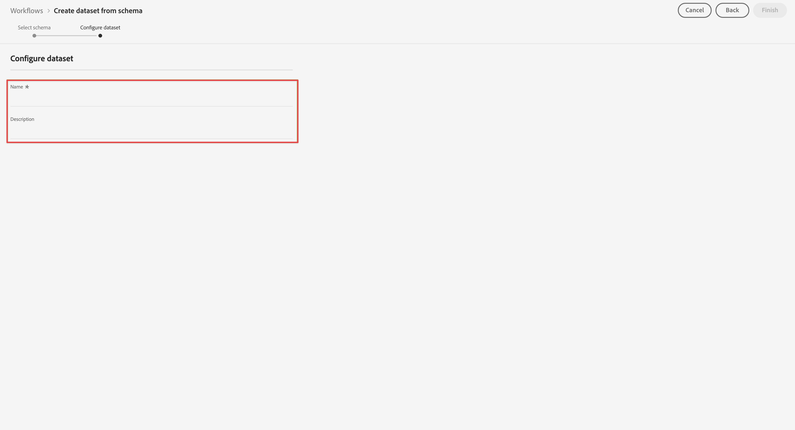

# 透過 Adobe Experience Platform Web SDK 和 Edge Network 擷取資料

本快速入門手冊說明如何使用Adobe Experience Platform Web SDK和邊緣網路，將網站追蹤資料直接內嵌至Adobe Experience Platform，然後在Customer Journey Analytics中使用該資料。

若要完成此作業，您必須：

- **設定結構和資料集** 在Adobe Experience Platform中，定義您要收集的資料的模型（結構），以及實際收集資料（資料集）的位置。

- **設定資料流** 設定Adobe Experience Platform邊緣網路，將收集的資料路由至您在Adobe Experience Platform中設定的資料集。

- **使用標籤** 輕鬆針對網站上資料層的資料設定規則和資料元素。 然後，確定資料已傳送至Adobe Experience Platform邊緣網路上設定的資料流。

- **部署和驗證**. 有一個環境，讓您可反覆進行標籤開發作業，一旦所有項目經過驗證，就會在生產環境中上線發佈。

- **設定連線** Customer Journey Analytics。 此連線應（至少）包含您的Adobe Experience Platform資料集。

- **設定資料檢視** Customer Journey Analytics來定義您要在Analysis Workspace中使用的量度和維度。

- **設定專案** Customer Journey Analytics來建立報表和視覺效果。

>[!NOTE]
>
>此為簡化的指南，說明如何將從您網站收集的資料內嵌至Adobe Experience Platform，以及在Customer Journey Analytics中使用。 強烈建議在提及時研究其他資訊。


## 設定結構和資料集

若要將資料內嵌至Adobe Experience Platform，您必須先定義要收集的資料。 所有擷取至Adobe Experience Platform的資料都必須符合標準的非正常結構，才能由下游功能和功能識別並處理。 Experience Data Model(XDM)是以結構形式提供此結構的標準架構。

定義結構後，可使用一或多個資料集來儲存及管理資料收集。 資料集是資料集合的儲存和管理結構，通常是包含方案 (欄) 和欄位 (列) 的表格。 

擷取至Adobe Experience Platform的所有資料都必須符合預先定義的結構，才能以資料集形式持續保存。

### 設定結構

您想要追蹤來自造訪您網站之設定檔的一些最少量資料，例如頁面名稱、身分識別。
為此，您首先需要定義用於模型此資料的結構。

若要設定您的結構：

1. 在Adobe Experience Platform UI的左側邊欄中，選取 **[!UICONTROL 結構]** with [!UICONTROL 資料管理].

2. 選擇 **[!UICONTROL 建立結構]**. 選擇 **[!UICONTROL XDM ExperienceEvent]** 從選項清單中。

   

   >[!INFO]
   >
   >    體驗事件結構可用來模型 _行為_ 設定檔（如頁面檢視、新增至購物車）。 個別設定檔結構可用來模型設定檔 _屬性_ （例如姓名、電子郵件、性別）。


3. 在 [!UICONTROL 無標題結構] 畫面：

   1. 輸入架構的顯示名稱，並（可選）說明。

      

   2. 選擇 **[!UICONTROL +新增]** in [!UICONTROL 欄位群組].

      

      欄位群組是可重複使用的物件和屬性集合，可讓您輕鬆擴充您的架構。

   3. 在 [!UICONTROL 新增欄位群組] 對話框，選擇 **[!UICONTROL AEP Web SDK ExperienceEvent]** 欄位群組。

      

      您可以選取預覽按鈕，查看屬於此欄位群組之欄位的預覽，例如 `web > webPageDetails > name`.

      

      選擇 **[!UICONTROL 返回]** 來關閉預覽。

   4. 選擇 **[!UICONTROL 新增欄位群組]**.

4. 選擇 **[!UICONTROL +]** 位於 [!UICONTROL 結構] 中。

   

5. 在 [!UICONTROL 欄位屬性] 面板，輸入 `Identification` 作為名稱， **[!UICONTROL 識別]** 作為 [!UICONTROL 顯示名稱]，選取 **[!UICONTROL 物件]** 作為 [!UICONTROL 類型] 選取 **[!UICONTROL ExperienceEvent核心v2.1]** 作為 [!UICONTROL 欄位組].

   

   這會將識別功能新增至您的架構。 在您的案例中，您想使用Experience CloudID和電子郵件地址識別造訪您網站的設定檔。 有許多其他屬性可用來追蹤訪客的身分識別（例如客戶id、忠誠度id）。

   選擇 **[!UICONTROL 套用]** 將此對象添加到您的架構中。

6. 選取 **[!UICONTROL ecid]** 欄位，然後選取 **[!UICONTROL 身分]** 和 **[!UICONTROL 主要身分]** 和 **[!UICONTROL ECID]** 從 [!UICONTROL 身分命名空間] 清單。

   

   您需指定Experience Cloud身分識別作為Adobe Experience Platform Identity服務可用來將設定檔的行為與相同ECID結合（拼接）的主要身分識別。

   選擇 **[!UICONTROL 套用]**. 您會看到ecid屬性中出現指紋圖示。

7. 選取 **[!UICONTROL 電子郵件]** 欄位，然後選取 **[!UICONTROL 身分]** 和 **[!UICONTROL 電子郵件]** 從 [!UICONTROL 身分命名空間] 清單 [!UICONTROL 欄位屬性] 中。

   

   您會將電子郵件地址指定為Adobe Experience Platform Identity Service可用來結合（拼接）設定檔行為的另一個身分。

   選擇 **[!UICONTROL 套用]**. 您會看到指紋圖示出現在電子郵件屬性中。

   選取「**[!UICONTROL 儲存]**」。

8. 選取顯示架構名稱的架構的根元素，然後選取 **[!UICONTROL 設定檔]** 切換。

   系統會提示您啟用配置檔案的架構。 啟用後，根據此結構將資料擷取至資料集時，該資料會合併至即時客戶設定檔中。

   請參閱 [啟用結構以用於即時客戶個人檔案](https://experienceleague.adobe.com/docs/experience-platform/xdm/tutorials/create-schema-ui.html?lang=en#profile) 以取得更多資訊。

   >[!IMPORTANT]
   >
   >    一旦為設定檔啟用了架構，便無法再為設定檔停用該架構。

   

9. 選擇 **[!UICONTROL 儲存]** 來儲存您的架構。

您已建立最小結構，以模型化可從網站擷取的資料。 結構可讓使用Experience Cloud身分和電子郵件地址來識別設定檔。 透過啟用設定檔的結構，您可確保從網站擷取的資料已新增至即時客戶設定檔中。

在行為資料旁，您也可以從您的網站擷取設定檔屬性資料（例如訂閱電子報的設定檔詳細資訊）。

若要擷取此設定檔資料，您可以：

- 根據XDM個別設定檔類別建立結構。

- 將「設定檔核心v2」欄位群組新增至結構。

- 根據「設定檔核心v2」欄位群組新增識別物件。

- 將ecid定義為主要識別碼，將電子郵件定義為識別碼。

- 啟用設定檔的結構

請參閱 [在UI中建立和編輯結構](https://experienceleague.adobe.com/docs/experience-platform/xdm/ui/resources/schemas.html) 有關向架構添加和刪除欄位組和單個欄位的詳細資訊。

### 設定資料集

您已使用您的結構定義資料模型。 您現在必須定義結構以儲存和管理該資料。 這是透過資料集完成。

若要設定資料集：

1. 在Adobe Experience Platform UI的左側邊欄中，選取 **[!UICONTROL 資料集]** with [!UICONTROL 資料管理].

2. 選擇 **[!UICONTROL 建立資料集]**.

   

3. 選擇 **[!UICONTROL 從結構建立資料集]**.

   

4. 選擇您先前建立的架構並選擇 **[!UICONTROL 下一個]**.

5. 為資料集命名，（選用）提供說明。

   

6. 選擇 **[!UICONTROL 完成]**.

7. 選取 **[!UICONTROL 設定檔]** 切換。

   系統會提示您啟用設定檔的資料集。 資料集一經啟用，即可透過擷取的資料豐富即時客戶個人檔案。

   >[!IMPORTANT]
   >
   >    只有當資料集所遵循的結構已啟用設定檔時，您才能啟用設定檔的資料集。

   

請參閱 [資料集UI指南](https://experienceleague.adobe.com/docs/experience-platform/catalog/datasets/user-guide.html?lang=zh-Hant) 以取得檢視、預覽、建立、刪除資料集的詳細資訊。 以及如何為「即時客戶個人檔案」啟用資料集。

## 設定資料流

資料流代表實作Adobe Experience Platform Web和Mobile SDK時的伺服器端設定。 使用Adobe Experience Platform SDK收集資料時，資料會傳送至Adobe Experience Platform邊緣網路。 它是決定資料要轉送到哪些服務的資料流。

在設定中，您會想要將您從網站收集的資料傳送至Adobe Experience Platform中的資料集。

設定資料流：

1. 在Adobe Experience Platform UI中，選取 **[!UICONTROL 資料流]** 從 [!UICONTROL 資料收集] 在左側邊欄。

2. 選擇 **[!UICONTROL 新資料流]**.

3. 為您的資料流命名和描述。 從 [!UICONTROL 事件結構] 清單。

   

4. 選取「**[!UICONTROL 儲存]**」。

5. 選擇 **[!UICONTROL 添加服務]**.

6. 在 [!UICONTROL 「添加服務」螢幕]:

   1. 選擇 **[!UICONTROL Adobe Experience Platform]** 從 [!UICONTROL 服務] 清單。

   2. 確保 **[!UICONTROL 已啟用]** 中所有規則的URL。

   3. 從 [!UICONTROL 事件資料集] 清單。

      

   4. 保留其他設定並選取 **[!UICONTROL 儲存]** 儲存資料流。

您的資料流現在已設定為將從您網站收集的資料轉送至Adobe Experience Platform中的資料集。

請參閱 [資料流概觀](https://experienceleague.adobe.com/docs/experience-platform/edge/datastreams/overview.html?lang=zh-Hant) 以取得如何設定資料流以及如何處理敏感資料的詳細資訊。


## 使用標籤

使用Adobe Experience Platform中的「標籤」功能，在您的網站上實作程式碼，以實際收集資料。 此標記管理解決方案可讓您部署 程式碼以及其他標記需求。 標籤可使用Adobe Experience Platform Web SDK擴充功能與Adobe Experience Platform緊密整合。

### 建立標籤

1. 在Adobe Experience Platform UI的左側邊欄中，選取 **[!UICONTROL 標籤]** with [!UICONTROL 資料收集].

2. 選擇 **[!UICONTROL 新屬性]**.

   為標籤命名，選取 **[!UICONTROL Web]** 並輸入域名。 選擇 **[!UICONTROL 儲存]** 繼續。

   

### 設定您的標籤

建立標籤後，您必須使用正確的擴充功能加以設定，並根據您要如何追蹤網站及將資料傳送至Adobe Experience Platform來設定資料元素和規則。

從 [!UICONTROL 標籤屬性] 來開啟它。


#### **擴充功能**

將AdobePlatform Web SDK擴充功能新增至您的標籤，以確保您可以（透過您的資料流）將資料傳送至Adobe Experience Platform。

若要建立和設定Adobe Experience Platform Web SDK擴充功能：

1. 選擇 **[!UICONTROL 擴充功能]** 在左側邊欄。

2. 選擇 **[!UICONTROL 目錄]** 的上界。

3. 搜尋或捲動至Adobe Experience Platform Web SDK擴充功能，然後選取 **[!UICONTROL 安裝]** 來安裝。

   

4. 選取您的沙箱以及您先前建立的資料流 [!UICONTROL 生產環境] 和（可選） [!UICONTROL 中繼環境] 和 [!UICONTROL 開發環境].

   

   選取「**[!UICONTROL 儲存]**」。

請參閱 [設定Adobe Experience Platform Web SDK擴充功能](https://experienceleague.adobe.com/docs/experience-platform/edge/extension/web-sdk-extension-configuration.html) 以取得更多資訊。

您也想要設定Experience CloudID服務擴充功能，以便輕鬆使用Experience CloudID。 Experience CloudID服務可識別所有Adobe Experience Cloud解決方案中的訪客。

若要建立和設定Experience CloudID服務擴充功能：

1. 選擇 **[!UICONTROL 擴充功能]** 在左側邊欄。

2. 選擇 **[!UICONTROL 目錄]** 的上界。

3. 搜尋或捲動至Experience CloudID服務擴充功能，然後選取 **[!UICONTROL 安裝]** 來安裝。

   

4. 將所有設定保留為預設值。

5. 選取「**[!UICONTROL 儲存]**」。

#### **資料元素**

資料元素是資料字典 (或資料地圖) 的建置組塊。使用資料元素，在行銷和廣告技術之間收集、組織和傳遞資料。您可在標籤中設定資料元素，這些元素會從資料層讀取，且可用來將資料傳送至Adobe Experience Platform。

資料元素的類型不同。 您先設定資料元素，以擷取訪客在您網站上檢視的頁面名稱。

若要定義頁面名稱資料元素：

1. 選擇 **[!UICONTROL 資料元素]** 在左側邊欄。

2. 選擇 **[!UICONTROL 新增資料元素]**.

3. 在 [!UICONTROL 建立資料元素] 對話框：

   - 為資料元素命名，例如 `Page Name`.

   - 選擇 **[!UICONTROL 核心]** 從 [!UICONTROL 擴充功能] 清單。

   - 選擇 **[!UICONTROL 頁面資訊]** 從 [!UICONTROL 資料元素類型] 清單。

   - 選擇 **[!UICONTROL 標題]** 從 [!UICONTROL 屬性] 清單。

      

      或者，您也可以使用資料層變數的值，例如 `pageName` 和 [!UICONTROL JavaScript變數] 定義資料元素的資料元素類型。

      

   - 選取「**[!UICONTROL 儲存]**」。

您現在想要設定資料元素，以參考由Adobe Experience Platform Web SDK自動提供且可透過Experience CloudID服務擴充功能使用的Experience CloudID。

若要定義ECID資料元素：

1. 選擇 **[!UICONTROL 資料元素]** 在左側邊欄。

2. 選擇 **[!UICONTROL 新增資料元素]**.

3. 在 [!UICONTROL 建立資料元素] 對話框：

   - 為資料元素命名，例如 `ECID`.

   - 選擇 **[!UICONTROL Experience CloudID服務]** 從 [!UICONTROL 擴充功能] 清單。

   - 選擇 **[!UICONTROL ECID]** 從 [!UICONTROL 資料元素類型] 清單。

      

   - 選取「**[!UICONTROL 儲存]**」。

最後，您現在想要將任何特定資料元素對應至先前定義的結構。 您可以定義另一個資料元素，以呈現XDM結構。

若要定義XDM物件資料元素：

1. 選擇 **[!UICONTROL 資料元素]** 在左側邊欄。

2. 選擇 **[!UICONTROL 新增資料元素]**.

3. 在 [!UICONTROL 建立資料元素] 對話框：

   - 為資料元素命名，例如 `XDM - Page View`.

   - 選擇 **[!UICONTROL Adobe Experience Platform Web SDK]** 從 [!UICONTROL 擴充功能] 清單。

   - 選擇 **[!UICONTROL XDM物件]** 從 [!UICONTROL 資料元素類型] 清單。

   - 從 [!UICONTROL 沙箱] 清單。

   - 從 [!UICONTROL 結構] 清單。

   - 對應 `identification > core > ecid` 屬性，在您的結構中定義，至ECID資料元素。 選取圓柱體圖示，即可輕鬆從資料元素清單中挑選ECID資料元素。

      

      


   - 對應 `web > webPageDetails > name` 屬性，在您的架構中定義，至Page Name資料元素。

      

   - 選取「**[!UICONTROL 儲存]**」。


#### **規則**

Adobe Experience Platform中的標籤會遵循規則型系統。 它們會尋找使用者互動和相關資料。 當符合列於您規則中的準則時，規則會觸發您識別的擴充功能、指令黨指令檔或用戶端代碼。您可以使用規則，透過Adobe Experience Platform Web SDK擴充功能將資料（例如XDM物件）傳送至Adobe Experience Platform。

若要定義規則：

1. 選擇 **[!UICONTROL 規則]** 在左側邊欄。

2. 選擇 **[!UICONTROL 建立新規則]**.

3. 在 [!UICONTROL 建立規則] 對話框：

   - 為規則命名，例如 `Page View`.

   - 選擇 **[!UICONTROL +新增]** 底下 [!UICONTROL 事件].

   - 在 [!UICONTROL 事件設定] 對話框：

      - 選擇 **[!UICONTROL 核心]** 從 [!UICONTROL 擴充功能] 清單。

      - 選擇 **[!UICONTROL 視窗已載入]** 從 [!UICONTROL 事件類型] 清單。

         

      - 選擇 **[!UICONTROL 保留變更]**.
   - 選擇 **[!UICONTROL +新增]** 底下 [!UICONTROL 動作].

   - 在 [!UICONTROL 動作設定] 對話框：

      - 選擇 **[!UICONTROL Adobe Experience Platform Web SDK]** 從 [!UICONTROL 擴充功能] 清單。

      - 選擇 **[!UICONTROL 傳送事件]** 從 [!UICONTROL 動作類型] 清單。

      - 選擇 **[!UICONTROL web.webpagedetails.pageViews]** 從 [!UICONTROL 類型] 清單。

      - 選取旁邊的圓柱體圖示  [!UICONTROL XDM資料] 和選擇 **[!UICONTROL XDM — 頁面檢視]** 從資料元素清單。

         

      - 選擇 **[!UICONTROL 保留變更]**.
   - 您的規則應該如下所示：

      

   - 選取「**[!UICONTROL 儲存]**」。


這只是定義規則的範例，此規則會將XDM資料（包含其他資料元素的值）傳送至Adobe Experience Platform。

您可以在標籤中以各種方式使用規則來操控變數（使用您的資料元素）。

請參閱 [規則](https://experienceleague.adobe.com/docs/experience-platform/tags/ui/rules.html) 以取得更多資訊。

### 建立並發佈您的標籤

定義資料元素和規則後，您需要建立並發佈標籤。 建立程式庫組建時，必須將其指派給環境。 隨後組建的擴充功能、規則和資料元素會經過編譯，並放入指派的環境中。每個環境都會提供唯一的內嵌程式碼，可讓您將指派的組建整合至您的網站。

若要建立並發佈您的標籤：

1. 選擇 **[!UICONTROL 發佈流程]** 從左側邊欄。

2. 選擇 **[!UICONTROL 選取工作程式庫]**，後跟 **[!UICONTROL 添加庫……]**.

3. 在 [!UICONTROL 建立程式庫] 對話框：

   - 為程式庫命名。

   - 選擇 **[!UICONTROL 開發（開發）]** 從 [!UICONTROL 環境] 清單。

   - 選擇 **[!UICONTROL +新增所有變更的資源]**.

      

   - 選擇 **[!UICONTROL 儲存並建置至開發]**.

   如此可儲存並建置開發環境的標籤。 綠色圓點表示在開發環境中成功建立標籤。

4. 您可以選取 **[!UICONTROL ...]** 若要重建程式庫，或將程式庫移至測試環境或生產環境。

   

Adobe Experience Platform標籤支援簡單到複雜的發佈工作流程，以配合您部署Adobe Experience Platform Web SDK。

請參閱 [發佈概觀](https://experienceleague.adobe.com/docs/experience-platform/tags/publish/overview.html?lang=zh-Hant) 以取得更多資訊。


### 擷取您的標籤代碼

最後，您需要在要追蹤的網站上安裝標籤。 這表示您會將程式碼放入網站範本的標題標籤中。

若要取得參考標籤的程式碼：

1. 選擇 **[!UICONTROL 環境]** 在左側邊欄。

2. 從環境清單中，選取正確的安裝（方塊）按鈕。

   在 [!UICONTROL Web安裝指示] 對話方塊中，選取指令碼程式碼旁的複製按鈕，如下所示：

   ```javascript
   <script src="https://assets.adobedtm.com/2a518741ab24/.../launch-...-development.min.js" async></script>
   ```

   

3. 選擇 **[!UICONTROL 關閉]**.

您可以根據您部署Adobe Experience Platform Web SDK的程式位置，選取其他環境（測試、生產），而非開發環境的程式碼。

請參閱 [環境](https://experienceleague.adobe.com/docs/experience-platform/tags/publish/environments/environments.html?) 以取得更多資訊。

## 部署和驗證

您現在可以將程式碼部署在 `<head>` 標籤。 部署後，您的網站就會開始將資料收集至Adobe Experience Platform。

驗證實作、視需要更正實作，並在更正後，使用「標籤」的發佈工作流程功能，將其部署至測試和生產環境。

## 設定連線

若要在Customer Journey Analytics中使用Adobe Experience Platform資料，您可以建立連線，其中包含設定結構、資料集和工作流程所產生的資料。

連線可讓您將資料集從 Adobe Experience Platform 整合到工作區。若要針對這些資料集製作報表，必須先在Adobe Experience Platform和工作區的資料集之間建立連線。

若要建立連線：

1. 在Customer Journey AnalyticsUI中，選取 **[!UICONTROL 連線]** 的下一頁。

2. 選擇 **[!UICONTROL 建立新連線]**.

3. 在 [!UICONTROL 無標題連接] 畫面：

   在中為連線命名並說明 [!UICONTROL 連線設定].

   從 [!UICONTROL 沙箱] 清單 [!UICONTROL 資料設定] ，並從 [!UICONTROL 每日事件平均數] 清單。

   

   選擇 **[!UICONTROL 新增資料集]**.

   在 [!UICONTROL 選取資料集] 步驟 [!UICONTROL 新增資料集]:

   - 選取您先前建立的資料集(`Example dataset`)和您要納入連線的任何其他資料集。

      

   - 選取&#x200B;**[!UICONTROL 「下一步」]**。
   在 [!UICONTROL 資料集設定] 步驟 [!UICONTROL 新增資料集]:

   - 對於每個資料集：

      - 選取 [!UICONTROL 人員ID] 以Adobe Experience Platform中資料集結構中定義的可用身分識別。

      - 從 [!UICONTROL 資料來源類型] 清單。 如果您指定 **[!UICONTROL 其他]**，然後新增資料來源的說明。

      - 設定 **[!UICONTROL 匯入所有新資料]** 和 **[!UICONTROL 資料集回填現有資料]** 根據您的偏好設定。

      

   - 選擇 **[!UICONTROL 新增資料集]**.
   選取「**[!UICONTROL 儲存]**」。

請參閱 [連線概述](../connections/overview.md) 如需如何建立和管理連線，以及如何選取和合併資料集的詳細資訊。

## 設定資料檢視

資料檢視是特定於 Customer Journey Analytics 的容器，可讓您決定如何詮釋來自連線的資料。它指定 Analysis Workspace 中可用的所有維度和量度，以及這些維度和量度從哪些欄取得資料。資料檢視是為了在 Analysis Workspace 中報告資料而定義的。

若要建立資料檢視：

1. 在Customer Journey AnalyticsUI中，選取 **[!UICONTROL 資料檢視]** 的下一頁。

2. 選擇 **[!UICONTROL 建立新資料檢視]**.

3. 在 [!UICONTROL 設定] 步驟：

   從 [!UICONTROL 連線] 清單。

   命名連線，並（選擇性）說明您的連線。

   

   選擇 **[!UICONTROL 保存並繼續]**.

4. 在 [!UICONTROL 元件] 步驟：

   將您要包含的任何結構欄位和/或標準元件新增至 [!UICONTROL 量度] 或 [!UICONTROL Dimension] 元件框。

   

   選擇 **[!UICONTROL 保存並繼續]**.

5. 在 [!UICONTROL 設定] 步驟：

   

   保留設定原樣並選取 **[!UICONTROL 保存並完成]**.

請參閱 [資料檢視概觀](../data-views/data-views.md) 如需如何建立和編輯資料檢視的詳細資訊，可在資料檢視中使用哪些元件，以及如何使用篩選和工作階段設定。


## 設定專案

Analysis Workspace是彈性的瀏覽器工具，可讓您根據資料快速建立分析並分享見解。 您可使用工作區專案結合資料元件、表格和視覺效果，建立分析並與組織中的任何人共用。

若要建立專案：

1. 在Customer Journey AnalyticsUI中，選取 **[!UICONTROL 專案]** 的下一頁。

2. 選擇 **[!UICONTROL 專案]** 的下一頁。

3. 選擇 **[!UICONTROL 建立專案]**.

   

   選擇 **[!UICONTROL 空白專案]**.

   

4. 從清單中選取您的資料檢視。

   .

5. 開始將維度和量度拖放至 [!UICONTROL 自由表格] 在 [!UICONTROL 面板] 來建立您的第一個報表。 例如，拖曳 `Program Points Balance` 和 `Page View` 做為量度 `email` 作為維度，快速概述已造訪過您網站且屬於收集忠誠點數之忠誠計劃一部分的設定檔。

   

請參閱 [Analysis Workspace概述](../analysis-workspace/home.md) 如需如何使用元件、視覺效果和面板建立專案和建立分析的詳細資訊。

>[!SUCCESS]
>
>您已完成所有步驟。 從定義您要收集的資料（結構），以及要將其儲存在Adobe Experience Platform的位置（資料集）開始，您已在邊緣網路上設定資料流，以確保資料可轉送至該資料集。 接著，您定義並部署了包含擴充功能(Adobe Experience Platform Web SDK、Experience CloudID服務)、資料元素和規則的標籤，以從您的網站擷取資料，並將該資料傳送至您的資料流。 您已在Customer Journey Analytics中定義連線，以使用您的網站追蹤資料和其他資料。 您的資料檢視定義可讓您指定要使用的維度和量度，最後您建立了第一個將資料視覺化和分析的專案。
