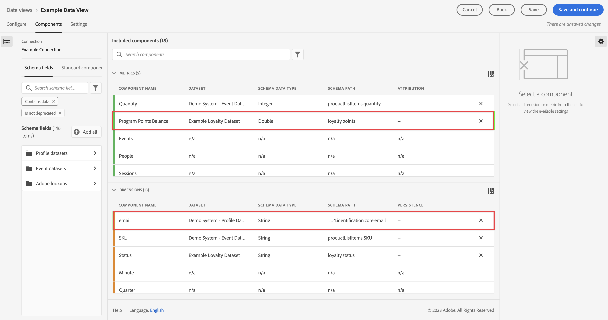

# 從傳統 Adobe Analytics 擷取和使用資料

本快速入門指南說明如何在 Customer Journey Analytics 中使用 Adobe Analytics 收集的資料。

>[!PREREQUISITES]
>
>您確實已使用任何以下記錄式實作方法，將 Adobe Analytics 授權並部署在一個或多個網站上：
>
>- [使用 Experience Platform Edge 實作 Analytics](https://experienceleague.adobe.com/docs/analytics/implementation/aep-edge/overview.html?lang=zh-Hant)
>
>- [使用 Adobe Analytics 擴充功能實作 Analytics](https://experienceleague.adobe.com/docs/analytics/implementation/launch/overview.html?lang=zh-Hant)
>
>- [使用 JavaScript 實作 Analytics](https://experienceleague.adobe.com/docs/analytics/implementation/js/overview.html?lang=zh-Hant)

若要完成此操作，您必須：

- 在 Adobe Experience Platform 中&#x200B;**設定 Adobe Analytics 來源連接器**。這可將您目前的 Adobe Analytics 資料擷取至 Adobe Experience Platform 的資料集。

- 在 Customer Journey Analytics 中&#x200B;**設定連線**。此連線應 (至少) 包含您的 Adobe Experience Platform 資料集。

- 在 Customer Journey Analytics 中&#x200B;**設定資料檢視**，定義您要在 Analysis Workspace 中使用的量度和維度。

- 在 Customer Journey Analytics 中&#x200B;**設定專案**，建立您的報告和視覺效果。

>[!NOTE]
>
>此為簡化的指南，說明如何使用 Adobe Analytics 來源連接器擷取資料，並在 Customer Journey Analytics 中使用該資料。強烈建議在提及時研究其他資訊。

## 設定 Adobe Analytics 來源連接器

Adobe Analytics 來源連接器可讓您將 Adobe Analytics 報告套裝資料匯入 Adobe Experience Platform。

建立 Adobe Analytics 來源連接器：

1. 在 Platform UI 中，自左側邊欄中選取&#x200B;**[!UICONTROL 「來源」]**。

2. 從 [!UICONTROL 「類別」]清單中選取 **[!UICONTROL Adobe 應用程式]**。

3. 在 Adobe Analytics 圖格中選取&#x200B;**[!UICONTROL 設定]**&#x200B;或&#x200B;**[!UICONTROL 新增資料]**。

   

4. 選取&#x200B;**[!UICONTROL 報告套裝]**。從報告套裝清單中，選取您要使用的套裝。

   

   選取&#x200B;**[!UICONTROL 「下一步」]**。

5. 選取&#x200B;**[!UICONTROL 預設結構]**&#x200B;作為[!UICONTROL 目標結構]。Adobe Experience Platform 會自動建立結構和對應的資料集，以對應所選 Adobe Analytics 報告套裝中的所有標準欄位。

   

   選取&#x200B;**[!UICONTROL 「下一步」]**。

6. 為資料流命名，並 (可選) 提供說明。

   

   選取&#x200B;**[!UICONTROL 「下一步」]**。

7. 查看連線並選取 **[!UICONTROL 完成]**。

   

建立連線後，系統會自動建立資料流，以從報表套裝中使用Adobe Analytics資料填入資料集，包括為生產沙箱擷取最多13個月的歷史資料。 （請注意，自2023年4月26日起，非生產沙箱的回填限制為3個月。）

完成初始擷取後，您的 Adobe Analytics 報告套裝資料就準備就緒，可供 Customer Journey Analytics 使用。

請參閱[在 UI 中建立 Adobe Analytics 來源連線](https://experienceleague.adobe.com/docs/experience-platform/sources/ui-tutorials/create/adobe-applications/analytics.html?lang=zh-Hant)，取得更完整的教學課程。

## 設定連線

若要在 Customer Journey Analytics 中使用 Adobe Experience Platform 資料，您可以建立連線，其中包含設定結構、資料集和工作流程所產生的資料。

連線可讓您將資料集從 Adobe Experience Platform 整合到工作區。若要針對這些資料集製作報告，必須先在 Adobe Experience Platform 和工作區的資料集之間建立連線。

若要建立連線，請執行以下操作：

1. 在 Customer Journey Analytics UI 中，選取頂部導覽中的&#x200B;**[!UICONTROL 「連線」]**。

2. 選取&#x200B;**[!UICONTROL 「建立新連線」]**。

3. 在[!UICONTROL 「無標題連線」]畫面中：

   在[!UICONTROL 「連線設定」]中為連線命名並提供說明。

   從[!UICONTROL 「資料設定」]的[!UICONTROL 「沙箱」]清單中選取正確沙箱，並從[!UICONTROL 「每日事件平均數」]清單中選取每日事件數。

   

   選取&#x200B;**[!UICONTROL 「新增資料集」]**。

   在[!UICONTROL 新增資料集]中的[!UICONTROL 選取資料集]步驟：

   - 選取由 Adobe Analytics 來源連接器自動建立的資料集，以及您要納入連線的任何其他資料集。

      

   - 選取&#x200B;**[!UICONTROL 「下一步」]**。
   在[!UICONTROL 新增資料集]的[!UICONTROL 資料集設定]步驟：

   - 對於每個資料集：

      - 在 Adobe Experience Platform 中，從資料集結構描述中所定義的可用身分中選取[!UICONTROL 人員 ID]。

      - 從[!UICONTROL 「資料來源類型」]清單中選取正確的資料來源。如果您指定&#x200B;**[!UICONTROL 「其他」]**，請為您的資料來源新增說明。

      - 根據您的偏好設定，設定&#x200B;**[!UICONTROL 匯入所有新資料]**&#x200B;和&#x200B;**[!UICONTROL 資料集回填現有資料]**。

      

   - 選取&#x200B;**[!UICONTROL 「新增資料集」]**。
   選取&#x200B;**[!UICONTROL 「儲存」]**。

如需如何建立和管理連線，以及如何選取和合併資料集的詳細資訊，請參閱[連線概觀](../connections/overview.md)。

## 設定資料檢視

資料檢視是特定於 Customer Journey Analytics 的容器，可讓您決定如何詮釋來自連線的資料。它指定 Analysis Workspace 中可用的所有維度和量度，以及這些維度和量度從哪些欄取得資料。資料檢視是為了在 Analysis Workspace 中報告資料而定義的。

若要建立資料檢視，請執行以下操作：

1. 在 Customer Journey Analytics UI 中，選取頂部導覽中的&#x200B;**[!UICONTROL 「資料檢視」]**。

2. 選取&#x200B;**[!UICONTROL 「建立新的資料檢視」]**。

3. 在[!UICONTROL 設定]步驟：

   從[!UICONTROL 「連線」]清單中選取您的連線。

   為連線命名，並 (可選) 提供說明。

   

   選取&#x200B;**[!UICONTROL 「儲存並繼續」]**。

4. 在[!UICONTROL 元件]步驟：

   將您要納入的任何結構欄位和/或標準元件新增至[!UICONTROL 量度]或[!UICONTROL 維度]元件框。

   

   選取&#x200B;**[!UICONTROL 「儲存並繼續」]**。

5. 在[!UICONTROL 設定]步驟：

   

   保留設定原樣並選取&#x200B;**[!UICONTROL 「儲存並完成」]**。

如需如何建立和編輯資料檢視、可在資料檢視中使用哪些元件，以及如何使用篩選器和工作階段設定的詳細資訊，請參閱[資料檢視概觀](../data-views/data-views.md)。

## 設定專案

Analysis Workspace 是彈性的瀏覽器工具，可讓您根據資料快速建立分析及分享見解。您可以使用工作區專案合併資料元件、表格和視覺效果，進行分析並與貴組織的任何人分享。

若要建立專案，請執行以下操作：

1. 在 Customer Journey Analytics UI 中，選取頂部導覽中的&#x200B;**[!UICONTROL 「專案」]**。

2. 在左側導覽中選取&#x200B;**[!UICONTROL 「專案」]**。

3. 選取&#x200B;**[!UICONTROL 「建立專案」]**。

   

   選取&#x200B;**[!UICONTROL 「空白專案」]**。

   

4. 從清單中選取您的資料檢視。

   。

5. 開始將維度和量度拖放至[!UICONTROL 面板]中的[!UICONTROL 自由表格]，建立您的第一個報告。例如，拖曳 `Program Points Balance`和 `Page View` 做為量度 而 `email` 作為維度，快速概覽已造訪過您網站且屬於收集忠誠點數之忠誠計劃一部分的設定檔。

   

如需如何使用元件、視覺效果和面板建立專案和建立分析的詳細資訊，請參閱 [Analysis Workspace 概觀](../analysis-workspace/home.md)。

>[!SUCCESS]
>
>您已完成所有步驟。首先設定 Adobe Analytics 資料來源連接器並為報告套裝配置該連接器，您的 Adobe Analytics 資料會自動上傳至 Adobe Experience Platform。您已在 Customer Journey Analytics 中定義連線，以使用擷取的 Adobe Analytics 資料和其他資料。您的資料檢視定義可讓您指定要使用的維度和量度，最後，您建立了第一個可視覺化和分析資料的專案。

