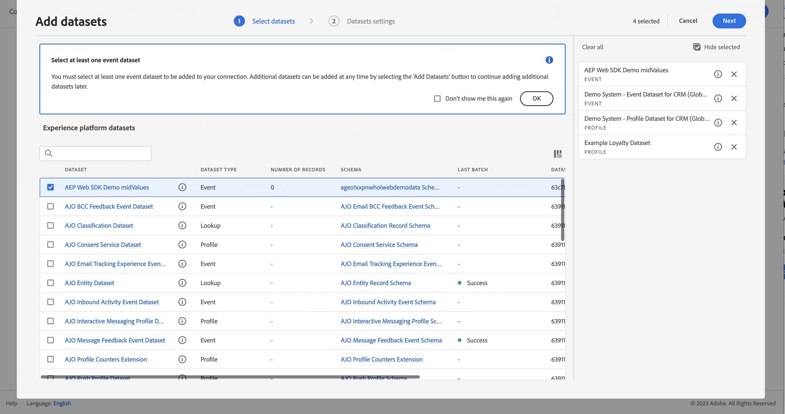

# 從傳統Adobe Analytics擷取和使用資料

本快速入門手冊說明如何在Customer Journey Analytics中使用Adobe Analytics收集的資料。

>[!PREREQUISITES]
>
>您確實已使用任何以下記錄式實作方法，將Adobe Analytics授權並部署在一或多個網站上：
>
>- [使用 Experience Platform Edge 實作 Analytics](https://experienceleague.adobe.com/docs/analytics/implementation/aep-edge/overview.html?lang=zh-Hant)
>
>- [使用Adobe Analytics擴充功能實作Analytics](https://experienceleague.adobe.com/docs/analytics/implementation/launch/overview.html?lang=zh-Hant)
>
>- [使用 JavaScript 實作 Analytics](https://experienceleague.adobe.com/docs/analytics/implementation/js/overview.html?lang=en)

若要完成此作業，您必須：

- **設定Adobe Analytics來源連接器** 在Adobe Experience Platform。 這可將您目前的Adobe Analytics資料擷取至Adobe Experience Platform的資料集。

- **設定連線** Customer Journey Analytics。 此連線應（至少）包含您的Adobe Experience Platform資料集。

- **設定資料檢視** Customer Journey Analytics來定義您要在Analysis Workspace中使用的量度和維度。

- **設定專案** Customer Journey Analytics來建立報表和視覺效果。

>[!NOTE]
>
>此為簡化的指南，說明如何使用Adobe Analytics來源連接器擷取資料，以及在Customer Journey Analytics中使用該資料。 強烈建議在提及時研究其他資訊。

## 設定Adobe Analytics來源連接器

Adobe Analytics來源連接器可讓您將Adobe Analytics報表套裝資料匯入Adobe Experience Platform。

建立Adobe Analytics源連接器：

1. 在平台UI中，選取 **[!UICONTROL 來源]**，可從左側邊欄。

2. 選擇 **[!UICONTROL Adobe應用程式]** 從 [!UICONTROL 類別].

3. 選擇 **[!UICONTROL 設定]** 或 **[!UICONTROL 新增資料]** 在Adobe Analytics瓷磚上。

   

4. 選擇 **[!UICONTROL 報表套裝]**. 從報表套裝清單中，選取您要使用的套裝。

   

   選取&#x200B;**[!UICONTROL 「下一步」]**。

5. 選擇 **[!UICONTROL 預設結構]** 作為 [!UICONTROL 目標架構]. Adobe Experience Platform會自動建立結構和對應的資料集，以對應所選Adobe Analytics報表套裝中的所有標準欄位。

   

   選取&#x200B;**[!UICONTROL 「下一步」]**。

6. 為資料流命名，並（可選）提供說明。

   

   選取&#x200B;**[!UICONTROL 「下一步」]**。

7. 查看連接並選擇 **[!UICONTROL 完成]**.

   

建立連線後，系統會自動建立資料流，以從報表套裝中使用Adobe Analytics資料填入資料集，包括擷取最多13個月的歷史資料。

完成初始內嵌後，您的Adobe Analytics報表套裝資料已準備好供Customer Journey Analytics使用。

請參閱 [在UI中建立Adobe Analytics來源連線](https://experienceleague.adobe.com/docs/experience-platform/sources/ui-tutorials/create/adobe-applications/analytics.html?lang=zh-Hant) 以取得更完整的教學課程。

## 設定連線

若要在Customer Journey Analytics中使用Adobe Experience Platform資料，您可以建立連線，其中包含設定結構、資料集和工作流程所產生的資料。

連線可讓您將資料集從 Adobe Experience Platform 整合到工作區。若要針對這些資料集製作報表，必須先在Adobe Experience Platform和工作區的資料集之間建立連線。

若要建立連線：

1. 在Customer Journey AnalyticsUI中，選取 **[!UICONTROL 連線]** 的下一頁。

2. 選擇 **[!UICONTROL 建立新連線]**.

3. 在 [!UICONTROL 無標題連接] 畫面：

   在中為連線命名並說明 [!UICONTROL 連線設定].

   從 [!UICONTROL 沙箱] 清單 [!UICONTROL 資料設定] ，並從 [!UICONTROL 每日事件平均數] 清單。

   

   選擇 **[!UICONTROL 新增資料集]**.

   在 [!UICONTROL 選取資料集] 步驟 [!UICONTROL 新增資料集]:

   - 選取由Adobe Analytics來源連接器自動建立的資料集，以及您要納入連線的任何其他資料集。

      

   - 選取&#x200B;**[!UICONTROL 「下一步」]**。
   在 [!UICONTROL 資料集設定] 步驟 [!UICONTROL 新增資料集]:

   - 對於每個資料集：

      - 選取 [!UICONTROL 人員ID] 以Adobe Experience Platform中資料集結構中定義的可用身分識別。

      - 從 [!UICONTROL 資料來源類型] 清單。 如果您指定 **[!UICONTROL 其他]**，然後新增資料來源的說明。

      - 設定 **[!UICONTROL 匯入所有新資料]** 和 **[!UICONTROL 資料集回填現有資料]** 根據您的偏好設定。

      

   - 選擇 **[!UICONTROL 新增資料集]**.
   選取「**[!UICONTROL 儲存]**」。

請參閱 [連線概述](../connections/overview.md) 如需如何建立和管理連線，以及如何選取和合併資料集的詳細資訊。

## 設定資料檢視

資料檢視是特定於 Customer Journey Analytics 的容器，可讓您決定如何詮釋來自連線的資料。它指定 Analysis Workspace 中可用的所有維度和量度，以及這些維度和量度從哪些欄取得資料。資料檢視是為了在 Analysis Workspace 中報告資料而定義的。

若要建立資料檢視：

1. 在Customer Journey AnalyticsUI中，選取 **[!UICONTROL 資料檢視]** 的下一頁。

2. 選擇 **[!UICONTROL 建立新資料檢視]**.

3. 在 [!UICONTROL 設定] 步驟：

   從 [!UICONTROL 連線] 清單。

   命名連線，並（選擇性）說明您的連線。

   

   選擇 **[!UICONTROL 保存並繼續]**.

4. 在 [!UICONTROL 元件] 步驟：

   將您要包含的任何結構欄位和/或標準元件新增至 [!UICONTROL 量度] 或 [!UICONTROL Dimension] 元件框。

   

   選擇 **[!UICONTROL 保存並繼續]**.

5. 在 [!UICONTROL 設定] 步驟：

   

   保留設定原樣並選取 **[!UICONTROL 保存並完成]**.

請參閱 [資料檢視概觀](../data-views/data-views.md) 如需如何建立和編輯資料檢視的詳細資訊，可在資料檢視中使用哪些元件，以及如何使用篩選和工作階段設定。

## 設定專案

Analysis Workspace是彈性的瀏覽器工具，可讓您根據資料快速建立分析並分享見解。 您可使用工作區專案結合資料元件、表格和視覺效果，建立分析並與組織中的任何人共用。

若要建立專案：

1. 在Customer Journey AnalyticsUI中，選取 **[!UICONTROL 專案]** 的下一頁。

2. 選擇 **[!UICONTROL 專案]** 的下一頁。

3. 選擇 **[!UICONTROL 建立專案]**.

   

   選擇 **[!UICONTROL 空白專案]**.

   

4. 從清單中選取您的資料檢視。

   .

5. 開始將維度和量度拖放至 [!UICONTROL 自由表格] 在 [!UICONTROL 面板] 來建立您的第一個報表。 例如，拖曳 `Program Points Balance` 和 `Page View` 做為量度 `email` 作為維度，快速概述已造訪過您網站且屬於收集忠誠點數之忠誠計劃一部分的設定檔。

   

請參閱 [Analysis Workspace概述](../analysis-workspace/home.md) 如需如何使用元件、視覺效果和面板建立專案和建立分析的詳細資訊。

>[!SUCCESS]
>
>您已完成所有步驟。 從設定Adobe Analytics資料來源連接器及為報表套裝設定該連接器開始，您的Adobe Analytics資料會自動上傳至Adobe Experience Platform。 您已在Customer Journey Analytics中定義連線，以利用擷取的Adobe Analytics資料和其他資料。 您的資料檢視定義可讓您指定要使用的維度和量度，最後您建立了第一個將資料視覺化和分析的專案。

