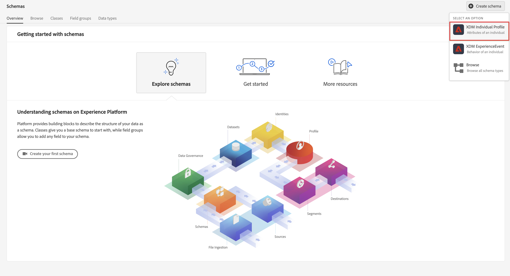

# 擷取及使用批次資料

本快速入門手冊說明如何將批次資料內嵌至Adobe Experience Platform，然後在Customer Journey Analytics中使用該資料。

若要完成此作業，您必須：

- **設定結構和資料集** 在Adobe Experience Platform中，定義您要收集的資料的模型（結構），以及實際收集資料（資料集）的位置。

- **使用工作流程** 輕鬆將批次資料上傳至Adobe Experience Platform中設定的資料集。

- **設定連線** Customer Journey Analytics。 此連線應（至少）包含您的Adobe Experience Platform資料集。

- **設定資料檢視** Customer Journey Analytics來定義您要在Analysis Workspace中使用的量度和維度。

- **設定專案** Customer Journey Analytics來建立報表和視覺效果。

>[!NOTE]
>
>此為如何將批次資料內嵌至Adobe Experience Platform及用於Customer Journey Analytics的簡化指南。 強烈建議在提及時研究其他資訊。

## 設定結構和資料集

若要將資料內嵌至Adobe Experience Platform，您必須先定義要收集的資料。 所有擷取至Adobe Experience Platform的資料都必須符合標準的非正常結構，才能由下游功能和功能識別並處理。 Experience Data Model(XDM)是以結構形式提供此結構的標準架構。

定義結構後，可使用一或多個資料集來儲存及管理資料收集。 資料集是資料集合的儲存和管理結構，通常是包含方案 (欄) 和欄位 (列) 的表格。 

擷取至Adobe Experience Platform的所有資料都必須符合預先定義的結構，才能以資料集形式持續保存。

### 設定結構

對於此快速入門，您想要收集一些忠誠度資料，例如忠誠度id、忠誠度點數和忠誠度狀態。
為此，您首先需要定義用於模型此資料的結構。

若要設定您的結構：

1. 在Adobe Experience Platform UI的左側邊欄中，選取 **[!UICONTROL 結構]** with [!UICONTROL 資料管理].

2. 選擇 **[!UICONTROL 建立結構]**. 選擇 **[!UICONTROL XDM個別設定檔]** 從選項清單中。

   

   >[!INFO]
   >
   >    個別設定檔結構可用來模型設定檔 _屬性_ （例如電子郵件、忠誠度狀態、忠誠度點數）。 體驗事件結構可用來模型 _行為_ 設定檔（如頁面檢視、新增至購物車）。


3. 在 [!UICONTROL 無標題結構] 畫面：

   1. 輸入架構的顯示名稱，並（可選）說明。

      

   2. 選擇 **[!UICONTROL +新增]** in [!UICONTROL 欄位群組].

      

      欄位群組是可重複使用的物件和屬性集合，可讓您輕鬆擴充您的架構。

   3. 在 [!UICONTROL 新增欄位群組] 對話框，選擇 **[!UICONTROL 忠誠度詳細資料]** 欄位群組。

      

      您可以選取預覽按鈕，以查看屬於此欄位群組之欄位的預覽。

      

      選擇 **[!UICONTROL 返回]** 來關閉預覽。

   4. 選擇 **[!UICONTROL 新增欄位群組]**.

4. 選擇 **[!UICONTROL +]** 位於 [!UICONTROL 結構] 中。

   

5. 在 [!UICONTROL 欄位屬性] 面板，輸入 `Identification` 作為名稱， **[!UICONTROL 識別]** 作為 [!UICONTROL 顯示名稱]，選取 **[!UICONTROL 物件]** 作為 [!UICONTROL 類型] 選取 **[!UICONTROL 設定檔核心v2]** 作為 [!UICONTROL 欄位組].

   

   這會將識別功能新增至您的架構。 在您的情況下，您會想使用批次資料中的電子郵件地址來識別忠誠度資訊。

   選擇 **[!UICONTROL 套用]** 將此對象添加到您的架構中。

6. 選取 **[!UICONTROL 電子郵件]** 欄位，然後選取 **[!UICONTROL 身分]** 和 **[!UICONTROL 電子郵件]** 從 [!UICONTROL 身分命名空間] 在 [!UICONTROL 欄位屬性] 中。

   

   您需指定電子郵件地址作為Adobe Experience Platform Identity Service可用來結合（拼接）設定檔的身分。

   選擇 **[!UICONTROL 套用]**. 您會看到指紋圖示出現在電子郵件屬性中。

   選取「**[!UICONTROL 儲存]**」。

7. 選擇架構的根級別（具有架構名稱），然後選擇 **[!UICONTROL 設定檔]** 切換。

   系統會提示您啟用配置檔案的架構。 啟用後，根據此結構將資料擷取至資料集時，該資料會合併至即時客戶設定檔中。

   請參閱 [啟用結構以用於即時客戶個人檔案](https://experienceleague.adobe.com/docs/experience-platform/xdm/tutorials/create-schema-ui.html?lang=en#profile) 以取得更多資訊。

   >[!IMPORTANT]
   >
   >    一旦為設定檔啟用了架構，便無法再為設定檔停用該架構。

   

8. 選擇 **[!UICONTROL 儲存]** 來儲存您的架構。

您已建立最小結構，以建立可內嵌至Adobe Experience Platform的忠誠度資料模型。 結構可讓使用電子郵件地址來識別設定檔。 啟用設定檔的結構，即可確保將批次檔案中的資料新增至即時客戶設定檔。

請參閱 [在UI中建立和編輯結構](https://experienceleague.adobe.com/docs/experience-platform/xdm/ui/resources/schemas.html) 有關向架構添加和刪除欄位組和單個欄位的詳細資訊。

### 設定資料集

您已使用您的結構定義資料模型。 您現在必須定義結構以儲存和管理該資料。 這是透過資料集完成。

若要設定資料集：

1. 在Adobe Experience Platform UI的左側邊欄中，選取 **[!UICONTROL 資料集]** with [!UICONTROL 資料管理].

2. 選擇 **[!UICONTROL 建立資料集]**.

   

3. 選擇 **[!UICONTROL 從結構建立資料集]**.

   

4. 選擇您先前建立的架構並選擇 **[!UICONTROL 下一個]**.

5. 為資料集命名，（選用）提供說明。

   

6. 選擇 **[!UICONTROL 完成]**.

7. 選取 **[!UICONTROL 設定檔]** 切換。

   系統會提示您啟用設定檔的資料集。 資料集一經啟用，即可透過擷取的資料豐富即時客戶個人檔案。

   >[!IMPORTANT]
   >
   >    只有當資料集所隸屬的結構也啟用設定檔時，您才能啟用設定檔的資料集。

   

請參閱 [資料集UI指南](https://experienceleague.adobe.com/docs/experience-platform/catalog/datasets/user-guide.html?lang=zh-Hant) 以取得檢視、預覽、建立、刪除資料集的詳細資訊。 以及如何為「即時客戶個人檔案」啟用資料集。


## 使用工作流程

您可以使用工作流程功能將批次資料上傳至Adobe Experience Platform。 您使用的批次檔案範例為CSV檔案，其中包含下列內容：

```
email,loyaltyID,points,status
abrocking0@blog.com,793406,82.16,Silver
wnichol1@ycombinator.com,988654,40.39,Gold
paisbett2@slideshare.net,444897,91.25,Bronze
bdiamant3@xinhuanet.com,239658,57.87,Gold
ppales4@nsw.gov.au,365384,82.71,Silver
...
```

若要使用工作流程：

1. 在平台UI中，選取 **[!UICONTROL 工作流程]** 在左側邊欄。

2. 選擇 **[!UICONTROL 將CSV對應至XDM結構]**. 選擇 **[!UICONTROL Launch]**.

   

3. 在 [!UICONTROL 將CSV對應至XDM結構] 螢幕，在 [!UICONTROL 資料流詳細資訊] 步驟：

   選擇 **[!UICONTROL 現有資料集]**，請從資料集清單中選取資料集，並為 [!UICONTROL 資料流名稱].

   

   選取&#x200B;**[!UICONTROL 「下一步」]**。

4. 在 [!UICONTROL 選擇資料] 步驟：

   拖放或選取 **[!UICONTROL 選擇檔案]** 來選取含有忠誠度資料的CSV檔案。 您會看到忠誠度資料的預覽。

   

   選取&#x200B;**[!UICONTROL 「下一步」]**。

5. 在 [!UICONTROL 對應] 步驟：

   將您的資料從CSV檔案對應至結構中的資料。 使用AI時，工作流程功能會嘗試自動將批次資料欄位對應至結構欄位。

   

   您可以使用 **[!UICONTROL 預覽資料]** ，查看已映射資料的預覽。

   

6. 選擇 **[!UICONTROL 完成]** 開始將批次資料內嵌至Adobe Experience Platform。

請參閱 [將CSV檔案對應至現有XDM結構](https://experienceleague.adobe.com/docs/experience-platform/ingestion/tutorials/map-csv/existing-schema.html) 有關在傳入資料與您的XDM架構不相容時如何映射資料的詳細資訊，請使用映射模板，使用計算欄位以確保您的批處理資料符合架構的預期內容，以及執行其他操作。


## 設定連線

若要在Customer Journey Analytics中使用Adobe Experience Platform資料，您可以建立連線，其中包含設定結構、資料集和工作流程所產生的資料。

連線可讓您將資料集從 Adobe Experience Platform 整合到工作區。若要針對這些資料集製作報表，必須先在Adobe Experience Platform和工作區的資料集之間建立連線。

若要建立連線：

1. 在Customer Journey AnalyticsUI中，選取 **[!UICONTROL 連線]** 的下一頁。

2. 選擇 **[!UICONTROL 建立新連線]**.

3. 在 [!UICONTROL 無標題連接] 畫面：

   在中為連線命名並說明 [!UICONTROL 連線設定].

   從 [!UICONTROL 沙箱] 清單 [!UICONTROL 資料設定] ，並從 [!UICONTROL 每日事件平均數] 清單。

   

   選擇 **[!UICONTROL 新增資料集]**.

   在 [!UICONTROL 選取資料集] 步驟 [!UICONTROL 新增資料集]:

   - 選取您先前建立的資料集(`Example Loyalty Dataset`)和您要納入連線的任何其他資料集。

      

   - 選取&#x200B;**[!UICONTROL 「下一步」]**。
   在 [!UICONTROL 資料集設定] 步驟 [!UICONTROL 新增資料集]:

   - 對於每個資料集：

      - 選取 [!UICONTROL 人員ID] 以Adobe Experience Platform中資料集結構中定義的可用身分識別。

      - 從 [!UICONTROL 資料來源類型] 清單。 如果您指定 **[!UICONTROL 其他]**，然後新增資料來源的說明。

      - 設定 **[!UICONTROL 匯入所有新資料]** 和 **[!UICONTROL 資料集回填現有資料]** 根據您的偏好設定。

      

   - 選擇 **[!UICONTROL 新增資料集]**.
   選取「**[!UICONTROL 儲存]**」。

請參閱 [連線概述](../connections/overview.md) 如需如何建立和管理連線，以及如何選取和合併資料集的詳細資訊。

## 設定資料檢視

資料檢視是特定於 Customer Journey Analytics 的容器，可讓您決定如何詮釋來自連線的資料。它指定 Analysis Workspace 中可用的所有維度和量度，以及這些維度和量度從哪些欄取得資料。資料檢視是為了在 Analysis Workspace 中報告資料而定義的。

若要建立資料檢視：

1. 在Customer Journey AnalyticsUI中，選取 **[!UICONTROL 資料檢視]** 的下一頁。

2. 選擇 **[!UICONTROL 建立新資料檢視]**.

3. 在 [!UICONTROL 設定] 步驟：

   從 [!UICONTROL 連線] 清單。

   命名連線，並（選擇性）說明您的連線。

   

   選擇 **[!UICONTROL 保存並繼續]**.

4. 在 [!UICONTROL 元件] 步驟：

   將您要包含的任何結構欄位和/或標準元件新增至 [!UICONTROL 量度] 或 [!UICONTROL Dimension] 元件框。

   

   選擇 **[!UICONTROL 保存並繼續]**.

5. 在 [!UICONTROL 設定] 步驟：

   

   保留設定原樣並選取 **[!UICONTROL 保存並完成]**.

請參閱 [資料檢視概觀](../data-views/data-views.md) 如需如何建立和編輯資料檢視的詳細資訊，可在資料檢視中使用哪些元件，以及如何使用篩選和工作階段設定。


## 設定專案

Analysis Workspace是彈性的瀏覽器工具，可讓您根據資料快速建立分析並分享見解。 您可使用工作區專案結合資料元件、表格和視覺效果，建立分析並與組織中的任何人共用。

若要建立專案：

1. 在Customer Journey AnalyticsUI中，選取 **[!UICONTROL 專案]** 的下一頁。

2. 選擇 **[!UICONTROL 專案]** 的下一頁。

3. 選擇 **[!UICONTROL 建立專案]**.

   

   選擇 **[!UICONTROL 空白專案]**.

   

4. 從清單中選取您的資料檢視。

   .

5. 開始將維度和量度拖放至 [!UICONTROL 自由表格] 在 [!UICONTROL 面板] 來建立您的第一個報表。 例如，拖曳 `Program Points Balance` 和 `Page View` 做為量度 `email` 作為維度，快速概述已造訪過您網站且屬於收集忠誠點數之忠誠計劃一部分的設定檔。

   

請參閱 [Analysis Workspace概述](../analysis-workspace/home.md) 如需如何使用元件、視覺效果和面板建立專案和建立分析的詳細資訊。

>[!SUCCESS]
>
>您已完成所有步驟。 從定義您要收集的忠誠度資料（結構），以及要將其（資料集）儲存在Adobe Experience Platform的何處開始，您已設定工作流程，將忠誠度資料批次上傳至資料集。 您已在Customer Journey Analytics中定義連線，以使用擷取的忠誠度資料和其他資料。 您的資料檢視定義可讓您指定要使用的維度和量度，最後您建立了第一個將資料視覺化和分析的專案。
