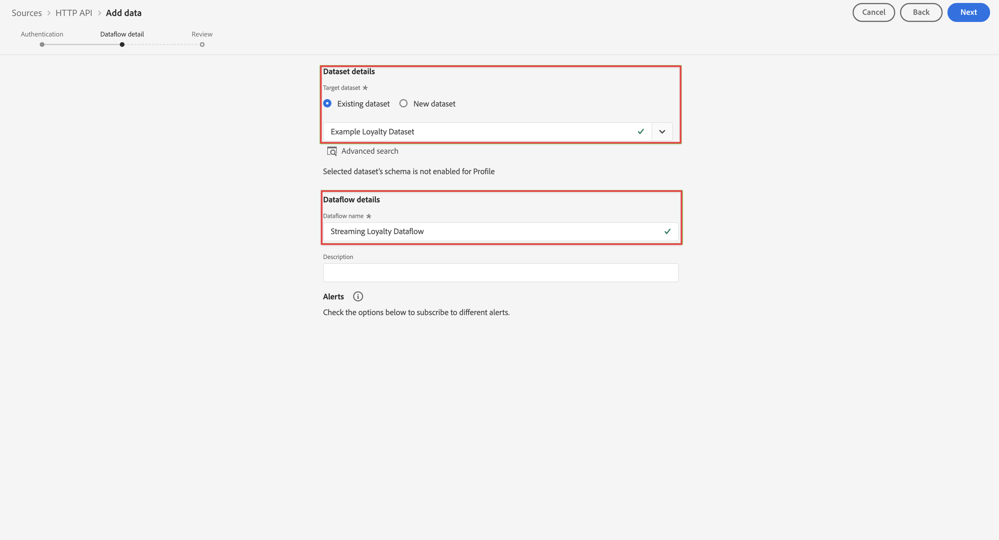

# 擷取和使用串流資料

本快速入門指南說明如何將串流資料擷取至 Adobe Experience Platform，然後在 Customer Journey Analytics 中使用該資料。

若要完成此操作，您必須：

- 在 Adobe Experience Platform 中&#x200B;**設定結構和資料集**，定義您要收集的資料的模型 (結構)，以及實際收集資料的位置 (資料集)。

- **使用 HTTP API 來源連接器**，輕鬆將資料串流至 Adobe Experience Platform 中已設定的資料集。

- 在 Customer Journey Analytics 中&#x200B;**設定連線**。此連線應 (至少) 包含您的 Adobe Experience Platform 資料集。

- 在 Customer Journey Analytics 中&#x200B;**設定資料檢視**，定義您要在 Analysis Workspace 中使用的量度和維度。

- 在 Customer Journey Analytics 中&#x200B;**設定專案**，建立您的報告和視覺效果。


>[!NOTE]
>
>此為簡化的指南，說明如何將串流資料擷取至 Adobe Experience Platform，並在 Customer Journey Analytics 中使用該資料。強烈建議在提及時研究其他資訊。

## 設定結構和資料集

若要將資料擷取至 Adobe Experience Platform，您必須先定義要收集的資料。所有擷取至 Adobe Experience Platform 的資料都必須符合標準的非正常結構，才能由下游能力和功能識別並處理。體驗資料模型 (XDM) 是以結構形式提供此結構的標準框架。

定義結構後，您可以使用一個或多個資料集來儲存及管理資料收集。資料集是資料集合的儲存和管理結構，通常是包含方案 (欄) 和欄位 (列) 的表格。 

擷取至 Adobe Experience Platform 的所有資料都必須符合預先定義的結構，才能以資料集形式持續保存。

### 設定結構

為了快速上手，您需要收集一些忠誠度資料，例如忠誠度 ID、忠誠度點數和忠誠度狀態。
為此，您首先需要定義用於建立此資料模型的結構。

若要設定您的結構：

1. 在 Adobe Experience Platform UI 的左側邊欄中，選取[!UICONTROL 「資料管理」]中的&#x200B;**[!UICONTROL 「結構」]**。

2. 選取&#x200B;**[!UICONTROL 「建立結構」]**。從選項清單中選取&#x200B;**[!UICONTROL 「XDM 個別設定檔」]**。

   

   >[!INFO]
   >
   >    個別設定檔結構可用來建立設定檔&#x200B;_屬性_ (例如姓名、電子郵件、性別) 模型。體驗事件結構可用來建立設定檔&#x200B;_行為_ (例如頁面檢視、新增至購物車) 模型。


3. 在[!UICONTROL 「無標題結構」]畫面中：

   1. 輸入結構的顯示名稱與 (可選) 說明。

      

   2. 在[!UICONTROL 「欄位群組」]中選取&#x200B;**[!UICONTROL 「+ 新增」]**。

      

      欄位群組是可重複使用的物件和屬性集合，可讓您輕鬆擴充結構。

   3. 在[!UICONTROL 「新增欄位群組」]對話框中，從清單中選取&#x200B;**[!UICONTROL 「忠誠度詳細資料」]**&#x200B;欄位群組。

      

      您可以選取預覽按鈕，以查看屬於此欄位群組之欄位的預覽。

      

      選取&#x200B;**[!UICONTROL 「返回」]**&#x200B;來關閉預覽。

   4. 選取&#x200B;**[!UICONTROL 「新增欄位群組」]**。

4. 在[!UICONTROL 「結構」]面板中，選取結構名稱旁的 **[!UICONTROL +]**。

   

5. 在[!UICONTROL 「欄位屬性」]面板中，輸入 `Identification` 作為名稱，**[!UICONTROL 識別]** 作為[!UICONTROL 顯示名稱]，選取&#x200B;**[!UICONTROL 「物件」]**&#x200B;作為[!UICONTROL 類型]，並選取&#x200B;**[!UICONTROL 「設定檔核心 v2」]**&#x200B;作為[!UICONTROL 欄位群組]。

   

   這會將識別功能新增至您的結構。在您的情況下，您會想要使用批次資料中的電子郵件地址來識別忠誠度資訊。

   選取&#x200B;**[!UICONTROL 「套用」]**&#x200B;將此物件加入您的結構。

6. 在剛剛新增的識別物件中選取&#x200B;**[!UICONTROL 「電子郵件」]**&#x200B;欄位，然後在[!UICONTROL 「欄位屬性」]面板中，選取&#x200B;**[!UICONTROL 「身分」]**&#x200B;和[!UICONTROL 「身分命名空間」]的&#x200B;**[!UICONTROL 「電子郵件」]**。

   

   您正在指定電子郵件地址作為 Adobe Experience Platform Identity 服務可用於結合 (拼接) 設定檔行為的身分。

   選取&#x200B;**[!UICONTROL 「套用」]**。您會看到指紋圖示出現在電子郵件屬性中。

7. 選擇結構的根層級 (具備結構名稱)，然後選取&#x200B;**[!UICONTROL 「設定檔」]**&#x200B;切換。

   系統會提示您啟用設定檔的結構。啟用後，根據此結構將資料擷取至資料集時，該資料就會合併至即時客戶設定檔中。

   如需詳細資訊，請參閱[啟用結構以用於即時客戶設定檔](https://experienceleague.adobe.com/docs/experience-platform/xdm/tutorials/create-schema-ui.html?lang=zh-Hant#profile)。

   >[!IMPORTANT]
   >
   >    儲存啟用設定檔的結構後，便無法再為設定檔停用該結構。

   

8. 選取&#x200B;**[!UICONTROL 「儲存」]**，即可儲存您的結構。

您已建立最小結構，以建立可內嵌至 Adobe Experience Platform 的忠誠度資料模型。該結構可讓您使用電子郵件地址來識別設定檔。透過啟用設定檔的結構，即可確保將來自串流來源的資料新增至即時客戶設定檔。

請參閱[在 UI 中建立和編輯結構](https://experienceleague.adobe.com/docs/experience-platform/xdm/ui/resources/schemas.html)，了解有關向結構添加和刪除欄位群組和個別欄位的詳細資訊。

### 設定資料集

您已使用您的結構定義資料模型。您現在必須定義結構以儲存和管理該資料。這將透過資料集完成。

若要設定您的資料集：

1. 在 Adobe Experience Platform UI 的左側邊欄中，選取[!UICONTROL 「資料管理」]中的&#x200B;**[!UICONTROL 「資料集」]**。

2. 選取&#x200B;**[!UICONTROL 「建立資料集」]**。

   

3. 選取&#x200B;**[!UICONTROL 「從結構建立資料集」]**。

   

4. 選取您先前建立的結構並選取&#x200B;**[!UICONTROL 「下一個」]**。

5. 為資料集命名，並 (可選) 提供說明。

   

6. 選取&#x200B;**[!UICONTROL 「完成」]**。

7. 選取&#x200B;**[!UICONTROL 「設定檔」]**&#x200B;切換。

   系統會提示您啟用設定檔的資料集。資料集一經啟用，即可透過擷取的資料豐富即時客戶設定檔。

   >[!IMPORTANT]
   >
   >    只有當資料集所遵循的結構同樣啟用設定檔時，您才能啟用設定檔的資料集。

   

請參閱[資料集 UI 指南](https://experienceleague.adobe.com/docs/experience-platform/catalog/datasets/user-guide.html?lang=zh-Hant)，了解如何檢視、預覽、建立、刪除資料集的詳細資訊。以及為即時客戶設定檔啟用資料集的方法。


## 設定 HTTP API 串流連線

您的來源應用程式串流符合您建立的結構的資料，如下所示。

```json
{
    ...
    "_demosystem4": {
        "identification": {
            "core": {
                "email": "abrocking0@blog.com",
                "loyaltyId": "793406",
            }
        }
    },
    "loyalty": {
        "loyaltyID": [
            "793406"
        ],
        "points": 82.16,
        "status": "Silver"
    }
    ...
}
```

若要將此資料串流至您建立的資料集，您必須定義要傳送至該資料的串流端點。若要這麼做，請定義 HTTP API 來源連接器。

若要建立 HTTP API 來源連接器：

1. 在 Experience Platform UI 中，在左側邊欄的[!UICONTROL 「連線」]下方，選取&#x200B;**[!UICONTROL 「來源」]**。

2. 從[!UICONTROL 「類別」]清單中選取&#x200B;**[!UICONTROL 「串流」]**。

3. 在 [!UICONTROL HTTP API] 圖格中選取&#x200B;**「設定」**。

   

4. 在[!UICONTROL 新增資料]畫面的[!UICONTROL 驗證]步驟：

   輸入 HTTP API 連線的名稱和說明。

   選擇&#x200B;**[!UICONTROL 「XDM 相容」]**，以指出您所串流的資料與現有 XDM 結構相容。

   選取&#x200B;**[!UICONTROL 「連線至來源」]**。成功連線後，您會看到[!UICONTROL 已連線]。

   

   選取&#x200B;**[!UICONTROL 「下一步」]**&#x200B;以繼續。

5. 在[!UICONTROL 新增資料]畫面的[!UICONTROL 資料流詳細資訊]步驟：

   選取&#x200B;**[!UICONTROL 「現有資料集」]**，請從資料集清單中選取資料集，並命名您的[!UICONTROL 資料流名稱]。

   

   選取&#x200B;**[!UICONTROL 「下一步」]**。

6. [!UICONTROL 新增資料]畫面的[!UICONTROL 檢閱]步驟會提供 HTTP API 連線的概觀。

   

   選取&#x200B;**[!UICONTROL 「完成」]**。

7. 您會看到 HTTP API 串流端點的最終定義。

   

您可以複製串流端點 URL，並用它來設定您的忠誠度應用程式，將資料串流至 Adobe Experience Platform 忠誠度資料集。

如需更完整的教學課程，說明如何使用驗證、當傳入資料與 XDM 結構不相容時如何對應資料，以及如何在設定串流連接器時建立新資料集，請參閱[使用 UI 建立 HTTP API 串流連線](https://experienceleague.adobe.com/docs/experience-platform/sources/ui-tutorials/create/streaming/http.html?lang=zh-Hant)。


## 設定連線

若要在 Customer Journey Analytics 中使用 Adobe Experience Platform 資料，您可以建立連線，其中包含設定結構、資料集和工作流程所產生的資料。

連線可讓您將資料集從 Adobe Experience Platform 整合到工作區。若要針對這些資料集製作報告，必須先在 Adobe Experience Platform 和工作區的資料集之間建立連線。

若要建立連線，請執行以下操作：

1. 在 Customer Journey Analytics UI 中，選取頂部導覽中的&#x200B;**[!UICONTROL 「連線」]**。

2. 選取&#x200B;**[!UICONTROL 「建立新連線」]**。

3. 在[!UICONTROL 「無標題連線」]畫面中：

   在[!UICONTROL 「連線設定」]中為連線命名並提供說明。

   從[!UICONTROL 「資料設定」]的[!UICONTROL 「沙箱」]清單中選取正確沙箱，並從[!UICONTROL 「每日事件平均數」]清單中選取每日事件數。

   

   選取&#x200B;**[!UICONTROL 「新增資料集」]**。

   在[!UICONTROL 新增資料集]的[!UICONTROL 選取資料集]步驟：

   - 選取您先前建立的資料集 (`Example Loyalty Dataset`) 和您要加入連線的任何其他資料集。

      

   - 選取&#x200B;**[!UICONTROL 「下一步」]**。
   在[!UICONTROL 新增資料集]的[!UICONTROL 資料集設定]步驟：

   - 對於每個資料集：

      - 在 Adobe Experience Platform 中，從資料集結構描述中所定義的可用身分中選取[!UICONTROL 人員 ID]。

      - 從[!UICONTROL 「資料來源類型」]清單中選取正確的資料來源。如果您指定&#x200B;**[!UICONTROL 「其他」]**，請為您的資料來源新增說明。

      - 根據您的偏好設定，設定&#x200B;**[!UICONTROL 匯入所有新資料]**&#x200B;和&#x200B;**[!UICONTROL 資料集回填現有資料]**。

      

   - 選取&#x200B;**[!UICONTROL 「新增資料集」]**。
   選取&#x200B;**[!UICONTROL 「儲存」]**。

如需如何建立和管理連線，以及如何選取和合併資料集的詳細資訊，請參閱[連線概觀](../connections/overview.md)。

## 設定資料檢視

資料檢視是特定於 Customer Journey Analytics 的容器，可讓您決定如何詮釋來自連線的資料。它指定 Analysis Workspace 中可用的所有維度和量度，以及這些維度和量度從哪些欄取得資料。資料檢視是為了在 Analysis Workspace 中報告資料而定義的。

若要建立資料檢視，請執行以下操作：

1. 在 Customer Journey Analytics UI 中，選取頂部導覽中的&#x200B;**[!UICONTROL 「資料檢視」]**。

2. 選取&#x200B;**[!UICONTROL 「建立新的資料檢視」]**。

3. 在[!UICONTROL 設定]步驟：

   從[!UICONTROL 「連線」]清單中選取您的連線。

   為連線命名，並 (可選) 提供說明。

   

   選取&#x200B;**[!UICONTROL 「儲存並繼續」]**。

4. 在[!UICONTROL 元件]步驟：

   將您要納入的任何結構欄位和/或標準元件新增至[!UICONTROL 量度]或[!UICONTROL 維度]元件框。

   

   選取&#x200B;**[!UICONTROL 「儲存並繼續」]**。

5. 在[!UICONTROL 設定]步驟：

   

   保留設定原樣並選取&#x200B;**[!UICONTROL 「儲存並完成」]**。

如需如何建立和編輯資料檢視、可在資料檢視中使用哪些元件，以及如何使用篩選器和工作階段設定的詳細資訊，請參閱[資料檢視概觀](../data-views/data-views.md)。


## 設定專案

Analysis Workspace 是彈性的瀏覽器工具，可讓您根據資料快速建立分析及分享見解。您可以使用工作區專案合併資料元件、表格和視覺效果，進行分析並與貴組織的任何人分享。

若要建立專案，請執行以下操作：

1. 在 Customer Journey Analytics UI 中，選取頂部導覽中的&#x200B;**[!UICONTROL 「專案」]**。

2. 在左側導覽中選取&#x200B;**[!UICONTROL 「專案」]**。

3. 選取&#x200B;**[!UICONTROL 「建立專案」]**。

   

   選取&#x200B;**[!UICONTROL 「空白專案」]**。

   

4. 從清單中選取您的資料檢視。

   。

5. 開始將維度和量度拖放至[!UICONTROL 面板]中的[!UICONTROL 自由表格]，建立您的第一個報告。例如，拖曳 `Program Points Balance`和 `Page View` 做為量度 而 `email` 作為維度，快速概覽已造訪過您網站且屬於收集忠誠點數之忠誠計劃一部分的設定檔。

   

如需如何使用元件、視覺效果和面板建立專案和建立分析的詳細資訊，請參閱 [Analysis Workspace 概觀](../analysis-workspace/home.md)。

>[!SUCCESS]
>
>您已完成所有步驟。從定義您要收集的忠誠度資料 (結構)，以及要將其儲存在 Adobe Experience Platform 中的何處 (資料集) 開始，您已設定 HTTP API 來源連接器，以將忠誠度資料直接串流至資料集。您的資料檢視定義可讓您指定要使用的維度和量度，最後，您建立了第一個可視覺化和分析資料的專案。
